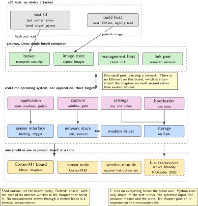

# Twenty Connected-Device Projects on an RTOS and Embedded Linux

*a room that knows whether it is in use, illustrated edition*

Joseph Ambrose Pagaran. Friday 2 October 2026.

## About this document

This is a build plan for twenty projects that together make one thing: a room that knows whether it is in use, says so to whoever asks, accepts a new version of itself without being visited, and runs on a battery while doing it. Every part needed is already on the bench. Nothing here is bought except four small boards that arrive on Monday 5 October 2026 and are named where they are used.

Fifteen of the twenty run a real-time operating system on a microcontroller. Three run Linux on a single-board computer, because the same device has a gateway behind it and a device's life does not begin at its first boot or end at its last. Two more sit on the boundary. Each chapter is self-contained and has the same twenty-part shape: why it exists, the prior art and what is taken from it, the parts it uses, a system architecture figure, the configuration, the wiring, a memory and timing budget, a software design in UML, a data-flow sketch, a repository layout, numbered steps with real commands, how to build and debug it, measurable acceptance criteria, its variants, pitfalls, the practices it applies, stretch goals, a sourced roadmap, the evidence to publish, and its sources.

> [!NOTE]
> **What this volume is, and is not**
>
> It is a portfolio of techniques, written so that one chapter and one project directory can be taken on their own. It names no employer and no product, here or anywhere, because a volume that names one vacancy is useless the week that vacancy closes. The device in these pages is a **room** or a **unit**. It is deliberately ordinary, and that is what makes the techniques portable.
>
> It is also not a claim to have shipped this. The author's production work on this operating system stands at a working prototype. Where a chapter is a prototype it says so in its first paragraph, and no chapter anywhere claims a shipped product on this operating system, a battery life measured in years, or a radar.

## The four behaviours everything else serves

A connected device of this kind does four things, and the twenty chapters are arranged around them rather than around a list of technologies. Each behaviour is built in full exactly once, in the chapter named, and every other chapter that needs it cites that chapter rather than building a second version.

| Behaviour | Built in | Why it is the one that matters |
| --- | --- | --- |
| Presence, with a hold and a release | P01 | A room that forgets to release is worse than a room with no sensor, because it looks busy all afternoon and nobody can tell it is wrong |
| A sample that is allowed to leave the device | P06 | Everything that costs energy or privacy is decided here, before a radio is involved at all |
| A signed image that rolls back | P08 | A unit that cannot be reached by hand needs an update that can fail safely more than it needs an update that is fast |
| A radio that sleeps | P10 | A battery device is a duty cycle with a radio attached. The sleep is the product; the transmission is the exception |

*Table 1. The product spine. A reader who has time for four chapters should read these four, in this order.*

The sentence those four are arranged to earn is short, and it is worth stating once at the front because it explains why P02 exists at all. The unit does not own the calendar. It owns the decision when the calendar and the body disagree, and it has to make that decision with the radio down.

## One stack, shared by every chapter



*Figure 1. The stack every chapter uses. Nothing in this volume invents a second one. Solid outlines are hardware on the bench; dotted is hardware that is absent and explained where it matters. The serial link between the gateway and the microcontroller carries a network: there is no Ethernet on this board, and that constraint shapes P09 and P11 rather than being worked around.*

Five rules follow from that picture and are not restated in every chapter.

- **C on anything that runs on a target.** Python appears only on the host and on the gateway: test harnesses, synthetic input, a protocol master, and the plots. No Python runs on the microcontroller in any chapter.
- **No allocation after initialisation on the sample path.** Buffers are declared, stacks are sized from the measured high-water mark, and the budget table in each chapter says what the chapter owns.
- **Credentials live in non-volatile storage, never in the image.** An image is public the moment it is distributed; a credential is per device and is enrolled, rotated and revoked in P13.
- **One log format, everywhere:** a timestamp followed by key-value pairs, with counters for the events that matter and a shell command that prints them. Prose in a log cannot be counted.
- **One shield or one expansion board at a time.** This is an address and supply constraint on real hardware, not a stylistic preference, and it is why no chapter fuses two sensor shields.

## The workspace, before the first chapter

Every chapter assumes the workspace below already exists, so that P01 can start with the thing a reader actually wants to see running rather than with a tool installation. This is the only place in the volume where the tooling is set up.

```bash
python -m venv .venv && . .venv/bin/activate
pip install west
west init -m https://github.com/zephyrproject-rtos/zephyr --mr v4.0.0 ws
cd ws && west update && west zephyr-export
pip install -r zephyr/scripts/requirements.txt
west blobs fetch hal_espressif          # only for the chapter that needs it
west build -b nucleo_h7a3zi_q zephyr/samples/hello_world
west flash
```

The revision is pinned on purpose. A volume whose examples drift with the tip of a tree is a volume whose examples stop building, and every version-dependent claim in these pages is a claim about that revision. Where a chapter depends on something that may have changed since, it says so and names the check.

Three pieces of the configuration system recur often enough to state once. A `prj.conf` switches subsystems on and is part of the application. A devicetree overlay describes the hardware the application expects and is the only place pins are named. A board's own devicetree is authoritative over any tutorial: on this board the overlays are not optional, because the upstream description enables neither the two-wire bus, nor the four-wire bus, nor the field-bus controller, and defines no flash partitions at all. Every chapter that needs one of those adds it and says that it did.

> [!IMPORTANT]
> **This part is not the popular member of its family**
>
> The microcontroller here is documented by reference manual RM0455. The well-known member of the same family is documented by RM0433, and the clock tree, the power configuration and the memory map all differ. Most tutorials, articles and example projects that name the family were written against the other one. Code copied from them does not run slowly; it produces a board that does not boot.
>
> No linker script, clock configuration or memory map is inherited from the sibling part without being checked against RM0455 and this part's datasheet. Any chapter that cites material written for the sibling says so in the sentence that cites it, and where a fact is not yet checked it is written as a question for the bench rather than as an assertion. A reader can tell the two apart at a glance, which is the point.

## Wiring, once, for the whole volume

Every header on this bench is female and there is no soldering iron, so every off-board connection is a jumper lead and nothing that needs a solder bridge moved is proposed anywhere. Logic is 3.3 V throughout. The cellular modules draw peaks of about two amperes and are fed from their own supply, never from a board.

| What | How it is wired, every time it appears | Chapters |
| --- | --- | --- |
| Presence sensor | The ranging shield on the Arduino-compatible two-wire pins. Three free general-purpose pins drive three indicators for free, held and occupied. The state goes to the log as well as to the lamps, because a lamp cannot be counted | P01, P05 |
| Motion and climate | One MEMS shield, never two, on the same two-wire or four-wire pins. Where a chapter wants a fan it drives an indicator from a pulse-width pin, because there is no motor on this bench and pretending otherwise would put a measurement behind a model | P06, P14 |
| Loose accelerometer | On the four-wire bus by jumper leads, in its own chapter, so that the bus mode is visible rather than implied | P03 |
| Current | The power meter in series with the board supply, never on a logic pin. It is both the supply and the ammeter, which is what lets a chapter cut power at a scripted moment | P07, P10 |
| Cellular | The modem board powered from its own connector. Transmit, receive and ground only, crossed, at 3.3 V. Flow-control lines are left unconnected until a chapter needs them, and that chapter says why | P10, P11 |
| Wireless microcontroller | On its own connector, talking to the gateway's broker. There is no wire between it and the Cortex-M7 board, and that is the point of the chapter | P12 |
| Field bus, from Monday 5 October 2026 | Controller transmit and receive to the transceiver board, then the two bus lines to the expansion board on the gateway, with termination fitted at one end only. Drawn dotted until the parts are on the bench | P18 |
| Console | The serial cable on the virtual port, or on the small Linux board's own pins. This is the bring-up log and never a second data path | several |

*Table 2. The wiring conventions. A chapter that departs from one of these rows says so in its own wiring section and gives the reason.*

## Two diagrams, each owned by one chapter

Two pictures recur across the volume, and each is drawn in full exactly once so that they cannot drift apart. The state machine for presence belongs to P01, and P02, P05, P08 and P09 reference it rather than redrawing it. The update sequence, from download through verification to a confirmation that either arrives or does not, belongs to P08, and P09 and P13 reference that.

Capture, in P06, is deliberately not drawn as a third state machine. It is a pipe: sample, window, gate, record. Drawing it as a lifecycle would suggest it has states that can be entered from outside, and it does not.

## The instruments, and what the bench does not have

There is no oscilloscope and no logic analyser on this bench, and there is no soldering iron. Every timing and energy claim therefore comes from one of three instruments, and every chapter names which one produced its numbers or writes `not measured` in the Measured column.

- **The power profiler** is both the supply and the ammeter, with digital inputs time-aligned to the current trace. It is this volume's energy instrument and its slow logic recorder, and it is the only reason P07 can cut power at a scripted moment a thousand times.
- **The data acquisition board** on a Linux host, at one hundred thousand samples per second aggregate, is the calibrated analogue reference. It resolves an edge to about ten microseconds on one channel, which is why P04 uses it to witness periods and uses the processor's own cycle counter for anything shorter.
- **The board's own timers and cycle counter**, for everything at the scale of a context switch.

A chapter that would be easier with an oscilloscope says so in one sentence and names what it used instead.

## The bench inventory

The document that is authoritative about each item below, and the handful of lines in it that actually changed a decision in this volume, are collected in [docs/HARDWARE.md](../docs/HARDWARE.md). That page also marks where every fact came from, because a vendor's product page, a vendor's schematic and the operating system's own devicetree are three different kinds of source and this bench has had them disagree.

| Item | What it is | Used in |
| --- | --- | --- |
| NUCLEO-H7A3ZI-Q | STM32H7A3ZIT6Q, Cortex-M7 at 280 MHz, 2 MB flash, on-board debug probe and virtual console. No Ethernet, no card socket, no bus transceiver | P01 to P11, P13, P15, P18 |
| X-NUCLEO-53L8A1 | Eight by eight multizone time-of-flight ranging shield | P05 |
| X-NUCLEO-IKS4A1 | MEMS shield, motion and environment | P06, P14 |
| X-NUCLEO-IKS5A1 | Industrial MEMS shield, high and low range at once | P06 variant |
| STEVAL-STWINBX1 | Industrial sensor node on a Cortex-M33, its own sensors and radio, a USB device rather than a shield | P14 |
| DFRobot SEN0032 | ADXL345 accelerometer breakout, two-wire or four-wire | P03 |
| nRF Power Profiler Kit II | Supply and ammeter to one ampere, with time-aligned digital inputs | P07, P10 |
| MCC 118 on a Linux host | Eight channels, 12 bit, 100 kS/s aggregate, the calibrated reference | P04 |
| Raspberry Pi 4 | The gateway: broker, image store, certificate authority, build host | P04, P09, P13, P16, P18, P19, P20 |
| Raspberry Pi 3, 3B+ | Second and third Linux nodes, and the hardware test runner | P13, P15, P17, P19 |
| NanoPi NEO Air | Small Linux node, wireless only, takes no expansion board | P19 |
| SIM7070G expansion board | Low-power cellular with position, on its own supply | P10, P11 |
| SIM7600E-H expansion board | Fourth-generation cellular, on the third Linux node | P19 |
| ESP32 module | Wireless microcontroller, a second instruction set for the same application | P12 |
| JOY-iT Explorer 700 | Linux expansion board whose joystick is the held button in P17 | P17 |
| Renkforce USB to serial cable | 3.3 V console cable, the five-volt lead unconnected | several |
| Breadboard, jumper leads, indicators | Wiring. Every header on this bench is female | several |
| *Arriving Monday 5 October 2026, and drawn dotted in every figure until they are on the bench* |  |  |
| RS485 CAN expansion board | Field-bus controller on the four-wire bus for a Linux host, with its own transceiver | P18 |
| SN65HVD230 transceiver board | 3.3 V field-bus transceiver on a header breakout, termination by jumper | P18 |
| Isolated serial and field-bus interface board | An isolated second node. Whether it is an expansion board or a USB device is confirmed on arrival | P18 |
| VL53L4CD ranging breakout | Single-zone time of flight, two-wire. The second device on one bus in P03 | P03 |

*Table 3. The inventory, and where each item is used. Small parts such as memory cards and USB supplies are assumed to be in the drawer. Four items arrive on Monday 5 October 2026 and are treated as absent until then, which is what the dotted outlines in P03 and P18 mean.*

## How to read, and how to work

- **Order.** P01 gates P02, P05, P08 and P09, because they all read its state. P07 gates P08, because a bootloader needs the partition layout P07 introduces. P11 gates P12, because the message client is written once. Everything else is a preference.
- **Effort.** Each chapter's key-facts box gives a difficulty from 1 to 5 and an estimate in evenings of about four hours.
- **Evidence first.** Each chapter ends with the artefacts to publish, and names **one** idiom with the command that proves it. A chapter that claims all of them has claimed none. A chapter is finished when the evidence exists, not when the code runs once.
- **Method before measurement.** Each measurement is preceded by the statement of what result would falsify it. A number without that sentence is a number nobody can argue with, which is a weakness and not a strength.
- **One observation is not a mechanism.** Where a chapter proposes a cause it says what control would distinguish that cause from the next most likely one, and the control is finished by putting the system back.
- **Licences before code.** Every dependency names its licence before anything is written around it.

## How this document is built

The source is LaTeX with one file per chapter under `sections/` and one TikZ or circuitikz file per figure under `figures/`. `build.py` runs pdflatex for the PDF, renders every figure through latex and dvisvgm to SVG, and converts the same LaTeX subset to one self-contained HTML file. `python build.py --check sections/z05.tex` compiles one chapter alone for quick iteration. `python lint.py` enforces the house rules a compiler cannot see, `python crosscheck.py` the ones no single chapter can see, and `python mdbuild.py` generates the Markdown edition, which is what is published. The authoring contract is in `AUTHORING.md` and the prior-art pool with its licence categories is in `SOURCE.md`.

---

[Contents](../README.md) &nbsp;&nbsp;|&nbsp;&nbsp; [Next](01-presence.md)
