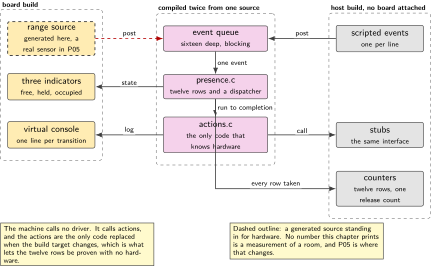
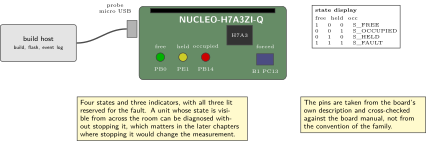
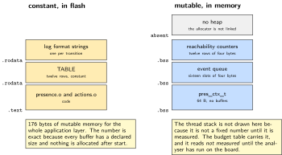
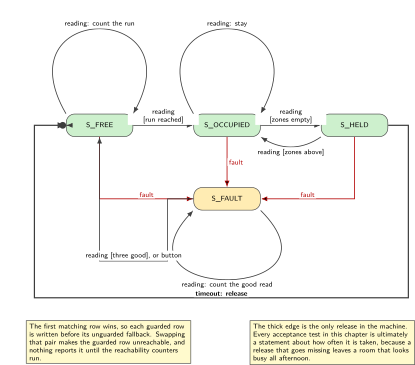
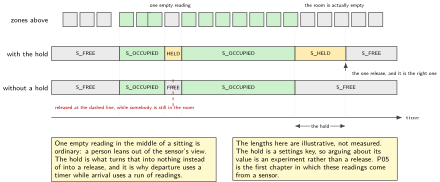

# P01. Presence: free, occupied, held, fault

> **Target:** NUCLEO-H7A3ZI-Q, and nothing else  
> **Theme:** The one state machine of the volume

> [!NOTE]
> **Where this sits in the product spine**
>
> This chapter builds the first of the four behaviours, **presence with a hold and a release**, and it builds it in full. P02 decides what to do when a calendar disagrees with it, P05 replaces its synthetic range with a real sensor, P08 refuses to restart while it reports occupied, and P09 publishes what it says. None of those four redraws the machine; they reference this one.

> **Key facts**
>
> - **Board:** NUCLEO-H7A3ZI-Q alone. No shield, no instrument, no radio
> - **Peripherals:** The three on-board indicators as a state display, the virtual console for the event log, the user button as a forced event, one kernel timer
> - **Toolchain:** The workspace from the front matter, pinned; west and CMake
> - **Operating system:** The real-time operating system, one thread and one work queue
> - **Difficulty:** 3 of 5
> - **Effort:** 3 evenings of about four hours
> - **Deliverable:** A transition table whose every row is proven reachable by a test that runs on the host with no board attached, and a release that cannot be lost

## Why this project

A room that reports occupancy has one failure that matters more than all the others, and it is not a missed detection. It is a missed release. A unit that fails to notice somebody left looks busy for the rest of the afternoon, and no one walking past can tell that it is wrong, because a closed door and a lit indicator look exactly the same whether the room is in use or whether the firmware stopped paying attention. A missed detection, by contrast, is discovered within seconds by the person standing in the room. The asymmetry is the whole reason this chapter is first.

So the chapter is not about a sensor. It is about the small piece of control flow that decides what the sensor's numbers mean: when a run of readings becomes an arrival, how long emptiness must last before it becomes a departure, and what happens when the sensor stops answering. That piece is written once here, in a form that can be read top to bottom, drawn, and exercised without hardware, and every later chapter that needs to know whether the room is in use asks this one.

Starting here rather than with a tool installation is deliberate. The workspace is in the front matter because installing a toolchain is not evidence of anything. What a reader wants to see first is the thing that runs, and what an interviewer asks first is what it does when something goes wrong.

> [!NOTE]
> **What this chapter does not claim**
>
> The range readings in this chapter come from a generated source, not from a sensor. P05 writes the driver that replaces it, and the architecture figure draws the generated source with a dashed outline for exactly that reason. Nothing here is a measurement of a room.
>
> The hold and grace values below are defaults chosen to be arguable, not results. No one on this bench has watched a real room for a week. The chapter's contribution is that they are configuration rather than constants, and that changing one does not mean editing the control flow.
>
> This is also not radar. The sensor P05 eventually fits is a time-of-flight array, which resolves zones and nothing else, and the difference matters when somebody asks what the device can see.

## Prior art and what to reuse

| Source | What it gives | What it does not | Licence |
| --- | --- | --- | --- |
| The kernel's threads, timers and message queues | Everything the dispatcher needs: a thread, a queue that blocks, a timer that posts, and a work queue for anything slow | Any opinion about what an event means. That is the application layer, and it is what this chapter writes | Apache-2.0 |
| The unit test framework and the simulated build target | The same source compiled for a host, with the test driving events directly into the queue and no board attached | A rig. The hardware runner belongs to P15 and is not needed here | Apache-2.0 |
| The shell and logging subsystems | A console that can print the current state and the counters on demand, which is the difference between a diagnosis and a guess | A log format. One is chosen below and used by the whole volume | Apache-2.0 |
| The settings subsystem | A place to keep the thresholds so that changing one does not mean rebuilding | A schema. P07 owns the versioned schema and the migration; here the keys are simply read at start | Apache-2.0 |
| A well-known hierarchical state machine framework and its course | The best teaching material on this subject anywhere, and a complete framework with modelling tools | A licence that permits it in a permissively published portfolio. Read it; do not paste it | Strong copyleft, or commercial |
| Small permissive state machine libraries | A dispatcher, a table type, sometimes a generator | None of them is a standard, and the dispatcher below is a dozen lines. A dependency that replaces a dozen lines has to be argued for rather than assumed | Various |

*Table 1.1. Prior art for P01. Four rows are infrastructure that is taken as it stands. The two rows that would carry the chapter are a framework whose licence excludes it and a category of library too small to be worth a dependency, which is the finding rather than a gap to apologise for.*

## Parts from the inventory

| Part | Role | Interface |
| --- | --- | --- |
| NUCLEO-H7A3ZI-Q | The whole chapter. Three indicators are the state display and the user button is a forced event | Micro USB to the host |
| A USB data cable | Power, programming and the event log on one lead | Micro USB |
| Build host | Builds for the board, and builds the same control flow for itself so the tests run with no board attached | As the front matter |

*Table 1.2. Inventory for P01. Nothing is wired and no instrument is needed, which is unusual in this volume and is the point: the acceptance criterion here is a test result rather than a measurement.*

## System architecture



*Figure 1.1. One source, two builds. The control flow knows neither the sensor nor the indicators: it calls actions, and the actions are the only code that knows hardware. The generated range source is drawn dashed because it stands in for the sensor P05 writes. Events reach the machine only through the queue, which is what makes the order of events testable.*

Three properties of that arrangement carry the rest of the chapter. The machine calls no driver directly, so the host build can replace every driver with a stub and still run the same transitions. Events arrive only through the queue and never as a function call, so there is exactly one place where their order is decided. And no action blocks, so a dispatch always finishes and the loop always returns to the queue, which means a slow action loses events rather than silently reordering them.

## Configuration

The board's own description enables neither of the two sensor buses and defines no flash partitions, so a chapter that needed either would add an overlay. This one needs neither, which makes it the right place to show the configuration system doing the smallest useful thing: naming the three indicators and the button so that the application never writes a pin number.

```dts
/* boards/nucleo_h7a3zi_q.overlay
 * The application refers to these by label, never by port and pin. Swapping a
 * board means editing this file and nothing else, which is the whole argument
 * for the devicetree in one example.
 */
/ {
    aliases {
        lamp-free     = &green_led_1;
        lamp-held     = &yellow_led_2;
        lamp-occupied = &red_led_3;
        forced-event  = &user_button;
    };
};
```

```text
# prj.conf
CONFIG_LOG=y
CONFIG_LOG_MODE_DEFERRED=y      # the log never blocks a transition
CONFIG_SHELL=y
CONFIG_ZTEST=n                  # the host build turns this on, the board does not
CONFIG_SETTINGS=y
CONFIG_SETTINGS_RUNTIME=y
CONFIG_MAIN_STACK_SIZE=2048
CONFIG_THREAD_ANALYZER=y        # how the stack numbers below are obtained
CONFIG_THREAD_ANALYZER_AUTO=n
```

Deferred logging is not a detail. A transition that waits for a console write is a transition whose timing depends on a cable, and the counters in the acceptance test would then measure the terminal rather than the firmware.

## Wiring



*Figure 1.2. Nothing is wired. The three indicators are on the board and their pins are confirmed from two independent sources, which is what makes it safe to spend them on a state display. The button is the forced event, used to prove that an event with no row in the current state is counted and logged rather than treated as a fault.*

The three indicators are worth their pins. Four states fit in three lamps with room to spare, and a unit whose current state is visible from across the room can be diagnosed without a debugger and without stopping it. That matters most in the later chapters where the board is sealed inside a measurement and stopping it would change the measurement. It does not replace the log, and the chapter says so twice: the lamps show where the machine is, the log shows how it got there.

## Memory and timing budget



*Figure 1.3. Every byte this chapter owns. The transition table is constant and stays in flash; the context, the queue and the counters are the whole of its mutable memory. No allocator is linked into this application at all.*

| Quantity | Budget | Measured | Margin |
| --- | --- | --- | --- |
| Transition table | under 1 kB in flash | not measured | not measured |
| Machine context, counters apart | 64 B of static memory | 40 B, printed by the test | none needed |
| Event queue | 16 events of 20 B | 320 B, printed by the test | none needed |
| Reachability counters | 29 rows of 4 B | 116 B, printed by the test | none needed |
| Dynamic allocation | zero bytes | zero by construction | not applicable |
| Thread stack, high-water mark | under 1024 B | not measured | not measured |
| Worst dispatch, excluding actions | under 200 cycles | not measured | not measured |
| Transition rows covered by test | all twenty-nine | all twenty-nine | none needed |

*Table 1.3. The budget for P01. Five rows are exact because they are static allocations rather than measurements, and the host test prints every one of them so that a reader checks a log rather than this table. Four of them were wrong until Tuesday 6 October 2026: they were written against a twelve-row table whose events carried no timestamp and no settings, which made an event 4 bytes rather than 20. The cycle row is measured with the processor's cycle counter in the method P04 establishes, and the stack row with the thread analyser. Both read `not measured` until they have been run on the board, which is the honest state of this chapter on Friday 2 October 2026.*

## Software design (UML)



*Figure 1.4. The transition table drawn. Four states, six events, and every edge that exists, including the ones taken only when something does not complete. An edge that is not drawn here is not a row in the table either, and the table is the specification.*

The design rule that makes the rest of the chapter work is that the diagram and the table are the same object. The table is the source of truth, the diagram is generated from it or checked against it by hand at every change, and any behaviour that is not a row is a defect rather than a special case. The most common way an application of this kind becomes untestable is that one condition gets handled with an early return inside an action instead of as a transition. After five of those the diagram no longer describes the program, and nobody notices until a release goes missing in the field.

Two choices in the table deserve their reasons written down. The arrival needs a run of readings rather than one, because a single sample above a threshold is a person walking past the door. The departure needs a timer rather than a run, because a person who is still in the room but out of the sensor's view for a moment must not release it; that is the whole purpose of the held state, and it is also the hook P02 uses for a longer hold when somebody says they are coming back.



*Figure 1.5. The same stream of readings, with the hold and without it. One empty reading in the middle of a sitting is ordinary, and without the hold it releases a room that is still in use. The lengths are illustrative rather than measured, which is why the hold is a settings key and not a constant.*

## Data flow (ASCII)

```text
        posted by the producers                     dispatched in one thread
  +-----------------------------+          +----------------------------------------+
  | tick     (kernel timer)      |          | take one event from the queue          |
  | reading  (range source)      |          |   find the row: (state, event, guard)  |
  | timeout  (hold timer)        | ------>  |   run its action, which must not block |
  | button   (forced event)      |  queue   |   set the next state                   |
  | fault    (any failed read)   | 16 deep  |   count the row as taken               |
  | settings (new threshold)     |          |   set the lamps, write one log line    |
  +-----------------------------+          +----------------------------------------+
                                                       |
                        state, and the reason it changed|
                                                       v
      +-------------------+   asked by    +-------------------------------------------+
      | shell: presence   | <------------ | P02 reads this to decide a claim          |
      | state, counters   |               | P08 reads this before it restarts         |
      +-------------------+               | P09 publishes it with a sequence number   |
                                          +-------------------------------------------+
```

## Repository layout

What follows is the tree as built, listed from the repository rather than from the plan. It is wider than the plan was, in one axis the plan did not have: the table is written four times and run under three kernels, and the point of the layout is that the four copies are compared against each other and the three kernels share one test.

```text
projects/01-presence/
  README.md                     # what exists, and what each part is evidence of
  docs/DESIGN.md                # the 29 rows and the invariant, written before the code
  docs/LANGUAGE_IDIOMS.md       # what each language version changes for this table
  docs/RTOS_VARIANTS.md         # the contract a kernel must satisfy, and three mappings
  docs/figures/                 # the five figures of this chapter, as SVG
  c/presence.h                  # four states, six events, the context, the invariant
  c/presence.c                  # the 29 rows and a dispatcher of a dozen lines
  c/test_presence.c             # every row reachable, the order traps, the invariant
  cpp/presence.hpp              # the same rows in C++17, the baseline
  cpp/presence23.hpp            # std::expected, and consteval proofs of totality
  cpp/presence26.hpp            # std::inplace_vector for the queue
  cpp/test_presence.cpp         # the C sequences, plus what the compiler provided
  rust/presence_core.rs         # the same rows, no_std, no unsafe, one source
  rust/tests_core.rs            # the same cases, and an exhaustive match over 192
  rust/e2018 e2021 e2024/       # three crates differing only in their edition line
  adapter/presence_adapter.h    # the contract every kernel adapter implements
  adapter/phases.c              # four test phases, and NO kernel header
  freertos/                     # the first adapter, and a CI job
  zephyr/                       # the second adapter, on native_sim, and a CI job
  qnx/                          # the third, written and never compiled
```

Two things in that list carry the chapter's argument rather than its code. `adapter/phases.c` includes no kernel header, which is what lets one test run against every kernel instead of each kernel having a test of its own that nobody can compare. And `qnx/` is there precisely because it cannot be built here: it is the kernel that does not fit, and reading what it guarantees is what produced the twenty-ninth row.

## Steps

**Step 1.** **Write the states and the events down before any code.** This is a step, not advice. Four states and six events, each with one sentence saying what it means and who may post it, in a file committed before `presence.c` exists. If a state cannot be described in one sentence it is two states, and if an event has two meanings it is two events.

**Step 2.** **Declare the table types.** A row is a from-state, an event, an optional guard, an action and a to-state, and nothing else. Putting a timeout value or a counter in the row is the first step towards a table that describes half the behaviour.

```c
/* presence.h */
typedef enum { S_FREE, S_OCCUPIED, S_HELD, S_FAULT, S_COUNT } pres_state_t;

typedef enum { E_TICK, E_READING, E_TIMEOUT, E_BUTTON, E_FAULT,
               E_SETTINGS, E_COUNT } pres_event_t;

typedef struct {
    pres_state_t state;
    uint16_t     zones_above;      /* from the most recent reading        */
    uint8_t      run;              /* consecutive readings above          */
    uint8_t      good_reads;       /* consecutive good reads, for recovery */
    uint32_t     entered_ms;       /* when the current state was entered   */
    uint32_t     releases;         /* the counter the acceptance test reads */
} pres_ctx_t;

typedef struct {
    pres_state_t from;
    pres_event_t on;
    bool (*guard)(const pres_ctx_t *);
    void (*action)(pres_ctx_t *);
    pres_state_t to;
} pres_row_t;
```

**Step 3.** **Write the table.** It is the specification. Read it top to bottom and you have read the behaviour, which is a property no set of boolean flags ever has. The guarded row is written before the unguarded fallback, because the first matching row wins.

```c
/* presence.c */
static const pres_row_t TABLE[] = {
  /* arrival needs a run, so one person walking past the door is not an arrival */
  { S_FREE,     E_READING, guard_run_reached,  act_enter_occupied, S_OCCUPIED },
  { S_FREE,     E_READING, NULL,               act_count_run,      S_FREE     },
  { S_FREE,     E_FAULT,   NULL,               act_enter_fault,    S_FAULT    },

  /* departure starts the hold; it does not release */
  { S_OCCUPIED, E_READING, guard_zones_empty,  act_start_hold,     S_HELD     },
  { S_OCCUPIED, E_READING, NULL,               act_stay,           S_OCCUPIED },
  { S_OCCUPIED, E_FAULT,   NULL,               act_enter_fault,    S_FAULT    },

  /* the hold is the only place a release can happen, and it is counted */
  { S_HELD,     E_READING, guard_zones_above,  act_resume,         S_OCCUPIED },
  { S_HELD,     E_TIMEOUT, NULL,               act_release,        S_FREE     },
  { S_HELD,     E_FAULT,   NULL,               act_enter_fault,    S_FAULT    },

  /* recovery takes three good reads, so one lucky read does not clear a fault */
  { S_FAULT,    E_READING, guard_three_good,   act_clear_fault,    S_FREE     },
  { S_FAULT,    E_READING, NULL,               act_count_good,     S_FAULT    },
  { S_FAULT,    E_BUTTON,  NULL,               act_clear_fault,    S_FREE     },
};
#define TABLE_ROWS (sizeof(TABLE) / sizeof(TABLE[0]))
static uint32_t taken[TABLE_ROWS];   /* the reachability counters */
```

**Step 4.** **Write the dispatcher.** It is twelve lines, and the chapter's argument that a library would cost more than it saves rests on this being visible.

```c
void pres_dispatch(pres_ctx_t *c, pres_event_t ev)
{
    for (size_t i = 0; i < TABLE_ROWS; i++) {
        const pres_row_t *r = &TABLE[i];
        if (r->from != c->state || r->on != ev) { continue; }
        if (r->guard && !r->guard(c))           { continue; }
        if (r->action)                          { r->action(c); }
        taken[i]++;
        if (r->to != c->state) {
            c->state = r->to;
            c->entered_ms = k_uptime_get_32();
            act_show_state(c);          /* lamps, and one log line */
        }
        return;
    }
    /* No row. This is information, not a fault: the button in S_OCCUPIED is a
     * legitimate event with nothing to do. Count it and carry on. */
    LOG_INF("ts=%u key=unhandled state=%d event=%d", k_uptime_get_32(),
            c->state, ev);
}
```

**Step 5.** **Put the thresholds in settings, not in the source.** Three values: how many consecutive readings make an arrival, how many zones count as occupied, and how long the hold lasts. They are read once at start and on the settings event, and the shell can change one without a rebuild. P07 adds the versioned schema; here they are simply keys.

**Step 6.** **Run it on the host first.** The whole point of the two builds is that the control flow can be exercised before a board is involved. Scripted event sequences go in, the final state and the counters come out. This is the one step below that has actually been run: on Tuesday 6 October 2026, in WSL on the demo laptop.

```bash
cmake -B build-zephyr -GNinja -DBOARD=native_sim -S projects/01-presence/zephyr
ninja -C build-zephyr
./build-zephyr/zephyr/zephyr.exe
```

**Not `west build`, and this chapter said otherwise until the command was run.** That is an extension command which west discovers through its workspace manifest, so it exists only inside the workspace; invoked from this repository it reports that `build` is an unknown command. `west zephyr-export` registers Zephyr's CMake package once, and `find_package(Zephyr)` then locates it from anywhere, which is why plain CMake needs no workspace and why a CI job is cheap. Two smaller corrections came with it: the directory is `projects/01-presence/zephyr` rather than `projects/P01-presence`, and the adapter carries its own four phases rather than ztest, so there is no `CONFIG_ZTEST` to set. Zephyr also wants a toolchain variant even for `native_sim`, which `CMakeLists.txt` supplies, so the three lines above are the whole of the build.

**Step 7.** **Then build for the board and watch the lamps.** **Not run.** No board has run any of this, and the lines below are the plan rather than a record.

```bash
west build -p -b nucleo_h7a3zi_q projects/01-presence/zephyr
west flash
picocom -b 115200 /dev/ttyACM0
```

For the board `west build` is the right tool rather than the wrong one, because flashing wants the runner configuration that a workspace carries; that is the one place this chapter asks for a workspace. The monitor line previously named an Espressif command, on a chapter whose only target is an ST board.

**Step 8.** **Prove the reachability counter by making it fail.** Comment out one scripted sequence, run the suite, and confirm that the uncovered row is named. A coverage check that has never reported a gap has not been shown to work, and this is the cheapest place in the volume to establish that habit.

## Build, flash and debug

The board carries a debug probe that is also the virtual console and a drag-and-drop disk, so `west flash` and `west debug` both work with no extra hardware. Two console habits are worth fixing here because the whole volume inherits them.

The log line has one shape, a timestamp followed by key-value pairs, because a log that mixes prose and values cannot be counted and the acceptance test below counts. The shell carries one command, `presence`, which prints the current state, the time in it, the release counter and the twenty-nine row counters. That single command is what turns a question about field behaviour into an answer rather than a theory.

## Verification and acceptance criteria

The method is written before the run, and so is the result that would refute it.

- **Every row is taken.** The scripted sequences drive all twenty-nine rows and the suite prints the counters. *Refuted if* any counter is zero after the full run, which means either a row is unreachable or the scripts are incomplete, and the chapter says which.
- **A release is never lost.** Over a generated sequence of ten thousand arrivals and departures with the hold shorter than the gap, the release counter equals the number of departures exactly. *Refuted if* the two differ by even one, which is the failure this chapter exists to prevent.
- **A fault does not become a release.** A sequence that enters the fault state during a hold must not increment the release counter. *Refuted if* it does, which would mean a sensor failure quietly frees the room.
- **One lucky read does not clear a fault.** Recovery requires three consecutive good reads. *Refuted if* a single good read among failures returns the machine to free.
- **An unhandled event is counted, not fatal.** Pressing the button in the occupied state logs one line and leaves the state alone.
- **The dispatch does not allocate.** The build links no allocator; a call to one is a link error rather than a review comment.

## Variants

| Axis | This chapter | The alternative | Cost | Built in full |
| --- | --- | --- | --- | --- |
| Control flow | A flat table, read top to bottom | A hierarchical machine with a superstate for faults | Two fault edges are cheap; at six a superstate pays | Here |
| Dispatch | One thread taking one event at a time | A work queue per event class | Ordering becomes a question rather than a fact | P04 |
| Where the range comes from | A generated source, dashed in the figure | A real sensor with its own driver | The driver is a chapter on its own | P05 |
| Where the thresholds live | Settings, read at start | Constants in the source | A rebuild to change a timeout | Here, schema in P07 |
| What the room does with it | Lamps and a log line | A claim, a reason code and an event | The policy is a chapter on its own | P02 |

*Table 1.4. Variants touching P01. Only two rows are built here, which is correct for the chapter that everything else references: a chapter that built every variant of itself would leave the later chapters with nothing to say.*

## Pitfalls

- **Treating the hold as a detail.** It is the chapter. Removing it gives a unit that releases the room every time somebody leans out of the sensor's view, and the symptom appears as complaints about bookings rather than as a firmware bug report.
- **An early return inside an action.** It is the fastest way to a diagram that no longer describes the program. If a condition changes what happens next, it is a guard and a row.
- **Ordering the table by state for readability.** The first matching row wins, so the guarded row must precede the unguarded one. Sorting the table alphabetically later is a change in behaviour, and only the reachability counters will say so.
- **Blocking inside an action.** A console write at the wrong log level is the usual culprit, which is why deferred logging is in the configuration fragment rather than left to taste.
- **Counting a transition instead of a release.** The acceptance test counts releases, because that is the quantity a room's users experience. Counting transitions would pass while the room stayed occupied all afternoon.

## Best practices applied

The specification is a table rather than prose, so it can be checked mechanically. The coverage instrument is proven by making it fail before it is trusted. The hardware-dependent code is a layer of actions, so the same control flow runs on a host with no board. The thresholds are configuration, so an argument about a timeout is an experiment rather than a release. And the one thing a reader is most likely to get wrong, the difference between a departure and a release, is the property the acceptance test measures directly.

## Stretch goals

Generate the figure from the table with `tools/table_to_dot.py` in the build, so a row added without a drawn edge turns the build red rather than being noticed at review. Add a superstate for faults once a third fault source appears, which is the point at which the flat table stops paying. Record a day of generated events at one second resolution and plot the state against time, which makes the hold's effect visible in a way a counter does not.

## Roadmap and next steps

P02 is the direct continuation and the reason this chapter stops where it does: presence is an observation, and a claim on a room is a decision that has to weigh that observation against a calendar, a button and a grace period. P05 replaces the generated range with a real sensor and is where the thresholds stop being arguable and start being measured. P07 gives the thresholds a versioned schema so that an update can change them safely, and P08 reads the state produced here before it restarts the unit, which is the first time this chapter's output protects something outside itself.

## Portfolio evidence

The idiom this chapter proves is **maintainability**: the pins live in the devicetree and the behaviour lives in a table, so neither is edited to change the other. The command that proves it is

`cmake -B build-zephyr -GNinja -DBOARD=native_sim -S projects/01-presence/zephyr && ninja -C build-zephyr && ./build-zephyr/zephyr/zephyr.exe`

which runs the four adapter phases through a real queue, a real dispatch thread and a real kernel timer, and needs no board. The same four phases run against FreeRTOS from the same source file, and both are jobs in `code.yml`. Publish the architecture figure, the state diagram, the counter output for all twenty-nine rows, and the one paragraph on why a missed release is the failure that matters.

## Sources

- The operating system's kernel documentation: threads, message queues, timers and work queues. Read Friday 2 October 2026.
- The unit test framework and the simulated build target, for the host build that needs no board. Read Friday 2 October 2026.
- The logging and shell subsystems, in particular deferred mode, which is why a transition does not wait for a console. Read Friday 2 October 2026.
- The board's own devicetree, for the three indicators and the button, cross-checked against the board manual rather than against the convention of the family.
- The hierarchical state machine framework and its course, read for the ideas and not used for code, for the licence reason stated in the prior-art table.

---

[Previous](00-about-this-volume.md) &nbsp;&nbsp;|&nbsp;&nbsp; [Contents](../README.md) &nbsp;&nbsp;|&nbsp;&nbsp; [Next](02-the-claim.md)
