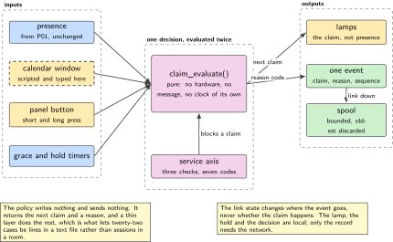
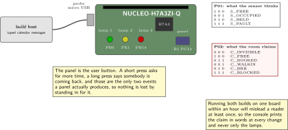
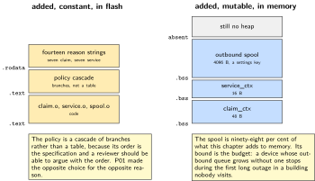
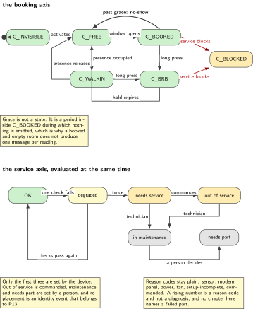
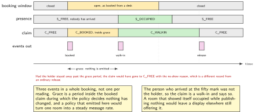

# P02. The claim, and the service axis

> **Target:** NUCLEO-H7A3ZI-Q, and nothing else  
> **Theme:** Policy when the calendar and the body disagree

> [!NOTE]
> **Where this sits in the product spine**
>
> This chapter borrows the first behaviour, **presence with a hold and a release**, from P01 and builds nothing of it. What it adds is the decision layer above it: who holds the room when a booking and a person disagree, and whether the room is fit to be booked at all. P09 runs these cases against a fleet, and P08 reads the state this chapter publishes before it restarts anything.

> **Key facts**
>
> - **Board:** NUCLEO-H7A3ZI-Q alone. The user button stands in for a panel button
> - **Peripherals:** The three indicators, now driven by the claim rather than by presence; the virtual console; two kernel timers, for the grace period and for the longer hold
> - **Toolchain:** As P01, plus the scripted-event runner
> - **Operating system:** One thread, the same queue discipline as P01
> - **Difficulty:** 4 of 5
> - **Effort:** 4 evenings of about four hours
> - **Deliverable:** One policy function with seven reason codes, a service axis that runs beside the booking state, and a spool that keeps working when the network does not

## Why this project

A room can be claimed twice over. A calendar claims it in advance, from a desk, by somebody who may not turn up. A person claims it by walking in. Those two claims are made in different places, arrive by different routes, and routinely disagree, and the firmware is where the disagreement has to be settled because the firmware is the only part of the system that is present in both senses.

The usual rule is easy to state and easy to get wrong. A live booking beats a walk-in. A booking whose holder has not appeared within a grace period does not. Everything hard about this chapter follows from that second sentence: the grace period has to be a number somebody can change, the release it causes has to be distinguishable in the record from an ordinary departure, and none of it may depend on the network being up, because the room is still a room when the radio is not working.

The second half of the chapter is the axis almost nobody builds until it is needed. A room can be free, booked or occupied, and separately it can be fine, partly working, or not fit to be booked at all. Collapsing those two into one status is the mistake that produces a room which reports itself free while its sensor has been silent for three days. Keeping them apart costs one more field and is the difference between an honest outage and a room that quietly swallows bookings.

> [!NOTE]
> **What this chapter does not claim**
>
> There is no calendar on this bench. Calendar messages arrive as scripted input in the host build and as typed shell commands on the board, and the architecture figure draws that source dashed. No chapter in this volume integrates with a real calendar service, and none claims to.
>
> There is no panel either. The user button stands in for one, which is enough to exercise the two events a panel actually produces, and the wiring figure says so rather than drawing hardware that is not there.
>
> The grace period, the longer hold and the spool bound are defaults, not findings. They are settings keys so that changing one is an experiment rather than a release.

## Prior art and what to reuse

| Source | What it gives | What it does not | Licence |
| --- | --- | --- | --- |
| P01, in this volume | The presence machine, its hold, its release and its fault state, taken unchanged. This chapter adds no state to it | Any notion of a booking. Presence is an observation; a claim is a decision | Apache-2.0 |
| The kernel's timers and the settings subsystem | Two independent timers and the keys that set them | A policy. The policy is what this chapter writes, and it is written as one function so that it can be tested | Apache-2.0 |
| The ring buffer of the sibling firmware volume | The outbound spool, with its atomicity assumptions already stated | A bound on bytes. This chapter adds the bound, because a spool that grows without one is a device that stops | MIT |
| Published scheduling and reservation protocols | A vocabulary for bookings and the useful observation that a no-show policy is a property of the room, not of the calendar | Anything that runs on a part of this size. They assume a server | Various |
| The shell subsystem | Typed commands standing in for calendar messages, which is what makes this chapter demonstrable on a desk | A transport. P11 carries these messages for real | Apache-2.0 |

*Table 2.1. Prior art for P02. The only substantial dependency is the chapter before it. The policy itself has no prior art worth the name, for the same reason the state machine in P01 had none: the application layer is where the product lives, and nobody publishes theirs.*

## Parts from the inventory

| Part | Role | Interface |
| --- | --- | --- |
| NUCLEO-H7A3ZI-Q | The whole chapter. The user button is the panel, and the three indicators now show the claim rather than the presence | Micro USB to the host |
| A USB data cable | Power, programming and the console on one lead | Micro USB |
| Build host | Runs the scripted cases, which is where every acceptance criterion below is checked | As the front matter |

*Table 2.2. Inventory for P02. Identical to P01, deliberately: a chapter whose subject is a decision needs no hardware to prove it, and the scripted cases are stronger evidence than a demonstration on a desk.*

## System architecture



*Figure 2.1. The claim sits above presence and below everything that leaves the unit. Four inputs reach one policy function; three outputs leave it. The calendar source is dashed because it is scripted here. The service axis runs beside the booking state rather than inside it, which is the structural point of the chapter.*

The arrangement has one rule that is worth more than the rest. The policy is a pure function of the current claim, the current presence, the pending calendar window, the timers and the service state. It writes no hardware and sends no message; it returns the next claim and a reason code, and a thin layer above it does the rest. That is what lets every case below be a line in a text file rather than a session with a stopwatch.

## Configuration

Nothing new is enabled on the board. What is new is six settings keys, and they are listed here rather than buried in the code because an argument about the right grace period is the most likely conversation this chapter will ever cause.

```text
# settings keys, read at start and on the settings event
claim/grace_s          300    # a booking whose holder has not appeared is released
claim/brb_hold_s       900    # the longer hold a panel press buys
claim/walkin_len_s    1800    # how long a walk-in claims the room for
claim/spool_bytes     4096    # the outbound spool's hard bound
claim/stale_after_s    600    # beyond this, published state carries the stale flag
svc/activated            0    # until this is 1 the unit never shows itself free
```

The last key is the one that gets forgotten. A unit that has been installed but not commissioned must not advertise itself as free, because a room that accepts a booking before anyone has checked that the door closes is worse than a room nobody can see. The flag defaults to zero, so the failure mode of forgetting to set it is a room that is invisible rather than a room that is wrong.

## Wiring



*Figure 2.2. Nothing is wired, again. The user button is the panel and produces the two events a panel actually produces: a short press, which asks for more time, and a long press, which says somebody is coming back. The indicators now show the claim, and the mapping differs from P01, which is why the figure prints both tables side by side.*

The indicators change meaning between P01 and P02 and that is a genuine hazard rather than a presentational detail. P01 shows where the sensor thinks the room is; P02 shows what the room is claiming. A reader who runs both builds on the same board within an hour will misread the lamps at least once, so the mapping is printed in the figure and the console prints the claim in words at every change.

## Memory and timing budget



*Figure 2.3. What this chapter adds to P01. The policy itself is constant: a table of rules and no state of its own. The spool is the only sizeable allocation, and its bound is a settings key rather than a constant, so the budget row below is a maximum rather than a measurement.*

| Quantity | Budget | Measured | Margin |
| --- | --- | --- | --- |
| Claim context | 48 B of static memory | 48 B by construction | none needed |
| Service context | 16 B of static memory | 16 B by construction | none needed |
| Outbound spool | 4096 B, a settings key | 4096 B by construction | the bound is the budget |
| Policy rules in flash | under 1 kB | not measured | not measured |
| Reason-code strings | under 256 B in flash | not measured | not measured |
| Added thread stack | under 512 B over P01 | not measured | not measured |
| Worst policy evaluation | under 400 cycles | not measured | not measured |
| Scripted cases passing | all twenty-two | not measured | not measured |

*Table 2.3. The budget for P02, stated as what it adds to P01 rather than as a total, because the two run together. The spool row is the one that matters operationally: a device whose outbound queue has no bound is a device that stops when the network does, which is the opposite of what this chapter is for.*

## Software design (UML)



*Figure 2.4. The claim, drawn beside the service axis. The two run at the same time and neither is a state of the other. A unit that is not fit to be booked refuses a claim without changing what presence reports, and that separation is the whole design.*

Two decisions in that picture deserve their reasons in writing.

The first is that a walk-in creates an outbound claim rather than simply lighting a lamp. A room that shows itself occupied while publishing nothing is a room that a display elsewhere still shows as free, and the person who booked it from a desk arrives to find it in use with no record of why. The event is not an optimisation; it is the difference between a device and a lamp.

The second is that asking for more time is a request with a timeout, never a local success. The unit does not own the calendar, so it cannot grant an extension; it can only ask and then show what it was told. A panel that lights up green the instant it is pressed is lying about a decision that has not been made yet, and the lie is discovered by the next person to arrive.



*Figure 2.5. One booking, one walk-in, and three events. Grace is the band where the claim is booked and nothing is emitted, which is why a room that has been booked and stands empty does not produce one message per reading. The person who arrived was not the holder, so the claim says walk-in and the record can tell the two apart afterwards.*

## Data flow (ASCII)

```text
   inputs                            one policy function                      outputs
  +------------------------+   +--------------------------------------+   +------------------+
  | presence   (from P01)  |-->| if not activated     -> invisible    |-->| lamps            |
  | calendar window        |   | if service blocks    -> rejected     |   | one event, with  |
  | panel: short, long     |   | if booked and here   -> booked       |   | a reason code    |
  | grace timer expiry     |   | if booked and empty  -> grace        |   | spool when the   |
  | service check results  |   |   and past grace     -> no-show      |   | radio is down    |
  +------------------------+   | if free and here     -> walk-in      |   +------------------+
                               | if long press        -> be-right-back|
                               +--------------------------------------+
                                                 |
          the service axis, evaluated separately |
                                                 v
  +--------------------------------------------------------------------------------------+
  | OK | degraded | needs service | out of service | in maintenance | needs part | replaced|
  | reason: sensor  modem  panel  power  fan  setup-incomplete  commanded                  |
  +--------------------------------------------------------------------------------------+
```

## Repository layout

```text
projects/P02-claim/
  CMakeLists.txt
  prj.conf
  src/claim.c                     # the policy function, pure, no hardware
  src/claim.h                     # claims, reason codes, the input struct
  src/service.c                   # the second axis, and its reason codes
  src/spool.c                     # the bounded outbound queue
  src/shell_cmds.c                # typed calendar messages, for the desk demo
  tests/cases.txt                 # twenty-two scripted cases, one per line
  tests/test_policy.c             # every case, and every reason code reached
  tests/test_spool.c              # the bound holds under a long outage
  docs/reason_codes.md            # the seven claim codes and the seven service codes
  README.md
```

## Steps

**Step 1.** **Write the reason codes down first, with one sentence each.** Seven for the claim and seven for the service axis. A reason code that needs two sentences is two codes, and a code that never appears in a scripted case is one nobody can act on.

**Step 2.** **Declare the inputs as one structure.** The policy takes this and returns a decision. If a later chapter needs to add an input, it goes here and every scripted case still compiles.

```c
/* claim.h */
typedef enum { C_INVISIBLE, C_FREE, C_BOOKED, C_WALKIN, C_BRB, C_BLOCKED,
               C_COUNT } claim_t;

typedef enum { R_BOOKED, R_WALKIN, R_GRACE, R_NOSHOW, R_BRB, R_REJECTED,
               R_OFFLINE, R_COUNT } reason_t;

typedef struct {
    pres_state_t presence;        /* straight from P01, never recomputed */
    bool     activated;           /* svc/activated */
    bool     service_blocks;      /* out of service, or in maintenance */
    bool     window_open;         /* a booking covers now */
    uint32_t window_started_s;    /* how long the booking has been open */
    bool     panel_short;         /* asked for more time */
    bool     panel_long;          /* said they are coming back */
    uint32_t grace_s;             /* settings */
    bool     link_up;             /* false means spool, not refuse */
} claim_in_t;

typedef struct { claim_t next; reason_t why; bool emit; } claim_out_t;

claim_out_t claim_evaluate(claim_t now, const claim_in_t *in);
```

**Step 3.** **Write the policy as a readable cascade, most specific first.** The order is the specification and it is the thing a reviewer should argue with.

```c
claim_out_t claim_evaluate(claim_t now, const claim_in_t *in)
{
    if (!in->activated)      { return (claim_out_t){ C_INVISIBLE, R_REJECTED, false }; }
    if (in->service_blocks)  { return (claim_out_t){ C_BLOCKED,   R_REJECTED, true  }; }

    if (in->panel_long && now != C_FREE) {
        return (claim_out_t){ C_BRB, R_BRB, true };          /* a longer hold */
    }
    if (in->window_open) {
        if (in->presence == S_OCCUPIED) {
            return (claim_out_t){ C_BOOKED, R_BOOKED, now != C_BOOKED };
        }
        /* booked, and nobody here: grace first, release only after it */
        if (in->window_started_s < in->grace_s) {
            return (claim_out_t){ C_BOOKED, R_GRACE, false };
        }
        return (claim_out_t){ C_FREE, R_NOSHOW, true };      /* the no-show release */
    }
    if (in->presence == S_OCCUPIED) {
        return (claim_out_t){ C_WALKIN, R_WALKIN, now != C_WALKIN };
    }
    return (claim_out_t){ C_FREE, R_BOOKED, now != C_FREE };
}
```

**Step 4.** **Make the link state change where the event goes, never whether it happens.** This is the one line that separates a device from a lamp. When the radio is down the event is spooled with the offline reason; it is not dropped and the room does not stop working.

```c
static void emit(claim_t c, reason_t why, bool link_up)
{
    event_t e = { .ts = k_uptime_get_32(), .claim = c, .why = why,
                  .seq = ++g_seq };
    if (link_up) { publish(&e); }
    else         { e.why = R_OFFLINE; spool_push(&e); }  /* bounded, oldest first */
}
```

**Step 5.** **Bound the spool, and decide what it discards.** Oldest first, because the newest claim is the one a display needs. The bound is a settings key and the discard is counted, so a long outage is visible afterwards rather than silent.

**Step 6.** **Build the service axis as a separate evaluation.** Three checks, each with a counter: did the sensor answer, did the radio attach, did the panel respond. Two consecutive failures of one check move the axis, and the reason code names the check rather than guessing at a cause. A rising number is a reason code, not a diagnosis.

**Step 7.** **Write the twenty-two cases before the code passes any of them.** Each line is a sequence of inputs and the claim, reason and event count it must produce. The interesting ones are the disagreements: booked and empty inside grace, booked and empty past grace, walk-in during somebody else's booking, a panel press while out of service, and a sensor fault during a booking.

**Step 8.** **Run them on the host, then type them at the board.**

```bash
west build -p -b native_sim projects/P02-claim -- -DCONFIG_ZTEST=y
./build/zephyr/zephyr.exe
west build -p -b nucleo_h7a3zi_q projects/P02-claim && west flash
# then, on the console: claim window open 1800 ; claim presence occupied
```

## Build, flash and debug

The shell is what makes this chapter demonstrable without a calendar, a panel or a radio. Four commands are enough: open and close a booking window, set the presence the policy should see, press the panel short or long, and set the service axis. Every one of them is also a line in the scripted cases, so the desk demonstration and the test suite exercise the same path.

The console prints one line per decision in the volume's format, and it prints the reason code as a word. A log that says the claim changed without saying why is a log that cannot settle an argument about a room, and settling that argument is the entire purpose of the chapter.

## Verification and acceptance criteria

- **Every reason code is reached.** The twenty-two cases produce all seven claim codes and all seven service codes. *Refuted if* any code has a zero count, which means either the policy cannot produce it or nobody wrote the case.
- **A live booking beats a walk-in.** With a window open and presence occupied, the claim is booked and not walk-in. *Refuted if* the walk-in path runs while a window is open, which would let a passer-by take a booked room.
- **A no-show releases exactly once, and says so.** Past the grace period with nobody present, one event is emitted with the no-show reason and the claim becomes free. *Refuted if* a second event follows, or if the reason is the ordinary release.
- **Grace does not emit.** Inside the grace period the claim does not change and no event leaves the unit. *Refuted if* the event count rises, which would flood a gateway with one message per reading.
- **An unactivated unit never shows itself free.** With the activation flag clear, no input sequence produces a free or walk-in claim. *Refuted if* any of the twenty-two does.
- **The room works with the radio down.** With the link down for the whole of a case, the claim still changes, the lamps still follow and the spool holds the events. *Refuted if* any claim transition depends on the link.
- **The spool is bounded and the loss is counted.** Driving a thousand events with the link down leaves the spool at its configured size and the discard counter at the difference exactly. *Refuted if* memory grows or the counter and the arithmetic disagree.

## Variants

| Axis | This chapter | The alternative | Cost | Built in full |
| --- | --- | --- | --- | --- |
| Where the policy lives | On the unit, as a pure function | On the gateway, with the unit as a sensor | The room stops deciding when the link drops | Here |
| Conflict rule | A live booking beats a walk-in | First claim wins, whoever made it | A no-show holds the room all afternoon | Here |
| Extension | A request with a timeout | A local grant, published later | The panel lies about a decision not yet made | Here |
| Outbound when offline | A bounded spool, oldest discarded | An unbounded queue | The device stops during a long outage | Here |
| Service axis | Beside the booking state | A single combined status | A faulty room reports itself free | Here |
| Transport for the events | Scripted and typed | A real message client | A chapter of its own | P11 |

*Table 2.4. Variants touching P02. Five rows are built here because they are the chapter, and each alternative is a real design that somebody ships; the cost column is why this volume does not.*

## Pitfalls

- **Folding the service axis into the booking state.** It looks tidier and it produces a room that reports itself free with a dead sensor. The two axes answer different questions and have different owners.
- **Emitting on every reading.** The grace period is the common case during a booking, and a policy that emits while nothing has changed turns one room into a steady message rate the gateway has to absorb.
- **Refusing to work when the link is down.** The lamp is local, the hold is local and the decision is local. Only the record needs the network.
- **An unbounded spool.** It passes every test on a desk and stops the device after a long outage in a building nobody visits.
- **Treating the activation flag as part of commissioning paperwork.** It is a state, it defaults to off, and the room is invisible until somebody sets it.
- **Letting the grace period be a constant.** The right value depends on the building, and a constant turns a conversation into a release.

## Best practices applied

The decision is a pure function, so it is tested as a table of cases rather than by waiting in a room. The two axes are separate because they answer separate questions. Every outbound path is bounded and every discard is counted. The local behaviour does not depend on the network, which is the property that distinguishes a device from a terminal. And the failure mode of every default is the safe one: the unit is invisible before commissioning, the spool discards rather than grows, and a sensor that stops answering produces an outage rather than a free room.

## Stretch goals

Generate the twenty-two cases from the policy's own cascade so that a branch added without a case turns the build red. Add a second conflict rule behind a settings key, so a building that prefers first-claim-wins can have it without a fork. Record a week of generated bookings and walk-ins and plot the claim against time, which makes the cost of a too-short grace period visible as a count rather than as an opinion.

## Roadmap and next steps

P08 is the first consumer of this chapter's output that protects something: it reads the claim before it restarts the unit and refuses while the room is in use. P09 publishes the claim with a sequence number and a stale flag, and runs these same twenty-two cases against a fleet rather than against one board. P11 gives the events a real transport, at which point the spool stops being a test fixture and starts being the thing that keeps the record intact across an outage. P18 supplies the one service reason code this chapter cannot yet produce honestly, because a silent panel is a statement about a bus that does not exist on this bench until Monday 5 October 2026.

## Portfolio evidence

The idiom this chapter proves is **validation**: the method and the result that would refute it are written before the run, as twenty-two named cases with expected reason codes. The command that proves it is

`west build -p -b native_sim projects/P02-claim -- -DCONFIG_ZTEST=y && ./build/zephyr/zephyr.exe`

which runs every case, prints the count for each of the fourteen reason codes, and fails if any is zero. Publish the policy cascade, the case file, the reason-code counts, and the one paragraph on why the service axis is separate from the booking state.

## Sources

- P01 in this volume, for the presence machine this chapter consumes without modifying.
- The kernel's timer and settings documentation, for the two independent timers and the six keys. Read Friday 2 October 2026.
- The shell subsystem, for the typed commands that stand in for a calendar. Read Friday 2 October 2026.
- The ring buffer of the sibling firmware volume, chapter 2, for the spool's structure and its stated atomicity assumptions.
- Published reservation and scheduling vocabularies, read for their terms rather than their implementations, which all assume a server.

---

[Previous](01-presence.md) &nbsp;&nbsp;|&nbsp;&nbsp; [Contents](../README.md) &nbsp;&nbsp;|&nbsp;&nbsp; [Next](03-one-sensor.md)
