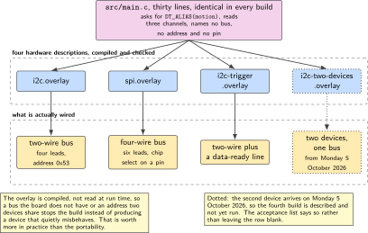
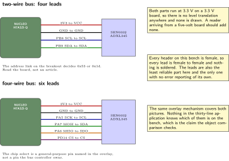
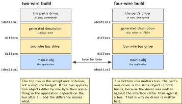
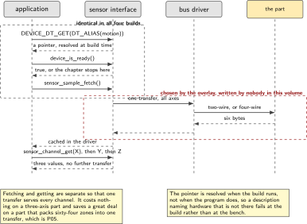
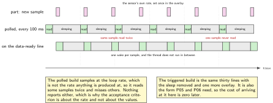

# P03. One sensor, two buses, zero code changes

> **Target:** NUCLEO-H7A3ZI-Q with an ADXL345 breakout, on jumper leads  
> **Theme:** Devicetree, bindings, the sensor API

> [!NOTE]
> **Where this sits in the product spine**
>
> This chapter serves no spine behaviour directly. It establishes the mechanism every sensor chapter afterwards uses: the hardware is described in an overlay, the application asks for a device by what it is rather than by where it is wired, and swapping a bus is an edit to a text file. P05 writes a driver that plugs into this, P06 reads its samples, and P14 moves the whole application to another board by writing a second overlay.

> **Key facts**
>
> - **Board:** NUCLEO-H7A3ZI-Q with a DFRobot SEN0032 carrying an ADXL345, on jumper leads
> - **Peripherals:** One two-wire bus and one four-wire bus, each enabled by overlay because the board's own description enables neither; one interrupt line for the data-ready trigger
> - **Toolchain:** As the front matter, plus the devicetree compiler's own output for reading
> - **Operating system:** One thread, polling in the first build and waiting on a trigger in the second
> - **Difficulty:** 3 of 5
> - **Effort:** 3 evenings of about four hours
> - **Deliverable:** One application binary built four ways from identical C, differing only in which overlay is given to the build

## Why this project

The one claim this chapter makes is easy to state and surprisingly hard to believe until it is demonstrated: the same C file, unchanged, reads an accelerometer over a two-wire bus and over a four-wire bus, and the only difference is which text file the build is told to use. Nobody edits a driver, nobody recompiles against a different header, and nobody writes an if statement about which bus is fitted.

That property is worth a chapter because it is the one that decides whether a codebase survives its second board. The alternative is familiar: a build flag that selects a bus, then two code paths that drift, then a third board whose pinout is unlike either, and eventually an application that cannot be read without knowing the wiring. The mechanism here moves all of that into a description of the hardware that the compiler checks, and leaves the application saying only what it wants.

The chapter is placed third, after the two that show the device deciding something, because it is infrastructure. A reader who wants to know what this volume builds should read P01 and P02; a reader who wants to know how the rest of it stays maintainable should read this one.

> [!NOTE]
> **What this chapter does not claim**
>
> This chapter proves portability across two buses on one board. It does not prove portability across two boards. That claim belongs to P14, which runs the same application on a different processor family, and it is a harder claim because the second board has different peripherals rather than a different wire.
>
> Whether the ranging shield used in P05 selects its bus with a jumper or with a soldered link is not settled on this bench. There is no soldering iron here, so P05 is written for the two-wire bus first with the four-wire bus as a variant, and this chapter's second build uses the loose accelerometer instead, which has a plain jumper.
>
> The second device on one bus, a single-zone ranging breakout, arrives on Monday 5 October 2026. Until it is on the bench its block in the architecture figure is dotted and the fourth build in the table below is marked as not yet run.

## Prior art and what to reuse

| Source | What it gives | What it does not | Licence |
| --- | --- | --- | --- |
| The operating system's in-tree accelerometer driver | A complete driver for this exact part, on both buses, with the data-ready trigger already implemented. This chapter writes no driver at all | Any guarantee that the board's buses are enabled. They are not, and the overlay is the chapter | Apache-2.0 |
| The devicetree bindings and the sensor interface documentation | The grammar of a binding, the channel vocabulary, and the trigger model | The board's own strapping. Which bus the breakout is wired for is a bench fact, confirmed by reading the board, not by reading a document | Apache-2.0 |
| The board's own devicetree source | The authoritative statement of what is enabled, which is the finding that shapes the chapter | Pin assignments for the buses, which come from the board manual and the processor's reference manual | Apache-2.0 |
| The breakout's datasheet | The address on the two-wire bus, which has two possible values, and the mode the four-wire bus needs | Anything about this board. The two documents have to be read together | Vendor |
| The devicetree compiler's generated header | A way to see what the build actually concluded, which settles an argument faster than reading three overlays | A readable overlay. It is generated output and is used for checking, never for editing | Apache-2.0 |

*Table 3.1. Prior art for P03. Unusually, the driver is entirely reused and the chapter's own work is the hardware description plus the demonstration that the application does not change. That ratio is the point rather than a shortcut.*

## Parts from the inventory

| Part | Role | Interface |
| --- | --- | --- |
| NUCLEO-H7A3ZI-Q | The host for all four builds | Micro USB to the build host |
| DFRobot SEN0032 | An ADXL345 accelerometer breakout that speaks both buses, which is why it is the right part for this chapter | Two-wire or four-wire, by jumper lead |
| Female jumper leads | Every header on this bench is female, so the leads are female to female and nothing is soldered | 3.3 V only |
| Single-zone ranging breakout | The second device on one bus, in the fourth build. Arrives Monday 5 October 2026 and is dotted until then | Two-wire |

*Table 3.2. Inventory for P03. No shield is fitted, which is deliberate: a shield would hide the wiring behind a connector, and the wiring is what this chapter is about.*

## System architecture



*Figure 3.1. The same application above, four hardware descriptions below. The application asks for a device by its devicetree node and receives a pointer; it never names a bus, an address or a pin. The second device is dotted because it arrives on Monday 5 October 2026.*

The arrangement has one consequence worth drawing out. Because the overlay is compiled rather than parsed at run time, a wiring mistake that would otherwise appear as a silent read of zeroes becomes a build error. An overlay that names a bus the board does not have, or an address two devices share, does not produce a device that misbehaves; it produces a build that stops. That is the single largest practical benefit of the mechanism and it is worth more than the portability.

## Configuration

The board's own description enables neither bus, which is the first thing to establish rather than the first thing to work around. Reading the board's devicetree source shows the nodes present and disabled, and the overlay's job is to turn one on, give it pins, and hang a device off it.

```dts
/* overlays/i2c.overlay: the accelerometer on the two-wire bus.
 * The pin groups come from the board manual and the reference manual for this
 * part, which is RM0455 and not the manual most material is written against.
 */
&i2c1 {
    status = "okay";
    pinctrl-0 = <&i2c1_scl_pb8 &i2c1_sda_pb9>;
    pinctrl-names = "default";
    clock-frequency = <I2C_BITRATE_FAST>;

    accel: adxl345@53 {
        compatible = "adi,adxl345";
        reg = <0x53>;              /* 0x1d when the address link is pulled up */
        status = "okay";
    };
};

/ { aliases { motion = &accel; }; };
```

```dts
/* overlays/spi.overlay: the same part, the same driver, a different bus.
 * Nothing in src/ changes between this file and the one above.
 */
&spi1 {
    status = "okay";
    pinctrl-0 = <&spi1_sck_pa5 &spi1_miso_pa6 &spi1_mosi_pa7>;
    pinctrl-names = "default";
    cs-gpios = <&gpiod 14 GPIO_ACTIVE_LOW>;

    accel: adxl345@0 {
        compatible = "adi,adxl345";
        reg = <0>;
        spi-max-frequency = <5000000>;   /* the part's documented ceiling */
        status = "okay";
    };
};

/ { aliases { motion = &accel; }; };
```

A third overlay adds the data-ready interrupt, and a fourth adds the second device to the two-wire bus. Both are shown in the repository rather than here, because their content is a variation on the two above and printing them would suggest there is more to it than there is.

## Wiring



*Figure 3.2. The two wirings, side by side, with the pins named in full. Four leads for the two-wire bus and six for the four-wire bus, all female to female, all at 3.3 V. The address link on the breakout decides between two addresses and is the single most common reason a first build finds nothing.*

Two wiring facts carry more weight than the rest. The breakout is a 3.3 V part on a 3.3 V board, so no level translation is needed and none is drawn; a reader coming from a five-volt board should not add any. And the chip-select line for the four-wire bus is driven by a general-purpose pin named in the overlay rather than by the bus controller's own, which is the usual arrangement and is why the overlay names a pin that looks unrelated to the bus.

## Memory and timing budget



*Figure 3.3. Where the four builds differ, which is almost nowhere. The application object file is identical across all four; the bus driver and the generated hardware description are what change, and the figure prints both so the claim can be checked rather than believed.*

| Quantity | Budget | Measured | Margin |
| --- | --- | --- | --- |
| Application object, two-wire build | identical across builds | not measured | the claim of the chapter |
| Application object, four-wire build | identical to the above | not measured | the claim of the chapter |
| Two-wire driver and bus | under 6 kB in flash | not measured | not measured |
| Four-wire driver and bus | under 6 kB in flash | not measured | not measured |
| Sample buffer | 36 B of static memory | 36 B by construction | none needed |
| Dynamic allocation | zero bytes | zero by construction | not applicable |
| Read latency, polled, two-wire | under 1 ms | not measured | not measured |
| Read latency, trigger to sample | under 200 us | not measured | not measured |

*Table 3.3. The budget for P03. The first two rows are the acceptance criterion rather than a resource budget: if the two application objects differ by a single byte, the chapter's claim is false and the difference is the finding. The latency rows are measured with the cycle counter in the method P04 establishes.*

## Software design (UML)



*Figure 3.4. What happens between asking for a device and getting a sample, on both buses. The application's half of the sequence is identical; only the lower half differs, and the lower half is code nobody in this volume writes.*

The sequence makes one thing visible that the overlays do not. The application calls for a sample and then reads channels out of it, rather than reading registers; the fetch and the get are separate because a sensor that returns three axes should be read once and unpacked three times, not read three times. That distinction costs nothing here and saves a great deal on a bus with a device that packs many values into one transfer, which is exactly the shape of the ranging sensor in P05.



*Figure 3.5. Polling against waiting on the data-ready line. The polled build samples at the loop rate and sometimes reads the same sample twice or misses one; the triggered build samples at the rate the sensor was configured for, and the thread is not running in between. Both are the same application source, differing by one overlay and one removed sleep.*

## Data flow (ASCII)

```text
  the application, identical in all four builds
  +--------------------------------------------------------------+
  |  dev = DEVICE_DT_GET(DT_ALIAS(motion));                       |
  |  if (!device_is_ready(dev)) { fault; }                        |
  |  loop: sensor_sample_fetch(dev);                              |
  |        sensor_channel_get(dev, ACCEL_X, &x); ... Y ... Z      |
  +--------------------------------------------------------------+
                 |                                   |
     overlay A   |                       overlay B   |
                 v                                   v
  +----------------------------+        +----------------------------+
  | two-wire controller         |        | four-wire controller       |
  | address 0x53 or 0x1d        |        | chip select on a GPIO      |
  | four leads                  |        | six leads                  |
  +----------------------------+        +----------------------------+
                 |                                   |
                 +-----------------+-----------------+
                                   v
                      +---------------------------+
                      | one accelerometer breakout|
                      | one in-tree driver        |
                      +---------------------------+
```

## Repository layout

```text
projects/P03-two-buses/
  CMakeLists.txt
  prj.conf                        # sensor and logging on; nothing bus specific
  overlays/i2c.overlay            # the two-wire description
  overlays/spi.overlay            # the four-wire description
  overlays/i2c-trigger.overlay    # adds the data-ready line
  overlays/i2c-two-devices.overlay  # the second device, from Monday 5 October 2026
  src/main.c                      # the only source file, and it never changes
  tools/compare_objects.sh        # the acceptance test: are the objects identical
  docs/pins.md                    # the pin tables, with the manual page for each
  README.md
```

## Steps

**Step 1.** **Read the board's own description before writing anything.** Confirm that both bus nodes exist and that both are disabled, and write down the node labels. A chapter that assumes a bus is enabled because every tutorial assumes it is a chapter that fails at the first build with a message about a missing device.

```bash
grep -n "i2c1\|spi1" zephyr/boards/st/nucleo_h7a3zi_q/nucleo_h7a3zi_q.dts
grep -rn "i2c1:\|spi1:" zephyr/dts/arm/st/h7/stm32h7a3.dtsi
```

**Step 2.** **Write the application first, against neither bus.** It is thirty lines and it is the whole point: it names an alias and a channel, and nothing else.

```c
/* src/main.c, identical in every build in this chapter */
#include <zephyr/device.h>
#include <zephyr/drivers/sensor.h>
#include <zephyr/logging/log.h>
LOG_MODULE_REGISTER(motion, LOG_LEVEL_INF);

int main(void)
{
    const struct device *dev = DEVICE_DT_GET(DT_ALIAS(motion));

    if (!device_is_ready(dev)) {
        LOG_ERR("ts=%u key=device_not_ready", k_uptime_get_32());
        return -ENODEV;            /* a wiring fault, reported as one */
    }
    while (1) {
        struct sensor_value x, y, z;

        if (sensor_sample_fetch(dev) == 0) {
            sensor_channel_get(dev, SENSOR_CHAN_ACCEL_X, &x);
            sensor_channel_get(dev, SENSOR_CHAN_ACCEL_Y, &y);
            sensor_channel_get(dev, SENSOR_CHAN_ACCEL_Z, &z);
            LOG_INF("ts=%u x=%d.%06d y=%d.%06d z=%d.%06d", k_uptime_get_32(),
                    x.val1, abs(x.val2), y.val1, abs(y.val2),
                    z.val1, abs(z.val2));
        }
        k_sleep(K_MSEC(100));
    }
}
```

**Step 3.** **Write the two-wire overlay and build with it.** The address is the first thing to get wrong, so read the breakout rather than the internet: the link decides between two values and the board as shipped may use either.

```bash
west build -p -b nucleo_h7a3zi_q projects/P03-two-buses \
    -- -DEXTRA_DTC_OVERLAY_FILE=overlays/i2c.overlay
```

**Step 4.** **Check what the build concluded, not what the overlay said.** The generated header is the authority, and reading it settles an argument in seconds that reading three overlays settles in an hour.

```bash
grep -n "adxl345\|i2c1" build/zephyr/include/generated/zephyr/devicetree_generated.h | head
```

**Step 5.** **Rewire for the four-wire bus and build again, changing nothing in src.** This is the demonstration. Six leads instead of four, a different overlay on the command line, and the same thirty lines.

```bash
west build -p -b nucleo_h7a3zi_q projects/P03-two-buses \
    -- -DEXTRA_DTC_OVERLAY_FILE=overlays/spi.overlay
```

**Step 6.** **Prove the claim mechanically rather than by assertion.** Compare the application object file from the two builds. If they differ, say so and find out why; the chapter's whole argument is this comparison.

```bash
sh tools/compare_objects.sh      # extracts main.c.obj from both builds, compares
```

**Step 7.** **Make a wiring mistake on purpose.** Give the overlay an address nothing answers at, and confirm the application reports a device that is not ready rather than printing zeroes. A sensor path that cannot tell absence from silence is the defect this step exists to rule out.

**Step 8.** **Add the trigger overlay and remove the sleep.** The third build waits on the data-ready line instead of polling, which is the form P05 and P06 both need, and it is one more overlay and one callback rather than a redesign.

## Build, flash and debug

Three commands cover every build in the chapter, differing only in the overlay named. The habit worth forming is to pass the overlay on the command line rather than putting it in the project's own configuration, because the command line is self-documenting: the shell history says which hardware each binary was for, and a binary whose hardware description came from a file somebody edited last week is a binary nobody can place.

When a device does not come up, the order of checking is fixed and short. Read the generated header to see whether the build made the device at all. If it did, check the address or the chip-select line against the breakout. If that is right, check the leads, which on this bench are the least reliable component and the only one with no error reporting of its own.

## Verification and acceptance criteria

- **The application object is byte for byte identical across the two-wire and four-wire builds.** *Refuted if* they differ at all, which would mean something in the application depends on the bus after all, and the difference names what.
- **Both builds produce the same readings at rest.** With the board flat on the bench, both report roughly one unit of acceleration on one axis and roughly zero on the other two. *Refuted if* the axes disagree between builds, which would point at a driver configuration difference the overlay introduced.
- **A wrong address is reported, not tolerated.** With the address deliberately wrong, the application logs a device that is not ready and returns. *Refuted if* it prints zeroes, which is the failure this criterion exists to exclude.
- **The build refuses an impossible description.** An overlay naming a bus the board does not have fails at build time with a message naming it. *Refuted if* the build succeeds.
- **The trigger build samples without polling.** With the sleep removed, samples arrive at the rate the sensor is configured for and the thread is not spinning. *Refuted if* the sample rate follows the loop rather than the sensor.
- **Two devices on one bus do not interfere.** From Monday 5 October 2026, with both devices described, each reads correctly and neither disturbs the other. *Not yet run*, and the figure says so.

## Variants

| Axis | This chapter | The alternative | Cost | Built in full |
| --- | --- | --- | --- | --- |
| Bus | Two-wire and four-wire, by overlay | A build flag and two code paths | The paths drift, and the third board fits neither | Here |
| Sampling | Polled, then on a trigger | Polled only | The loop rate decides the sample rate | Here |
| Driver | In tree, unmodified | Written against the registers | A chapter of its own, and a maintenance burden | The sibling firmware volume, chapter 17 |
| Driver, out of tree | Not here | A binding and a module of one's own | A chapter of its own | P05 |
| Devices per bus | One, then two | One only | The address question is never faced | Here, from Monday 5 October 2026 |
| Board | One | Two, with two overlays | A different peripheral set, not just a different wire | P14 |

*Table 3.4. Variants touching P03. The two rows built here are the ones that cost nothing extra to demonstrate once the mechanism exists, which is itself the argument for the mechanism.*

## Pitfalls

- **Assuming a bus is enabled.** On this board neither is. Every tutorial that skips the overlay was written for a board whose description enables the bus already.
- **Taking the address from an article.** This part has two, selected by a link on the breakout, and both appear in print. Read the board in front of you.
- **Copying pin groups from the popular member of this processor family.** The reference manuals differ, and a pin group that exists there may not exist here.
- **Reading three axes with three fetches.** The interface separates fetching from getting precisely so that one transfer serves every channel, and the habit matters far more on the ranging sensor than on this one.
- **Treating a silent bus as a zero reading.** Check that the device is ready and report it when it is not. A path that cannot distinguish absence from silence will eventually report an empty room as a still one.
- **Putting the overlay in the project configuration.** It builds the same and it loses the record of which hardware a binary was for.

## Best practices applied

The hardware is described once, in a file the compiler checks, rather than asserted in several places the compiler cannot. The application names what it wants and not where it is. The portability claim is tested by comparing object files rather than by inspection. The absence of a device is an error path with a message rather than a default value. And the one fact that cannot be read from a document, which link the breakout has fitted, is checked on the bench and written down in the project's own notes.

## Stretch goals

Add a build for the second ranging device once it arrives on Monday 5 October 2026 and measure whether a slow device on the bus delays the fast one, which is the first question anyone asks about sharing a bus. Add a bus-error injection by driving one line low with a spare pin and confirm the driver reports a failure rather than hanging, which is the behaviour that matters in a unit nobody can visit. Generate the pin tables in the documentation from the overlays, so that a rewiring that is not documented turns the build red.

## Roadmap and next steps

P05 uses this mechanism for a driver that does not exist upstream, which is where the binding stops being a formality and becomes design work. P06 consumes the samples and decides which of them deserve to leave the device. P14 writes a second overlay for a different board and is the chapter where the portability claim is made properly. And P15 runs all four builds in continuous integration, which is what keeps the claim true after the chapter is written.

## Portfolio evidence

The idiom this chapter proves is **maintainability**: the devicetree owns the pins and the application does not, so a change of wiring is a change of one text file. The command that proves it is

`sh tools/compare_objects.sh`

which builds the application for both buses and reports whether the two application object files are byte for byte identical. Publish the two overlays, the thirty-line application, the comparison output, and the build log of the deliberate wiring mistake showing a device reported as not ready.

## Sources

- The board's own devicetree source and the processor family's include file, read on Friday 2 October 2026, for the finding that neither bus is enabled.
- The reference manual for this part, which is RM0455, for the pin groups. Material written for the popular sibling is not used.
- The devicetree bindings documentation and the sensor interface documentation. Read Friday 2 October 2026.
- The in-tree accelerometer driver and its binding, used unmodified.
- The breakout's datasheet, for the two possible addresses and the four-wire mode, read together with the board manual rather than on its own.

---

[Previous](02-the-claim.md) &nbsp;&nbsp;|&nbsp;&nbsp; [Contents](../README.md) &nbsp;&nbsp;|&nbsp;&nbsp; [Next](04-what-the-kernel-primitives-cost.md)
