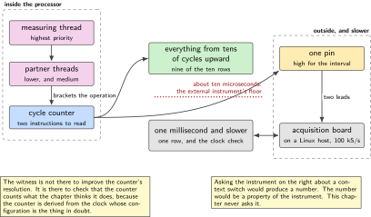
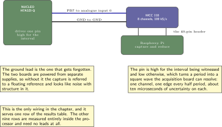
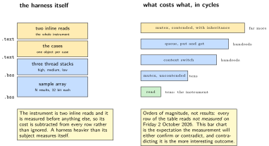
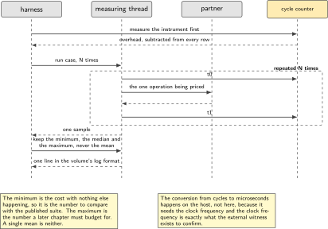
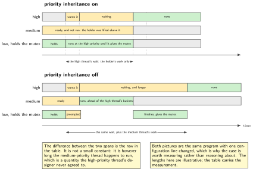

# P04. What the kernel primitives cost, by the cycle counter

> **Target:** NUCLEO-H7A3ZI-Q, with an MCC 118 on a Raspberry Pi as a witness for periods only  
> **Theme:** Threads, queues, work queues, priority inheritance

> [!NOTE]
> **Where this sits in the product spine**
>
> This chapter serves no spine behaviour. It establishes the measurement method the rest of the volume uses whenever a number is a duration: the processor's own cycle counter for anything shorter than the acquisition board can see, and the acquisition board for periods it can. P10 measures charge with a different instrument and cites this chapter for the timing half.

> **Key facts**
>
> - **Board:** NUCLEO-H7A3ZI-Q, with a Raspberry Pi carrying an MCC 118 as an external witness
> - **Peripherals:** The data watchpoint unit's cycle counter, one general-purpose pin for the witness, the virtual console
> - **Toolchain:** As the front matter, plus a short host script that reduces the captured periods
> - **Operating system:** Several threads, a message queue, a work queue, a mutex
> - **Difficulty:** 4 of 5
> - **Effort:** 4 evenings of about four hours
> - **Deliverable:** A table of primitive costs in cycles, each with its own method and its own refutation, and a witness that confirms the one claim the cycle counter cannot make about itself

## Why this project

Every later chapter in this volume states a duration at some point: how long a dispatch takes, how long a sensor read blocks, how long the radio is awake. A volume that states those numbers without saying how they were obtained is a volume whose numbers cannot be checked, and a number that cannot be checked is worth less than no number at all, because it looks like evidence.

So this chapter does the measuring once, properly, and the rest of the book cites it. It prices the kernel's own primitives against each other: what it costs to switch between threads, what a message queue costs compared with waiting on several objects at once, what handing work to a queue costs compared with doing it in place, and what a mutex costs when a lower-priority thread is holding it and a higher-priority one wants it.

The second reason for the chapter is a boundary that matters. The acquisition board on this bench resolves an edge to about ten microseconds on one channel. A context switch on this processor is far shorter than that. Using the acquisition board to measure a context switch would produce a number, and the number would be an artefact of the instrument rather than a property of the software. The chapter is therefore as much about knowing which instrument cannot answer a question as it is about the answers.

> [!NOTE]
> **What this chapter does not claim**
>
> The interrupt-to-thread latency distribution is not measured here. The sibling firmware volume's final chapter builds that measurement in full over a million events, and repeating it would be duplication rather than evidence. This chapter prices the primitives against one another, which is a different question.
>
> Every row in the table below reads `not measured` on Friday 2 October 2026. The method is written and the refutation is written; the runs have not happened. A reader should treat the table as a protocol rather than as a result, and the chapter says so rather than leaving the column blank.
>
> The cycle counter measures the processor, including its caches. A number taken with the instruction cache warm and a number taken cold differ by more than the quantity being measured in some cases, so each row states which it is. A chapter that reported one number would be reporting an accident of ordering.

## Prior art and what to reuse

| Source | What it gives | What it does not | Licence |
| --- | --- | --- | --- |
| The operating system's own timing benchmark suite | A maintained set of measurements of exactly these primitives, with a documented method, which is the right place to start and the right thing to compare against | Numbers for this board. They are published for other boards, and the differences between processors of this family are large enough that borrowing one would be inventing it | Apache-2.0 |
| The processor's data watchpoint and trace unit | A free-running cycle counter, readable in two instructions, which is the only instrument on this bench fine enough for the question | Any help with overflow, ordering or cache state. Those are the chapter's work | Vendor documentation |
| The thread analyser | Stack high-water marks, which is the one memory number this volume takes rather than computes | Timing | Apache-2.0 |
| The acquisition board's library on the Linux host | A calibrated capture at one hundred thousand samples per second aggregate, which witnesses a period of a millisecond comfortably | Anything at the scale of a context switch. Ten microseconds per sample is the floor, and the chapter states it rather than hoping | BSD |
| The sibling firmware volume, chapter 20 | The interrupt-to-thread latency distribution, built in full over a million events | A comparison between primitives, which is this chapter | Apache-2.0 |

*Table 4.1. Prior art for P04. The upstream benchmark suite is both the method to follow and the result to argue with: where this bench disagrees with it the disagreement is the finding, and where it agrees the agreement is a check on the method.*

## Parts from the inventory

| Part | Role | Interface |
| --- | --- | --- |
| NUCLEO-H7A3ZI-Q | The subject. Its own cycle counter is the instrument for everything below ten microseconds | Micro USB to the build host |
| Raspberry Pi 4 with an MCC 118 | The external witness, used only for the periodic thread's period, which is a millisecond-scale quantity it can see | One analogue channel, one ground, two leads |
| Two female jumper leads | One general-purpose pin to one analogue input, and a ground between the boards | 3.3 V, within the board's input range |

*Table 4.2. Inventory for P04. The acquisition board appears for exactly one row of the results table. Listing it for the others would imply it contributed to them, which it cannot.*

## System architecture



*Figure 4.1. What measures what. The cycle counter is inside the processor and sees everything; the acquisition board is outside and sees one pin at ten microseconds. The dotted boundary between them is the point of the figure: a question below that line cannot be answered by the instrument on the right, and this chapter never asks it to.*

The arrangement has one property worth stating because it is the usual mistake. The witness is not there to improve the cycle counter's resolution; it is there to check that the cycle counter is counting what the chapter thinks it is. A periodic thread whose period the cycle counter says is one millisecond and whose pin the acquisition board says toggles every one millisecond is a measurement with two independent witnesses. If they disagree, the clock configuration is wrong, and that is a failure the cycle counter cannot detect on its own because it is derived from the same clock.

## Configuration

```text
# prj.conf
CONFIG_LOG=y
CONFIG_LOG_MODE_DEFERRED=y
CONFIG_THREAD_ANALYZER=y
CONFIG_THREAD_ANALYZER_USE_PRINTK=y
CONFIG_SCHED_DEADLINE=n          # not used; stated so the schedule is unambiguous
CONFIG_TIMESLICING=n             # time slicing off, or the numbers include it
CONFIG_PRIORITY_CEILING=n        # inheritance, not ceiling: that is the subject
CONFIG_MUTEX=y
CONFIG_POLL=y                    # k_poll, measured against the queue
CONFIG_SYSTEM_WORKQUEUE_STACK_SIZE=2048
```

Two of those lines are measurements in disguise. Time slicing is off because a slice boundary landing inside a measured interval adds a context switch nobody asked for, and a result that silently includes one is wrong in a way that looks like noise. Priority ceiling is off because inheritance is the subject of one of the rows, and the two protocols produce different numbers for the same program.

## Wiring



*Figure 4.2. Two leads. One general-purpose pin on the microcontroller to one analogue input on the acquisition board, and one ground between the two boards so that the voltages are comparable. The pin is driven high for the duration being witnessed and low otherwise, which turns a period into a square wave the acquisition board can resolve.*

The ground lead is the one that gets forgotten and it is the one that produces the most confusing failure. Without it the acquisition board sees a signal referred to its own ground, which floats relative to the microcontroller's, and the capture looks like noise with structure in it. The two boards are powered from separate supplies here, so the ground lead is the only thing making the measurement meaningful.

## Memory and timing budget



*Figure 4.3. The measurement harness itself, and what it costs. The instrument has to be cheaper than the thing it measures, which for a two-instruction counter read it comfortably is, and the figure states the overhead so that it can be subtracted rather than ignored.*

| What is being priced | Expected order | Measured | Cache state |
| --- | --- | --- | --- |
| Reading the cycle counter, the overhead itself | tens of cycles | not measured | warm |
| Context switch, two ready threads | hundreds of cycles | not measured | warm |
| Context switch, same, cold instruction cache | more than the above | not measured | cold |
| Message queue, put then get, no block | hundreds of cycles | not measured | warm |
| Waiting on several objects at once, one ready | more than a queue | not measured | warm |
| Handing an item to a work queue | hundreds of cycles | not measured | warm |
| Doing the same work in place | the baseline | not measured | warm |
| Mutex, uncontended take and give | tens of cycles | not measured | warm |
| Mutex, contended, with inheritance | far more than the above | not measured | warm |
| Periodic thread, the period itself | one millisecond | not measured | witnessed |

*Table 4.3. The protocol for P04, which is what this table is until the runs happen. The last row is the only one the acquisition board can witness; every row above it is below that instrument's floor, and the chapter does not pretend otherwise. The two context-switch rows exist because reporting one number for both would be reporting an accident of ordering.*

## Software design (UML)



*Figure 4.4. The harness. One high-priority thread starts and stops the counter around the operation being priced; the operation's partner runs at a lower priority. Each case runs many times and the harness keeps the minimum, the median and the maximum rather than the mean, because the maximum is the number a design has to survive and the mean hides it.*

Keeping the minimum matters as much as keeping the maximum, and for a different reason. The minimum is the closest thing available to the cost with nothing else happening, so it is the number to compare against the upstream suite. The maximum is the number a later chapter has to budget for. A single mean is neither, and reporting one would make the table agree with everybody and inform nobody.



*Figure 4.5. The contended mutex case, which is the one worth drawing. With inheritance the holder is lifted so that the medium-priority thread cannot run first; without it, the medium thread runs and the high-priority thread waits for work it never asked for. The two configurations are the same program, and the difference between them is the row in the table.*

## Data flow (ASCII)

```text
                     the processor, where the cycle counter lives
  +------------------------------------------------------------------------+
  |  measuring thread, highest priority                                     |
  |    t0 = DWT->CYCCNT;                                                    |
  |    <the one operation being priced>        <- partner thread, lower     |
  |    t1 = DWT->CYCCNT;                                                    |
  |    record(t1 - t0 - overhead);             <- overhead measured first   |
  |    repeat N times, keep min, median, max                                |
  +------------------------------------------------------------------------+
                 |                                      |
     console     |                                      |  one pin, high for
     one line    |                                      |  the periodic thread
     per case    v                                      v
  +---------------------------+        +------------------------------------+
  | build host: the table     |        | acquisition board on a Linux host  |
  | in cycles and in micro-   |        | 100 kS/s, about 10 us per edge     |
  | seconds at the stated     |        | witnesses the 1 ms period ONLY     |
  | clock                     |        | and nothing shorter                |
  +---------------------------+        +------------------------------------+
```

## Repository layout

```text
projects/P04-primitive-costs/
  CMakeLists.txt
  prj.conf
  src/cycles.h                    # the counter, enabled and read in two inlines
  src/harness.c                   # run a case N times, keep min, median, max
  src/case_switch.c               # context switch, warm and cold
  src/case_queue.c                # message queue against waiting on many
  src/case_workq.c                # handing off against doing it in place
  src/case_mutex.c                # uncontended, then contended with inheritance
  src/case_period.c              # the periodic thread, and the witness pin
  host/capture_period.py          # the acquisition board side, on the Linux host
  host/reduce.py                  # cycles to microseconds, and the table
  docs/method.md                  # each case, and what would refute it
  README.md
```

## Steps

**Step 1.** **Write down what would refute each case before writing the case.** This is the chapter's own rule applied to itself. A measurement whose refutation is not written first tends to acquire one that it happens to pass.

**Step 2.** **Enable the counter and measure the instrument before anything else.** The read itself costs something, and a result that has not subtracted it is wrong by that amount on every row.

```c
/* src/cycles.h */
static inline void cyc_init(void)
{
    CoreDebug->DEMCR |= CoreDebug_DEMCR_TRCENA_Msk;
    DWT->LAR = 0xC5ACCE55;        /* unlock, where the part requires it */
    DWT->CYCCNT = 0;
    DWT->CTRL |= DWT_CTRL_CYCCNTENA_Msk;
}
static inline uint32_t cyc_now(void) { return DWT->CYCCNT; }

/* the overhead of the measurement itself, subtracted from every case */
static uint32_t cyc_overhead(void)
{
    uint32_t best = UINT32_MAX;
    for (int i = 0; i < 1000; i++) {
        uint32_t a = cyc_now();
        uint32_t b = cyc_now();
        if (b - a < best) { best = b - a; }
    }
    return best;
}
```

**Step 3.** **Price the context switch, warm and cold.** The measuring thread yields to a partner that immediately yields back; half the round trip is one switch. Running the same case after invalidating the instruction cache gives the second row.

```c
/* src/case_switch.c, the measured half */
static void partner(void *a, void *b, void *c)
{
    for (;;) { k_sem_take(&go, K_FOREVER); k_sem_give(&back); }
}

static uint32_t one_round_trip(void)
{
    uint32_t t0 = cyc_now();
    k_sem_give(&go);              /* partner is higher priority: it runs now */
    k_sem_take(&back, K_FOREVER);
    return cyc_now() - t0;
}
```

**Step 4.** **Price the queue against waiting on several objects.** Same payload, same partner, two mechanisms. The result that matters is the ratio rather than either number, because the ratio is what a later chapter uses to choose.

**Step 5.** **Price handing work off against doing it in place.** The work is the same small function in both cases. A hand-off that costs more than the work it defers is a hand-off that should not exist, and the pair of numbers is what makes that judgement possible rather than stylistic.

**Step 6.** **Price the mutex twice: uncontended, then contended.** The contended case needs three threads and is the one worth drawing: a low-priority thread holds the mutex, a high-priority thread asks for it, and a medium-priority thread is ready to run. With inheritance the medium thread does not run first; without it, it does. Measure the high-priority thread's wait in both configurations.

**Step 7.** **Witness the one thing the counter cannot check about itself.** Drive a pin high at the top of the periodic thread and low at the bottom, capture it on the acquisition board, and compare its period with the counter's. Two independent instruments agreeing is the only evidence here that the clock is configured as the build believes.

```bash
python host/capture_period.py --channel 0 --rate 100000 --seconds 10 \
    --out period.csv
python host/reduce.py period.csv --expect-ms 1.0
```

**Step 8.** **Make the witness fail on purpose.** Change the periodic thread to two milliseconds without telling the reduction script and confirm it reports the disagreement. An instrument that has never disagreed has not been shown to be able to.

## Build, flash and debug

The harness prints one line per case in the volume's log format, with the case name, the count, and the minimum, median and maximum in cycles. Converting to time happens on the host, not on the board, because the conversion needs the clock frequency and the clock frequency is exactly the thing the witness exists to confirm. A board that converted its own cycles to microseconds would be asserting the number it is supposed to be checking.

When a case produces a number that looks wrong, the order of suspicion is fixed. Check that time slicing is off. Check that the partner thread's priority is what the case intends. Check whether the counter wrapped, which at this clock happens in about fifteen seconds and is the single most common cause of an impossible result. Only then suspect the kernel.

## Verification and acceptance criteria

- **The instrument is cheaper than everything it measures.** The overhead is at least an order of magnitude below the smallest case. *Refuted if* it is not, which would mean the table is mostly measuring the measurement.
- **The minimum agrees with the upstream suite within a stated factor.** *Refuted if* this bench and the published numbers for comparable processors disagree by more than that factor, in which case the disagreement is the finding and the chapter investigates rather than publishing.
- **Warm and cold differ, and the chapter says by how much.** *Refuted if* they do not differ at all, which would suggest the cold case did not actually invalidate anything.
- **Priority inheritance changes the contended result.** With inheritance on, the high-priority thread's wait does not include the medium thread's work; with it off, it does. *Refuted if* the two configurations give the same number, which would mean the case is not actually contended.
- **Two instruments agree on the period.** The counter and the acquisition board agree on the periodic thread's period within the acquisition board's own resolution. *Refuted if* they disagree, which points at the clock configuration and not at the kernel.
- **The disagreement is detectable.** With the period deliberately changed, the reduction script reports it. *Refuted if* it passes.
- **No row claims the acquisition board where it cannot see.** Every row except the last names the cycle counter. *Refuted if* any sub-ten-microsecond number cites the external instrument.

## Variants

| Axis | This chapter | The alternative | Cost | Built in full |
| --- | --- | --- | --- | --- |
| Instrument | The cycle counter, with an external witness for the period | The external instrument alone | Everything below ten microseconds becomes an artefact | Here |
| Statistic | Minimum, median and maximum | The mean | The number a design must survive disappears | Here |
| Synchronisation | Queue, several objects, work queue, mutex | One of them | No ratio, so no basis for choosing | Here |
| Mutex protocol | Inheritance, measured against it being off | Ceiling | A different number for the same program | Here |
| Latency distribution | Not measured here | A million events, binned | Duplication | Sibling firmware volume, chapter 20 |
| Energy per operation | Not measured here | The power meter in series | A different instrument and a different chapter | P10 |

*Table 4.4. Variants touching P04. The rows built here are the ones that let a later chapter choose a primitive on evidence. The two rows that are not built here are not gaps: each is a chapter elsewhere that does the job properly.*

## Pitfalls

- **A counter that wraps.** At this clock the counter wraps in about fifteen seconds. A case that brackets anything slower than that produces a plausible small number, which is the worst kind of wrong.
- **Leaving time slicing on.** A slice boundary inside a measured interval adds a switch nobody asked for and appears as occasional large values that look like noise.
- **Reporting the mean.** It hides the maximum, which is the only number a later chapter actually needs.
- **Measuring with the console attached at a high log level.** A deferred log is cheap and a synchronous one is not, and the difference lands inside the measured interval.
- **Using the external instrument for short intervals.** It will produce a number. The number will be about the instrument.
- **Forgetting the ground lead between the boards.** The capture then looks like structured noise, and the time spent reading it is time not spent on the measurement.
- **Comparing a cold number with somebody else's warm one.** Half the published disagreements about this processor family are this.

## Best practices applied

The instrument is measured before the subject and its cost is subtracted rather than ignored. The resolution floor of each instrument is stated, and no question is asked of an instrument that cannot answer it. Two independent instruments check the one assumption neither can check alone. Three statistics are kept rather than one, and the reason for each is written down. The refutation of every case is written before the case. And the one check that proves the method works is a deliberate disagreement, because an instrument that has never reported a problem has not been shown capable of reporting one.

## Stretch goals

Run the whole table at two clock configurations and confirm that the cycle counts barely move while the times do, which is the cleanest demonstration that cycles and seconds are different quantities. Add a case for the time the scheduler takes to choose among many ready threads, which is the number that decides how many threads a design can afford. Publish the reduction script's output as a committed file so that a later change to the kernel version shows up as a difference rather than as a memory.

## Roadmap and next steps

P06 uses these numbers to decide where its feature computation runs and how large a window it can afford. P07 uses the method rather than the numbers, to time a write that must survive a power cut. P10 measures a different quantity with a different instrument and cites this chapter for the timing half of its table, which is the arrangement that keeps one current table and one timing method rather than four of each. P15 runs the harness in continuous integration so that a number which drifts is reported rather than remembered.

## Portfolio evidence

The idiom this chapter proves is **performance**: the rate, the window and the statistic are stated, each number names the instrument that produced it, and the instrument's floor is stated beside it. The command that proves it is

`west build -p -b nucleo_h7a3zi_q projects/P04-primitive-costs && west flash && python host/reduce.py period.csv --expect-ms 1.0`

which prints the table in cycles and in microseconds and reports whether the external witness agrees with the counter on the one row it can see. Publish the table, the method document with its refutations, and the capture that shows the deliberate disagreement being caught.

## Sources

- The operating system's own timing benchmark suite, read on Friday 2 October 2026, as both the method to follow and the published result to argue with.
- The processor core's documentation for the data watchpoint and trace unit, for the counter, its enable sequence and its wrap period.
- The reference manual for this part, which is RM0455, for the clock configuration the witness exists to confirm.
- The acquisition board's library documentation on the Linux host, for the sample rate and the resulting resolution floor of about ten microseconds on one channel.
- The sibling firmware volume, chapter 20, for the interrupt-to-thread latency distribution this chapter deliberately does not repeat.

---

[Previous](03-one-sensor.md) &nbsp;&nbsp;|&nbsp;&nbsp; [Contents](../README.md) &nbsp;&nbsp;|&nbsp;&nbsp; [Next](05-the-zones.md)
