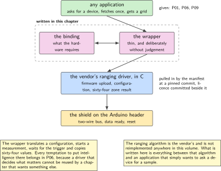
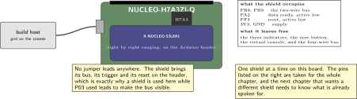
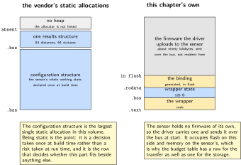
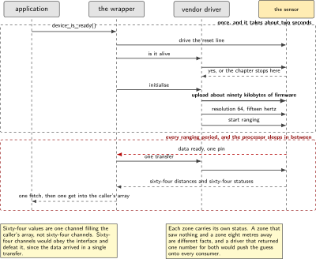
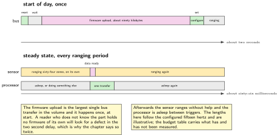

# P05. The zones: an out-of-tree driver

> **Target:** NUCLEO-H7A3ZI-Q with the eight by eight ranging shield, two-wire bus first  
> **Theme:** A kernel driver with its own binding and module

> [!NOTE]
> **Where this sits in the product spine**
>
> This chapter serves the first behaviour, **presence with a hold and a release**, by replacing the generated range source P01 ran on with a real one. P01 keeps the state machine; this chapter supplies its input. It also sets up the second behaviour, since the sixty-four numbers produced here are what P06 has to decide about.

> **Key facts**
>
> - **Board:** NUCLEO-H7A3ZI-Q with the X-NUCLEO-53L8A1, the only shield fitted
> - **Peripherals:** The two-wire bus, enabled by the overlay of P03; one interrupt line for data ready; one general-purpose pin to reset the sensor
> - **Toolchain:** As the front matter, plus a west manifest entry that pulls the vendor driver in as a module
> - **Operating system:** One thread waiting on the trigger, no polling
> - **Difficulty:** 5 of 5
> - **Effort:** 5 evenings of about four hours
> - **Deliverable:** A binding, a driver and a module that let the sixty-four zone sensor be used through the same interface as a three-axis accelerometer, with the vendor's code vendored rather than rewritten

## Why this project

Everything in this volume that knows whether a room is in use eventually rests on a sensor that can tell a person from a chair. The part on this bench that can do that resolves an eight by eight grid of distances, and the question it answers is not how far away something is but how much of the room is occupied and roughly where. That is a different question from the one a single-point rangefinder answers, and the difference is why this part was chosen over anything cheaper.

The chapter exists because that part has no driver in the tree. The vendor publishes a complete driver in C, written against no particular operating system and tested on Linux, and the work here is to make it a first-class device: a binding that describes the hardware, a wrapper that maps the vendor's interface onto the sensor interface every other chapter uses, and a module arrangement that pulls the vendor's source in at a pinned revision rather than copying it into the repository.

The harder half of the chapter is not code. It is the argument about what the device is allowed to perceive, and it belongs here because this is the chapter where perception is chosen rather than inherited.

> [!NOTE]
> **What this chapter does not claim**
>
> This part is a time-of-flight array. It measures distance by timing light, resolves sixty-four zones, and produces nothing from which a person could be identified. It is not radar, and the volume never calls it that. The published literature on sensing people without cameras is largely about millimetre-wave radar, and that literature is cited below for its framing and not for its method, because the method does not transfer.
>
> The vendor driver is used unmodified and its licence text is committed beside it. The chapter writes the binding, the wrapper and the module arrangement, and claims nothing about the ranging algorithm, which is the vendor's.
>
> Whether this shield selects its bus by a jumper or by a soldered link is not settled on this bench, and there is no soldering iron here. The chapter is therefore written for the two-wire bus, with the four-wire bus as a variant that is described and not run.

## Why not a microphone, and why not a camera

The two cheaper ways to tell whether a room is in use are a microphone and a camera, and both are worse products rather than merely worse engineering.

A microphone with an energy threshold works. It is cheap, it needs no line of sight, and a room with somebody in it is reliably louder than a room without. It is also a device that could, with a firmware change nobody outside the company would see, record what is said in a room designed for private conversations. The threshold is not the problem; the capability is. A device whose hardware cannot do the thing people fear is a device that does not have to be trusted about it, and that is worth more than the component cost difference.

A camera is the same argument with a sharper edge, plus two engineering ones. It fails in the dark and it fails when somebody tapes over it, and both failures look like an empty room. The survey literature on sensing people without cameras opens with exactly this point, that cameras fail on privacy and on lighting, and that framing is worth borrowing even though its subject is a different sensor. The time-of-flight array shares the useful half: it works in the dark, it yields nothing identifiable, and what it loses is the ability to tell a person from a coat on a chair, which is a cost this volume names rather than hides.

## Prior art and what to reuse

| Source | What it gives | What it does not | Licence |
| --- | --- | --- | --- |
| The vendor's ultra lite driver for this part, in C | The whole ranging implementation: firmware upload to the sensor, configuration, and a sixty-four zone result structure, with a reference port for Linux | Any integration with this operating system. There is no binding, no device model and no trigger support, and that gap is the chapter | Vendor, permissive with attribution; the text is committed beside the code |
| The in-tree driver for the single-zone part of the same family | The shape a binding for this vendor's ranging parts takes, and the naming conventions to follow rather than invent | Support for zones. Its channel model is one distance, and this part produces sixty-four | Apache-2.0 |
| The sensor interface documentation | The channel and trigger vocabulary, and the rule that one fetch serves every channel | A channel for a grid. Choosing how sixty-four values are presented is a design decision this chapter makes and defends | Apache-2.0 |
| The module and manifest documentation | The arrangement that pulls a third-party source tree in at a pinned revision instead of copying it | A revision. Pinning one, and saying which, is the chapter's responsibility | Apache-2.0 |
| P03, in this volume | The overlay that enables the bus at all, since the board enables neither | Anything about this part | Apache-2.0 |
| Survey literature on sensing people without cameras | The framing: cameras fail on privacy and on lighting, and a sensor that yields nothing identifiable is a different product rather than a cheaper one | A method. That literature is about millimetre-wave radar; this part times light. One sentence of difference is mandatory or the citation is false | Published |

*Table 5.1. Prior art for P05. The ranging algorithm is entirely the vendor's and is not reimplemented. What is written here is everything between that algorithm and an application that wants to ask a device for a sample.*

## Parts from the inventory

| Part | Role | Interface |
| --- | --- | --- |
| NUCLEO-H7A3ZI-Q | The host. One shield is fitted and it is this one | Micro USB to the build host |
| X-NUCLEO-53L8A1 | The eight by eight ranging shield, the only part on this bench that resolves zones | Arduino header, two-wire bus |
| Build host | Builds, flashes, and runs the plotting script that turns sixty-four numbers into something a person can read | As the front matter |

*Table 5.2. Inventory for P05. The accelerometer shields stay in the drawer: one shield at a time is an address and supply constraint on this board, not a preference, and a chapter that fitted two would be describing a bench that does not exist.*

## System architecture



*Figure 5.1. Four layers, of which this chapter writes two. The vendor's driver and the application are both given; the binding and the wrapper in between are the work. The module is pulled in by the manifest at a pinned revision rather than copied, so the licence stays with the code and the revision is a fact rather than a memory.*

The arrangement is worth one observation. The wrapper is the only place in the volume where a vendor's own interface meets the operating system's, and it is deliberately thin: it translates a configuration, starts a measurement, waits for the trigger, and copies sixty-four values. Every temptation to put intelligence there belongs in P06 instead, because a driver that decides what matters is a driver that cannot be reused by a chapter that wants something else.

## Configuration

```dts
/* overlays/53l8a1.overlay. The bus is enabled by the pattern P03 established;
 * the board's own description enables neither bus, so this is not optional.
 */
&i2c1 {
    status = "okay";
    pinctrl-0 = <&i2c1_scl_pb8 &i2c1_sda_pb9>;
    pinctrl-names = "default";
    clock-frequency = <I2C_BITRATE_FAST>;

    tof: vl53l8cx@29 {
        compatible = "st,vl53l8cx";
        reg = <0x29>;
        int-gpios   = <&gpioa 2 GPIO_ACTIVE_LOW>;   /* data ready */
        reset-gpios = <&gpiof 3 GPIO_ACTIVE_LOW>;   /* the sensor needs one */
        resolution = <64>;                           /* 8 by 8, not 4 by 4 */
        ranging-frequency-hz = <15>;
        status = "okay";
    };
};

/ { aliases { zones = &tof; }; };
```

```text
# dts/bindings/sensor/st,vl53l8cx.yaml, the part this chapter actually writes
description: Eight by eight multizone time of flight ranging sensor
compatible: "st,vl53l8cx"
include: [i2c-device.yaml]
properties:
  int-gpios:
    type: phandle-array
    description: data ready, active low
  reset-gpios:
    type: phandle-array
    required: true
    description: the part needs a reset line; it is not optional
  resolution:
    type: int
    enum: [16, 64]
    default: 64
  ranging-frequency-hz:
    type: int
    default: 15
```

The reset line is marked required because the part genuinely needs one and a binding that allowed it to be absent would permit a description that cannot work. A binding is a place to encode what the hardware demands, and making a needed line optional moves a build failure into a bench session.

## Wiring



*Figure 5.2. Nothing is wired by hand. The shield sits on the Arduino header and brings its own bus, its interrupt and its reset line, which is exactly why a shield is used here while P03 used jumper leads. The figure names which header pins the shield occupies, because the next chapter that wants a different shield needs to know what is taken.*

## Memory and timing budget



*Figure 5.3. Where sixty-four zones live. The vendor's own working buffer is the largest single allocation in any chapter of this volume, and it is static, declared once, and never resized. The figure prints it beside the application's own buffer so the ratio is visible.*

| Quantity | Budget | Measured | Margin |
| --- | --- | --- | --- |
| Vendor configuration structure | under 16 kB static | not measured | not measured |
| One results structure, 64 zones | under 2 kB static | not measured | not measured |
| Wrapper's own state | 128 B | 128 B by construction | none needed |
| Dynamic allocation | zero bytes | zero by construction | not applicable |
| Sensor firmware upload, at start | under 90 kB over the bus | not measured | not measured |
| Time to first sample after reset | under 2 s | not measured | not measured |
| One transfer, 64 zones | under 20 ms at 400 kHz | not measured | not measured |
| Trigger to sample available | under 25 ms | not measured | not measured |

*Table 5.3. The budget for P05. The first row is the one that decides whether this part fits beside anything else: the vendor's configuration structure is large by the standards of this volume and it is static, so it is a decision taken once at build time rather than a risk taken at run time. The timing rows use the method of P04.*

## Software design (UML)



*Figure 5.4. Start of day, then the steady state. The firmware upload at start is the unusual part: this sensor holds no firmware of its own, so the driver sends it one over the bus before anything works, and a chapter that did not say so would leave a reader puzzled by a two second delay.*

Two design decisions are worth defending in writing.

The sixty-four zones are presented as one channel read with a buffer rather than as sixty-four channels. Sixty-four channels would fit the interface's letter and defeat its purpose, since the application would make sixty-four calls for data that arrived in one transfer. A single channel that fills a caller's array keeps the one fetch, many gets discipline that P03 established.

The driver reports a zone's status alongside its distance rather than folding an invalid reading into a large number. A zone that saw nothing and a zone that is eight metres away are different facts, and a driver that returns a number for both forces every consumer to guess. P06 relies on being able to tell them apart, and P01's fault state exists partly because this distinction is available.



*Figure 5.5. Start of day against the steady state, at the same scale. The firmware upload dominates the first two seconds and happens once; after that the sensor ranges on its own and the processor is asleep between triggers. The figure is drawn to make one point: the expensive part of this sensor is not the part that repeats.*

## Data flow (ASCII)

```text
  start of day, once
  +-----------------------------------------------------------------------+
  | reset the part, wait, then upload about 90 kB of firmware over the bus |
  | set the resolution to 64 and the ranging frequency, then start ranging |
  +-----------------------------------------------------------------------+
                                   |
  steady state, every ranging period
                                   v
  +----------------+   data ready  +---------------------+   one transfer
  | the sensor     | ------------> | the wrapper's thread| -----------------+
  | ranges 64 zones|   interrupt   | waits, never polls  |                  |
  +----------------+               +---------------------+                  |
                                                                            v
  +--------------------------------------------------------------------------+
  | 64 distances, each with its own status: valid, too far, too noisy, none  |
  | a status is NOT folded into the distance, because "nothing" and "far" are|
  | different facts and every consumer would otherwise have to guess         |
  +--------------------------------------------------------------------------+
                                   |
                                   v
                 P01 asks: how many zones are occupied, and P06 asks: which
                 of these sixty-four numbers is worth sending anywhere
```

## Repository layout

```text
projects/P05-zones/
  CMakeLists.txt
  prj.conf
  west.yml                        # the manifest entry that pulls the vendor tree
  overlays/53l8a1.overlay
  drivers/sensor/vl53l8cx/
    CMakeLists.txt
    Kconfig
    vl53l8cx.c                    # the wrapper: this chapter's work
    LICENSE.vendor                # committed beside the code it covers
  dts/bindings/sensor/st,vl53l8cx.yaml
  src/main.c                      # prints the grid, and nothing else
  host/plot_zones.py              # sixty-four numbers into something readable
  tests/test_status.c             # a missing return is not a far return
  docs/why_not_a_camera.md        # the argument, so it is not re-made each time
  README.md
```

## Steps

**Step 1.** **Check whether a driver exists upstream before writing one.** This is a step because the answer can change. If one has appeared, the chapter becomes a comparison between it and the wrapper here, which is a better chapter than this one.

```bash
find zephyr/drivers/sensor -iname "*vl53*"
grep -rn "vl53l8" zephyr/dts/bindings/sensor/ || echo "none upstream today"
```

**Step 2.** **Pull the vendor tree in as a module, pinned.** Copying it into the repository loses the revision and buries the licence. A manifest entry keeps both.

```text
# west.yml
manifest:
  projects:
    - name: vl53l8cx-uld
      url: https://github.com/stmicroelectronics/vl53l8cx-uld-driver
      revision: <the exact commit, written down, not a branch name>
      path: modules/lib/vl53l8cx
```

**Step 3.** **Write the binding before the driver.** It is the specification of what the hardware needs, and writing it first prevents a driver that quietly assumes a line nobody described.

**Step 4.** **Write the wrapper's initialisation, and let it fail loudly.** The firmware upload takes seconds and a hundred things can go wrong with it. Every one of them is reported with a distinct message, because a device that fails to initialise silently is the single most expensive defect on a bench with no logic analyser.

```c
static int vl53l8cx_init(const struct device *dev)
{
    const struct vl53l8cx_config *cfg = dev->config;
    struct vl53l8cx_data *data = dev->data;
    uint8_t alive = 0;

    if (!i2c_is_ready_dt(&cfg->i2c))        { return -ENODEV; }
    gpio_pin_configure_dt(&cfg->reset, GPIO_OUTPUT_ACTIVE);
    k_msleep(10);
    gpio_pin_set_dt(&cfg->reset, 0);
    k_msleep(10);

    if (vl53l8cx_is_alive(&data->vdev, &alive) || !alive) {
        LOG_ERR("ts=%u key=not_alive addr=0x%02x", k_uptime_get_32(),
                cfg->i2c.addr);
        return -ENODEV;             /* absence, reported as absence */
    }
    if (vl53l8cx_init_sensor(&data->vdev)) {   /* uploads the firmware */
        LOG_ERR("ts=%u key=fw_upload_failed", k_uptime_get_32());
        return -EIO;
    }
    vl53l8cx_set_resolution(&data->vdev, cfg->resolution);
    vl53l8cx_set_ranging_frequency_hz(&data->vdev, cfg->freq_hz);
    return vl53l8cx_start_ranging(&data->vdev) ? -EIO : 0;
}
```

**Step 5.** **Map the trigger onto the interrupt line.** The application never polls. The pin's edge gives work to a thread, the thread does the transfer, and the application's wait returns.

**Step 6.** **Decide how sixty-four values are presented, and write down why.** One channel filling a caller's array, with a parallel status array. Sixty-four channels would be obedient to the interface and useless.

```c
/* one fetch, then one get that fills the caller's own array */
struct zone_grid {
    uint16_t mm[64];
    uint8_t  status[64];     /* valid, too far, too noisy, nothing at all */
};
```

**Step 7.** **Prove that nothing and far are distinguishable.** Point the sensor at an empty room and then at a wall two metres away, and confirm the status arrays differ rather than the distances merely being large in one case. This is the acceptance criterion the rest of the volume depends on.

**Step 8.** **Look at the grid as a grid.** Print it as eight rows of eight on the console, and plot it on the host. A sensor whose output has never been looked at spatially is a sensor whose orientation nobody knows, and orientation is the first thing P01's thresholds depend on.

```bash
west build -p -b nucleo_h7a3zi_q projects/P05-zones && west flash
python host/plot_zones.py --port /dev/ttyACM0 --frames 200
```

**Step 9.** **Swap it into P01 and confirm the state machine does not change.** The generated source goes, the real one arrives, and not one line of the presence machine moves. If it does, P01 was wrong about where the boundary was.

## Build, flash and debug

The first build after a manifest change needs an update, and forgetting it produces a missing-header error that looks like a configuration problem. Beyond that, the chapter's debugging is dominated by one failure: the part does not answer. The order of checking is the address, then the reset line, then the leads on the header, then the supply, and only then the firmware upload, because an upload cannot fail on a part that was never alive.

The console prints the grid as eight rows of eight with a status character beside each value. That is more console traffic than the rest of the volume combined and it is deliberate for this chapter only: a grid that is not looked at is a grid nobody can reason about, and later chapters consume reduced numbers rather than the grid itself.

## Verification and acceptance criteria

- **The device comes up, and failure is reported as failure.** With the shield absent the application logs that the device is not ready and stops. *Refuted if* it reports zeroes or an empty grid, which would make an absent sensor look like an empty room.
- **Nothing and far are different facts.** An empty room and a wall at two metres differ in the status array, not merely in the distance array. *Refuted if* both report a status of valid, which would push the distinction onto every consumer.
- **One fetch serves sixty-four zones.** A single transfer per ranging period, confirmed by counting bus transactions. *Refuted if* the count scales with the number of zones read.
- **The application never polls.** With the trigger connected, the thread's run count equals the ranging frequency. *Refuted if* it follows a loop rate instead.
- **The grid is the right way up.** Covering the top left quadrant darkens a known corner of the printed grid. *Refuted if* the covered quadrant appears elsewhere, in which case the orientation is written down before anything downstream uses it.
- **P01 is unchanged.** The presence machine's source is byte for byte what it was, and only its range source differs. *Refuted if* a single line had to move.
- **The licence travels with the code.** The vendor's text is committed beside the vendored source and the manifest pins a commit rather than a branch. *Refuted if* either is missing.

## Variants

| Axis | This chapter | The alternative | Cost | Built in full |
| --- | --- | --- | --- | --- |
| Driver location | Out of tree, as a module | Copied into the repository | The revision and the licence both become memories | Here |
| Bus | Two-wire | Four-wire, faster for sixty-four zones | The shield's selection may need a soldered link, and there is none on this bench | Described, not run |
| Resolution | Sixty-four zones | Sixteen zones, four times the rate | A different trade, and a settings key rather than a rebuild | Here |
| Presentation | One channel filling an array | Sixty-four channels | Obedient to the interface, useless in practice | Here |
| Where the reduction happens | Not here | In the driver | A driver that decides what matters cannot be reused | P06 |
| Sensing method | Timing light | Sound, or an image | A device that can record a private room, or one that fails in the dark | Here, as an argument rather than a build |

*Table 5.4. Variants touching P05. The last row is in the table deliberately: the choice of what the device is able to perceive is an engineering decision with the same standing as the choice of bus, and it is made once, here.*

## Pitfalls

- **Expecting the part to work without a firmware upload.** It holds none. The two second start is not a defect and a reader who does not know that will look for one.
- **Folding an invalid zone into a large distance.** Every consumer then has to guess, and one of them will guess wrong in a way that reports an empty room as occupied.
- **Reading zones one at a time.** The interface permits it and the bus cannot afford it.
- **Copying the vendor tree into the repository.** The revision stops being a fact and the licence stops travelling with the code.
- **Fitting a second shield.** One at a time on this board. The address and supply constraints are real and the failure is intermittent rather than clean.
- **Trusting the orientation.** Nothing in the datasheet tells a reader which corner of the printed grid is which corner of the room. Cover a quadrant and look.
- **Letting the driver decide what matters.** It is the one change that would make this chapter unusable by the next one.

## Best practices applied

The third-party code is vendored by reference at a pinned revision with its licence beside it. The binding is written before the driver and marks as required what the hardware actually requires. Absence is reported as absence rather than as a default value. The driver distinguishes facts it can distinguish and refuses to collapse them. The presentation of the data is chosen for the consumer rather than for the interface's letter. And the choice of sensing method is argued in writing, once, so that it is a decision on record rather than an assumption repeated.

## Stretch goals

Measure the bus time for sixty-four zones at both bus speeds and decide from the numbers whether the four-wire variant is worth the strapping question. Add a second resolution as a settings key and measure the rate against the resolution, which is the trade a real deployment makes. Build the host plot into the chapter's evidence as a short recording of somebody walking across the sensor's field, which is the single most convincing artefact this volume can produce and costs an afternoon.

## Roadmap and next steps

P06 is the direct consumer and the reason the driver stays free of judgement: it decides which of these sixty-four numbers deserves to leave the device, and it needs the status array to do it honestly. P01 gains a real input here and its thresholds stop being arguable. P09 publishes what the two of them conclude, and P14 takes the same application to a second board, where this driver is the part most likely to need attention because it is the only one in the volume that is not upstream.

## Portfolio evidence

The idiom this chapter proves is **maintainability**: the hardware is described in a binding, the vendor's code is pulled in at a pinned revision with its licence beside it, and the wrapper between them is thin enough to read in one sitting. The command that proves it is

`west update && west build -p -b nucleo_h7a3zi_q projects/P05-zones && python host/plot_zones.py --frames 200`

which fetches the vendor tree at its pinned commit, builds the driver as a module, and plots the grid. Publish the binding, the wrapper's initialisation path, the status-versus-distance acceptance output, the plotted grid, and the short document on why the device perceives distance rather than sound or images.

## Sources

- The vendor's ultra lite driver and its user manual, read on Friday 2 October 2026, for the firmware upload, the configuration calls and the results structure. The licence text is committed beside the code.
- The in-tree driver and binding for the single-zone part of the same family, read for its naming and structure rather than its content.
- The sensor interface and devicetree binding documentation, and the module and manifest documentation. Read Friday 2 October 2026.
- Zhang, Xi, He and others, a survey of sensing people with millimetre-wave radar, IEEE Communications Surveys and Tutorials, 2023, cited for its framing that cameras fail on privacy and on lighting. The part on this bench times light rather than transmitting at sixty gigahertz, and the survey's methods do not transfer.
- P03 in this volume, for the overlay that enables the bus the board leaves disabled.

---

[Previous](04-what-the-kernel-primitives-cost.md) &nbsp;&nbsp;|&nbsp;&nbsp; [Contents](../README.md) &nbsp;&nbsp;|&nbsp;&nbsp; [Next](06-capture-that-decides-what-to-keep.md)
