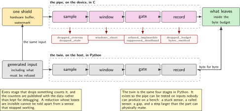
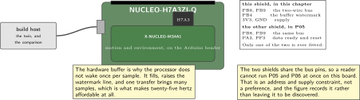
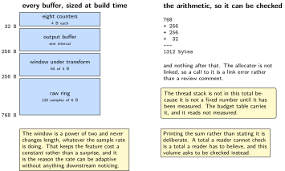
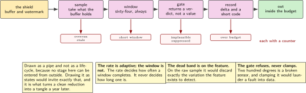
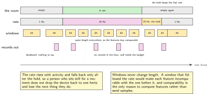

# P06. Capture that decides what to keep

> **Target:** NUCLEO-H7A3ZI-Q with one motion and environment shield, and a twin on the host  
> **Theme:** What may leave the device, and what it costs

> [!NOTE]
> **Where this sits in the product spine**
>
> This chapter builds the second behaviour, **a sample that is allowed to leave the device**, in full. P05 supplies the zones and P03 the sensor mechanism; what is decided here is which of those numbers is worth a radio. P11 carries what survives, P10 pays for it in charge, and P14 rebuilds this same application for a second board.

> **Key facts**
>
> - **Board:** NUCLEO-H7A3ZI-Q with the X-NUCLEO-IKS4A1, the only shield fitted
> - **Peripherals:** The two-wire bus and one interrupt line, as P03 established; no transfer engine and no signal processing accelerator
> - **Toolchain:** As the front matter, plus a host twin in Python that produces the input and checks the output
> - **Operating system:** One thread on the trigger, fixed windows, no allocation after start
> - **Difficulty:** 4 of 5
> - **Effort:** 4 evenings of about four hours
> - **Deliverable:** A pipe with a stated bound on bytes per hour, a loss figure measured against the raw stream, and a test suite whose inputs include the ones the pipe has to refuse

## Why this project

A connected sensor spends almost all of its energy on the radio and almost none of it on measuring. That single fact decides the architecture: the interesting engineering is not how often the device samples but how rarely it needs to speak, and the piece of code that turns the first number into the second is this one.

It is also the piece that decides what the device knows about people. Everything after this chapter sees only what this chapter allowed through, so a decision made here about resolution or rate is a decision about what can ever be reconstructed afterwards. That is a privacy property as much as an energy one, and the two point the same way for once, which is worth saying because they usually do not.

The chapter is drawn as a pipe rather than as a state machine on purpose. A pipe has an input, a sequence of stages and an output, and no stage can be entered from outside. Drawing it as a lifecycle would suggest it has states that something else can put it into, and that suggestion is what turns a clean reduction into a tangle a year later.

> [!NOTE]
> **What this chapter does not claim**
>
> Every number in the budget table reads `not measured` on Friday 2 October 2026. The bound on bytes per hour is arithmetic from the design, not an observation, and the chapter says which is which in every row.
>
> The loss figure is against this bench's own raw stream, not against ground truth. It says how much of what the sensor reported did not survive the pipe. It does not say how much of what happened in a room did not reach the sensor, which is a different and much harder question that nothing on this bench can answer.
>
> The thresholds here are defaults chosen to be arguable. No one has watched a real room for a week, and a chapter that presented them as tuned would be presenting an opinion as a result.

## Prior art and what to reuse

| Source | What it gives | What it does not | Licence |
| --- | --- | --- | --- |
| The in-tree drivers for the shield's sensors | Every sensor on the shield, through the interface P03 established, including the hardware buffer and its watermark interrupt | Any opinion about which samples matter, which is the chapter | Apache-2.0 |
| The signal processing library for this processor family | Fixed-point transforms and filters, with a documented numerical contract | A reason to use any of them. Most of this chapter is comparisons and counters, and reaching for a transform because it is available is the mistake the budget table exists to prevent | Apache-2.0 |
| The sibling firmware volume, chapters 13, 16 and 18 | The hardware buffer and watermark in full, the question of where a classifier runs, and the numerical acceptance test for transforms | The decision about what leaves the device, which none of them makes | Apache-2.0 |
| Published work on adaptive sampling in sensor networks | The vocabulary: a dead band, an event-triggered send, a budget per interval | Numbers for this device. Every published figure is for a different sensor at a different rate | Published |
| The compression used by the common sensor logging formats | The observation that a delta plus a short code beats a float for slowly varying quantities, which is most of what this device measures | An implementation small enough for this part. The one here is twenty lines and is written | Various |

*Table 6.1. Prior art for P06. The reduction vocabulary is well established and the implementations are not transferable, which is the usual shape for application-layer work and is why the chapter is mostly its own.*

## Parts from the inventory

| Part | Role | Interface |
| --- | --- | --- |
| NUCLEO-H7A3ZI-Q | The host. One shield, and it is the motion and environment one | Micro USB to the build host |
| X-NUCLEO-IKS4A1 | Motion and environment, with a hardware buffer deep enough that the processor need not wake per sample | Arduino header, two-wire bus |
| Build host | Runs the twin: generates the input, runs the same pipe in Python, and compares | As the front matter |

*Table 6.2. Inventory for P06. The industrial shield is a variant rather than a second fitting: one shield at a time on this board, and the chapter's argument does not depend on which sensors are underneath.*

## System architecture



*Figure 6.1. The pipe, and the twin beside it. Four stages, each with one job, and a counter on every discard so that nothing disappears silently. The twin is the same four stages in Python and exists so that the pipe can be tested on inputs nobody can produce on a bench, including the ones it has to refuse.*

The structure has one rule that is worth more than the stages. Every stage that drops something increments a counter, and the counters are published with the data rather than kept for debugging. A reduction whose losses are invisible is indistinguishable from a sensor that stopped working, and the whole point of this chapter is to make the difference between a quiet room and a broken device something a reader can see.

## Configuration

```text
# the six keys that make this pipe arguable rather than fixed
capture/rate_idle_hz        1    # when nothing is happening
capture/rate_active_hz     25    # when something is
capture/active_for_s       30    # how long activity keeps the fast rate
capture/deadband_milli      50   # below this change, a value is not news
capture/bytes_per_hour   2048    # the hard budget; the pipe stays inside it
capture/window_samples     64    # fixed, and a power of two, for the transform
```

The budget key is the one that makes the chapter honest. Without it the pipe is a set of heuristics that usually produce little data; with it, the pipe has a contract it either meets or reports breaking. A device whose traffic depends on how interesting the day was is a device nobody can plan a tariff or a battery around.

## Wiring



*Figure 6.2. One shield on the header, and nothing else. The figure exists mainly to record which pins the shield takes, because P05 took a different set and a reader moving between the two chapters needs to know that only one of them can be fitted at a time.*

## Memory and timing budget



*Figure 6.3. Fixed windows, declared once. The ring that holds raw samples, the window the transform runs on, and the output buffer are all sized at build time, and the figure prints the arithmetic so that a reader can check the total rather than take it.*

| Quantity | Budget | Measured | Margin |
| --- | --- | --- | --- |
| Raw ring, 128 samples of 6 B | 768 B static | 768 B by construction | none needed |
| Window under transform, 64 of 4 B | 256 B static | 256 B by construction | none needed |
| Output buffer, one interval | 256 B static | 256 B by construction | none needed |
| Counters, eight of 4 B | 32 B static | 32 B by construction | none needed |
| Allocation after start | zero bytes | zero by construction | not applicable |
| Thread stack, high-water mark | under 1536 B | not measured | not measured |
| Feature computation, one window | under 30000 cycles | not measured | not measured |
| Bytes per hour, quiet room | under 512 B | not measured | arithmetic only |
| Bytes per hour, busy room | under 2048 B | not measured | the contract |
| Loss against the raw stream | stated, not minimised | not measured | not measured |

*Table 6.3. The budget for P06. The last row is deliberately not a target. A pipe tuned to minimise loss is a pipe that sends everything, and the chapter's claim is that the loss is known and bounded rather than that it is small. The cycle row uses the method of P04.*

## Software design (UML)



*Figure 6.4. The pipe as a pipe. Sample, window, gate, record, with a counter on each discard. There is no state another part of the system can put this into, which is why it is drawn as a sequence and not as a lifecycle.*

Three stages deserve their reasoning written down.

The rate is adaptive but the window is not. A window that changed length with the rate would make every feature incomparable with the one before it, and comparability is the only reason to compute features at all. So the rate decides how often windows happen, and the window stays sixty-four samples whatever the rate, which also keeps the transform's cost a constant rather than a surprise.

The dead band is applied to the feature and not to the raw sample. Applying it to raw samples throws away exactly the variation the feature exists to detect, and the result is a device that is quiet because it is deaf. Applying it afterwards means the device still looks at everything and only declines to speak about the parts that did not change.

The plausibility gate refuses rather than clamps. A temperature of two hundred degrees is not a hot room, it is a broken sensor, and clamping it to a plausible value launders a fault into data. The refusal increments a counter, and a counter that climbs is how P02's service axis learns that a sensor needs attention.



*Figure 6.5. A quiet hour and a busy one, at the same scale. The rate rises when something happens and falls back after the hold; the window stays sixty-four samples in both, so the features remain comparable. The lower band shows what actually left the device, which is the quantity the budget key bounds.*

## Data flow (ASCII)

```text
  +----------+     +-----------+     +--------------+     +-------------+
  |  sample  | --> |  window   | --> |     gate     | --> |   record    |
  |          |     |           |     |              |     |             |
  | hardware |     | fixed 64, |     | plausible?   |     | delta plus  |
  | buffer,  |     | never     | --> | changed by   | --> | a short code|
  | watermark|     | variable  |     | more than    |     | inside the  |
  | interrupt|     |           |     | the deadband?| --> | byte budget |
  +----------+     +-----------+     +--------------+     +-------------+
       |                 |                   |                    |
       v                 v                   v                    v
  dropped_overrun   windows_short      refused_implausible   dropped_budget
  dropped_stale                        suppressed_deadband   bytes_emitted

  every discard has a counter, and the counters are PUBLISHED with the data.
  a reduction whose losses are invisible cannot be told from a dead sensor.
```

## Repository layout

```text
projects/P06-capture/
  CMakeLists.txt
  prj.conf
  overlays/iks4a1.overlay
  src/pipe.c                      # the four stages, no hardware, no messages
  src/pipe.h                      # the config struct and the counters
  src/features.c                  # mean, peak, crest factor, in fixed point
  src/codec.c                     # delta plus a short code, twenty lines
  src/main.c                      # wires the sensor to the pipe and prints
  twin/pipe.py                    # the same four stages, in Python
  twin/generate.py                # inputs, including the ones to refuse
  twin/compare.py                 # board against twin, byte for byte
  tests/test_gate.c               # the refusals, which are the interesting half
  tests/test_budget.c             # the contract: never over the bytes per hour
  docs/thresholds.md              # every default, and why it is arguable
  README.md
```

## Steps

**Step 1.** **Write the twin before the firmware.** The pipe in Python, the generator beside it, and the comparison. It takes an evening and it means every later question is answered by running something rather than by reasoning.

**Step 2.** **Generate the inputs the pipe must refuse, first.** A sensor stuck at one value, a sensor returning its maximum, a gap where samples stopped, a step change larger than the part can physically produce. A suite that only contains plausible input tests the easy half.

```python
# twin/generate.py, the cases that matter
def stuck(n):        return [1000] * n
def railed(n):       return [32767] * n
def gap(n):          return [None] * n          # the sensor stopped answering
def impossible(n):   return [1000] * (n // 2) + [20000] * (n // 2)
def quiet(n):        return [1000 + (i % 3) for i in range(n)]   # below deadband
def busy(n, rng):    return [1000 + rng.integers(-800, 800) for _ in range(n)]
```

**Step 3.** **Write the gate so that refusal is a first-class outcome.** It returns a verdict, not a value, and the caller cannot ignore it.

```c
typedef enum { G_PASS, G_SUPPRESSED, G_IMPLAUSIBLE, G_STALE } verdict_t;

verdict_t gate(const feature_t *f, pipe_ctx_t *c)
{
    if (f->status != F_VALID)                 { c->refused_implausible++;
                                                return G_IMPLAUSIBLE; }
    if (f->peak > c->cfg->physical_max)       { c->refused_implausible++;
                                                return G_IMPLAUSIBLE; }
    if (f->stuck_for >= c->cfg->stale_windows){ c->dropped_stale++;
                                                return G_STALE; }
    if (abs_delta(f->mean, c->last_sent) < c->cfg->deadband) {
                                                c->suppressed_deadband++;
                                                return G_SUPPRESSED; }
    return G_PASS;
}
```

**Step 4.** **Make the byte budget a hard contract, not an aspiration.** The pipe tracks bytes emitted in the current hour and refuses to exceed it, counting what it dropped. A budget that is only usually met is not a budget.

```c
if (c->bytes_this_hour + len > c->cfg->bytes_per_hour) {
    c->dropped_budget++;          /* counted, published, never silent */
    return;                        /* the record does not leave */
}
```

**Step 5.** **Keep the window fixed while the rate varies.** Sixty-four samples, always. The rate decides how often a window completes; it never decides how long one is.

**Step 6.** **Compute features in fixed point, and say why.** Mean, peak and crest factor are enough for the decisions this volume makes, they cost a few thousand cycles, and none of them needs a transform. The chapter measures the transform's cost anyway, in order to justify not using it.

**Step 7.** **Compare the board against the twin, byte for byte.** Feed both the same generated input, take the output of each, and require that they are identical. A twin that merely agrees approximately is a twin that will not catch the defect it exists for.

```bash
python twin/generate.py --cases all --out cases.npz
west build -p -b nucleo_h7a3zi_q projects/P06-capture && west flash
python twin/compare.py --port /dev/ttyACM0 --cases cases.npz
```

**Step 8.** **Measure the loss and publish it rather than reducing it.** Run a day of generated input at both rates and report what fraction of the raw stream is recoverable from what was sent. The number is the chapter's honest statement about its own cost.

**Step 9.** **Prove each counter by causing it.** Drive the stuck input and confirm the stale counter alone rises. Drive the railed input and confirm the implausible counter alone rises. A counter that has never been seen to move has not been shown to work.

## Build, flash and debug

The console prints one line per interval with every counter, in the volume's format, which makes the whole chapter diagnosable without a debugger. When output stops the question is always which counter is rising, and the answer distinguishes a quiet room from a sensor that failed from a budget that is exhausted, which are three different situations that look identical from outside.

The twin is the main debugging tool and not an afterthought. A disagreement between the board and the twin is almost always the board's fixed-point arithmetic differing from Python's, and the comparison names the first sample where they diverge, which turns an afternoon into a few minutes.

## Verification and acceptance criteria

- **The board and the twin agree exactly.** Over every generated case, the bytes the board emits are identical to the bytes the twin emits. *Refuted if* they differ anywhere, and the comparison names the sample.
- **The byte budget is never exceeded.** Over a simulated busy day the bytes emitted in any hour are at or under the key. *Refuted if* any hour exceeds it, which would make the contract an aspiration.
- **A stuck sensor is reported, not transmitted.** The stale counter rises and no record leaves. *Refuted if* the device cheerfully sends the same value for an hour, which is the failure that makes a dead sensor look like a quiet room.
- **An implausible value is refused, not clamped.** The counter rises and nothing is sent. *Refuted if* a plausible-looking value appears in the output, which would launder a fault into data.
- **The dead band is on the feature, not the raw sample.** Feeding small-amplitude activity produces features that differ, even though individual samples do not. *Refuted if* the device is silent through activity it should notice.
- **The window is constant across rates.** The feature computation's cost does not change when the rate does. *Refuted if* it does, which would mean the window followed the rate.
- **Every counter can be made to move.** Each of the eight has a generated case that raises it and no other. *Refuted if* any counter cannot be provoked, in which case it is either unreachable or wrong.
- **Loss is stated.** The fraction of the raw stream recoverable from what was sent is reported for both a quiet and a busy day. *Refuted if* the chapter reports only that loss is small.

## Variants

| Axis | This chapter | The alternative | Cost | Built in full |
| --- | --- | --- | --- | --- |
| Rate | Adaptive, two rates and a hold | One fixed rate | Either too much traffic or too little resolution | Here |
| Window | Fixed, sixty-four samples | Following the rate | Features stop being comparable | Here |
| Dead band | On the feature | On the raw sample | A device that is quiet because it is deaf | Here |
| Implausible input | Refused and counted | Clamped to a plausible value | A fault becomes data | Here |
| Budget | A hard contract per hour | Best effort | No tariff and no battery can be planned | Here |
| Features | Mean, peak, crest factor, fixed point | A frequency transform | Measured, and not used; the cost is the argument | Here, with the measurement |
| Where the features run | On the processor | In the sensor, or on the host | A different trade, measured elsewhere | Sibling firmware volume, chapter 16 |

*Table 6.4. Variants touching P06. Six rows are built here because together they are the chapter. The transform row is unusual: the alternative is implemented and measured in order to justify not adopting it, which is cheaper than arguing about it twice a year.*

## Pitfalls

- **A dead band on raw samples.** It is the single most common way to build a sensor that reports nothing during exactly the events it was installed for.
- **Clamping an impossible reading.** It makes the output look healthy and removes the only evidence that something is wrong.
- **A window that follows the rate.** Features computed over different lengths cannot be compared, and comparing them is the only reason they exist.
- **Counters kept for debugging rather than published.** They are the difference between a quiet room and a broken device, which is a question somebody will ask at a distance.
- **A budget that is usually met.** Planning a battery or a tariff needs a bound, and usually is not one.
- **Reaching for a transform because the library is there.** Measure it, then decide. This chapter measures it and declines.
- **A twin that agrees approximately.** Fixed point and floating point differ in the last place, and the defect worth catching usually lives there.

## Best practices applied

The reduction is a pipe with one job per stage and a counter on every loss. The losses are published rather than hidden. Refusal is a first-class outcome with its own return value, so a caller cannot accidentally treat a refused reading as a value. The byte budget is a contract the code enforces rather than a hope. Every analysis is tested on generated input including the cases it has to refuse. And the alternative that everyone reaches for first is implemented and measured, so that declining it is a result rather than a preference.

## Stretch goals

Run the pipe over a week of generated activity at several dead bands and plot bytes against recoverable detail, which turns the threshold argument into a curve somebody can point at. Add a second feature set behind a settings key and compare their loss at equal bytes. Record the counters alongside the data for a month of simulated operation and check that a reader can tell, from the counters alone, which days the sensor was unhealthy.

## Roadmap and next steps

P10 takes the output of this chapter and prices it in charge, which is where the byte budget stops being an abstraction and becomes battery life. P11 carries the records over a real link, at which point the budget meets a tariff. P02's service axis consumes the counters, which is how a rising refusal count becomes a room that is marked as needing attention rather than a room that is quietly wrong. P14 rebuilds this application for a second board, and this chapter is the one most likely to survive that move untouched, which is the test of whether it was written at the right level.

## Portfolio evidence

The idiom this chapter proves is **efficiency**: fixed windows, integer arithmetic, no allocation after start, and a stack sized from its measured high-water mark rather than from a guess. The command that proves it is

`python twin/generate.py --cases all --out cases.npz && python twin/compare.py --cases cases.npz`

which runs every generated case through the board and the twin and requires the emitted bytes to be identical, refusals included. Publish the pipe diagram, the counter table from a simulated day, the bytes-against-detail curve, and the statement of loss for a quiet and a busy room.

## Sources

- The in-tree drivers for the shield's sensors and their hardware buffer documentation. Read Friday 2 October 2026.
- The signal processing library for this processor family, read for the transform whose cost is measured here and then declined.
- The sibling firmware volume, chapters 13, 16 and 18, for the hardware buffer and watermark, the placement question, and the numerical acceptance test, none of which is repeated here.
- Published work on adaptive sampling and dead bands in sensor networks, read for vocabulary rather than for figures, since every published figure is for a different sensor at a different rate.
- P03 and P05 in this volume, for the sensor mechanism and for the zones this pipe also has to reduce.

---

[Previous](05-the-zones.md) &nbsp;&nbsp;|&nbsp;&nbsp; [Contents](../README.md) &nbsp;&nbsp;|&nbsp;&nbsp; [Next](07-settings-that-survive-a-power-cut.md)
