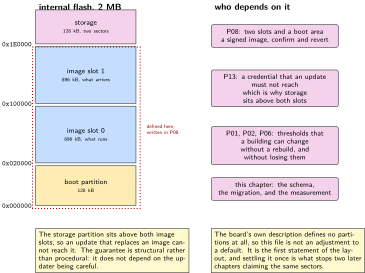
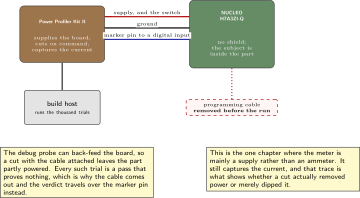
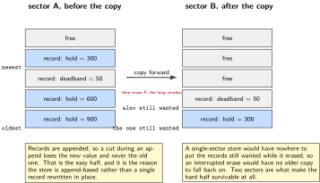
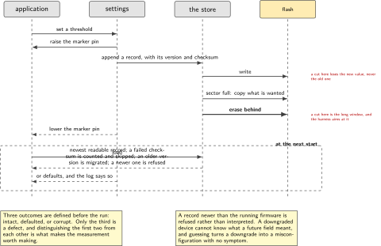
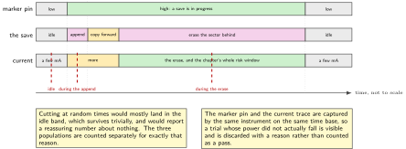

# P07. Settings that survive a power cut

> **Target:** NUCLEO-H7A3ZI-Q with the power meter as a switched supply  
> **Theme:** Flash partitions, non-volatile storage, a versioned schema

> [!NOTE]
> **Where this sits in the product spine**
>
> This chapter serves no spine behaviour on its own, and every one of the four depends on it. It introduces the flash layout the whole volume shares, so that P08 has somewhere to put two images and P13 has somewhere to put a credential that is not in the image. The thresholds P01, P02 and P06 argue about live here.

> **Key facts**
>
> - **Board:** NUCLEO-H7A3ZI-Q, powered through the meter so that the supply can be cut on command
> - **Peripherals:** The internal flash, through the storage partition this chapter defines; the virtual console; one general-purpose pin to mark a write for the meter's digital input
> - **Toolchain:** As the front matter, plus a host script that cuts the supply at scripted moments and counts what survived
> - **Operating system:** One thread, the settings subsystem over non-volatile storage
> - **Difficulty:** 4 of 5
> - **Effort:** 4 evenings of about four hours
> - **Deliverable:** The volume's flash layout, a versioned configuration that migrates forward, and a thousand power cuts with the survival rate reported rather than assumed

## Why this project

Three earlier chapters put numbers in settings and moved on: the hold, the grace period, the dead band. That was the right decision and it created an obligation this chapter discharges. A value that can be changed at run time is a value that can be half-written when the power goes, and a device whose configuration is corrupt after a power cut is worse than one that never allowed the value to change, because it fails later and in a building nobody is standing in.

The chapter also has to do something none of the others could: decide where things live in flash. The board's own description defines no partitions at all, so until now every chapter has been using the default image area and nothing else. P08 needs two image slots and a place for the bootloader's own state; P13 needs somewhere for a credential that an update must not erase. Those requirements are incompatible with deciding them one chapter at a time, so the layout is settled here, once, and every later chapter inherits it.

The third reason is that this is the chapter where the power meter stops being an ammeter and becomes an instrument of experiment. It can switch the supply, so it can cut power at a moment the host chooses, a thousand times, without anybody standing there with a lead. That turns a claim about robustness into a measurement.

> [!NOTE]
> **What this chapter does not claim**
>
> The survival rate below is not yet measured. The harness is written, the method is written and the refutation is written, and the result reads `not measured` on Friday 2 October 2026.
>
> The partition layout is a design for this part, checked against its reference manual, which is RM0455 and not the manual most material is written for. The sector geometry stated here comes from that manual. If the bench disagrees with it, the bench is right and the chapter is wrong, and the first build is where that is found out.
>
> Nothing here claims power-loss safety as a property of the storage subsystem. What is claimed is a measured survival rate for one configuration on one part, which is a smaller and checkable claim.

## Prior art and what to reuse

| Source | What it gives | What it does not | Licence |
| --- | --- | --- | --- |
| The settings subsystem and the non-volatile storage backend | A key and value store with a documented write path, a load at start and a save on demand | A schema, a version, or any opinion about what happens when a write is interrupted. All three are this chapter | Apache-2.0 |
| The flash map and partition documentation | The way a layout is described so that the bootloader, the application and the tools all agree on it | A layout for this board, which defines none | Apache-2.0 |
| The reference manual for this part | The sector geometry and the write granularity, which decide what a partition can be | Anything about the storage subsystem. The two have to be read together | Vendor |
| The power meter's host library | Supply control and current capture in one instrument, with digital inputs aligned to the current trace | A harness. Cutting power at a chosen moment a thousand times and counting survivors is written here | Permissive |
| Published work on power-loss robustness in embedded key and value stores | The failure modes to test for: a torn write, a lost erase, and a record that reads back as valid but is not | An implementation. The storage backend is given; what is written here is the test | Published |

*Table 7.1. Prior art for P07. The storage backend is used as it stands, which is correct: a volume that wrote its own would be asserting something about reliability that it could not then measure independently. The measurement is the contribution.*

## Parts from the inventory

| Part | Role | Interface |
| --- | --- | --- |
| NUCLEO-H7A3ZI-Q | The subject. No shield is fitted; the chapter is about what is inside the part | Micro USB for programming only |
| nRF Power Profiler Kit II | The supply, and the switch. It powers the board and cuts that power on command, which is what makes a thousand trials possible | Supply leads to the board, USB to the host |
| One female jumper lead | A general-purpose pin to the meter's digital input, raised while a write is in progress so the cut can be aimed | 3.3 V |

*Table 7.2. Inventory for P07. The meter appears here as a supply rather than as an ammeter, which is the one chapter in this volume where that is its main job. P10 uses the same instrument for the measurement it is better known for.*

## System architecture



*Figure 7.1. The flash layout this chapter settles, and who needs which part of it. The bootloader partitions are drawn dotted because nothing writes them until P08; the storage partition is the chapter's own. Deciding the whole map once is what stops two later chapters from each claiming the same sectors.*

The layout has one property worth defending. The storage partition sits at the top of flash, above both image slots, so that an update which replaces an image cannot reach it. A credential enrolled in P13 and a threshold set in P01 both survive every update by construction rather than by the updater being careful, and that is a stronger guarantee than any amount of care in the updater.

## Configuration

```dts
/* overlays/partitions.overlay: the whole volume's flash map, settled here.
 * The board's own description defines no partitions at all, so this file is
 * not an adjustment to a default; it is the first statement of the layout.
 * Sector geometry is from RM0455 for this part, not from the popular sibling.
 */
&flash0 {
    partitions {
        compatible = "fixed-partitions";
        #address-cells = <1>;
        #size-cells = <1>;

        boot_partition:    partition@0        { label = "mcuboot";
                                                reg = <0x00000000 0x00020000>; };
        slot0_partition:   partition@20000    { label = "image-0";
                                                reg = <0x00020000 0x000e0000>; };
        slot1_partition:   partition@100000   { label = "image-1";
                                                reg = <0x00100000 0x000e0000>; };
        storage_partition: partition@1e0000   { label = "storage";
                                                reg = <0x001e0000 0x00020000>; };
    };
};
```

```text
# prj.conf
CONFIG_FLASH=y
CONFIG_FLASH_MAP=y
CONFIG_NVS=y
CONFIG_SETTINGS=y
CONFIG_SETTINGS_NVS=y
CONFIG_SETTINGS_RUNTIME=y
CONFIG_SETTINGS_DYNAMIC_HANDLERS=n   # every handler is known at build time
CONFIG_REBOOT=y                      # the harness needs it
```

The storage partition is two sectors rather than one, and the reason is the backend rather than the data. A store that can only erase the sector it is writing has nowhere to put the surviving records while it does so; two sectors let it copy forward and erase behind, which is what makes an interrupted erase recoverable at all.

## Wiring



*Figure 7.2. Three connections. The meter supplies the board and can cut that supply on command; one lead marks a write in progress so that the cut can be aimed at the moment that matters; and the programming cable is removed during a run, because a device powered from two sources is a device whose supply nobody controls.*

Removing the programming cable during the run is not fastidiousness. The debug probe can back-feed the board, and a cut that leaves the part partly powered produces a trial that proves nothing and looks like a pass. The harness therefore flashes the board, the operator unplugs the cable, and the run begins, which is also why the results come back over the meter's own digital lines rather than over a console.

## Memory and timing budget



*Figure 7.3. Inside the storage partition. Records are appended, and the two sectors let the store copy what is still wanted forward before erasing behind, which is the only arrangement under which an interrupted erase is survivable.*

| Quantity | Budget | Measured | Margin |
| --- | --- | --- | --- |
| Boot partition | 128 kB | by construction | for P08 |
| Each image slot | 896 kB | by construction | for P08 |
| Storage partition | 128 kB, two sectors | by construction | this chapter |
| Settings in use | under 512 B of records | not measured | not measured |
| One save, start to finish | under 20 ms | not measured | not measured |
| Erase of one sector | under 400 ms | not measured | not measured |
| Load at start | under 50 ms | not measured | not measured |
| Survival over 1000 cuts | stated, not assumed | not measured | the chapter's result |
| Corrupt-record detections | counted, published | not measured | not measured |

*Table 7.3. The budget for P07. The erase row matters more than its size suggests: it is by far the longest operation in the chapter and therefore the window during which a cut does the most damage, which is why the harness aims cuts at it specifically rather than at random.*

## Software design (UML)



*Figure 7.4. A save, and the three moments a cut can land. Before the record is written nothing changes; during the write the record is incomplete and must be rejected on the next load; during an erase the store is mid-copy and must recover from the sector it has not yet erased. The chapter aims cuts at all three rather than at random times.*

The versioned schema is the second half of the design and it is what makes an update safe. Every record carries a version, the application knows the version it expects, and a record from an older version is migrated forward on load rather than rejected. Without that, the first update that adds a settings key turns every deployed unit's configuration into something the new firmware does not recognise, and the device falls back to defaults in a building where somebody had carefully set them.

```c
/* migration runs on load, oldest first, and is the reason an update does not
 * quietly reset a building full of carefully chosen thresholds */
static int migrate(uint16_t from, struct cfg *c)
{
    switch (from) {
    case 1:
        c->brb_hold_s = c->hold_s * 3;   /* v2 split one hold into two */
        /* fall through */
    case 2:
        c->bytes_per_hour = 2048;        /* v3 added a budget; pick the default */
        /* fall through */
    case 3:
        break;                            /* current */
    default:
        return -EINVAL;                   /* newer than us: refuse, do not guess */
    }
    c->version = CFG_VERSION;
    return 0;
}
```

A record newer than the running firmware is refused rather than interpreted. A device that has been downgraded cannot know what a future version meant by a field, and guessing is how a downgrade turns into a misconfiguration nobody can explain.



*Figure 7.5. One save on the current trace, with the marker pin beside it, and the three moments a cut is aimed at. The erase is two orders of magnitude longer than the append, which is why cutting at random times would measure mostly the idle state and report a reassuring number about nothing.*

## Data flow (ASCII)

```text
  load, at every start
  +------------------------------------------------------------------------+
  | read records newest first                                              |
  |   a record whose checksum fails    -> count it, skip it, keep looking   |
  |   a record with a newer version    -> refuse: do not guess what it meant|
  |   a record with an older version   -> migrate forward, oldest step first|
  |   nothing readable at all          -> defaults, and say so in the log    |
  +------------------------------------------------------------------------+

  save, on demand
  +------------------------------------------------------------------------+
  | raise the marker pin                                                   |
  | append a new record                        <- a cut here loses the new  |
  |                                               value, never the old one  |
  | if the sector is full:                                                 |
  |     copy the records still wanted into the other sector                |
  |     erase the first sector                 <- a cut here is the long    |
  |                                               window, and the harness   |
  | lower the marker pin                           aims at it on purpose    |
  +------------------------------------------------------------------------+
```

## Repository layout

```text
projects/P07-settings/
  CMakeLists.txt
  prj.conf
  overlays/partitions.overlay     # the whole volume's flash map
  src/cfg.c                       # the schema, the migration, the handlers
  src/cfg.h                       # the struct, and CFG_VERSION
  src/marker.c                    # the pin the meter watches
  src/main.c                      # save on a schedule, report on load
  host/cut.py                     # the meter: supply, cut, restore, repeat
  host/tally.py                   # what survived, counted per cut moment
  tests/test_migrate.c            # every version pair, including the refusal
  docs/layout.md                  # why the storage partition is above the slots
  README.md
```

## Steps

**Step 1.** **Read the sector geometry out of the reference manual for this part, not for its popular sibling.** The two differ, and a partition that straddles a sector boundary the manual did not describe fails in a way that looks like a storage bug.

**Step 2.** **Write the partition overlay for the whole volume, not for this chapter.** P08 needs two slots and a boot area; P13 needs storage that an update cannot reach. Deciding all of it once is the only way those requirements stay compatible.

**Step 3.** **Put the storage partition above both image slots, and write down why.** An update replaces a slot. A credential and a threshold that live above every slot survive by construction, which is a stronger guarantee than an updater that is careful.

**Step 4.** **Give every record a version from the first commit.** Adding one later means the first deployed version has records with no version, and every migration afterwards has to special-case them.

```c
struct cfg {
    uint16_t version;       /* first field, always, so it can be read alone */
    uint16_t hold_s;
    uint16_t brb_hold_s;
    uint16_t grace_s;
    uint16_t deadband_milli;
    uint16_t bytes_per_hour;
    uint32_t crc;           /* over everything above, checked on load */
};
#define CFG_VERSION 3
```

**Step 5.** **Raise a pin for the duration of a save.** It costs one general-purpose pin and it is what lets the harness aim a cut rather than scatter one.

**Step 6.** **Write the harness so that each cut moment is a separate population.** Cutting at random times measures mostly the idle state, which survives trivially. The interesting populations are during the append and during the erase, and the erase is two orders of magnitude longer.

```python
# host/cut.py, the shape that matters
MOMENTS = ["idle", "during_append", "during_erase"]

def one_trial(ppk, moment):
    ppk.supply_on()
    wait_for_boot(ppk)
    if moment == "idle":
        delay = uniform(0.2, 0.8)
    else:
        wait_for_marker_high(ppk)          # the pin says a save has begun
        delay = append_window() if moment == "during_append" else erase_window()
    sleep(delay)
    ppk.supply_off()                        # the cut, aimed
    sleep(0.3)
    ppk.supply_on()
    return read_verdict_after_boot(ppk)     # intact, defaulted, or corrupt
```

**Step 7.** **Define the three verdicts before running anything.** Intact means the value set before the cut is the value read after it. Defaulted means the store was unreadable and the device said so. Corrupt means a value came back that was never written, and it is the only one of the three that is a defect.

**Step 8.** **Run a thousand trials and report per moment.** One number for the whole run would hide exactly the distinction the chapter exists to make.

```bash
python host/cut.py --trials 1000 --moments all --out cuts.csv
python host/tally.py cuts.csv
```

**Step 9.** **Prove the detector by writing a bad record on purpose.** Corrupt a stored record with a debugger and confirm the next load counts it and falls back rather than using it. A checksum that has never rejected anything has not been shown to work.

**Step 10.** **Test every migration pair on the host, including the refusal.** Version one to three, two to three, three to three, and four to three, where the last must be refused rather than guessed.

## Build, flash and debug

The run is unusual in this volume because the console is not available during it: the programming cable is unplugged so that the board has exactly one supply. The verdict therefore travels out over the marker pin as a short pattern after boot, which the meter's digital input captures alongside the current trace. That is a constraint worth embracing rather than working around, because it forces the verdict to be something a machine can read and count.

When a trial comes back corrupt, the first question is whether the board was fully unpowered. The current trace answers it directly, and a cut that left the part at a few hundred microamps is a cut that did not happen. That check runs on every trial automatically and the trial is discarded with a reason rather than counted.

## Verification and acceptance criteria

- **No trial in any population returns a corrupt value.** A value that was never written must never be read back. *Refuted if* even one trial does, and the chapter reports it rather than rerunning until it does not.
- **A cut during an append loses the new value, never the old one.** *Refuted if* the previous value is lost, which would mean the append is not an append.
- **A cut during an erase is recoverable.** The device comes back with either the old configuration or the defaults, and says which. *Refuted if* it comes back unable to boot, which would make the store a brick risk rather than a storage risk.
- **The survival rate is reported per cut moment.** Three populations, three numbers. *Refuted if* the chapter reports one number for the whole run.
- **A cut that did not fully remove power is discarded.** The current trace is checked on every trial. *Refuted if* trials are counted without that check.
- **A corrupt record is detected and counted.** With a record deliberately corrupted, the next load skips it and the counter rises. *Refuted if* it is used.
- **Every migration pair is covered, and a newer version is refused.** *Refuted if* a record from a future version is interpreted rather than refused.
- **An update cannot reach the storage partition.** The layout places it above both slots, which is checked by reading the generated flash map rather than by inspecting the overlay. *Refuted if* the addresses overlap.

## Variants

| Axis | This chapter | The alternative | Cost | Built in full |
| --- | --- | --- | --- | --- |
| Where settings live | Above both image slots | Inside the application's slot | An update erases the building's thresholds | Here |
| Store | Append with two sectors | A single fixed record, rewritten | An interrupted rewrite has no older copy | Here |
| Versioning | From the first commit | Added when first needed | Every later migration special-cases the unversioned records | Here |
| A newer record | Refused | Interpreted as best it can | A downgrade becomes a silent misconfiguration | Here |
| When cuts happen | Aimed at three moments | Random | Mostly measures the idle state, which survives trivially | Here |
| The instrument | The meter as supply and witness | A person with a lead | A thousand trials is not a person's afternoon | Here |
| Image slots | Defined, unused | Deferred to P08 | Two chapters claiming the same sectors | Defined here, used in P08 |

*Table 7.4. Variants touching P07. Six rows are built here. The last is the chapter's quiet contribution: the slots exist from this point even though nothing writes them for two more chapters, which is what keeps the map coherent.*

## Pitfalls

- **Leaving the programming cable attached during a run.** The probe can back-feed the board and every trial becomes a pass that proves nothing.
- **Cutting at random moments.** The erase window is a fraction of a percent of the time and is where almost all of the risk lives.
- **A single-sector store.** There is nowhere to copy the surviving records to, so an interrupted erase has no older copy to fall back on.
- **Adding the version field later.** The deployed records without one then need a special case in every migration from then on.
- **Interpreting a newer record.** A downgraded device cannot know what a future field meant, and guessing produces a misconfiguration with no symptom.
- **Taking the sector geometry from material about the popular sibling part.** The manuals differ and the failure looks like a storage bug.
- **Reporting one survival number.** It averages the easy population with the hard one and hides the thing the chapter measured.

## Best practices applied

The flash layout is decided once for the whole volume rather than per chapter. The partition that must survive updates is placed where an update cannot reach it, so the guarantee is structural rather than procedural. Records are versioned from the first commit and migrate forward, and a record from the future is refused rather than guessed. The experiment aims at the moments where the risk is, states three verdicts before running, and discards trials whose premise failed. And the detector is proven by deliberately giving it something to detect.

## Stretch goals

Repeat the run at the two supply voltages the part supports and see whether the survival rate moves, which is the cheapest test of whether the result is about the software or about the brown-out threshold. Add a wear count per record and run long enough to see the store rotate sectors, which is the one behaviour a short run never exercises. Publish the three survival rates as a committed file so that a change to the storage subsystem version shows up as a difference rather than as a memory.

## Roadmap and next steps

P08 takes the two image slots this chapter defined and puts a bootloader in the first partition, which is the moment the layout stops being a plan. P13 puts a credential in the storage partition and relies on exactly the property argued here, that an update cannot reach it. P01, P02 and P06 stop having arguable constants and start having a configuration that can be changed in a building without a rebuild. And P17, on the Linux side, faces the same question at a different scale and reaches a different answer, which is worth reading next to this one.

## Portfolio evidence

The idiom this chapter proves is **reliability**: the configuration either survives a power cut or reports that it did not, and the claim is a measured rate rather than a design argument. The command that proves it is

`python host/cut.py --trials 1000 --moments all --out cuts.csv && python host/tally.py cuts.csv`

which runs a thousand aimed power cuts across three moments and prints the survival rate for each, with trials whose power did not actually fall discarded and counted separately. Publish the flash map, the migration function, the three survival rates, and the trace of the deliberately corrupted record being detected.

## Sources

- The settings subsystem and the non-volatile storage backend documentation, and the flash map and partition documentation. Read Friday 2 October 2026.
- The reference manual for this part, which is RM0455, for the sector geometry and write granularity that decide what a partition can be.
- The power meter's host library documentation, for supply control and for the digital inputs that are aligned to the current trace.
- Published work on power-loss robustness in embedded key and value stores, read for the failure modes to aim at rather than for an implementation.
- P03 in this volume, for the pattern of describing hardware in an overlay that the build checks.

---

[Previous](06-capture-that-decides-what-to-keep.md) &nbsp;&nbsp;|&nbsp;&nbsp; [Contents](../README.md) &nbsp;&nbsp;|&nbsp;&nbsp; [Next](08-a-signed-image.md)
