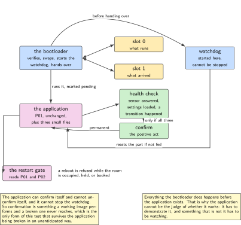
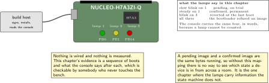
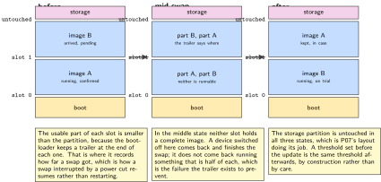
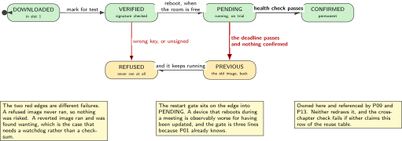
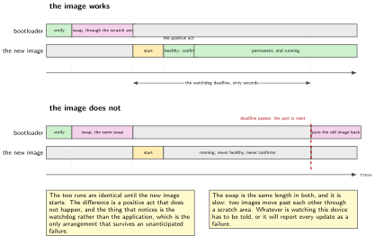

# P08. A signed image, confirm and revert

> **Target:** NUCLEO-H7A3ZI-Q, built with the bootloader alongside the application  
> **Theme:** The bootloader, its signature and its rollback

> [!NOTE]
> **Where this sits in the product spine**
>
> This chapter builds the third behaviour, **a signed image that rolls back**, in full. It is the only place in the volume where rollback is implemented; P09 carries images to the device and cites this chapter rather than repeating it, and P13 signs with a key whose lifecycle it owns. The restart gate here reads P01's state, which is the first time one spine behaviour protects another.

> **Key facts**
>
> - **Board:** NUCLEO-H7A3ZI-Q, using the partition layout P07 settled
> - **Peripherals:** The internal flash through the two image slots; the independent watchdog; the virtual console
> - **Toolchain:** As the front matter, plus the build-system wrapper that produces the bootloader and the application together, and the image signing tool
> - **Operating system:** The application unchanged from P01; the bootloader runs before it
> - **Difficulty:** 5 of 5
> - **Effort:** 5 evenings of about four hours
> - **Deliverable:** A signed image that boots, a test image that must confirm or be replaced, a watchdog that enforces the deadline, and a demonstration that an image which never confirms is not the one running afterwards

## Why this project

A device that can be reached but not touched needs an update that can fail safely more than it needs an update that is fast. The failure to design for is not a corrupt download, which a checksum catches cheaply; it is an image that installs perfectly, boots, and then turns out not to work, in a building where the only remedy is a visit.

The arrangement that solves this is older than any of the software here and is worth stating plainly. A new image is installed as a test. It boots once. If it reaches the point where it can demonstrate that it works, it declares itself confirmed and becomes permanent. If it does not, something that is not the new image puts the old one back. The whole chapter is about making each of those three sentences true on this part, and about proving the third one, which is the only one that is ever tested by accident.

The signature is the second half and it answers a different question. Rollback protects against an image that does not work; a signature protects against an image that was not meant to be there. They are independent and both are cheap, and a device that has one without the other has an obvious gap that somebody will eventually find.

> [!NOTE]
> **What this chapter does not claim**
>
> The key used here is generated on the bench and lives in the repository's ignore list. Nothing in this volume models how a production signing key is held, which is an organisational problem rather than a firmware one, and a chapter that pretended otherwise would be inventing a process.
>
> The bootloader is used as it stands. Its verification code is not reimplemented, reviewed or audited here, and no claim is made about it beyond that it is the maintained upstream implementation at the pinned revision.
>
> The watchdog deadline below is a design choice, not a measurement. How long an application legitimately needs before it can confirm itself is a question this bench cannot answer for a real deployment, and the chapter says so rather than presenting the number as tuned.

## Prior art and what to reuse

| Source | What it gives | What it does not | Licence |
| --- | --- | --- | --- |
| The bootloader project | Two slots, the swap, signature verification, the test-then-confirm sequence and the revert, all maintained and widely deployed | A partition layout, which P07 settled, and any opinion about when a device may restart, which is this chapter | Apache-2.0 |
| Its image signing tool | Key generation, image signing and the header the bootloader expects | Key custody. The key here is a bench key and the chapter says so | Apache-2.0 |
| The build-system wrapper that builds both images together | One command that produces a bootloader and an application whose configurations cannot disagree, which removes the largest category of mistake in this chapter | Anything about the application. It is P01's, unchanged | Apache-2.0 |
| The independent watchdog driver | A timer the application cannot stop once started, which is what makes a deadline a deadline | A policy. What counts as the application working is an application question, answered here | Apache-2.0 |
| P07, in this volume | The two slots, the boot partition and the storage that sits above both | Anything about images | Apache-2.0 |
| The survey of over-the-air update threats for connected devices | A classification of what can go wrong, including rollback to an older image and a device reached only through a gateway | A measured implementation on this part, and no slot layout. The threat list is cited; the revert is measured here | Published |

*Table 8.1. Prior art for P08. The bootloader is the single largest piece of third-party code in the volume and none of it is rewritten. What is written here is the application's half of the contract: deciding when it may restart, and deciding what counts as working.*

## Parts from the inventory

| Part | Role | Interface |
| --- | --- | --- |
| NUCLEO-H7A3ZI-Q | The whole chapter. No shield, no instrument | Micro USB to the build host |
| Build host | Generates the key, signs the images, and holds the one that is deliberately broken | As the front matter |

*Table 8.2. Inventory for P08. Nothing is wired and no instrument is needed. The evidence here is a sequence of boots and what the console says after each, which is checkable without touching the bench.*

## System architecture



*Figure 8.1. The bootloader, the two slots, and the one decision. Everything the bootloader does happens before the application exists, which is why the application cannot be the thing that decides whether it works: it has to demonstrate that it works, and something that is not it has to be watching.*

The arrangement rests on one asymmetry. The application confirms itself, but it cannot un-confirm itself, and it cannot stop the watchdog. So a confirmation is a positive act that a working application performs and a broken one simply never gets to, which is the only form of this test that survives the application being broken in ways nobody anticipated.

## Configuration

```text
# sysbuild.conf: build the bootloader and the application together, so that
# their views of the flash map cannot disagree. That disagreement is the
# largest single category of mistake in this chapter and this removes it.
SB_CONFIG_BOOTLOADER_MCUBOOT=y
SB_CONFIG_BOOT_SIGNATURE_TYPE_ECDSA_P256=y
SB_CONFIG_BOOT_SIGNATURE_KEY_FILE="keys/bench-ecdsa-p256.pem"
```

```text
# prj.conf, the application's half
CONFIG_BOOTLOADER_MCUBOOT=y
CONFIG_MCUBOOT_IMG_MANAGER=y        # so the application can confirm itself
CONFIG_IMG_MANAGER=y
CONFIG_STREAM_FLASH=y
CONFIG_WDT_DISABLE_AT_BOOT=n        # the deadline starts before main() does
CONFIG_WATCHDOG=y
CONFIG_REBOOT=y
```

The watchdog line is the one that matters and it is easy to get backwards. If the watchdog is disabled at boot, a broken application has to actively start it before the deadline exists, which is precisely the thing a broken application cannot be relied upon to do. Starting it before the application runs means the deadline exists whether or not the application is healthy enough to want one.

## Wiring



*Figure 8.2. Nothing is wired. The figure records the three states the on-board indicators show during a test boot, because this is the one chapter where what the device is doing is otherwise invisible: a test image and a confirmed image are the same bytes running, and only the lamps and the log distinguish them.*

## Memory and timing budget



*Figure 8.3. The flash, during a swap. Three states: before, mid-swap, and after. The bootloader uses a scratch area and a trailer at the end of each slot to know where it was if power is lost in the middle, which is why the usable slot is smaller than the partition.*

| Quantity | Budget | Measured | Margin |
| --- | --- | --- | --- |
| Bootloader in its partition | under 64 kB | not measured | of 128 kB |
| Image trailer, each slot | as the tool reports | not measured | not measured |
| Application image, signed | under 400 kB | not measured | of 896 kB |
| Signature verification at boot | under 500 ms | not measured | not measured |
| Swap, slot to slot | under 20 s | not measured | not measured |
| Watchdog deadline | 60 s, a design choice | by construction | not a measurement |
| Time from boot to confirm | under 10 s | not measured | not measured |
| Revert after a failed image | one reboot | not measured | the chapter's result |

*Table 8.3. The budget for P08. The swap row is the one that surprises people: moving two images past each other through a scratch area is slow, it happens on a reboot, and a device that is expected to be back in two seconds will be reported as broken by whatever is watching it.*

## Software design (UML)



*Figure 8.4. The update sequence, owned here and referenced by P09 and P13. Four states and the one edge that matters: an image which is pending and never confirms is replaced by the one it displaced, and the thing that notices is the watchdog rather than the application.*

The restart gate is this chapter's own addition to the standard sequence and it is where two spine behaviours meet. An image can be marked for test at any time, but the reboot that installs it is refused while P01 reports the room occupied or held. A device that restarts in the middle of a meeting is a device that is observably worse for having been updated, and the fix is three lines rather than a policy document.

```c
/* the restart gate: the one place two spine behaviours meet */
static bool may_restart_now(void)
{
    pres_state_t s = presence_state();        /* P01, read, never duplicated */

    if (s == S_OCCUPIED || s == S_HELD) { return false; }
    if (claim_is_booked_now())          { return false; }   /* P02 */
    return true;
}
```



*Figure 8.5. A successful update and a failed one on the same time base. The two differ only after the new image starts running, and the difference is a positive act that does not happen. The watchdog deadline is the same length in both, which is the property that makes the failed case terminate at all.*

## Data flow (ASCII)

```text
  slot 1 receives a signed image            (how it gets there is P09's chapter)
                 |
                 v  mark for test, then wait for a moment the room is free
  +--------------------------------------------------------------------------+
  | reboot  ->  bootloader                                                    |
  |              verify the signature in slot 1    -> fails: stay on slot 0   |
  |              swap slot 0 and slot 1 through the scratch area              |
  |              start the watchdog BEFORE handing over                       |
  |              run the new image, marked PENDING                            |
  +--------------------------------------------------------------------------+
                 |
                 v
  +----------------------------+        +------------------------------------+
  | the new image works:       |        | the new image does not:            |
  |   it feeds the watchdog    |        |   it fails to feed the watchdog,   |
  |   it reaches its own       |        |   or it never reaches its own      |
  |   health check             |        |   health check                     |
  |   it CONFIRMS itself       |        |   the watchdog resets the part     |
  |   -> permanent             |        |   -> the bootloader puts the old   |
  |                            |        |      image back, unasked           |
  +----------------------------+        +------------------------------------+
```

## Repository layout

```text
projects/P08-signed-image/
  CMakeLists.txt
  sysbuild.conf                   # bootloader and application, built together
  prj.conf
  keys/README.md                  # how to generate one; the key itself is ignored
  src/health.c                    # what counts as working, and it is specific
  src/confirm.c                   # the positive act, and nothing else calls it
  src/gate.c                      # may_restart_now(), reading P01 and P02
  src/main.c                      # P01's application, plus the three above
  tools/make_bad_image.py         # an image that boots and never confirms
  tools/sign.sh                   # the signing step, written down rather than typed
  tests/test_gate.c               # occupied, held, booked, free
  docs/sequence.md                # the four states, owned here
  README.md
```

## Steps

**Step 1.** **Generate a key and put it in the ignore list in the same commit.** A key that is committed once is a key that is in the history forever, and the only reliable prevention is doing both at the same moment.

```bash
mkdir -p keys
imgtool keygen -k keys/bench-ecdsa-p256.pem -t ecdsa-p256
echo "keys/*.pem" >> .gitignore
```

**Step 2.** **Build both images with one command.** Building them separately is possible and is the source of the most confusing failure in this chapter, where a bootloader and an application disagree about where a slot begins and the symptom is a device that boots into nothing.

```bash
west build -p -b nucleo_h7a3zi_q --sysbuild projects/P08-signed-image
west flash
```

**Step 3.** **Confirm the first image by hand, once, and watch what the bootloader prints.** The first installed image is pending like any other. Seeing it revert because nobody confirmed it is the cheapest possible demonstration that the mechanism is live.

**Step 4.** **Decide what counts as working, and make it specific.** Feeding the watchdog is necessary and nowhere near sufficient: a program stuck in a loop that feeds a watchdog is a program that passes. The health check here is that the sensor answered, the configuration loaded, and the state machine has made at least one transition.

```c
/* src/health.c: specific, and deliberately not just "we reached main" */
bool image_is_healthy(void)
{
    if (!sensor_has_answered())      { return false; }   /* P03 and P05 */
    if (!settings_loaded_ok())       { return false; }   /* P07 */
    if (presence_transitions() == 0) { return false; }   /* P01 */
    return true;
}

void confirm_once_healthy(void)
{
    if (!boot_is_img_confirmed() && image_is_healthy()) {
        boot_write_img_confirmed();       /* the positive act */
        LOG_INF("ts=%u key=image_confirmed", k_uptime_get_32());
    }
}
```

**Step 5.** **Gate the restart on the room, not on a timer.** Reading P01 and P02 rather than waiting for the small hours means a building in a different time zone needs no configuration.

**Step 6.** **Build an image that boots and never confirms, on purpose.** This is the chapter. Without it, the revert path has never run and the claim is a reading of somebody else's documentation.

```python
# tools/make_bad_image.py: not corrupt, not unsigned. It boots fine and
# simply never reaches a healthy state, which is the realistic failure.
# It is built from the same source with one define:
#   -DCONFIG_APP_FORCE_UNHEALTHY=y
# so that it is a real image in every other respect.
```

**Step 7.** **Install the bad image and watch the device come back as the old one.** Record the console from before the reboot to after the revert, because that log is the chapter's single most valuable artefact.

**Step 8.** **Try an image signed with the wrong key.** The bootloader must refuse it and stay on the running image. A signature check that has never rejected anything has not been shown to work.

**Step 9.** **Try to restart while the room is occupied.** The request is accepted, the reboot is deferred, and the console says why. Then free the room and watch it proceed.

**Step 10.** **Time the swap and write the number down.** Anything watching this device needs to know how long it is away, and a device that is expected back in two seconds will be reported as failed every time it updates.

## Build, flash and debug

The bootloader prints over the same console as the application, and its output is the first thing to read when anything is wrong. A device that boots into nothing is almost always a slot disagreement, which the single-command build is there to prevent; a device that reverts immediately is almost always an image that was never confirmed, which is the mechanism working.

One habit is worth fixing here because it is the difference between a demonstration and a test. Never confirm an image by hand after installing it over the air. The whole arrangement exists so that confirmation is something the image earns, and an operator who confirms on the device's behalf has disabled the only protection the scheme offers while leaving every appearance of it in place.

## Verification and acceptance criteria

- **An image that never confirms is not the one running afterwards.** After installing the deliberately unhealthy image and waiting past the deadline, the device runs the previous image. *Refuted if* the unhealthy image is still running, which would mean the revert path does not work and everything else in this chapter is decoration.
- **An image signed with the wrong key does not run.** The bootloader refuses it and the previous image continues. *Refuted if* it boots.
- **An unsigned image does not run.** *Refuted if* it boots.
- **Confirmation is earned, not automatic.** An image that boots but whose sensor never answers does not confirm itself. *Refuted if* it does, which would mean the health check is really a check that main was reached.
- **The watchdog is running before the application is.** A deliberately hung application is reset. *Refuted if* it hangs indefinitely, which would mean the deadline depends on the application starting it.
- **A restart is refused while the room is in use.** With presence occupied, the reboot is deferred and the console says so; with the room free, it proceeds. *Refuted if* the device restarts during occupancy.
- **The settings survive the update.** A threshold set before the update is the same threshold afterwards, which is P07's layout doing its job. *Refuted if* it reverts to a default.
- **The swap time is stated.** *Refuted if* the chapter reports that it is quick.

## Variants

| Axis | This chapter | The alternative | Cost | Built in full |
| --- | --- | --- | --- | --- |
| Update shape | Two slots and a swap | Overwrite in place | A failed image leaves nothing to go back to | Here |
| Confirmation | Earned by a specific health check | Automatic on reaching main | Almost every realistic failure still confirms | Here |
| Deadline | A watchdog started before the application | Started by the application | A broken application never starts it | Here |
| Signature | Required, with the key on the bench | Checksum only | An image that was not meant to be there still runs | Here |
| Restart timing | Gated on the room | A fixed hour of the night | A building in another time zone needs configuration | Here |
| Image transport | Not here | Over a link, with a gateway | A chapter of its own | P09 |
| Key custody | A bench key, said plainly | A managed signing process | An organisational problem this volume does not model | Named, not built |
| Linux side | Not here | Two root filesystems and a watchdog | Already built elsewhere | Linux volume, Project 19 |

*Table 8.4. Variants touching P08. Five rows are built here. The last two are deliberately not: one is not a firmware problem, and the other is a chapter that exists in a sibling volume and is cited rather than rebuilt.*

## Pitfalls

- **Building the bootloader and the application separately.** They then hold two views of the flash map, and the symptom is a device that boots into nothing with no useful message.
- **A health check that only proves main was reached.** It passes for nearly every realistic failure, which makes the whole scheme ceremonial.
- **A watchdog the application starts.** The application that most needs the deadline is the one least able to set it.
- **Confirming by hand after an update.** It disables the only protection while leaving every appearance of it.
- **Expecting the swap to be quick.** It moves two images past each other through a scratch area, and whatever is watching needs to be told.
- **Committing the key.** Once in the history it is there permanently, and the ignore entry belongs in the same commit as the key generation.
- **Restarting whenever an image arrives.** The room is sometimes in use, and the device knows, because P01 is already running.

## Best practices applied

The bootloader is used as it stands rather than reimplemented, and the chapter's own work is the application's half of the contract. Confirmation is a positive act with a specific definition, so it cannot be passed by accident. The deadline exists before the application does, so it does not depend on the thing it guards. The revert path is exercised deliberately with a realistic failure rather than a corrupt file. The signature is tested by presenting a wrongly signed image. And the restart is gated on what the device already knows about the room, which is cheaper and more correct than any schedule.

## Stretch goals

Measure the swap time at both bus and flash settings and record whether it is dominated by erase or by copy, which decides whether a faster part would help. Add a second health condition behind a settings key so that a deployment can require more before confirming. Run a hundred install-and-revert cycles unattended and report how many left the device in a state neither image owns, which is the number that decides whether this scheme is deployable rather than merely demonstrable.

## Roadmap and next steps

P09 brings images to the device over a wire that is not a network and adds the fleet view, and it cites this chapter for everything after the image has arrived. P13 replaces the bench key with one belonging to a device identity that can be rotated and revoked, which is the part this chapter deliberately does not model. P02's service axis gains a reason code for an update that reverted, which is the signal a technician actually needs. And P17 asks the same questions on the Linux side, where the answers are different enough to be worth reading together.

## Portfolio evidence

The idiom this chapter proves is **reliability**: confirm then revert, with a deadline that does not depend on the thing it guards, and a failure path that has been run on purpose rather than reasoned about. The command that proves it is

`west build -p -b nucleo_h7a3zi_q --sysbuild projects/P08-signed-image && west flash && python tools/make_bad_image.py && ./tools/install_and_watch.sh`

which installs an image that boots and never becomes healthy, waits past the deadline, and prints the console from before the reboot to after the device comes back as the previous image. Publish that log, the health check, the restart gate, and the measured swap time.

## Sources

- The bootloader project's documentation, its image signing tool, and the build-system wrapper that produces both images together. Read Friday 2 October 2026.
- The independent watchdog driver documentation, for the fact that it cannot be stopped once started, which is what makes the deadline meaningful.
- P07 in this volume, for the two slots, the boot partition, and the storage that sits above both and therefore survives the swap.
- El Jaouhari and Bouvet, a survey of secure firmware updates over the air for connected devices, Internet of Things, 2022, cited for its classification of what can go wrong. It is a survey rather than a measured implementation on this part and specifies no slot layout, so the threat list is taken and the revert is measured here.
- P01 and P02 in this volume, for the room state the restart gate reads rather than duplicates.

---

[Previous](07-settings-that-survive-a-power-cut.md) &nbsp;&nbsp;|&nbsp;&nbsp; [Contents](../README.md) &nbsp;&nbsp;|&nbsp;&nbsp; [Next](09-fleet-update-and-the-fleet-shadow.md)
