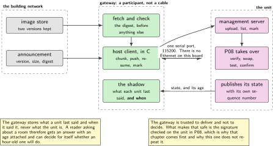
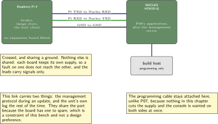
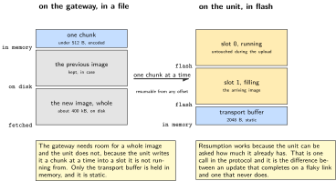
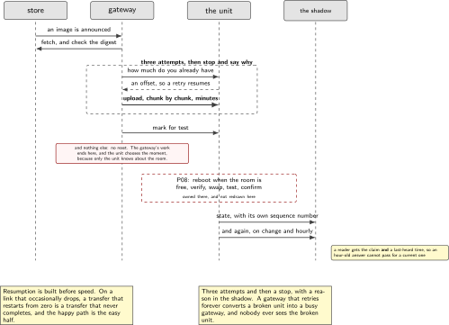
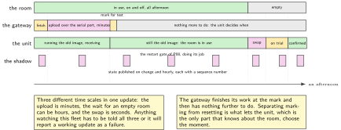

# P09. Fleet update and the fleet shadow

> **Target:** NUCLEO-H7A3ZI-Q over its serial port to a Raspberry Pi gateway  
> **Theme:** Delivery over a wire that is not a network

> [!NOTE]
> **Where this sits in the product spine**
>
> This chapter borrows two spine behaviours and builds neither. **A signed image that rolls back** is P08's and is cited; **presence with a hold and a release** is P01's and is what the shadow publishes. What this chapter adds is everything between a new image existing somewhere and a unit running it, plus the view that lets somebody at a distance tell a quiet room from a broken one.

> **Key facts**
>
> - **Board:** NUCLEO-H7A3ZI-Q, and a Raspberry Pi 4 as the gateway
> - **Peripherals:** One serial port between them. There is no Ethernet on the microcontroller board, and that is the premise of the chapter rather than an obstacle to it
> - **Toolchain:** As the front matter, plus a host client in C written here, because none exists upstream
> - **Operating system:** The device application of P08; a broker, an image store and the client on the gateway
> - **Difficulty:** 5 of 5
> - **Effort:** 5 evenings of about four hours
> - **Deliverable:** An image that travels from a store to a unit over a serial port, a published state carrying a sequence number and a staleness flag, and a shadow on which P02's cases run against a fleet rather than against one board

## Why this project

P08 made an image safe to install. It said nothing about how the image gets there, and on this board that question is sharper than usual because there is no network interface at all. The device's only route to the world is a serial port, so something at the other end of that port has to be a full participant: it subscribes to an announcement, fetches an image, pushes it over the serial link, and reports what happened.

That shape is not a workaround. It is what a connected device with a gateway actually looks like, and the published survey of update threats treats it as a first-class case: a device reached only through an intermediary, where the intermediary is trusted to deliver but not to decide. The signature is what keeps the intermediary from being trusted to decide, which is why P08 comes first.

The second half is the view. A fleet of units that each know whether their room is in use is useless unless somebody can ask them, and the hard part of asking is not the question but the honesty of the answer. A unit that has been silent for an hour must not be reported as free; it must be reported as last seen free an hour ago, and that distinction is the whole of the shadow.

> [!NOTE]
> **What this chapter does not claim**
>
> The fleet here is one device. Everything about the shadow is written so that it works for many, and nothing about it has been tested with more than one, and the chapter says so rather than implying a scale it has not reached.
>
> The host client is written here because none exists upstream in C. It implements the subset of the management protocol this chapter needs, and it is not a general implementation of that protocol.
>
> The gateway is trusted to deliver and not to decide, which is a property of the signature rather than of anything in this chapter. Nothing here authenticates the gateway to the device beyond that.

## Prior art and what to reuse

| Source | What it gives | What it does not | Licence |
| --- | --- | --- | --- |
| The simple management protocol and its device-side server | Image upload, image list, confirm and reset, over a serial transport, already on the device | **A host client in C.** The tooling upstream is in another language, so this chapter writes the client it needs | Apache-2.0 |
| P08, in this volume | Everything after the image has arrived: verification, swap, test, confirm and revert | Delivery, and any view of more than one device | Apache-2.0 |
| The broker on the gateway | Announcements and state, with transport security and per-client certificates | The certificates, which are P13's | EPL-2.0 |
| Published conventions for device state in a message topic tree | The shape that works: a retained state topic per device, a sequence number, and a last-seen time | A staleness policy, which is a product decision and is made here | Published |
| The survey of over-the-air update threats | The case of a device reached only through an intermediary, named and classified | A measured implementation over a serial link on this part. The threat case is cited; the delivery is built and timed here | Published |
| P02, in this volume | The twenty-two claim cases, which the shadow replays against the fleet view rather than against the policy function | Anything about transport | Apache-2.0 |

*Table 9.1. Prior art for P09. The one genuine gap is the host client, and it is a gap of language rather than of design: the protocol is specified and implemented, and what is missing is an implementation in the language the gateway in this volume is written in.*

## Parts from the inventory

| Part | Role | Interface |
| --- | --- | --- |
| NUCLEO-H7A3ZI-Q | The unit. Runs P08's application with the management server enabled | Serial port to the gateway; USB for programming only |
| Raspberry Pi 4 | The gateway: broker, image store, and the host client written here | Serial port to the unit; the building network on the other side |
| Two female jumper leads, plus a ground | Transmit, receive and ground between the two boards, crossed, at 3.3 V | 3.3 V, and nothing else is shared |

*Table 9.2. Inventory for P09. No expansion board is fitted on the gateway, which keeps its header free and means this chapter can run on the same Pi that carries the acquisition board in P04 without anything being unplugged.*

## System architecture



*Figure 9.1. The announcement travels over the building network; the image travels over a serial port. The gateway is a full participant rather than a cable, and the signature is what keeps it from being a trusted one. The shadow is the gateway's view of every unit it knows about, and it is deliberately drawn as holding a last-seen time rather than a state.*

The arrangement has one property that is easy to lose and expensive to recover. The gateway stores what a unit last said and when it said it, not what the unit is. Everything that reads the shadow therefore has to decide for itself whether an hour-old answer is good enough, and because the shadow carries the age, it can. A shadow that stored only the state would force every reader to assume it was current, and the assumption would be wrong exactly when it mattered.

## Configuration

```text
# the device's half: the management server over the serial port
CONFIG_MCUMGR=y
CONFIG_MCUMGR_TRANSPORT_UART=y
CONFIG_MCUMGR_GRP_IMG=y            # upload, list, confirm
CONFIG_MCUMGR_GRP_OS=y             # reset, and the echo used for liveness
CONFIG_MCUMGR_TRANSPORT_UART_BUF_SIZE=2048
CONFIG_BASE64=y
```

```text
# the topic tree on the gateway, written down once so it is not improvised
fleet/<unit-id>/state      retained, published by the gateway for each unit
fleet/<unit-id>/health     retained, the service axis of P02
fleet/<unit-id>/image      retained, the version now running and its status
fleet/announce             an image is available: version, size, digest
fleet/<unit-id>/command    restart, update, resend state
```

The state topic is retained and the health topic is separate, which repeats on the wire the separation P02 made in the device. A reader that wants to know whether a room is free and a reader that wants to know whether the room is working are different readers with different urgencies, and putting both in one message means every change to either wakes both.

## Wiring



*Figure 9.2. Three leads between two boards, crossed, with a shared ground and nothing else. The programming cable stays attached here, unlike P07, because nothing in this chapter cuts the supply and the console is wanted on both sides at once.*

The serial link carries two things that are usually separate: the management protocol during an update, and the device's own log the rest of the time. They share the port because the board has one usable serial port to spare, and the chapter is explicit that this is a constraint of the bench rather than a design preference. The protocol framing makes the sharing safe, and the symptom when it is misconfigured is a log line in the middle of an upload, which is distinctive enough to diagnose quickly.

## Memory and timing budget



*Figure 9.3. Where an image is while it is in flight. It exists three times at once during an update: in the store, in the gateway's buffer as it is chunked, and in the unit's second slot. The figure makes the point that the gateway needs room for a whole image and the unit does not need room for two complete ones at once.*

| Quantity | Budget | Measured | Margin |
| --- | --- | --- | --- |
| Management transport buffer, device | 2048 B static | 2048 B by construction | none needed |
| One chunk, over the serial link | under 512 B encoded | by construction | not measured |
| Upload of a 400 kB image | under 15 min at 115200 | not measured | not measured |
| Upload, at the highest reliable rate | stated once measured | not measured | not measured |
| Image store on the gateway | two versions kept | by construction | disk, not memory |
| State publication interval | on change, and hourly | by construction | not a measurement |
| Staleness threshold | 600 s, a settings key | by construction | a product decision |
| Shadow entry per unit | under 256 B | by construction | on the gateway |
| Time from announcement to confirmed | stated end to end | not measured | the chapter's result |

*Table 9.3. The budget for P09. The upload row is the one that shapes the chapter: at a console baud rate a four hundred kilobyte image takes minutes rather than seconds, which is why the rate is measured rather than assumed and why the restart gate from P08 matters more here than it did there.*

## Software design (UML)



*Figure 9.4. One update, end to end, with the gateway in the middle. The device's half of this sequence is P08's and is not redrawn; what is new is everything to the left of the serial port, and the one decision the gateway makes, which is when to stop trying.*

The retry policy is the gateway's only real decision and it is written down rather than left to a loop. An upload that fails part way is resumed rather than restarted, because restarting a fifteen minute transfer on a flaky link is how a fleet never updates. Three resumptions and then the gateway stops, marks the unit in the shadow with a reason, and waits for somebody to ask. A gateway that retries forever is a gateway that hides a broken unit behind an infinite queue.

```c
/* the gateway's one decision, in the host client written here */
static int deliver(unit_t *u, const image_t *img)
{
    for (int attempt = 0; attempt < 3; attempt++) {
        off_t from = smp_img_upload_offset(u);    /* resume, never restart */
        int rc = smp_img_upload(u, img, from);
        if (rc == 0) { return smp_img_test(u); }  /* mark for test, do not reset */
        LOG_WARN("unit=%s attempt=%d resumed_from=%ld rc=%d",
                 u->id, attempt, (long)from, rc);
    }
    shadow_set_reason(u, "upload_failed_three_times");  /* visible, not retried */
    return -EIO;
}
```

Marking for test and resetting are deliberately separate calls. The gateway may deliver an image at any time; when the unit restarts is the unit's decision, because only the unit knows whether the room is in use. That split is the chapter's one structural contribution to P08's scheme.



*Figure 9.5. An update across an afternoon, at a scale where the serial link is the slow part. The upload takes minutes, the deferral until the room is free can take hours, and the swap takes seconds. Anything watching this fleet has to be told all three, or it will report a working update as a failure.*

## Data flow (ASCII)

```text
  the building network                 the serial port, 115200, no Ethernet
  +---------------------+        +-----------------------------------------+
  | an image is         |        | gateway                                 |
  | announced:          | -----> |   fetch it, check the digest            |
  | version, size,      |        |   chunk it, encode it, push it           |
  | digest              |        |   resume on failure, three times, then   |
  +---------------------+        |   stop and say so in the shadow          |
                                 |   mark for test; do NOT reset            |
                                 +-----------------------------------------+
                                                   |
                                                   v
  +--------------------------------------------------------------------------+
  | unit: P08 takes over from here and this chapter does not repeat it        |
  |   the unit decides WHEN to restart, because only the unit knows the room  |
  +--------------------------------------------------------------------------+
                                                   |
                      state, with a sequence number|
                                                   v
  +--------------------------------------------------------------------------+
  | the shadow: per unit, the last thing it said AND when it said it          |
  |   a reader asking "is room 3 free" gets: free, as of 40 seconds ago       |
  |   a reader asking after an outage gets: free, as of 70 minutes ago, STALE |
  +--------------------------------------------------------------------------+
```

## Repository layout

```text
projects/P09-fleet/
  device/
    prj.conf                      # the management server over the serial port
    src/publish.c                 # state, with a sequence number, on change
  gateway/
    CMakeLists.txt
    smp_client.c                  # the host client in C, written here
    smp_client.h
    deliver.c                     # fetch, chunk, resume, mark for test
    shadow.c                      # last said, and when, per unit
    shadow.h
    broker.conf                   # topics, retention, and who may publish what
  tools/
    replay_cases.py               # P02's twenty-two cases, against the shadow
    announce.py                   # put an image in the store and announce it
  tests/
    test_resume.c                 # a cut link mid-upload resumes, not restarts
    test_stale.c                  # an old entry is reported with its age
  docs/topics.md                  # the topic tree, written down once
  README.md
```

## Steps

**Step 1.** **Bring the management server up on the device and talk to it from the gateway by hand.** Before writing a client, prove the transport with the tool that already exists, so that a later failure is known to be in the client rather than in the link.

**Step 2.** **Write the host client in C, smallest useful subset first.** List images, upload, mark for test. Not a general implementation of the protocol, and the header says so.

```c
/* smp_client.h: the subset this chapter needs, and no more */
int smp_open(unit_t *u, const char *tty, int baud);
int smp_img_list(unit_t *u, img_info_t *out, size_t n);
off_t smp_img_upload_offset(unit_t *u);          /* for resuming */
int smp_img_upload(unit_t *u, const image_t *img, off_t from);
int smp_img_test(unit_t *u);                     /* mark; does not reset */
int smp_os_echo(unit_t *u);                      /* liveness, cheap */
```

**Step 3.** **Make resumption work before making the happy path fast.** A transfer that cannot resume is a transfer that never completes on a link that occasionally drops, and the happy path is the easy half.

**Step 4.** **Separate marking from resetting, and write down why.** The gateway marks; the unit chooses the moment. This is the one place where P08's restart gate becomes operationally visible.

**Step 5.** **Publish state with a sequence number, from the device.** The number is what lets a reader detect a gap. The gateway does not invent it.

```c
/* device/src/publish.c: the device numbers its own statements */
static uint32_t seq;

void publish_state(claim_t c, reason_t why)
{
    char buf[96];
    snprintf(buf, sizeof buf,
             "{\"seq\":%u,\"claim\":%d,\"why\":%d,\"up_s\":%u}",
             ++seq, (int)c, (int)why, k_uptime_get_32() / 1000U);
    transport_publish("state", buf);      /* or spool it, as P02 decided */
}
```

**Step 6.** **Make the shadow store the time, not just the state.** This is the chapter's main idea and it is two extra fields.

```c
/* gateway/shadow.h */
typedef struct {
    char     unit_id[24];
    claim_t  last_claim;
    uint32_t last_seq;
    time_t   last_heard;        /* the field that makes the rest honest */
    bool     stale;             /* derived: now - last_heard > threshold */
    char     reason[32];        /* why delivery stopped, if it did */
} shadow_t;
```

**Step 7.** **Replay P02's cases against the fleet view.** The same twenty-two sequences, driven through the gateway rather than into the policy function, with the expected claim and reason checked at the shadow. A policy that is right in a unit test and wrong through a transport is a policy nobody has actually tested.

```bash
python tools/replay_cases.py --broker localhost --unit bench-01 --cases 22
```

**Step 8.** **Cut the link in the middle of an upload, deliberately.** Unplug the lead, watch the attempt fail, plug it back, and confirm the next attempt resumes from where it stopped rather than from zero.

**Step 9.** **Let an upload fail three times and confirm the unit is marked rather than retried forever.** The shadow carries a reason and somebody can see it. This is the acceptance criterion that distinguishes a fleet tool from a loop.

**Step 10.** **Stop publishing from the device and confirm the shadow ages rather than lies.** After the threshold, a reader asking about the room gets an answer with an age and a staleness flag, not a confident wrong answer.

**Step 11.** **Time the whole thing, announcement to confirmed, and write the number down.** It is minutes rather than seconds, and anything that watches this fleet needs to know that.

## Build, flash and debug

The gateway's client and the device's log share one serial port, which is the chapter's main source of confusion and its main diagnostic convenience. When an upload stalls, the first thing to look at is whether a log line arrived in the middle of it; the framing recovers, but a device logging at a high level during a transfer will make the transfer slow in a way that looks like a link problem.

The shadow is inspectable from the broker with a subscription and nothing else, which is deliberate. A fleet view that needs its own tool to read is a fleet view nobody checks, and the whole point of putting the age in the message is that a person with a terminal can see it.

## Verification and acceptance criteria

- **An image travels from the store to a running unit.** Announcement, fetch, upload, mark, restart when the room is free, confirm. *Refuted if* any step needs a person at the bench.
- **A cut link resumes rather than restarts.** The second attempt begins at the offset the first reached. *Refuted if* it begins at zero, which on this link means an update that never finishes.
- **Three failures stop, and say why.** The shadow carries a reason and the gateway does not keep trying. *Refuted if* it retries indefinitely, which hides a broken unit behind a queue.
- **Marking and resetting are separate.** The unit does not restart when the image arrives; it restarts when the room is free. *Refuted if* delivery causes a reboot.
- **The shadow reports age, not just state.** Every answer carries a last-heard time. *Refuted if* a reader can get a state without an age.
- **A silent unit goes stale rather than wrong.** After the threshold with no publication, the entry is flagged. *Refuted if* the last known state is still presented as current.
- **A sequence gap is detectable.** Dropping a publication leaves a hole a reader can see. *Refuted if* the gateway renumbers.
- **P02's cases pass through the transport.** All twenty-two produce the expected claim and reason at the shadow. *Refuted if* any differs from the unit test, and the difference is the finding.
- **The end-to-end time is stated.** *Refuted if* the chapter reports that it is quick.

## Variants

| Axis | This chapter | The alternative | Cost | Built in full |
| --- | --- | --- | --- | --- |
| Transport | A serial port to a gateway | A network interface on the device | There is none on this board, which is the premise | Here |
| Host client | Written in C, a small subset | The upstream tooling, in another language | A second language on the gateway | Here |
| Failure handling | Resume, three times, then stop | Restart, forever | Updates never complete, and failures are hidden | Here |
| Marking and resetting | Separate calls | One call | The unit restarts during a meeting | Here |
| The fleet view | Last said, and when | The state alone | Every reader assumes it is current | Here |
| What the device numbers | Its own statements | The gateway numbers them | A gap becomes invisible | Here |
| Verification of the image | Not here | Signature checked at the device | Already built | P08 |
| Who the gateway is | Not authenticated to the device | Mutual authentication | A different chapter | P13 |

*Table 9.4. Variants touching P09. Six rows are built here. The last two are the chapter's boundary: this chapter trusts the gateway to deliver and not to decide, and the two reasons that is safe are built elsewhere.*

## Pitfalls

- **Restarting a failed upload from zero.** On a link that occasionally drops, a transfer that cannot resume is a transfer that never finishes.
- **Retrying forever.** It converts a broken unit into a busy gateway, and nobody sees the broken unit.
- **Resetting the device as part of delivery.** The room is sometimes in use, and the unit is the only part of the system that knows.
- **A shadow that stores only the state.** Every reader then assumes it is current, and the assumption fails exactly when something is wrong.
- **Letting the gateway assign the sequence number.** A gap then becomes invisible, which removes the only cheap way to detect a lost publication.
- **Logging at a high level during an upload.** The two share a port, and the transfer slows in a way that looks like a bad link.
- **Testing the policy only in a unit test.** A policy that is right in isolation and wrong through a transport has not been tested where it runs.

## Best practices applied

The protocol subset that is needed is implemented and named as a subset. Resumption is built before speed, because the failure mode decides whether the feature works at all. Retries are bounded and their exhaustion is visible rather than silent. The authority to decide when to restart stays with the part of the system that has the information. The fleet view stores a time alongside a state, so that staleness is a fact a reader can act on rather than an assumption. And the policy from an earlier chapter is replayed through the real transport, because that is where it will actually run.

## Stretch goals

Measure the upload at several serial rates and find the one where the error rate starts to cost more than the speed gains, which is a number this bench can actually produce. Add a second unit, even if it is the same board reflashed with a different identifier, and confirm the shadow keeps them apart. Record a week of state publications and check that a reader can reconstruct, from the sequence numbers alone, every interval during which the fleet view was not current.

## Roadmap and next steps

P13 gives the unit and the gateway identities, at which point the gateway stops being trusted by default and starts being authenticated. P11 replaces the serial link with a cellular one, and the resumption built here stops being a nicety. P02's service axis is published on its own topic from this chapter onward, which is what lets a technician see a unit that needs attention without subscribing to every room's occupancy. And P19 puts the whole management path behind a tunnel, so that the broker is not reachable from the building network at all.

## Portfolio evidence

The idiom this chapter proves is **observability**: one log format, counters that matter, and a fleet view that carries the age of every answer so that a stale one cannot be mistaken for a current one. The command that proves it is

`python tools/announce.py --image build/app.signed.bin && ./gateway/deliver --unit bench-01 && python tools/replay_cases.py --cases 22`

which announces an image, delivers it over the serial link with resumption, and then replays the twenty-two claim cases through the transport against the shadow. Publish the architecture figure, the retry decision, the shadow structure, a trace of a cut link resuming, and the measured end-to-end time from announcement to confirmed.

## Sources

- The simple management protocol, its device-side server and its transport over a serial port. Read Friday 2 October 2026. The host client in C is written here because none exists upstream.
- P08 in this volume, for everything after the image has arrived, which this chapter cites and does not repeat.
- The broker's documentation, for retained topics and for the configuration that decides who may publish what.
- El Jaouhari and Bouvet, a survey of secure firmware updates over the air for connected devices, Internet of Things, 2022, for the classification of a device reached only through an intermediary. It is a survey and not a measured implementation on this part, so the case is cited and the delivery is timed here.
- Published conventions for device state in a topic tree, read for the retained-state-plus-sequence shape rather than for a staleness policy, which is a product decision made in this chapter.

---

[Previous](08-a-signed-image.md) &nbsp;&nbsp;|&nbsp;&nbsp; [Contents](../README.md) &nbsp;&nbsp;|&nbsp;&nbsp; [Next](10-a-radio-that-sleeps.md)
