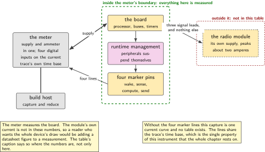
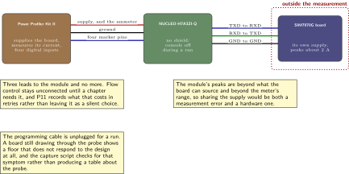
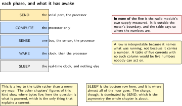
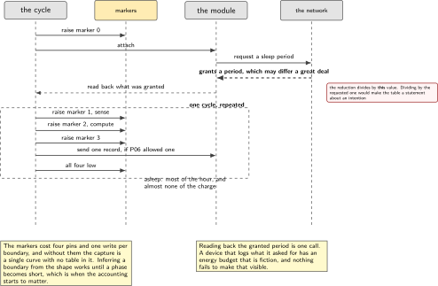
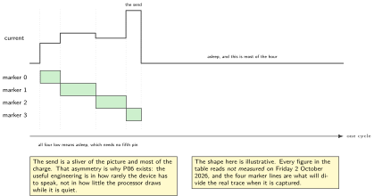

# P10. A radio that sleeps

> **Target:** NUCLEO-H7A3ZI-Q with the power meter in series, and a cellular module on its own supply  
> **Theme:** One current table for the whole volume

> [!NOTE]
> **Where this sits in the product spine**
>
> This chapter builds the fourth behaviour, **a radio that sleeps**, in full, and it owns the only measured current table in the volume. P04 contributes the timing method and P11 the link itself; everything else that wants to say what something costs in charge cites this chapter rather than measuring again.

> **Key facts**
>
> - **Board:** NUCLEO-H7A3ZI-Q, supplied through the meter; a SIM7070G module powered from its own connector
> - **Peripherals:** The device power management subsystem, the idle thread, one serial port to the module, one pin marking each phase for the meter
> - **Toolchain:** As the front matter, plus the meter's host library and a short reduction script
> - **Operating system:** One thread per phase, device runtime management on the peripherals that support it
> - **Difficulty:** 5 of 5
> - **Effort:** 5 evenings of about four hours
> - **Deliverable:** One table of current per state, measured, with each row naming what was running; and the two link timers logged as granted rather than as requested

## Why this project

A battery device is a duty cycle with a radio attached. Almost all of its energy goes to transmitting, almost none to measuring, and the design question is therefore not how little the processor draws but how rarely the radio has to be awake. That makes this chapter the natural partner of P06: that one decides how little needs to be said, and this one measures what saying it costs.

It is also the chapter where a particular kind of dishonesty is easiest and most tempting. Multiplying a sleep current by a year gives a number that looks like a battery life, and the number is almost always wrong, because the thing that drains the battery is the handful of seconds the radio is awake and not the months it is not. The chapter therefore measures per state and per phase and declines to multiply, and says why in the text rather than leaving the omission to be noticed.

The third reason is that the two link sleep mechanisms are negotiated rather than set. A device asks for a sleep period and a network grants one, and the granted value can differ from the requested one by a large factor without anything failing. A device that logs what it asked for is a device whose energy budget is fiction, and logging what was granted costs one line.

> [!NOTE]
> **What this chapter does not claim**
>
> Every current figure below reads `not measured` on Friday 2 October 2026. The harness is written, the phases are marked, and the runs have not happened.
>
> No battery life is stated anywhere in this chapter or in this volume. The arithmetic from a current to a number of years needs a duty cycle observed over a long period, and nothing on this bench has observed one. A reader who wants that number has the per-phase charge and can do the arithmetic with their own duty cycle, which is the honest way round.
>
> The module on this bench is a SIM7070G. The driver upstream names a different member of the same family, and the command differences are recorded in P11 rather than hidden. Where a figure here depends on a command that differs, the chapter says so.
>
> System-level power states for this processor family could not be confirmed in the tree pinned by the front matter. The chapter is written for device runtime management and the idle thread, and if system states turn out to exist, the measurement gains a row and the text says when that happened.

## Prior art and what to reuse

| Source | What it gives | What it does not | Licence |
| --- | --- | --- | --- |
| The power management documentation | Device runtime management, the idle policy, and the distinction between a device's own state and a system state | Confirmation that system states exist for this part in the pinned tree. The chapter checks rather than assumes | Apache-2.0 |
| The power meter and its host library | Supply and ammeter in one instrument, with eight digital inputs on the same time base as the current trace, which is what makes per-phase accounting possible at all | A harness. Marking phases and reducing the trace into a table is written here | Permissive |
| P04, in this volume | The timing method, the instrument floors, and the habit of naming the instrument in every row | Charge. It measures durations and says so | Apache-2.0 |
| The sibling firmware volume, chapter 10 | Per-phase charge accounting on the same bench, bare metal, with marker pins | Anything about an operating system's power management, which is the subject here | Apache-2.0 |
| The module's own documentation, for its two sleep mechanisms | The commands that request a sleep period, and the fact that the network grants rather than obeys | Numbers. Every published figure is for a different network and a different module | Vendor |
| Published energy modelling of a low-power cellular link | The argument that a long life follows from the link timers being chosen rather than accepted, which is the idea this chapter acts on | A measurement. The result is analytic, the module here is different, and the number in the table is this bench's or it reads not measured | Published |

*Table 10.1. Prior art for P10. The published energy model is the one source in this chapter that is used for its argument and explicitly not for its figures, which is a distinction worth making in writing because the figures are tempting.*

## Parts from the inventory

| Part | Role | Interface |
| --- | --- | --- |
| NUCLEO-H7A3ZI-Q | The subject of the measurement. No shield; the shields have their own currents and would confuse the table | Supplied through the meter |
| nRF Power Profiler Kit II | Supply and ammeter in one, with digital inputs on the current trace's own time base | Supply leads to the board, four marker leads, USB to the host |
| SIM7070G expansion board | The radio. Powered from its own connector, never from the board, because it draws peaks of about two amperes | Three leads to the board's serial port, 3.3 V |
| Build host | Runs the capture and the reduction | As the front matter |

*Table 10.2. Inventory for P10. The module's own supply is not measured by this meter, which is a real limitation and is stated in the honesty note of the results table rather than left for a reader to notice.*

## System architecture



*Figure 10.1. What is measured and what is not. The meter sits in the board's supply and sees everything the processor does; the module has its own supply and is outside that boundary. Four marker pins divide the trace into phases, which is what turns one current curve into a table.*

The boundary in that figure is the chapter's main limitation and it is drawn rather than described. The meter measures the board. The module's own current is not in these numbers, so a reader who wants the whole device's draw has to add the module's datasheet figures and will be adding a specification to a measurement. The chapter says so in the table's caption rather than letting the two be confused.

## Configuration

```text
# prj.conf
CONFIG_PM=y
CONFIG_PM_DEVICE=y
CONFIG_PM_DEVICE_RUNTIME=y      # peripherals suspend themselves when idle
CONFIG_PM_DEVICE_RUNTIME_EXCLUSIVE=n
CONFIG_LOG=y
CONFIG_LOG_MODE_DEFERRED=y      # a synchronous log keeps the processor awake
CONFIG_SERIAL=y
CONFIG_UART_CONSOLE=n           # the console is off during a run, deliberately
CONFIG_THREAD_ANALYZER=y
```

Turning the console off during a run is not tidiness. A virtual console holds a peripheral awake and a terminal attached to it holds the probe awake, and both appear in the trace as a floor the design did not ask for. The run therefore reports over the marker pins, and the table is about the device rather than about the measurement setup.

## Wiring



*Figure 10.2. The meter in series with the board, four marker pins into its digital inputs, and the module on its own supply with three signal leads. The module's supply is outside the measurement boundary, which the figure draws as a dotted box rather than leaving to the caption.*

Three leads to the module and no more. Flow control is left unconnected until a chapter needs it, and this one does not; the chapter after it records what that costs in retries. The module's supply peaks at about two amperes, which is more than the board can source and more than the meter's range, so sharing it would be both a measurement error and a hardware one.

## Memory and timing budget



*Figure 10.3. The phases, and what each one has running. The figure is a key to the table rather than a memory map: each phase names the peripherals that are awake during it, which is what makes a row interpretable rather than merely numeric.*

| State or phase | Expected | Measured | What is awake |
| --- | --- | --- | --- |
| Idle, everything suspended | tens of uA | not measured | the real-time clock only |
| Idle, console attached | far more | not measured | a serial peripheral, and the probe |
| Sensing, one window | a few mA | not measured | one bus, the sensor, the processor |
| Computing one feature | a few mA | not measured | the processor only |
| Module attached, idle | tens of mA | not measured | the serial port; the module is outside |
| Sending one record | tens of mA | not measured | the serial port; the module is outside |
| Module asleep, long period | tens of uA | not measured | the real-time clock only |
| Wake, serve, sleep, one cycle | charge per cycle | not measured | the whole of the above, in order |

*Table 10.3. The one current table of this volume. Two things it does not contain, deliberately. It contains no battery life, because the arithmetic from a current to a number of years needs a duty cycle nobody here has observed. And it contains no figure for the radio module itself, which has its own supply outside the meter's boundary; adding the module's datasheet numbers to these would be adding a specification to a measurement.*

## Software design (UML)



*Figure 10.4. One cycle: wake, sense, decide, perhaps send, sleep. The marker pins are raised and lowered at the boundaries, which is the only reason the trace can be divided at all. The two link timers are requested at attach and logged as granted, which is one line and the difference between a budget and a guess.*

The design has one rule and it is about what the device asks for rather than what it does. A sleep period is requested and a network grants a period that may be very different, so the attach sequence reads back what was granted and logs it, and the reduction script uses the granted value when it divides charge by time. A table built on requested values is a table about an intention.

```c
/* one line, and the difference between an energy budget and a guess */
static void log_granted_timers(const modem_t *m)
{
    timers_t t;

    if (modem_read_granted_timers(m, &t) == 0) {
        LOG_INF("ts=%u key=timers_granted sleep_s=%u active_s=%u "
                "requested_sleep_s=%u",
                k_uptime_get_32(), t.granted_sleep_s, t.granted_active_s,
                t.requested_sleep_s);
    } else {
        LOG_WARN("ts=%u key=timers_unknown: the table cannot divide by time",
                 k_uptime_get_32());
    }
}
```



*Figure 10.5. One cycle on the current trace, with the four marker lines below it. The sleep is most of the picture and almost none of the charge; the send is a sliver of the picture and most of it. That asymmetry is the reason P06 exists and the reason this chapter refuses to multiply a sleep current by a year.*

## Data flow (ASCII)

```text
  the board, inside the meter's boundary          the module, outside it
  +-------------------------------------+        +------------------------+
  | marker 0 high  ->  WAKE             |        | its own supply          |
  | marker 1 high  ->  SENSE            |        | peaks about 2 A         |
  | marker 2 high  ->  COMPUTE          | <----> | three signal leads only |
  | marker 3 high  ->  SEND             |        | NOT in this table       |
  | all low        ->  SLEEP            |        +------------------------+
  +-------------------------------------+
                 |
                 | current, and four digital lines, on ONE time base
                 v
  +--------------------------------------------------------------------------+
  | the meter: a curve, and the four lines that say which phase each part of  |
  | it belongs to. Without the markers this is one curve and no table exists. |
  +--------------------------------------------------------------------------+
                 |
                 v
  +--------------------------------------------------------------------------+
  | the reduction: charge per phase, divided by the GRANTED sleep period,     |
  | never by the requested one. no multiplication into years anywhere.        |
  +--------------------------------------------------------------------------+
```

## Repository layout

```text
projects/P10-radio-sleeps/
  CMakeLists.txt
  prj.conf
  src/phases.c                    # raise and lower the four markers
  src/cycle.c                     # wake, sense, compute, send, sleep
  src/timers.c                    # request the two periods, log what was granted
  src/main.c
  host/capture.py                 # the meter: current plus four digital lines
  host/reduce.py                  # the table, per phase, with the instrument named
  host/checks.py                  # refuses to print a battery life
  docs/boundary.md                # what the meter does and does not see
  README.md
```

## Steps

**Step 1.** **Measure the floor before measuring anything else.** An empty application, console off, everything suspended. If that number is not small, nothing measured afterwards is about the design.

**Step 2.** **Measure the same floor with the console attached, and keep the number.** It is the cheapest demonstration in the volume of why the run reports over marker pins, and it is a figure most readers will not expect.

**Step 3.** **Mark the phases with four pins, raised and lowered at the boundaries.** Four lines are enough for five phases because sleep is all of them low, which costs nothing and reads unambiguously.

```c
/* src/phases.c: cheap, and the whole table depends on it */
void phase_enter(phase_t p)
{
    gpio_pin_set_dt(&marker[0], p == PH_WAKE);
    gpio_pin_set_dt(&marker[1], p == PH_SENSE);
    gpio_pin_set_dt(&marker[2], p == PH_COMPUTE);
    gpio_pin_set_dt(&marker[3], p == PH_SEND);
    /* all four low means asleep, which needs no fifth pin */
}
```

**Step 4.** **Turn on device runtime management and measure the difference.** Each peripheral that supports it suspends itself when nothing is using it. The figure worth reporting is the before and after on the same application, because that is the subsystem's actual contribution.

**Step 5.** **Check whether system states exist for this part before claiming them.** If they do, there is another row; if they do not, the chapter says so and stays with runtime management.

```bash
grep -rn "pm-states" zephyr/dts/arm/st/h7/ | head
grep -rn "CONFIG_PM_S2RAM\|pm_state" zephyr/soc/st/stm32/stm32h7x/ | head
```

**Step 6.** **Attach the module and read back the granted timers.** Not the requested ones. This is the single most important line in the chapter and it is one call.

**Step 7.** **Measure one whole cycle, wake to sleep, and report charge per phase.** The sum is the cycle; the division by the granted period gives an average. Neither is multiplied by a year.

**Step 8.** **Make the reduction script refuse to print a battery life.** It is three lines and it prevents the one mistake this chapter exists to avoid.

```python
# host/checks.py
def refuse_battery_life(args):
    if args.capacity_mah or args.years:
        raise SystemExit(
            "This script reports charge per phase and an average over the "
            "granted period. Turning that into a battery life needs a duty "
            "cycle observed over a long time, which this bench has not done. "
            "Do the arithmetic yourself, with your own duty cycle.")
```

**Step 9.** **Run the same cycle with the radio never sleeping, for contrast.** The ratio between the two is the chapter's result, and it is a ratio this bench can honestly produce because both halves were measured here.

**Step 10.** **Publish the trace with the four digital lines visible.** A current curve with its phase markers is the single most convincing artefact in the volume, and it is the evidence that the table was divided rather than guessed.

## Build, flash and debug

The run has no console, so the first few attempts will fail silently and the fix is always the same: check the markers on the meter's digital lines before trusting any current. A phase boundary that never appears means the application stopped before reaching it, and that is visible in the capture without any console at all.

The second recurring problem is the probe. A board that is still connected to the programming cable draws through it, and the trace shows a floor that does not move when the application sleeps. Unplugging it is part of the procedure and the capture script checks for the symptom and says so rather than producing a table that is quietly about the probe.

## Verification and acceptance criteria

- **The idle floor is measured and stated.** *Refuted if* the chapter reports a design figure instead.
- **The console's cost is measured and stated.** *Refuted if* the chapter asserts that a console is expensive without the number.
- **Every phase boundary appears on the digital lines.** *Refuted if* any phase is inferred from the current curve's shape rather than read from a marker.
- **Runtime management is measured before and after on the same application.** *Refuted if* the chapter reports only the after.
- **The granted timers are logged, and the reduction uses them.** *Refuted if* the table divides by a requested value, which would make it a statement about an intention.
- **No battery life appears anywhere.** The reduction script refuses to produce one. *Refuted if* a figure in years appears in the chapter, the figures, or the output.
- **The module's exclusion is stated where the numbers are, not only in the text.** *Refuted if* the table's caption does not say it.
- **A trial with the probe attached is detected and discarded.** *Refuted if* such a capture is reduced into the table.
- **The sleeping and never-sleeping cycles are both measured.** The ratio is reported. *Refuted if* only one is measured and the other is estimated.

## Variants

| Axis | This chapter | The alternative | Cost | Built in full |
| --- | --- | --- | --- | --- |
| Power management | Device runtime, measured | Registers written directly | Already built, bare metal, next door | Sibling firmware volume, chapter 7 |
| Phase accounting | Four marker pins | Inferring phases from the curve | A reading of a shape rather than a measurement | Here |
| Link sleep | The granted timers, logged | The requested ones | A budget about an intention | Here |
| Result | Charge per phase, and a ratio | A battery life in years | A duty cycle nobody observed | Here, by refusing |
| The console | Off during a run | Left attached | A floor the design did not ask for | Here, and measured |
| The module's own draw | Outside the boundary, said so | Added from its datasheet | A specification added to a measurement | Here, by exclusion |
| Timing of the phases | From P04's method | Measured again | Two methods, drifting apart | P04 |

*Table 10.4. Variants touching P10. Two of the rows are built by refusing to do something, which is unusual in a table of this kind and is the point: the chapter's contribution is as much what it declines to compute as what it measures.*

## Pitfalls

- **Multiplying a sleep current by a year.** The battery is drained by the seconds the radio is awake, not by the months it is not, and the resulting number is confidently wrong.
- **Leaving the console attached.** It holds a peripheral awake and puts a floor under every measurement.
- **Leaving the programming cable attached.** The board draws through it and the floor stops responding to the design at all.
- **Logging the requested sleep period.** The network grants what it grants, and the difference can be a large factor.
- **Adding the module's datasheet current to measured board figures.** The result is neither a measurement nor a specification, and nobody afterwards can tell which parts are which.
- **Inferring phase boundaries from the curve.** It works until a phase becomes short, which is exactly when the accounting starts to matter.
- **Measuring only the configuration that wins.** The ratio needs both halves, and the half that loses is the cheaper one to measure.

## Best practices applied

The instrument's boundary is drawn rather than described, so what is excluded is visible at a glance. Phases are marked rather than inferred, which is what makes a single curve into a table. The value the network granted is used rather than the value the device asked for. The one arithmetic step that would be most impressive and least defensible is prevented by the tooling rather than by discipline. Both halves of every comparison are measured on this bench. And the configuration that makes the measurement convenient, a console, is itself measured and then removed.

## Stretch goals

Measure the same cycle at the module's two sleep mechanisms separately and report which one the network actually honoured, which is a question with a surprising answer on many networks. Add the module's own supply to a second meter if one ever exists on this bench, which would close the one gap in the table. Record the granted timers over a week and report how often they changed, since a budget built on a value the network revises is a budget with a shelf life.

## Roadmap and next steps

P11 builds the link whose timers are logged here, and it is where the retries that flow control would have prevented are counted. P06's byte budget stops being arithmetic and becomes charge, because the cost of one record is now a measured quantity. P02's service axis gains the reason code for a module that never attached, which this chapter's capture makes visible. And P14 runs the same application on a part with a different power architecture, where this table is the baseline the second board is compared against.

## Portfolio evidence

The idiom this chapter proves is **sustainability**, meaning energy rather than a slogan: the radio is off between payloads, the granted timers are logged, the meter is in series, and no figure is multiplied into a life it cannot support. The command that proves it is

`python host/capture.py --seconds 120 --out cycle.npz && python host/reduce.py cycle.npz`

which captures the current with the four phase markers on one time base and prints charge per phase with the instrument named in every row, refusing to print a battery life. Publish the trace with its markers, the per-phase table, the before and after for runtime management, and the granted-against-requested timer log.

## Sources

- The power management documentation, for device runtime management and the idle policy, and the device tree for this processor family, checked for system states rather than assumed. Read Friday 2 October 2026.
- The power meter's host library documentation, for the digital inputs that share the current trace's time base.
- P04 in this volume, for the timing method and for the habit of naming an instrument in every row.
- The sibling firmware volume, chapter 10, for per-phase charge accounting with marker pins on this same bench, bare metal.
- Andres-Maldonado, Ameigeiras, Prados-Garzon, Navarro-Ortiz and Lopez-Soler, energy modelling of a low-power cellular link with its two sleep mechanisms, Computer Networks, 2023, used for its argument that the timers must be chosen rather than accepted. Its result is analytic and its module is not this one, so no figure of its is reproduced here.

---

[Previous](09-fleet-update-and-the-fleet-shadow.md) &nbsp;&nbsp;|&nbsp;&nbsp; [Contents](../README.md) &nbsp;&nbsp;|&nbsp;&nbsp; [Next](11-cellular-from-the-rtos.md)
