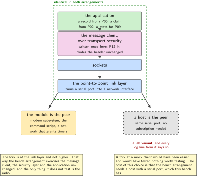
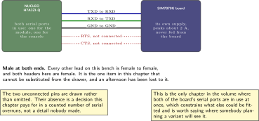
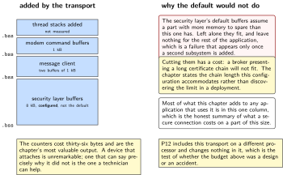
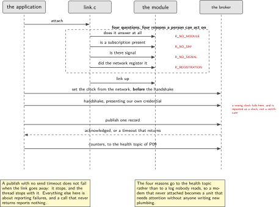
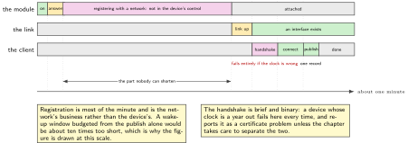

# P11. Cellular from the RTOS: attach, and one payload

> **Target:** NUCLEO-H7A3ZI-Q driving a SIM7070G module, with a broker on a Raspberry Pi  
> **Theme:** The modem subsystem and the one message client

> [!NOTE]
> **Where this sits in the product spine**
>
> This chapter borrows **a radio that sleeps** from P10 and **a sample that is allowed to leave the device** from P06. What it builds, and what the rest of the volume then reuses unchanged, is the one message client over transport security and the one link layer. P12 rebuilds both for a different processor and adds only the wireless join.

> **Key facts**
>
> - **Board:** NUCLEO-H7A3ZI-Q, a SIM7070G expansion board on its own supply, a Raspberry Pi 4 running the broker
> - **Peripherals:** One serial port to the module; no flow control, deliberately, and the cost of that is counted
> - **Toolchain:** As the front matter; the module's own command set read from its documentation rather than from the driver
> - **Operating system:** The modem subsystem, a point-to-point link layer, sockets, and the message client
> - **Difficulty:** 5 of 5
> - **Effort:** 5 evenings of about four hours
> - **Deliverable:** A device that attaches to a network by itself, publishes one record over an authenticated connection, and logs every counter that would let somebody at a distance tell why it did not

## Why this project

Every chapter so far has ended with something worth saying and no way to say it. The claim in P02, the records in P06, the state in P09: all of them reach a transport and stop. This chapter builds the transport, and it builds it once, because a volume with three message clients is a volume where two of them are subtly wrong.

The chapter is deliberately narrow. It attaches and it sends one payload. It does not build a second protocol, it does not implement store and forward beyond the spool P02 already has, and it does not try to be a general modem library. What it does do thoroughly is the part everybody underestimates: knowing why an attach failed. A device that cannot reach its network is the commonest fault in a deployed fleet and the one a technician is worst equipped to diagnose, so the counters and the log format matter more here than the happy path.

The second reason for the chapter is honesty about the hardware. The driver upstream names a different member of this module family. Most of the command set is shared, some of it is not, and the differences are written down rather than discovered by the next person.

> [!NOTE]
> **What this chapter does not claim**
>
> The module on this bench is a SIM7070G. The upstream driver names the SIM7080. The chapter records every command where the two differ and treats the driver as a starting point rather than as support for this part.
>
> Flow control is not connected. Three leads carry transmit, receive and ground, which is what P10's figure shows, and the chapter counts the retries that result rather than pretending the choice is free.
>
> No network subscription is assumed. Where a step needs a live network and this bench does not have one, the step says so and the point-to-point variant below is what runs instead. That variant is a lab arrangement and the chapter labels it as one every time it appears.
>
> The transport security here uses the credential P13 enrols. Until that chapter, the key and certificate are generated on the bench and the chapter says so.

## Prior art and what to reuse

| Source | What it gives | What it does not | Licence |
| --- | --- | --- | --- |
| The modem subsystem and its cellular driver | A state machine for attaching, a command script, and the attachment of a link layer to a network interface | Support for **this** module. It names a sibling, and the differences are this chapter's to record | Apache-2.0 |
| The point-to-point link layer | A way to turn a serial port into a network interface, which is what makes sockets possible on a board with no network controller | A peer. On a live network the module is the peer; on this bench the variant uses a host, and the chapter labels which | Apache-2.0 |
| The secure sockets layer and the message client | A client small enough for this part, with certificate verification and a documented keep-alive | Credentials, which are P13's, and a topic tree, which is P09's | Apache-2.0 |
| The module's own documentation | The command set, the attach sequence, and the two sleep mechanisms whose granted values P10 logs | Agreement with the driver. Reading both and recording the differences is the work | Vendor |
| P06, P09 and P02 in this volume | What is to be sent, the topic tree it goes to, and the spool it waits in when the link is down | Transport | Apache-2.0 |

*Table 11.1. Prior art for P11. The modem subsystem is close to what is needed and not identical to it, which is the most common and least documented situation in embedded work, and the chapter treats recording the gap as a deliverable rather than as an inconvenience.*

## Parts from the inventory

| Part | Role | Interface |
| --- | --- | --- |
| NUCLEO-H7A3ZI-Q | Drives the module directly. The Linux host is out of the loop, which is the difference between this chapter and the sibling volume's | Serial port to the module |
| SIM7070G expansion board | The radio. Its own supply; three signal leads; peaks of about two amperes | Three leads, 3.3 V |
| Raspberry Pi 4 | The broker, and on the bench variant the link peer as well | The building network |
| Male to male jumper leads | The module's header is female, as is the board's, so the leads are male at both ends. Confirmed on the bench before the chapter was written | 3.3 V |

*Table 11.2. Inventory for P11. The lead type is listed because it is the one item in this chapter that cannot be substituted from the drawer: every other lead on this bench is female to female, and an afternoon has been lost to that before.*

## System architecture



*Figure 11.1. The stack from the application down to the module, and the one place it forks. On a live network the module is the link peer; on this bench a host is, over the same serial port. Everything above the link layer is identical in both, which is why the fork is drawn there and not higher.*

The fork is the chapter's main structural decision. Putting it at the link layer means the message client, the security layer and the application are the same code in both arrangements, so the bench variant tests everything except the radio. Putting it higher, in a mock client, would have tested nothing worth testing.

## Configuration

```text
# prj.conf: the one message client of this volume
CONFIG_NETWORKING=y
CONFIG_NET_IPV4=y
CONFIG_NET_SOCKETS=y
CONFIG_NET_PPP=y
CONFIG_NET_L2_PPP=y
CONFIG_MODEM_MODULES=y
CONFIG_MODEM_CELLULAR=y            # names a sibling of this module; see below
CONFIG_MQTT_LIB=y
CONFIG_MQTT_LIB_TLS=y
CONFIG_MBEDTLS=y
CONFIG_NET_SOCKETS_SOCKOPT_TLS=y
CONFIG_MQTT_KEEPALIVE=120
CONFIG_NET_CONTEXT_SNDTIMEO=y      # a send that blocks forever is not a send
```

The last line is the one that is usually missing. A publish with no send timeout on a link that has gone away does not fail; it stops, and the thread that called it stops with it. Everything else in this chapter is about reporting failures, and a call that never returns reports nothing at all.

## Wiring



*Figure 11.2. Three leads, male at both ends, and the module on its own supply. The two unconnected flow-control pins are drawn dotted rather than omitted, because their absence is a decision this chapter counts the cost of rather than a detail nobody made.*

## Memory and timing budget



*Figure 11.3. What the transport costs in memory, which is most of what this chapter adds to any application that uses it. The security layer dominates, and its buffers are configured rather than default, because the defaults assume a part with more memory than this one has to spare.*

| Quantity | Budget | Measured | Margin |
| --- | --- | --- | --- |
| Security layer buffers | 8 kB, configured | by construction | not the default |
| Message client buffers | 2 kB, two of them | by construction | none needed |
| Link layer and network stack | under 12 kB | not measured | not measured |
| Modem command buffers | 1 kB | by construction | none needed |
| Thread stacks added | under 6 kB total | not measured | not measured |
| Time to attach, cold | under 60 s | not measured | not measured |
| Time to first publish after attach | under 10 s | not measured | not measured |
| Retries caused by no flow control | counted, published | not measured | the cost of three leads |
| Publish failures, by reason | counted, published | not measured | the chapter's real output |

*Table 11.3. The budget for P11. The last two rows are the chapter's actual deliverable. A device that attaches is unremarkable; a device that can say precisely why it did not is the one a technician can help, and these counters are what make that possible.*

## Software design (UML)



*Figure 11.4. Attach, secure, publish, and the four places it can fail. Each failure has its own counter and its own reason code, and the reason codes are the ones P02's service axis already understands, so a modem that never attaches becomes a unit that needs attention without anybody writing new plumbing.*

The log format established in P01 earns its keep here. Every stage of the attach writes one line with a key and a value, so a failure at any point leaves a trail that can be read without a debugger and counted without a parser. The counters are published on the health topic from P09, which means a technician sees them in the fleet view rather than having to visit.

```c
/* the counters that matter, published on the health topic of P09 */
struct link_counters {
    uint32_t attach_attempts;
    uint32_t attach_ok;
    uint32_t attach_fail_no_sim;        /* a reason a person can act on */
    uint32_t attach_fail_no_signal;
    uint32_t attach_fail_registration;
    uint32_t tls_handshake_fail;        /* usually the clock or the chain */
    uint32_t publish_ok;
    uint32_t publish_timeout;
    uint32_t serial_overrun;            /* the price of no flow control */
};
```



*Figure 11.5. A cold attach, at the scale it actually takes. Registration dominates and is outside the device's control; the handshake is short but fails entirely if the clock is wrong; the publish itself is the smallest part. The figure exists so that nobody budgets a wake-up window from the publish alone.*

## Data flow (ASCII)

```text
  the application              the transport this chapter builds, once
  +-----------------+   +---------------------------------------------------+
  | a record from   |-->| message client, over transport security           |
  | P06, or a claim |   |   verifies the broker's certificate               |
  | from P02        |   |   presents its own, from P13                      |
  +-----------------+   +---------------------------------------------------+
                                             |
                                   sockets   v
                        +---------------------------------------------------+
                        | the point-to-point link layer                     |
                        +---------------------------------------------------+
                             |                                   |
          on a live network  |                                   |  on this bench
                             v                                   v
        +----------------------------+        +------------------------------+
        | the module is the peer      |        | a host is the peer, over the |
        | modem subsystem, AT script  |        | same serial port             |
        | the network grants timers   |        | LABELLED AS A LAB VARIANT    |
        +----------------------------+        | EVERY TIME IT APPEARS        |
                                              +------------------------------+

  everything ABOVE the link layer is identical in both, which is the point of
  forking there and not higher.
```

## Repository layout

```text
projects/P11-cellular/
  CMakeLists.txt
  prj.conf
  overlays/modem-uart.overlay
  src/link.c                      # attach, with a reason for every failure
  src/link.h                      # the counters, published on the health topic
  src/msg.c                       # the one message client of this volume
  src/msg.h                       # what P12 includes without changing it
  src/main.c
  docs/at_differences.md          # this module against the one the driver names
  docs/lab_variant.md             # the host-as-peer arrangement, labelled
  tests/test_reasons.c            # every failure reason is reachable
  README.md
```

## Steps

**Step 1.** **Talk to the module by hand before writing any driver configuration.** Three leads, a terminal, and the module's own commands. Everything afterwards is easier if the link has been proven without software in the way.

**Step 2.** **Read the driver's command script and the module's documentation side by side, and write down every difference.** This is a deliverable, not preparation. The next person to use this module and this driver should find the list rather than rediscover it.

```bash
sed -n '/sim7080/,/};/p' zephyr/drivers/modem/modem_cellular.c > /tmp/driver.txt
# then, against the module's own manual, record each command that differs
```

**Step 3.** **Write the attach so that every failure has a reason a person can act on.** No signal, no subscription, registration refused, and a module that did not answer at all are four different situations with four different remedies.

```c
link_result_t link_attach(link_t *l)
{
    l->c.attach_attempts++;

    if (!modem_responds(l))        { return reason(l, R_NO_MODULE); }
    if (!sim_present(l))           { return reason(l, R_NO_SIM); }
    if (signal_quality(l) < 5)     { return reason(l, R_NO_SIGNAL); }
    if (!registered_within(l, K_SECONDS(60)))
                                   { return reason(l, R_REGISTRATION); }
    if (!ppp_up_within(l, K_SECONDS(20)))
                                   { return reason(l, R_LINK); }
    l->c.attach_ok++;
    return R_OK;
}
```

**Step 4.** **Bring the link layer up and prove it with something smaller than a message client.** One packet to the gateway. A failure at this point is a link failure, and a failure after it is not, which is a distinction worth buying cheaply.

**Step 5.** **Add transport security, and expect the clock to be the problem.** A certificate has validity dates and a device that has just started has no idea what day it is. The chapter sets the time from the network before the handshake and counts the failures when it does not.

**Step 6.** **Write the message client once, and give it the shape P12 can reuse without editing.** The interface takes a topic, a payload and a length, and knows nothing about what is in it.

```c
/* src/msg.h: P12 includes this file and changes nothing in it */
int msg_connect(const char *host, uint16_t port, const cred_t *own);
int msg_publish(const char *topic, const void *payload, size_t len);
int msg_poll(k_timeout_t timeout);        /* keep-alive, and incoming */
void msg_counters(struct link_counters *out);
```

**Step 7.** **Publish one record and stop.** Not a stream. One record, with the counters beside it, so that the first thing this chapter proves is that the whole path works end to end.

**Step 8.** **Make each failure reason happen on purpose.** Remove the subscription card, shield the antenna, point the client at a broker with the wrong certificate, and set the clock a year out. Four deliberate faults, four distinct reason codes, and the counters prove it.

**Step 9.** **Count the serial overruns and report them.** They are the price of not connecting flow control, and the number turns a silent choice into a measured one.

**Step 10.** **Run the lab variant and label it in the log itself.** The host as the link peer, over the same port, so that the whole stack above runs on a bench with no subscription. The log line says which arrangement is in use, so a capture cannot later be mistaken for a live one.

## Build, flash and debug

The module and the console cannot share a port, so the console here is the probe's virtual port and the module has the board's other serial port. That is the one chapter in the volume where both serial ports are in use at once, and it is worth saying because it constrains what else can be fitted.

When an attach fails, the log says which of the four reasons applied, and the remedy follows from the reason without further investigation in three of the four cases. The fourth, registration refused, is the one that needs the network operator, and the chapter records what the module reported verbatim so that the conversation can start from a fact.

## Verification and acceptance criteria

- **The device attaches without help and publishes one record.** *Refuted if* any step needs a command typed by a person.
- **Each of the four attach failures produces its own reason code.** Proven by causing each one. *Refuted if* two different faults produce the same code, which would leave a technician guessing.
- **A certificate failure is distinguishable from a link failure.** *Refuted if* both appear as a generic failure to connect.
- **A wrong clock is reported as a wrong clock.** With the time set a year out, the handshake fails and the reason says so. *Refuted if* it reports a certificate problem, which would send somebody to look at the wrong thing.
- **A publish cannot block forever.** With the link removed mid-publish, the call returns with a timeout and the counter rises. *Refuted if* the thread stops.
- **The command differences are recorded.** The document lists every command where this module and the one the driver names disagree. *Refuted if* the chapter claims the driver supports this module.
- **Serial overruns are counted and published.** *Refuted if* the chapter asserts that flow control is unnecessary without the number.
- **The lab variant is labelled in the log.** Every line from a bench run says so. *Refuted if* a capture cannot be told apart from a live one afterwards.
- **The client is unchanged by P12.** Checked when that chapter is built: the header and the source are identical. *Refuted if* either had to be edited.

## Variants

| Axis | This chapter | The alternative | Cost | Built in full |
| --- | --- | --- | --- | --- |
| Who drives the module | The microcontroller | A Linux host with the module | A different chapter, in a sibling volume | Sibling Linux volume, Project 16 |
| Where the stack forks | At the link layer | At a mock client | The bench variant would test nothing | Here |
| Flow control | Not connected | Two more leads | Overruns, which are counted here | Here, with the count |
| Failure reporting | Four reasons, each actionable | One failure code | A technician guesses | Here |
| Send timeout | Set, so a publish can fail | Default, which is forever | A thread that stops silently | Here |
| Credentials | Bench-generated for now | Enrolled, rotatable, revocable | A chapter of its own | P13 |
| Second protocol | Not here | A bridge between two | A chapter of its own, and the weaker of the two | P20 |
| Second architecture | Not here | The same client, different silicon | Proof that the client was written once | P12 |

*Table 11.4. Variants touching P11. Five rows are built here. The row about where the stack forks is the chapter's main design decision and the one most worth arguing with, which is why its cost is stated rather than implied.*

## Pitfalls

- **Assuming the driver supports this module because it supports its sibling.** Most commands are shared. The ones that are not will be found at the worst moment unless they are written down first.
- **A publish with no send timeout.** On a link that has gone away it does not fail, it stops, and so does the thread.
- **Attempting a secure handshake before the clock is set.** Certificates have dates and a device that has just started does not know the date.
- **One failure code for everything.** The commonest fault in a deployed fleet is a device that cannot reach its network, and a single code makes it the hardest to diagnose.
- **Forgetting that the leads are male at both ends.** Every other lead on this bench is female to female, and the discovery costs an afternoon.
- **Running the bench variant and forgetting to say so.** A capture that cannot be told apart from a live one will eventually be presented as one.
- **Building a second message client later.** Two clients means one of them is subtly wrong, and nobody finds out which until a deployment.

## Best practices applied

The transport is built once and the interface is designed for its second user before that user exists. The fork between the live arrangement and the bench one is placed where it tests the most. Every failure carries a reason a person can act on, and each reason is proven reachable by causing the fault. The counters go to the fleet view rather than to a log nobody reads. The gap between a driver and the hardware it nearly supports is written down as a document rather than absorbed as folklore. And the choice not to connect two leads is paid for in a measured number rather than defended in an argument.

## Stretch goals

Connect flow control and measure the overrun counter before and after, which turns the chapter's one unforced compromise into a result. Record the attach time over a week and report its distribution rather than its best case, since the worst case is what a duty cycle has to tolerate. Add a second module from the drawer, which speaks a different command set, and see how much of the command-differences document turns out to generalise.

## Roadmap and next steps

P12 takes this client to a different processor and proves it was written once. P13 replaces the bench credential with an enrolled one that can be rotated and revoked, which is the piece this chapter deliberately leaves open. P10's table gains the attach and publish phases as measured charge rather than as durations. P02's spool stops being a test fixture, because the link it waits for now exists and can genuinely be down. And P19 puts the broker behind a tunnel, at which point the certificate this chapter checks is doing two jobs at once.

## Portfolio evidence

The idiom this chapter proves is **observability**: one log format, a counter for every outcome that matters, a reason code a technician can act on, and a shell command that prints them. The command that proves it is

`west build -p -b nucleo_h7a3zi_q projects/P11-cellular && west flash && ./tools/cause_each_failure.sh`

which attaches, publishes one record, and then causes each of the four attach failures in turn, printing the counters after each so that every reason code is shown to be reachable. Publish the command-differences document, the counter structure, the four deliberate failures with their log lines, and the serial overrun count that is the price of three leads.

## Sources

- The modem subsystem and its cellular driver, read on Friday 2 October 2026. The driver names a sibling of the module on this bench, and the differences are recorded in the chapter's own document.
- The point-to-point link layer, the secure sockets layer and the message client documentation. Read Friday 2 October 2026.
- The module's own documentation, for the command set and the attach sequence, read alongside the driver rather than instead of it.
- P06, P09 and P02 in this volume, for what is sent, where it goes and where it waits when the link is down.
- P10 in this volume, for the granted sleep periods this chapter requests and that chapter measures.

---

[Previous](10-a-radio-that-sleeps.md) &nbsp;&nbsp;|&nbsp;&nbsp; [Contents](../README.md) &nbsp;&nbsp;|&nbsp;&nbsp; [Next](12-wi-fi-on-a-second-architecture.md)
