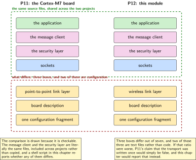
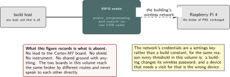
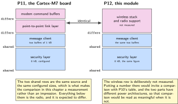
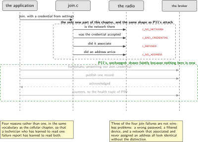
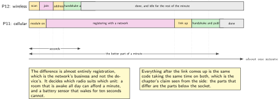

# P12. Wi-Fi on a second architecture

> **Target:** An ESP32 module on its own connector, with the broker of P09 on a Raspberry Pi  
> **Theme:** The same client, a different silicon

> [!NOTE]
> **Where this sits in the product spine**
>
> This chapter borrows **a sample that is allowed to leave the device** from P06 and the transport from P11, and builds neither. What is new is a wireless join and a second instruction set. The chapter is short on purpose: if it were long, the transport in P11 was not written once.

> **Key facts**
>
> - **Board:** An ESP32 module on its own USB connector. No wire to the Cortex-M7 board anywhere in this chapter
> - **Peripherals:** The module's own wireless radio; no shield, no sensor, no instrument
> - **Toolchain:** As the front matter, plus one command to fetch the binary hardware support package this target needs
> - **Operating system:** The same operating system, built for a different instruction set
> - **Difficulty:** 3 of 5
> - **Effort:** 3 evenings of about four hours
> - **Deliverable:** The message client of P11, unmodified, running on a second architecture, with a wireless join that reports its failures as specifically as P11's attach reports its own

## Why this project

P11 claimed that the transport was written once and that a second user would include its header without editing it. This chapter is the test of that claim, and it is worth a chapter because the claim is cheap to make and usually false.

The second reason is that the device this volume describes does not have to be one board. A unit in a room needs cellular because it may be installed where a building network does not reach; a sensor added later, or a display in a corridor, can reasonably join the building's wireless network instead. The shape of a calendar message arriving at a unit is the same in both cases, and the only part that differs is how it got there.

The chapter is short because almost all of it already exists. That brevity is the result rather than a gap, and the chapter says so rather than padding itself to look like the others.

> [!NOTE]
> **What this chapter does not claim**
>
> This chapter does not port the application of P01 or P06 to this module. It runs the transport and a stub that publishes a fixed record. Porting the sensor application belongs to P14 and is a harder claim, because that board has peripherals rather than merely a different instruction set.
>
> The binary hardware support package this target needs is fetched rather than built, and nothing here inspects it. That is a dependency the chapter names rather than one it evaluates.
>
> Nothing here measures energy. The module's power behaviour is different enough from the Cortex-M7 board's that P10's table does not transfer, and producing a second table for one chapter would invite exactly the comparison that table is not able to support.

## Prior art and what to reuse

| Source | What it gives | What it does not | Licence |
| --- | --- | --- | --- |
| P11, in this volume | The message client, the security layer configuration and the counters, all included unchanged | A wireless join. The link layer below differs and that difference is the chapter | Apache-2.0 |
| The board support for this module | A supported target in the same tree, with its radio and its network interface already described | The binary support package, which is fetched separately and is a dependency rather than a part of the tree | Apache-2.0 |
| The wireless management interface | Scanning, joining, and the events that say what happened, with the same shape as every other network interface | Credentials for a network. Those are configuration, and where they live is a decision made here | Apache-2.0 |
| P09, in this volume | The broker, the topic tree, and the shadow that this module publishes into exactly as the other board does | Anything about wireless | Apache-2.0 |
| The kit volume's sidecar lab | This same module on this same bench, driven from a Linux host over a serial port with its vendor firmware | Anything about running this operating system on it, which is the whole difference | Apache-2.0 |

*Table 12.1. Prior art for P12. The largest single dependency is a chapter of this volume, which is the intended outcome: a transport that needs rewriting for a second target was not a transport.*

## Parts from the inventory

| Part | Role | Interface |
| --- | --- | --- |
| ESP32 module | The whole chapter. Its own USB connector for power and programming | USB to the build host |
| Raspberry Pi 4 | The broker of P09, unchanged, and the building's wireless network reaches it | Wireless, and the building network |

*Table 12.2. Inventory for P12. No lead connects this module to anything else on the bench, which is the point: the two boards in this volume reach the same broker by different routes and never speak to each other directly.*

## System architecture



*Figure 12.1. The same stack twice, side by side, with the differing layer shaded. Three boxes differ out of seven, and two of those three are configuration rather than code. The figure is the chapter's argument in one picture.*

The comparison is drawn rather than asserted because it is checkable. The message client, the security layer and the application's publishing interface are the same source files, and a reader can confirm it with a file comparison rather than by trusting the text. What differs is the link layer, the board description and one configuration fragment.

## Configuration

```text
# prj.conf: what changes from P11, and it is less than a reader expects
CONFIG_WIFI=y
CONFIG_WIFI_ESP32=y
CONFIG_NET_L2_WIFI_MGMT=y
CONFIG_NET_DHCPV4=y               # the building's network assigns the address
# and what does NOT change, listed so the claim can be checked:
#   CONFIG_MQTT_LIB, CONFIG_MQTT_LIB_TLS, CONFIG_MBEDTLS,
#   CONFIG_NET_SOCKETS_SOCKOPT_TLS, CONFIG_MQTT_KEEPALIVE,
#   CONFIG_NET_CONTEXT_SNDTIMEO
# The point-to-point link layer of P11 is simply absent here.
```

The network's credentials are a settings key rather than a build constant, for the same reason every threshold in this volume is: a building changes its wireless password and a device that needs rebuilding for that is a device somebody has to visit.

## Wiring



*Figure 12.2. One cable, and it is a USB cable to the build host. The figure exists mainly to record what is not here: no lead to the other board, no shield, no instrument, and no shared ground with anything.*

## Memory and timing budget



*Figure 12.3. The same transport on two parts. The figure prints both so that the one genuinely interesting number in this chapter is visible: the transport costs what it costs, and the difference between the two columns is the radio stack rather than the application.*

| Quantity | Budget | Measured | Margin |
| --- | --- | --- | --- |
| Source files shared with P11 | all of the client | by comparison | the chapter's claim |
| Source files changed for this target | zero | by comparison | the chapter's claim |
| Configuration lines changed | four added, one removed | by construction | countable |
| Security layer buffers | 8 kB, as P11 | by construction | the same figure |
| Wireless stack and radio support | not measured | not measured | not measured |
| Time to join, warm | under 5 s | not measured | not measured |
| Time to join, cold scan | under 15 s | not measured | not measured |
| Join failures, by reason | counted, published | not measured | as P11's attach |

*Table 12.3. The budget for P12. The first three rows are the acceptance criterion rather than a resource budget, and they are the only rows in this chapter a reader should care about. If the second row is anything but zero, P11's transport was not written once and the chapter says so plainly.*

## Software design (UML)



*Figure 12.4. Joining, and then nothing new. The upper half is the only part of this chapter that does not already exist, and the lower half is drawn faintly to make that visible rather than to repeat P11's sequence.*

The join reports its failures with the same specificity P11's attach does, and for the same reason. A network that is not there, a password that is wrong, a network that is there and refuses, and an address that never arrives are four situations with four remedies, and a single failure code makes a building's worth of devices undiagnosable from a desk.

```c
/* the same shape as P11's attach, deliberately, so a technician reads one form */
typedef enum { J_OK, J_NO_NETWORK, J_BAD_CREDENTIAL,
               J_REFUSED, J_NO_ADDRESS } join_reason_t;

join_reason_t wifi_join(const char *ssid, const char *psk)
{
    if (!scan_found(ssid))                  { return J_NO_NETWORK; }
    switch (connect_and_wait(ssid, psk)) {
    case WIFI_STATUS_AUTH_FAIL:             return J_BAD_CREDENTIAL;
    case WIFI_STATUS_CONN_FAIL:             return J_REFUSED;
    default: break;
    }
    if (!dhcp_bound_within(K_SECONDS(15)))  { return J_NO_ADDRESS; }
    return J_OK;
}
```



*Figure 12.5. A join on this module beside an attach on the other board, at the same scale. The wireless join is seconds where the cellular attach is a minute, and that single difference is most of what decides which unit gets which radio in a building.*

## Data flow (ASCII)

```text
  the only new part                     everything below is P11's, unchanged
  +------------------------+   +-----------------------------------------------+
  | scan for the network   |   | the message client, over transport security   |
  | join with a credential |-->|   same source files                           |
  |   from settings        |   |   same buffer sizes                           |
  | wait for an address    |   |   same counters, same reason-code shape       |
  +------------------------+   +-----------------------------------------------+
            |                                        |
   four join reasons, published                      v
   on the health topic of P09                 the broker of P09
                                              the topic tree of P09
                                              the shadow of P09

  the two boards in this volume reach the SAME broker by DIFFERENT routes
  and never speak to each other directly.
```

## Repository layout

```text
projects/P12-wifi/
  CMakeLists.txt
  prj.conf                        # four lines added, one removed, from P11's
  src/join.c                      # the only new source file in this chapter
  src/join.h
  src/main.c                      # joins, then calls P11's msg_* and stops
  tools/compare_with_p11.sh       # the acceptance test: which files differ
  docs/what_changed.md            # three things, and two of them are config
  README.md

  # note: src/msg.c and src/msg.h are NOT here. They are included from
  # ../P11-cellular/src, which is what makes the claim checkable.
```

## Steps

**Step 1.** **Fetch the binary support package this target needs, and record that it is a dependency.** It is one command, and it is the one thing in this chapter that is not source.

```bash
west blobs fetch hal_espressif
west build -p -b esp32_devkitc_wroom/esp32/procpu projects/P12-wifi
```

**Step 2.** **Include P11's transport rather than copying it.** The build refers to the other project's source directory. Copying would make the comparison pass trivially and prove nothing.

```make
# CMakeLists.txt: the line that makes the claim checkable
target_sources(app PRIVATE
  src/join.c
  src/main.c
  ${CMAKE_CURRENT_SOURCE_DIR}/../P11-cellular/src/msg.c)
target_include_directories(app PRIVATE
  ${CMAKE_CURRENT_SOURCE_DIR}/../P11-cellular/src)
```

**Step 3.** **Put the network credentials in settings, not in the build.** A building that changes its wireless password should not need a visit.

**Step 4.** **Write the join with four distinct reasons.** Same shape as P11's attach, so that a technician who has learned to read one has learned to read both.

**Step 5.** **Publish one record to the broker of P09 and confirm it lands in the shadow.** No new topic, no new identifier scheme, nothing to configure on the gateway.

**Step 6.** **Run the comparison, and report what it finds.** This is the chapter's acceptance test and it is a shell script.

```bash
sh tools/compare_with_p11.sh
# lists: files shared, files changed, configuration lines added and removed
```

**Step 7.** **Cause each join failure on purpose.** Switch the network off, use the wrong password, filter by hardware address at the access point, and block the address assignment. Four faults, four reasons.

**Step 8.** **Change P11's client deliberately and confirm this chapter's build breaks.** If it does not, the two are not actually sharing the file and the comparison was measuring nothing. Then put it back.

## Build, flash and debug

The target name for this module is longer than most and names a processor within the package, which is the one thing that trips a first build. Beyond that, the console is over the same USB cable that powers and programs it, so a single lead carries everything and there is nothing to unplug.

When a join fails, the reason tells a reader which of four things to try, and the chapter's own experience is that the commonest is the fourth: a device that associated successfully and never received an address, which looks like a wireless fault and is a network configuration one.

## Verification and acceptance criteria

- **No file shared with P11 was changed.** The comparison names every shared file and reports them identical. *Refuted if* any differs, in which case the chapter says which and why, and P11's claim is weakened accordingly.
- **The configuration difference is countable and small.** Four lines added, one removed. *Refuted if* the difference is large, which would mean the transport depended on its link layer after all.
- **A deliberate change to P11's client breaks this build.** *Refuted if* it does not, which would mean the file is not actually shared and every other result in this chapter is meaningless.
- **A record published here appears in the shadow of P09.** Same broker, same topic tree, same reader. *Refuted if* anything on the gateway had to be configured for a second kind of device.
- **Each join failure produces its own reason.** Proven by causing all four. *Refuted if* two faults share a code.
- **The credentials are changeable without a rebuild.** *Refuted if* a new password needs a flash.
- **No energy figure is claimed.** *Refuted if* the chapter offers a current for this module, which P10's boundary does not cover.

## Variants

| Axis | This chapter | The alternative | Cost | Built in full |
| --- | --- | --- | --- | --- |
| Link | Wireless, to the building's network | Cellular, to an operator | Already built, and a different installation story | P11 |
| Transport | P11's, included unchanged | A second client for this target | Two clients, one of them subtly wrong | P11 |
| Sharing | The file is included across projects | Copied into this one | The comparison passes trivially and proves nothing | Here |
| Credentials | In settings | In the build | A visit for every password change | Here |
| Application | A stub that publishes a fixed record | The sensor application | A harder claim, about peripherals rather than instruction sets | P14 |
| Firmware on this module | This operating system | The vendor firmware, driven over a serial port | Already built, in the kit volume | Kit volume, lab 16 |
| Energy | Not measured | A second table | An invitation to compare two parts the table cannot compare | Here, by omission |

*Table 12.4. Variants touching P12. Only two rows are built here, which is the correct size for a chapter whose purpose is to demonstrate that an earlier chapter did its job.*

## Pitfalls

- **Copying the transport instead of including it.** The comparison then passes by construction and proves nothing at all.
- **Putting the wireless credentials in the build.** It works until the building changes its password, at which point every device needs a visit.
- **One failure code for the join.** The four situations have four different remedies, and three of them are not wireless problems.
- **Forgetting the binary support package.** The build fails in a way that reads as a missing header rather than a missing download.
- **Measuring energy here and putting it next to P10's table.** The two parts have different power architectures and the comparison would be read as meaningful when it is not.
- **Padding the chapter.** Its brevity is its result, and making it look like the others would hide that.

## Best practices applied

The reuse claim is made checkable by sharing a file across projects rather than copying it, and the check is made meaningful by deliberately breaking the shared file once. Failures are reported with the same vocabulary as the sibling chapter, so that a technician learns one form. Configuration that a building will change lives where a building can change it. Nothing is measured that cannot honestly be compared with what has already been measured. And the chapter is as long as its content, which for a chapter about reuse is short.

## Stretch goals

Run the same application on a third target from the drawer and see whether the configuration difference stays small, which is the only way to tell a portable design from one that happens to fit two cases. Add the wireless join's reasons to P02's service axis so that a unit that cannot reach the network is marked rather than merely quiet. Measure the join time across a working day and report its distribution, since a building's network is busiest exactly when the device most wants to publish.

## Roadmap and next steps

P13 enrols credentials for both kinds of unit through one process, which is where having two routes to one broker starts to pay. P14 makes the harder portability claim, about peripherals rather than instruction sets. P19 puts the broker behind a tunnel, at which point a device on the building's wireless network and a device on an operator's network reach it the same way, which is the strongest argument for having built the transport once.

## Portfolio evidence

The idiom this chapter proves is **portability**: one application, two targets, with the difference confined to a link layer and four lines of configuration. The command that proves it is

`sh tools/compare_with_p11.sh`

which lists every source file shared with the cellular chapter, reports whether any differs, and counts the configuration lines added and removed. Publish that output, the join function with its four reasons, and the record showing a publication from this module landing in the same fleet view as one from the other board.

## Sources

- P11 in this volume, for the transport this chapter includes and does not modify.
- The board support for this module and the wireless management interface documentation. Read Friday 2 October 2026.
- The module's binary hardware support package, fetched as a dependency and named as one; nothing here inspects it.
- P09 in this volume, for the broker, the topic tree and the shadow, none of which needed changing for a second kind of device.
- The kit volume, lab 16, for this same module on this same bench running its vendor firmware, which is the arrangement this chapter deliberately does not repeat.

---

[Previous](11-cellular-from-the-rtos.md) &nbsp;&nbsp;|&nbsp;&nbsp; [Contents](../README.md) &nbsp;&nbsp;|&nbsp;&nbsp; [Next](13-device-identity.md)
