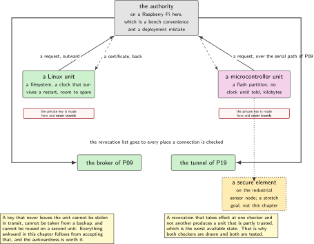
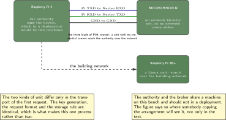
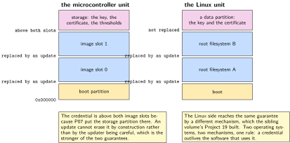
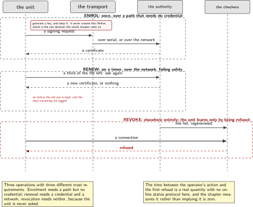
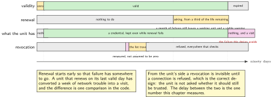

# P13. Device identity: enrol, rotate, revoke

> **Target:** A Raspberry Pi 4 as the authority, a Pi 3B+ as a Linux unit, and the Cortex-M7 board as a microcontroller unit  
> **Theme:** A certificate lifecycle across two operating systems

> [!NOTE]
> **Where this sits in the product spine**
>
> This chapter borrows **a signed image that rolls back** from P08 and is the chapter that replaces its bench key with one belonging to an identity. It also gives P11 and P12 the credential they have been generating by hand, and P19 the revocation list that lets a tunnel refuse a device. It builds no spine behaviour of its own.

> **Key facts**
>
> - **Boards:** A Raspberry Pi 4 holding the authority, a Pi 3B+ as a Linux unit, and the NUCLEO-H7A3ZI-Q as a microcontroller unit
> - **Peripherals:** The storage partition P07 placed above both image slots; the serial port of P09 for the enrolment of the microcontroller unit
> - **Toolchain:** As the front matter, plus the authority's own tooling on the Pi 4
> - **Operating system:** Both of them: this is the one chapter where the same lifecycle runs on a microcontroller and on Linux
> - **Difficulty:** 5 of 5
> - **Effort:** 5 evenings of about four hours
> - **Deliverable:** One process by which a unit of either kind acquires an identity, renews it before it expires, and can be refused afterwards, with the refusal demonstrated rather than asserted

## Why this project

Three earlier chapters have been quietly generating keys on the bench and getting on with the interesting part. P08 signs an image with a key it generated and names the gap. P11 and P12 present a credential they made locally. None of that survives contact with more than one device, because an identity that is generated where it is used is not an identity: it says nothing about which unit is speaking and it cannot be withdrawn.

The chapter exists because withdrawal is the hard half and the one usually left out. Issuing a credential is a few commands. Renewing it before it expires is a timer and a retry. Refusing a credential after a unit has been removed from a building, and having that refusal take effect at every place the unit might appear, is a design problem, and it is the one that decides whether a fleet can be maintained.

The third reason is that this volume has two kinds of unit, and a process that works for only one of them is not a process. A Linux unit has a filesystem, a clock that survives a restart and plenty of room; a microcontroller unit has a flash partition, no clock until it is told, and a few kilobytes. The same lifecycle has to fit both, and most of the chapter's design work is in finding the parts that can be identical.

> [!NOTE]
> **What this chapter does not claim**
>
> The authority here runs on a Raspberry Pi on this bench. Nothing in this volume models how a real authority is held, who may operate it, or how its own key is protected, and those are the questions that dominate a production deployment. The chapter builds the device half of the lifecycle and says plainly that the other half is an organisational problem.
>
> The microcontroller unit's private key is generated on the device and never leaves it, which is the right arrangement and is also the only one its storage makes comfortable. The Linux unit's key is generated on the unit for the same reason.
>
> A revocation list is checked where the connection is made. There is no online status protocol here, and the chapter states what that costs: a revoked unit is refused when the list reaches the place that checks it, not the instant the operator presses the button.

## Prior art and what to reuse

| Source | What it gives | What it does not | Licence |
| --- | --- | --- | --- |
| The widely used command-line authority tooling | Key generation, signing requests, issuing, and a revocation list, with every step scriptable | A lifecycle. Which steps a device performs, when, and what happens at each failure is the chapter | Apache-2.0 |
| The operating system's credential storage and the secure sockets layer | A place to put a certificate and a key on the microcontroller unit, and the calls that present them | Enrolment. Getting the first credential onto a device that has none is the interesting part | Apache-2.0 |
| P07, in this volume | The storage partition, deliberately placed above both image slots so that an update cannot erase a credential | Anything about identity | Apache-2.0 |
| P09, in this volume | The serial path by which a microcontroller unit can be reached before it has any network credential at all | Identity | Apache-2.0 |
| The sibling Linux volume, Project 18 | An authority and certificates issued once for a broker on this same bench | Rotation and revocation, which are the lifecycle rather than the issuance, and which are this chapter | Apache-2.0 |
| Published guidance on device identity for constrained devices | The vocabulary, and the argument that a device should generate its own key | An implementation for a part of this size, and no opinion about enrolling over a serial port | Published |

*Table 13.1. Prior art for P13. The tooling is mature and the gap is entirely in the device half: what a unit does on its first start, what it does ninety days later, and what happens at the moment somebody decides it should no longer be trusted.*

## Parts from the inventory

| Part | Role | Interface |
| --- | --- | --- |
| Raspberry Pi 4 | The authority and the broker. In a deployment these would not share a machine, and the chapter says so | The building network |
| Raspberry Pi 3B+ | A Linux unit: a filesystem, a clock that survives a restart, and room to spare | The building network |
| NUCLEO-H7A3ZI-Q | A microcontroller unit: a flash partition, no clock until told, and kilobytes | Serial port to the Pi 4 for enrolment |
| Three female jumper leads | The enrolment path of P09, reused rather than rebuilt | 3.3 V |

*Table 13.2. Inventory for P13. The authority and the broker share a Pi here, which is a bench convenience and a deployment mistake; the chapter notes it where the figure is drawn rather than only in the text.*

## System architecture



*Figure 13.1. One authority, two kinds of unit, and the three operations. The arrows are deliberately asymmetric: a key never travels, a request travels outward, a certificate travels back, and a revocation list travels to every place that checks one. The secure element on the industrial sensor node is drawn dotted, because it is a stretch goal rather than a part of this chapter.*

The asymmetry is the design. A private key that never leaves the unit that generated it cannot be stolen in transit, cannot be stolen from a backup, and cannot be reused on a second unit. Everything else in the chapter follows from accepting the awkwardness that creates, which is that a unit with no identity has to be reached somehow in order to acquire one.

## Configuration

```text
# the authority, on the Pi 4. One command per operation, scripted, never typed.
ca/
  ca.key              the authority's own key, which this volume does not model
  ca.crt              the certificate every unit is built knowing
  issued/<unit>.crt   one per unit
  crl.pem             the revocation list, regenerated on every revocation
  index.txt           which units exist, and which are revoked
```

```text
# the microcontroller unit's half, in prj.conf
CONFIG_TLS_CREDENTIALS=y
CONFIG_TLS_CREDENTIALS_BACKEND_PROTECTED_STORAGE=n   # not available here
CONFIG_SETTINGS=y                   # the credential lives beside the thresholds
CONFIG_MBEDTLS_PK_WRITE_C=y         # the unit generates its own key
CONFIG_MBEDTLS_X509_CSR_WRITE_C=y   # and its own request
CONFIG_SNTP=y                       # a certificate has dates; the unit needs the date
```

The last line is not an afterthought. A certificate is valid between two dates and a microcontroller unit that has just started does not know the date, so every validity check fails in a way that looks like a certificate problem. The time comes from the network before the first check, and P11 already counts the failures when it does not.

## Wiring



*Figure 13.2. The enrolment path, which is the serial link of P09 reused. A unit with no network credential cannot reach the authority over the network, so the first credential travels over the wire that needs none. The figure shows that the Linux unit has no such problem and takes a different route.*

## Memory and timing budget



*Figure 13.3. Where a credential lives on each kind of unit. On the microcontroller it is in the storage partition P07 placed above both image slots, which is why an update cannot erase it. On the Linux unit it is a file on a partition an update does not replace, which is Project 19 of the sibling volume doing the same job by a different mechanism.*

| Quantity | Budget | Measured | Margin |
| --- | --- | --- | --- |
| Private key, microcontroller unit | 128 B in storage | by construction | never leaves the unit |
| Certificate, microcontroller unit | under 1 kB in storage | not measured | not measured |
| Authority certificate, in the image | under 1 kB in flash | by construction | built in, not enrolled |
| Revocation list, as checked | under 4 kB | not measured | grows with revocations |
| Key generation, on the microcontroller | under 20 s | not measured | not measured |
| Enrolment, end to end, over serial | under 60 s | not measured | not measured |
| Renewal, over the network | under 10 s | not measured | not measured |
| Time from revoking to first refusal | stated, not instant | not measured | the chapter's honest limit |

*Table 13.3. The budget for P13. The last row is the one that matters and the one most often left unstated: without an online status protocol, a revoked unit is refused when the list reaches the checker, and the chapter measures that delay rather than implying there is none.*

## Software design (UML)



*Figure 13.4. The three operations as one lifecycle. Enrolment happens once, over a path that needs no credential; renewal happens on a timer and over the network; revocation happens elsewhere entirely and reaches the unit only as a refusal. The three have different trust requirements and the figure separates them for that reason.*

Renewal is designed to fail safely, which means starting early rather than retrying hard. The unit begins asking for a new certificate when a third of its validity remains, so that a month of failed attempts still leaves a working credential while somebody investigates. A unit that renews on the last day has converted a transient network problem into a device that has to be visited.

```c
/* start early, so that failure has somewhere to go */
static bool renewal_due(const cred_t *c, time_t now)
{
    time_t life = c->not_after - c->not_before;
    return now > c->not_after - (life / 3);     /* a third of the life left */
}

/* and on failure, keep the old one and say so, rather than discarding it */
static void renew(cred_t *c)
{
    cred_t fresh;

    if (request_new(&fresh) == 0 && cred_store(&fresh) == 0) {
        *c = fresh;
        counters.renew_ok++;
    } else {
        counters.renew_fail++;        /* the old credential is still valid */
        LOG_WARN("ts=%u key=renew_failed days_left=%d",
                 k_uptime_get_32(), days_until(c->not_after));
    }
}
```



*Figure 13.5. A certificate's life, and where the two failure paths lead. Renewal begins with a third of the validity left, so a month of failed attempts still leaves a working unit and a visible warning. The lower band shows what a revocation looks like from the unit's side, which is nothing at all until a connection is refused.*

## Data flow (ASCII)

```text
  ENROL, once, over a path that needs no credential
  +-----------------------------------------------------------------------+
  | the unit generates its own key              <- it never leaves the unit |
  | the unit builds a signing request                                      |
  | the request travels over the serial link of P09, or over the building  |
  |   network for a Linux unit                                             |
  | the authority issues a certificate                                     |
  | the certificate goes into the storage partition P07 put above the slots|
  +-----------------------------------------------------------------------+

  RENEW, on a timer, over the network
  +-----------------------------------------------------------------------+
  | at a third of the life remaining: ask for a new one                    |
  | on failure: KEEP THE OLD ONE, count it, log the days remaining         |
  | a month of failures still leaves a working unit and a visible problem  |
  +-----------------------------------------------------------------------+

  REVOKE, somewhere else entirely
  +-----------------------------------------------------------------------+
  | an operator revokes; the list is regenerated                           |
  | the list reaches the broker, and the tunnel of P19                     |
  | the unit learns about it only as a refusal, which is the correct design |
  | the delay between the two is MEASURED, not assumed to be zero          |
  +-----------------------------------------------------------------------+
```

## Repository layout

```text
projects/P13-identity/
  ca/
    issue.sh                      # scripted; no step is ever typed by hand
    revoke.sh
    refresh_crl.sh
    README.md                     # what this volume does NOT model, said first
  device-mcu/
    src/enrol.c                   # generate, request, store
    src/renew.c                   # the timer, and the failure that keeps the old
    src/cred.c                    # storage, in P07's partition
    prj.conf
  device-linux/
    enrol.sh                      # the same three operations, different mechanism
    renew.timer                   # and a system timer rather than a thread
  tools/
    enrol_over_serial.py          # the path for a unit with no network identity
    time_to_refusal.py            # measures the one number nobody states
  tests/
    test_renew_window.c           # a third of the life, and the failure path
  docs/two_kinds_of_unit.md       # what is identical and what cannot be
  README.md
```

## Steps

**Step 1.** **Write down, before anything else, what this volume does not model.** The authority's own key, who may operate it, and how it is protected. Putting that in the first paragraph of the authority's own notes is what stops the bench arrangement being mistaken for a design.

**Step 2.** **Make every authority operation a script.** An operation that is typed is an operation that is done differently each time and cannot be audited afterwards.

**Step 3.** **Have each unit generate its own key.** This is the one decision the whole chapter rests on, and the awkwardness it creates, that a unit with no identity has to be reached somehow, is worth paying.

```c
/* device-mcu/src/enrol.c: the key is made here and stays here */
int enrol(void)
{
    uint8_t csr[640];
    int len;

    if (cred_exists()) { return 0; }         /* enrolment happens once */
    if (key_generate_into_storage() != 0) { return -EIO; }
    len = csr_build(csr, sizeof csr, unit_id());
    if (len < 0) { return len; }
    return enrol_transport_send(csr, len);   /* serial here; network on Linux */
}
```

**Step 4.** **Enrol the microcontroller unit over the serial path of P09.** It has no network credential, so it cannot reach the authority over the network, and this is the chapter's neatest reuse of an earlier one.

**Step 5.** **Enrol the Linux unit over the building network, and note that the difference is only the transport.** The three operations, the request format and the storage rule are the same; the mechanism is not.

**Step 6.** **Set the unit's clock before the first validity check.** A certificate has dates and a device that has just started does not know the date, which produces a failure that looks like a certificate problem and is not.

**Step 7.** **Renew at a third of the life remaining, and keep the old credential when renewal fails.** This is the difference between a transient network problem and a visit.

**Step 8.** **Revoke a unit and measure how long it takes before it is refused.** This is the chapter's one genuinely interesting measurement and almost nobody makes it.

```bash
./ca/revoke.sh bench-mcu-01 && ./ca/refresh_crl.sh
python tools/time_to_refusal.py --unit bench-mcu-01 --watch broker,tunnel
```

**Step 9.** **Confirm the revoked unit is refused at every place that checks.** The broker of P09 and, once it exists, the tunnel of P19. A revocation that takes effect in one place and not another is worse than none, because it produces a unit that is partly trusted.

**Step 10.** **Replace a unit and confirm the identity moves correctly.** The new unit enrols, the old one is revoked, and the binding in the fleet view follows. This is the whole of replacement in this volume and it is two existing operations rather than a new chapter.

**Step 11.** **Try to reuse a credential on a second unit.** Copy the certificate without the key and confirm it is useless, which is what makes the key-never-leaves rule worth its awkwardness.

## Build, flash and debug

The commonest failure in this chapter is a clock, and the second commonest is a chain the unit was not built knowing. Both present as a handshake that fails, and P11's separate reason codes are what tell them apart, which is the first time in the volume that an earlier chapter's diagnostics pay for themselves in a later one.

Enrolment over the serial path is slow and that is acceptable because it happens once. What is not acceptable is enrolment that has to be retried by hand, so the tool is written to be idempotent: run it twice on an enrolled unit and it reports that nothing was needed rather than issuing a second certificate.

## Verification and acceptance criteria

- **A private key never appears outside the unit that generated it.** Checked by searching the authority's own files and the transport captures. *Refuted if* one is found anywhere, which would invalidate the chapter's main design decision.
- **A unit with no identity can acquire one.** Over the serial path for the microcontroller unit and over the network for the Linux one. *Refuted if* either needs a credential it does not yet have.
- **Enrolment is idempotent.** Running it twice does not issue a second certificate. *Refuted if* it does.
- **Renewal starts at a third of the life remaining.** *Refuted if* it starts later, which would turn a transient failure into a visit.
- **A failed renewal keeps the old credential and reports the days remaining.** *Refuted if* the unit discards a valid credential it cannot replace.
- **A revoked unit is refused at every checker.** Broker and tunnel both. *Refuted if* one refuses and another does not, which is worse than no revocation at all.
- **The time from revoking to first refusal is measured and stated.** *Refuted if* the chapter implies the refusal is immediate.
- **A certificate without its key is useless.** *Refuted if* copying one onto a second unit produces a working connection.
- **An update does not erase a credential.** Install an image through P08 and confirm the credential survives, which is P07's layout doing its job. *Refuted if* the unit has to re-enrol after an update.

## Variants

| Axis | This chapter | The alternative | Cost | Built in full |
| --- | --- | --- | --- | --- |
| Where the key is made | On the unit | At the authority, and shipped | A key that can be stolen in transit or from a backup | Here |
| First enrolment | Over a path needing no credential | A credential built into the image | Every unit shares one identity | Here |
| Renewal timing | A third of the life remaining | On the last day | A transient failure becomes a visit | Here |
| Failed renewal | Keep the old one, report it | Discard and retry | A unit with no credential and no way to get one | Here |
| Revocation | A list, checked where connections are made | An online status protocol | More infrastructure; the delay here is measured instead | Here, with the delay stated |
| Key storage | Flash, in P07's partition | A secure element | The industrial sensor node has one; a stretch goal, drawn dotted | Named, not built |
| Issuance only | Not here | Certificates issued once | Already built | Sibling Linux volume, Project 18 |

*Table 13.4. Variants touching P13. Five rows are built here, and the one that is named rather than built is named because the part exists on this bench and using it properly is a chapter rather than a paragraph.*

## Pitfalls

- **Generating keys at the authority.** It is convenient, it makes enrolment easy, and it means a key exists somewhere other than the device for the rest of its life.
- **Building one credential into every image.** Every unit then has the same identity, which is the same as having none.
- **Renewing on the last day.** A network that is down for a week turns into a fleet that has to be visited.
- **Discarding a credential when renewal fails.** The unit then has nothing, and no way to ask for anything.
- **Checking a certificate before the clock is set.** It fails, and it fails in a way that sends somebody to look at certificates.
- **Assuming revocation is instant.** Without an online status protocol it takes as long as the list takes to arrive, and that is a number somebody should know.
- **Revoking in one place only.** A unit that is refused by the broker and accepted by the tunnel is partly trusted, which is the worst available state.

## Best practices applied

Every private key is generated where it is used and never travels. The first credential is acquired over a path that does not need one, which is the problem most schemes solve by giving every device the same identity. Renewal is early enough that failure has somewhere to go, and a failed renewal keeps what the unit has. Revocation is checked at every place a connection is made, and the delay between the operator's action and the first refusal is measured rather than assumed away. Every authority operation is a script. And what the volume does not model is stated at the top of the authority's own notes rather than inferred from its absence.

## Stretch goals

Use the secure element on the industrial sensor node to hold a key that the processor cannot read at all, which turns the key-never-leaves rule from a procedure into a property of the hardware. Add an online status check and measure how much the time to first refusal improves against how much infrastructure it costs. Run a hundred enrolments over the serial path and report how many needed a retry, which is the number that decides whether a commissioning engineer can work through a building without getting stuck.

## Roadmap and next steps

P19 consumes the revocation list and is the second place a refusal has to take effect, which is what makes the measurement in this chapter worth making. P08's bench key becomes an identity, so a signed image is signed by somebody rather than by the build. P11 and P12 stop generating credentials locally. P17 performs the decommission half on the Linux side, where wiping a credential provably is a filesystem problem rather than a flash one, and the two chapters are worth reading together.

## Portfolio evidence

The idiom this chapter proves is **reliability**, applied to identity rather than to storage: renewal starts early, failure keeps what works, and the one delay nobody states is measured. The command that proves it is

`./ca/revoke.sh bench-mcu-01 && ./ca/refresh_crl.sh && python tools/time_to_refusal.py --unit bench-mcu-01 --watch broker,tunnel`

which revokes a unit, refreshes the list, and reports the elapsed time until the unit is refused at each checker. Publish the enrolment path over serial, the renewal window with its failure behaviour, the measured time to first refusal, and the search of the authority's files showing that no device private key is present.

## Sources

- The command-line authority tooling, for key generation, issuance and the revocation list. Read Friday 2 October 2026.
- The operating system's credential storage and secure sockets documentation, and the request-writing configuration that lets a unit build its own signing request. Read Friday 2 October 2026.
- P07 in this volume, for the storage partition above both image slots, which is why a credential survives an update.
- P09 in this volume, for the serial path by which a unit with no network identity is reached.
- The sibling Linux volume, Project 18, for an authority and certificates issued once on this same bench, which this chapter extends into a lifecycle rather than repeating.
- Published guidance on identity for constrained devices, read for the argument that a device should generate its own key, and not for an implementation.

---

[Previous](12-wi-fi-on-a-second-architecture.md) &nbsp;&nbsp;|&nbsp;&nbsp; [Contents](../README.md) &nbsp;&nbsp;|&nbsp;&nbsp; [Next](14-the-same-application-on-a-second-board.md)
