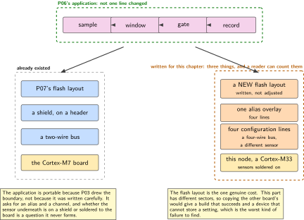
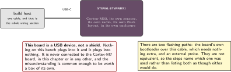
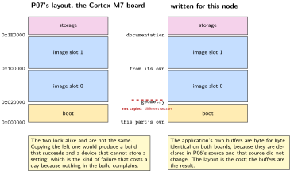
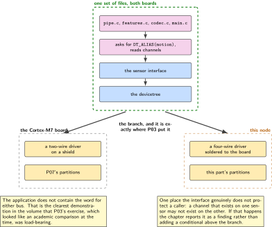
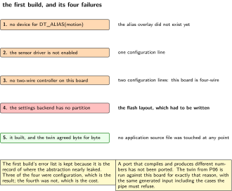

# P14. The same application on a second board

> **Target:** The STEVAL-STWINBX1, a Cortex-M33 industrial sensor node  
> **Theme:** Portability across two microcontroller families

> [!NOTE]
> **Where this sits in the product spine**
>
> This chapter borrows **a sample that is allowed to leave the device** from P06 and rebuilds it for a second board without changing it. It builds no spine behaviour. Its result is a number: how many files had to change, and which.

> **Key facts**
>
> - **Board:** STEVAL-STWINBX1, a Cortex-M33 with its own sensors, its own radio and its own flash layout. A USB device, not a shield
> - **Peripherals:** The board's own motion sensors, reached through the same interface P03 established; its radio through a serial host-controller binding
> - **Toolchain:** As the front matter; flashing by the board's own bootloader or by an external probe, and the chapter names which it used
> - **Operating system:** The same, built for a second processor family
> - **Difficulty:** 4 of 5
> - **Effort:** 4 evenings of about four hours
> - **Deliverable:** P06's application running on a board it was not written for, with every file that had to change listed and justified

## Why this project

P12 showed that the transport was written once by running it on a second instruction set. That was the easy half of portability, because the only thing that differed below the socket was a radio. This chapter is the harder half: a different processor family, a different flash geometry, different sensors, a different radio arrangement, and no header in common with the board every other chapter uses.

The claim being tested is not that the code compiles. It is that the boundary P03 drew, where hardware is described in an overlay and the application names what it wants, holds when the hardware changes substantially rather than slightly. If it holds, the application is untouched and the work is three text files. If it does not, the chapter says exactly where it leaked, and that is a more useful result than a success would have been.

The chapter is also a boundary with a sibling volume, and the boundary is stated rather than implied. This board is the committed subject of a separate condition-monitoring build, and nothing here encroaches on it: this is a port, it runs the application of P06, and it makes no claim about what this board is best at.

> [!NOTE]
> **What this chapter does not claim**
>
> This is a port and nothing more. The board's wideband vibration capability, its on-board storage and its industrial sensing role are the subject of a different volume, and this chapter deliberately uses none of them.
>
> The board's own radio is brought up far enough to confirm the binding resolves and no further. P12 is where a second radio is actually used, and doing it twice would be duplication rather than evidence.
>
> The flashing path is named because there are two and they are not equivalent. One needs no extra hardware and one needs an external probe this bench may or may not have free, and the chapter says which was used rather than listing both as if either would do.
>
> No energy comparison is made with P10. The two parts have different power architectures and the comparison would be read as meaningful when it is not, which is the same reason P12 declined it.

## Prior art and what to reuse

| Source | What it gives | What it does not | Licence |
| --- | --- | --- | --- |
| The board support for this node, added upstream by its maker | A supported target with its sensors, its radio binding, its flash partitions and two flashing paths described | Any of this volume's application. The port is the chapter | Apache-2.0 |
| P06, in this volume | The application being ported: the pipe, the features, the counters and the twin | Anything board-specific, which is the point | Apache-2.0 |
| P03, in this volume | The boundary being tested: hardware in an overlay, the application naming what it wants | Proof that the boundary holds across families, which is this chapter | Apache-2.0 |
| P07, in this volume | The flash layout for the other board, which does not transfer and has to be redone from this part's own geometry | A layout for this part | Apache-2.0 |
| The kit volume, lab 4 | This board on this bench, as a USB device running its vendor firmware | Anything about this operating system on it | Apache-2.0 |
| The sibling firmware volume's authoring guide | The statement that this board belongs to the condition-monitoring build, which is the boundary this chapter respects | Permission to use its vibration capability, which this chapter does not take | Apache-2.0 |

*Table 14.1. Prior art for P14. Two of the six rows are boundaries rather than resources, which is unusual and is deliberate: a chapter about a board that another volume owns has to say what it is not doing before it says what it is.*

## Parts from the inventory

| Part | Role | Interface |
| --- | --- | --- |
| STEVAL-STWINBX1 | The whole chapter. A self-contained node with its own sensors; a USB device rather than a shield, so nothing on this bench plugs into it | USB to the build host |
| Build host | Builds for a second processor family and runs P06's twin against the output | As the front matter |
| An external probe, if the chosen flashing path needs one | Named in the steps rather than assumed | As the board's documentation |

*Table 14.2. Inventory for P14. Nothing from the other chapters is reused physically: no shield, no leads, no instrument. The reuse in this chapter is entirely in source.*

## System architecture



*Figure 14.1. The same four-stage pipe above, two different hardware descriptions below. The shaded boxes are what had to be written for this board, and the figure is drawn so that a reader can count them. Three is the result; if it had been six the chapter would have said so.*

The honest reading of that figure is that the application is portable because P03 made it so, not because it was written carefully. The devicetree boundary does the work: the application asks for an alias and a channel, and whether the sensor underneath is on a shield or soldered to the board is a question it never forms.

## Configuration

```dts
/* boards/steval_stwinbx1.overlay: the only devicetree this chapter writes.
 * The board's own description already has the sensors; what is added is the
 * alias the application of P06 asks for, so that no source file changes.
 */
/ {
    aliases {
        motion = &ism330dhcx;      /* this board's sensor, not the shield's */
    };
};
```

```text
# prj.conf: what differs from P06's, and it is four lines
CONFIG_SPI=y                      # this board's sensors are on a four-wire bus
CONFIG_I2C=n                      # and not on a two-wire one
CONFIG_ISM330DHCX=y               # its sensor, instead of the shield's
CONFIG_LSM6DSO=n
# everything else is P06's prj.conf, unchanged, including the window length,
# the dead band, the byte budget and the counters.
```

The flash layout is the one thing that genuinely has to be redone rather than adjusted. This part has different sector geometry and a different total, so P07's partition table does not transfer, and copying it would produce a build that succeeds and a device that cannot store a setting. The chapter writes a new one from this part's own documentation and says so.

## Wiring



*Figure 14.2. One USB cable. The figure records that this board is a USB device rather than a shield, which is the single most common misunderstanding about it on this bench: nothing plugs into the other board, and the two are never connected.*

## Memory and timing budget



*Figure 14.3. The two flash layouts side by side. They are not the same and could not be, which is the chapter's one genuine porting cost. The application's own buffers are identical, which is its one genuine porting success.*

| Quantity | Budget | Measured | Margin |
| --- | --- | --- | --- |
| Application source files changed | zero | by comparison | the chapter's claim |
| Devicetree files written | one, the alias overlay | by construction | countable |
| Configuration lines changed | four | by construction | countable |
| Flash layout | rewritten, not adjusted | by construction | the real porting cost |
| Application buffers, both boards | identical | by construction | P06's figures |
| Flash total, this part | 2 MB | by construction | same as the other board |
| Memory total, this part | 768 kB | by construction | less than the other board |
| Feature computation, one window | not measured | not measured | a different core |
| Twin agreement, both boards | byte for byte | not measured | P06's acceptance test |

*Table 14.3. The budget for P14. The first and fourth rows together are the chapter: the application did not change and the flash layout could not be reused, which is a fair summary of what porting across two families of one processor family actually costs.*

## Software design (UML)



*Figure 14.4. Where the two builds diverge, drawn as one tree. Everything above the devicetree is one set of files; everything below is two. The branch is at exactly the place P03 put it, which is the chapter's result rather than its design.*

One difference is worth more than the others and it is not in the figure. This board's sensor is on a four-wire bus and the shield's is on a two-wire one, and the application does not contain the word for either. That is the clearest demonstration in the volume that P03's exercise, which looked like an academic comparison at the time, was load-bearing.



*Figure 14.5. The port, as it actually went: a first build that failed in four places, and what each failure turned out to be. Three were configuration and one was a flash layout. The figure keeps the first build's error list because it is the record of where the abstraction nearly leaked.*

## Data flow (ASCII)

```text
  one application, two boards
  +------------------------------------------------------------------------+
  | P06's pipe: sample, window, gate, record. Not one line changed.         |
  | It asks for DT_ALIAS(motion) and reads channels. It names no bus.        |
  +------------------------------------------------------------------------+
                 |                                        |
        overlay  |                               overlay  |
                 v                                        v
  +----------------------------+        +--------------------------------+
  | the Cortex-M7 board        |        | this node, a Cortex-M33        |
  |   a shield on a header     |        |   sensors soldered to the board|
  |   a two-wire bus           |        |   a four-wire bus              |
  |   P07's flash layout       |        |   a DIFFERENT flash layout,    |
  |                            |        |   rewritten from this part's   |
  |                            |        |   own geometry                 |
  +----------------------------+        +--------------------------------+

  what changed: one overlay, four configuration lines, one flash layout.
  what did not: every source file in the application.
```

## Repository layout

```text
projects/P14-second-board/
  CMakeLists.txt                  # includes P06's sources; copies none of them
  prj.conf                        # four lines different from P06's
  boards/steval_stwinbx1.overlay  # the alias, and nothing else
  boards/partitions.overlay       # written from this part's geometry, not copied
  tools/compare_with_p06.sh       # the acceptance test: which files differ
  docs/what_did_not_transfer.md   # the flash layout, and why
  README.md

  # src/ is deliberately absent. The application is ../P06-capture/src.
```

## Steps

**Step 1.** **Build the operating system's own sample for this board before anything else.** It establishes that the toolchain, the target name and the flashing path all work, so that the first failure of the port is known to be the port.

```bash
west build -p -b steval_stwinbx1 zephyr/samples/hello_world
west flash          # or the board's own bootloader; the steps say which was used
```

**Step 2.** **Read this part's flash geometry and write a new partition table.** Do not adjust P07's. A layout copied from a part with different sectors produces a build that succeeds and a device that cannot store a setting, which is the worst kind of failure to debug.

**Step 3.** **Write the alias overlay and nothing else.** One file, four lines, naming this board's sensor as the thing P06's application asks for.

**Step 4.** **Include P06's sources rather than copying them.** As in P12, copying would make the comparison pass by construction.

```make
# CMakeLists.txt
target_sources(app PRIVATE
  ${CMAKE_CURRENT_SOURCE_DIR}/../P06-capture/src/pipe.c
  ${CMAKE_CURRENT_SOURCE_DIR}/../P06-capture/src/features.c
  ${CMAKE_CURRENT_SOURCE_DIR}/../P06-capture/src/codec.c
  ${CMAKE_CURRENT_SOURCE_DIR}/../P06-capture/src/main.c)
```

**Step 5.** **Build, and record every error before fixing any of them.** The list of first errors is the most informative artefact this chapter produces, because it is the list of places the abstraction nearly leaked.

**Step 6.** **Run P06's twin against this board's output.** Same generated input, same expected bytes. A port that compiles and produces different numbers has not been ported.

```bash
python ../P06-capture/twin/generate.py --cases all --out cases.npz
python ../P06-capture/twin/compare.py --port /dev/ttyACM0 --cases cases.npz
```

**Step 7.** **Bring the board's own radio up far enough to confirm the binding resolves, and stop there.** P12 is where a second radio is used, and using one twice would be duplication.

**Step 8.** **Run the comparison and publish what it found.** Which files are shared, which differ, how many configuration lines changed, and the flash layout that had to be rewritten.

**Step 9.** **Change P06's pipe deliberately and confirm this build breaks.** The same check P12 made, for the same reason: if it does not break, nothing is actually shared and the whole result is an illusion. Then put it back.

**Step 10.** **Write down what did not transfer, and why.** One short document. It is the half of the result that a reader planning their own port actually needs.

## Build, flash and debug

The flashing path is the first obstacle and the documentation describes two. One uses the board's own bootloader over USB and needs nothing extra; the other needs an external probe. The chapter states which it used and what it cost, because a reader with one probe and three boards needs to plan.

The second obstacle is the sensor name. This board's inertial sensor is a different part from the shield's, with a different driver and a different set of supported channels, and a channel the application reads happily on one may not exist on the other. That is the one place the abstraction can genuinely leak, and if it does, the chapter reports it as a finding rather than quietly adding a conditional to the application.

## Verification and acceptance criteria

- **No application source file changed.** The comparison reports every shared file identical. *Refuted if* any differs, and the chapter names it and explains what leaked.
- **The configuration difference is countable and small.** Four lines. *Refuted if* it is large, which would mean the application depended on its board after all.
- **A deliberate change to P06's pipe breaks this build.** *Refuted if* it does not, which would mean nothing is shared and every other result here is meaningless.
- **The twin agrees byte for byte on this board.** Same input, same emitted bytes as the other board. *Refuted if* they differ, which would mean the arithmetic is not actually portable even though the source is.
- **The flash layout was rewritten rather than copied.** Checked by comparing the two partition tables, which must not be identical. *Refuted if* they are, which means somebody copied a layout for a part with different sectors.
- **The board's radio binding resolves.** Nothing more is claimed. *Refuted if* the chapter asserts a working radio without having used one.
- **The flashing path is named.** *Refuted if* the chapter lists both as if either would do.
- **No energy comparison with P10 appears.** *Refuted if* one does.

## Variants

| Axis | This chapter | The alternative | Cost | Built in full |
| --- | --- | --- | --- | --- |
| What is ported | P06's pipe | The whole volume | Months, and no clearer a result | Here |
| Sharing | Sources included across projects | Copied in | The comparison proves nothing | Here |
| Flash layout | Rewritten from this part | P07's, adjusted | A build that succeeds and a device that cannot store a setting | Here |
| This board's strengths | Deliberately unused | Wideband vibration, on-board storage | Another volume owns that subject | Named, not built |
| Second radio | Binding confirmed only | Used properly | Duplication of P12 | P12 |
| Second instruction set | Not the point here | A different architecture entirely | Already shown | P12 |
| Energy | Not compared | A second table | An invalid comparison presented as a valid one | Here, by omission |

*Table 14.4. Variants touching P14. Three rows are built. The row about this board's strengths is the most important one in the table and the only one that is a boundary rather than a trade: another volume is committed to that subject, and this chapter stays out of it.*

## Pitfalls

- **Adjusting the other board's flash layout instead of writing a new one.** The sectors differ, the build succeeds, and the device cannot store a setting.
- **Copying the application in rather than including it.** The portability comparison then passes by construction.
- **Adding a conditional to the application to make it build.** That is the abstraction leaking, and absorbing it quietly turns a finding into folklore.
- **Assuming a channel exists because it existed on the other sensor.** Different parts support different channels, and this is the one place the interface genuinely does not protect a caller.
- **Treating this board as a shield.** It is a USB device. Nothing on this bench plugs into it, and the figure says so because the mistake is common.
- **Using this board's vibration capability.** Another volume is committed to that subject, and crossing the boundary makes two documents that each half-cover it.
- **Comparing its current with the other board's.** Different power architectures, and the comparison will be read as meaningful.

## Best practices applied

The reuse is made checkable by sharing sources rather than copying them, and the check is made meaningful by breaking the shared file once on purpose. The thing that could not be ported is identified, rewritten properly, and documented as the chapter's real cost. The first build's error list is kept as evidence rather than discarded once it is fixed. The boundary with another volume is stated before the work begins rather than defended afterwards. And the chapter claims exactly what it demonstrated: a port, with a count.

## Stretch goals

Port the presence application of P01 as well, which needs a range sensor this board does not have and would therefore test whether the stand-in source of that chapter is as separable as it claims. Measure the feature computation on both cores and report the ratio, which is a legitimate comparison because both are measured by the same method from P04. Try a third board and see whether the configuration difference stays at four lines, which is the only way to distinguish a portable design from one that happens to fit two cases.

## Roadmap and next steps

P15 adds this board to the hardware test map, so that the port stays true rather than being true on the day it was written. P13 enrols it as a third kind of unit, which is where the identity process meets a part with a secure element it could use. And the condition-monitoring volume that owns this board remains the place to look for what it is actually good at, which this chapter has deliberately not touched.

## Portfolio evidence

The idiom this chapter proves is **portability**: one application, two overlays, with every file that had to change listed and the one thing that could not be ported named and rewritten. The command that proves it is

`sh tools/compare_with_p06.sh`

which lists every source file shared with the capture chapter, reports whether any differs, counts the configuration lines, and shows that the two partition tables are deliberately not identical. Publish that output, the first build's error list, the twin agreement on this board, and the short document on what did not transfer.

## Sources

- The board support for this node, read on Friday 2 October 2026, for its sensors, its radio binding, its partitions and its two flashing paths.
- This part's own documentation, for the flash geometry that made a new partition table necessary rather than an adjusted one.
- P03 and P06 in this volume, for the boundary being tested and the application being ported.
- The kit volume, lab 4, for this board on this bench as a USB device running its vendor firmware.
- The sibling firmware volume's authoring guide, for the statement that this board is the committed subject of a condition-monitoring build, which is the boundary this chapter respects.

---

[Previous](13-device-identity.md) &nbsp;&nbsp;|&nbsp;&nbsp; [Contents](../README.md) &nbsp;&nbsp;|&nbsp;&nbsp; [Next](15-twister-on-hardware.md)
