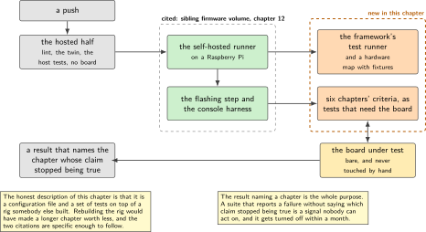
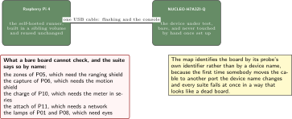
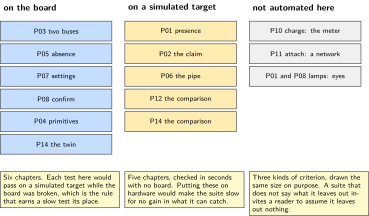
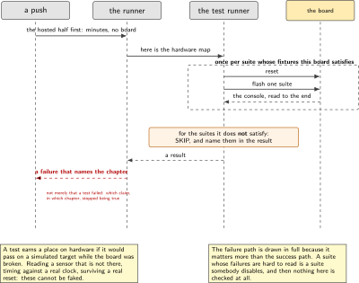
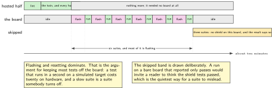

# P15. Twister on hardware, on every push

> **Target:** The NUCLEO-H7A3ZI-Q as a device under test on a Raspberry Pi 4 runner  
> **Theme:** The framework's own test runner against real hardware

> [!NOTE]
> **Where this sits in the product spine**
>
> This chapter serves no spine behaviour and is what keeps the other four true. Every claim in this volume is a claim about software that somebody will change, and a claim that is not checked after the chapter is written is a claim with a shelf life. Only the test runner is new here: the runner machine, the flashing step and the console fixtures are built in two sibling volumes and are cited.

> **Key facts**
>
> - **Boards:** A NUCLEO-H7A3ZI-Q as the device under test, attached to a Raspberry Pi 4 that is a self-hosted runner
> - **Peripherals:** The debug probe for flashing and the virtual console for reading; nothing else
> - **Toolchain:** As the front matter, plus the framework's own test runner and a hardware map
> - **Operating system:** The assertion library on the target; the runner is Linux
> - **Difficulty:** 4 of 5
> - **Effort:** 4 evenings of about four hours
> - **Deliverable:** A hardware map, tests from six chapters running on the board on every push, and a suite that fails when a chapter's claim stops being true

## Why this project

Fourteen chapters have each ended with an acceptance criterion and a command. Every one of those criteria was true on the day it was written, and none of them is true tomorrow unless something checks. This chapter is that something.

The first paragraph of this chapter is therefore a disclaimer about scope, and it is here rather than in a note because it is the chapter's shape. The machinery of continuous integration with real hardware attached already exists on this bench: the sibling firmware volume built the self-hosted runner, the flashing step and the energy rig, and the sibling Linux volume built the console fixtures. Rebuilding any of that would be duplication. What is new here is the framework's own test runner, its hardware map, and the discipline of writing tests that genuinely need the board rather than tests that happen to run on it.

That last distinction is the chapter's real content. A test that passes on a simulated target and also passes on hardware has told nobody anything about the hardware. The tests worth running on the board are the ones that touch a peripheral, depend on real timing, or exercise a path that only exists when a sensor can refuse to answer.

> [!NOTE]
> **What this chapter does not claim**
>
> The runner machine, its configuration and the flashing step are not built here. They are the sibling firmware volume's chapter 12, cited, and this chapter adds a configuration file to them.
>
> The suite runs on one board. A hardware map is designed for several, and nothing here has been tried with more than one, which is stated rather than implied by the word fleet.
>
> Not every chapter's acceptance criteria are automated. The ones needing a power meter, a radio network or a person watching a lamp are not, and the chapter lists which rather than quietly covering the easy ones and calling the suite complete.

## Prior art and what to reuse

| Source | What it gives | What it does not | Licence |
| --- | --- | --- | --- |
| The framework's own test runner and its device-testing mode | Building a suite for a target, flashing it, running it and collecting the result, driven by a hardware map | A rig, a runner machine, or any opinion about which tests deserve hardware | Apache-2.0 |
| The assertion library | Tests that run on the target itself, with setup and teardown and a readable report over the console | Anything about a host | Apache-2.0 |
| The sibling firmware volume, chapter 12 | **The self-hosted runner on a Raspberry Pi, the workflow file, the flashing step and a harness reading the board's console.** All of it, built in full there | The framework's test runner, which is this chapter | Apache-2.0 |
| The sibling Linux volume, Project 4 | Console fixtures and a network-boot arrangement for hardware in the loop | Anything about a microcontroller target | Apache-2.0 |
| The chapters of this volume | Fourteen acceptance criteria, each already written with its refutation | Automation. Turning a criterion into a test that can fail nightly is the work | Apache-2.0 |

*Table 15.1. Prior art for P15. The third row is unusually large and is the point: almost all of the infrastructure exists, and a chapter that rebuilt it would have been longer and worth less.*

## Parts from the inventory

| Part | Role | Interface |
| --- | --- | --- |
| NUCLEO-H7A3ZI-Q | The device under test. Left attached and never touched by hand once the runner is set up | USB to the runner |
| Raspberry Pi 4 | The self-hosted runner, built in the sibling firmware volume and reused unchanged | The building network |

*Table 15.2. Inventory for P15. No shield and no instrument, which bounds what this suite can check and is why the chapter lists what it cannot automate rather than leaving the omission to be inferred.*

## System architecture



*Figure 15.1. What exists already and what this chapter adds. Four boxes are cited from two sibling volumes, two are new. The figure is drawn this way because the honest description of this chapter is that it is a configuration file and a set of tests on top of somebody else's rig.*

## Configuration

```text
# hardware-map.yaml: one entry per board, and designed for more than one
- connected: true
  id: 0668FF485087534867073949
  platform: nucleo_h7a3zi_q
  product: ST-LINK
  runner: openocd
  serial: /dev/serial/by-id/usb-STMicroelectronics_STLINK-V3E...
  fixtures:
    - fixture_console          # every test needs this
    - fixture_no_shield        # the board is bare, so shield tests are skipped
```

The fixture list is the part that makes the map useful rather than decorative. A test that needs a shield declares it, the board declares what it has, and a suite run on a bare board skips those tests and says it skipped them. Without that, a suite on a bare board either fails confusingly or quietly omits a third of itself.

## Wiring



*Figure 15.2. One USB cable from the runner to the board, and that is the whole of it. The figure also records what the absence of a shield costs: the tests that are skipped, named, so that nobody reads a green suite as a complete one.*

## Memory and timing budget



*Figure 15.3. Which of the fourteen chapters have tests here, which have tests that run only on a simulated target, and which cannot be automated at all. The third column is the chapter's honest boundary and is drawn the same size as the others so that it is not overlooked.*

| Quantity | Budget | Measured | Margin |
| --- | --- | --- | --- |
| Chapters with tests on hardware | six | by construction | of fourteen |
| Chapters with tests on a simulated target only | five | by construction | no board needed |
| Criteria that cannot be automated here | three kinds | by construction | and each is named |
| Whole suite, on the board | under 10 min | not measured | not measured |
| Flash and boot, per test binary | under 20 s | not measured | not measured |
| Tests that genuinely need hardware | every one in the suite | by review | the chapter's discipline |
| A failing claim is caught | within one push | not measured | the chapter's purpose |

*Table 15.3. The budget for P15. The second and third rows are as important as the first: a suite that does not say what it leaves out invites a reader to assume it leaves out nothing, and three of the fourteen chapters here need an instrument, a network or a person.*

## Software design (UML)



*Figure 15.4. A push, and what happens to it. The two steps in the middle are cited rather than built; the two at the ends are this chapter's. The failure path matters more than the success one: a suite whose failures are hard to read is a suite that gets disabled.*

The rule that decides what goes in the suite is written down because it is easy to lose. A test earns a place on hardware if it would pass on a simulated target while the board was broken. Reading a sensor that is not there, timing something against a real clock, surviving a real reset: these cannot be faked. Checking that a state machine takes the right transition can be, and belongs on the simulated target where it runs in a second and needs no board.

```c
/* an example of a test that earns its place: it cannot pass without hardware */
ZTEST(hw_sensor, test_absent_sensor_is_reported_not_zeroed)
{
    const struct device *dev = DEVICE_DT_GET(DT_ALIAS(motion));

    /* the board in the map declares fixture_no_shield, so this test runs
     * exactly when there is nothing on the header to answer */
    zassert_false(device_is_ready(dev),
                  "a bare board reported a ready sensor, which means the "
                  "driver is inventing one");
}
```



*Figure 15.5. One push, from the hosted half to the board and back. The hosted half is minutes and needs nothing; the hardware half is dominated by flashing and resetting rather than by running. The figure is drawn to make the case for keeping most tests off the board.*

## Data flow (ASCII)

```text
  a push
     |
     v
  +--------------------------------------------------------------------------+
  | the hosted part: lint, the twin of P06, the host tests of P01 and P02,    |
  | and every test that does not need a board. Minutes, and no hardware.      |
  +--------------------------------------------------------------------------+
     |
     v
  +--------------------------------------------------------------------------+
  | the self-hosted runner: BUILT IN THE SIBLING FIRMWARE VOLUME, chapter 12. |
  | This chapter adds a configuration file to it and cites the rest.          |
  +--------------------------------------------------------------------------+
     |
     v
  +--------------------------------------------------------------------------+
  | the framework's test runner, with the hardware map:                       |
  |   for each suite that this board's fixtures satisfy:                      |
  |     build, flash, run on the board, read the console, collect             |
  |   for each suite the fixtures do NOT satisfy:                             |
  |     SKIP, and SAY SO. a silent omission is worse than a failure.          |
  +--------------------------------------------------------------------------+
     |
     v
  +--------------------------------------------------------------------------+
  | a result that names the chapter whose claim stopped being true            |
  +--------------------------------------------------------------------------+
```

## Repository layout

```text
tests/hardware/
  hardware-map.yaml               # one entry per board, fixtures declared
  sensor_absent/                  # P03 and P05: absence is reported, not zeroed
    testcase.yaml
    src/main.c
  settings_survive/               # P07: a setting survives a reset
    testcase.yaml
    src/main.c
  image_confirm/                  # P08: an unconfirmed image does not persist
    testcase.yaml
    src/main.c
  cycle_cost/                     # P04: the primitives, on the real core
    testcase.yaml
    src/main.c
  overlay_identical/              # P03: the objects of the two builds match
    testcase.yaml
  port_twin/                      # P14: the twin agrees on the second board
    testcase.yaml
  docs/what_is_not_automated.md   # three chapters, named, with the reason
  README.md
```

## Steps

**Step 1.** **Cite the runner rather than building one.** The sibling firmware volume's chapter 12 built it. This chapter's first step is to confirm it still runs and to add a configuration file, and saying so plainly is more useful than a page describing a machine that already works.

**Step 2.** **Write the hardware map, with fixtures.** The fixtures are what let one map serve a bench whose boards are not identically equipped.

**Step 3.** **Decide the rule for what goes on hardware, and write it in the suite's own notes.** A test earns a place if it would pass on a simulated target while the board was broken.

**Step 4.** **Convert the criteria of six chapters into tests, starting with the one that is hardest to fake.** Absence of a sensor is the right first one, because it is the failure every chapter in this volume warns about and the easiest to regress.

**Step 5.** **Make the suite skip loudly.** A suite that runs on a bare board and omits the shield tests must say which ones it omitted, in the result, every time.

```yaml
# testcase.yaml for a suite that needs a shield
tests:
  p05.zones.hardware:
    harness: ztest
    platform_allow: nucleo_h7a3zi_q
    fixture: fixture_shield_tof     # the bare board does not declare this,
                                    # so the run reports it as SKIPPED, by name
```

**Step 6.** **Run the whole thing by hand once, and time it.** If it takes longer than the patience of the person pushing, it will be disabled within a month, and knowing the number early is what prevents that.

**Step 7.** **Make a chapter's claim false on purpose and confirm the suite names that chapter.** This is the acceptance criterion. A suite that has never failed has not been shown to be able to.

```bash
# break P03's claim deliberately: make the application depend on the bus
sed -i 's/DT_ALIAS(motion)/DT_NODELABEL(accel_i2c)/' ../P03-two-buses/src/main.c
west twister --device-testing --hardware-map tests/hardware/hardware-map.yaml \
             -T tests/hardware
# the result must name P03. then put it back.
```

**Step 8.** **Write down what cannot be automated here, and why.** The power meter has to be in series, a radio needs a network, and a lamp needs eyes. Naming them is what keeps a green suite from being read as a complete one.

**Step 9.** **Put the whole thing on every push, and check the first failure is readable.** The failure path matters more than the success path, because a suite whose failures are hard to read is a suite somebody turns off.

## Build, flash and debug

The runner flashes and reads the console over one cable, and the commonest failure is a board that has been unplugged and plugged back into a different port, which changes the serial device name and makes every suite fail at once. The map uses the stable identifier for that reason, and the chapter says so because the symptom is alarming and the cause is trivial.

The second commonest failure is a test that passes on the runner and fails for a person, or the reverse, because the board was left in a state by the previous suite. Each suite resets the board before it starts rather than assuming the last one left it tidy, which costs twenty seconds per suite and removes an entire category of confusion.

## Verification and acceptance criteria

- **A deliberately broken claim names its chapter.** Breaking P03's portability makes the suite fail and the result says P03. *Refuted if* the failure is anonymous, which would make the suite a signal nobody can act on.
- **Skipped suites are named in the result.** *Refuted if* a run on a bare board reports only passes, which would invite a reader to think the shield tests passed.
- **Every hardware test would fail on a simulated target with a broken board.** Checked by review against the rule. *Refuted if* any test passes identically in both places, which means it does not need the board.
- **The whole suite runs in under the stated time.** *Refuted if* it is slower, and the number is reported rather than the target.
- **Each suite resets the board before starting.** *Refuted if* a suite's result depends on which suite ran before it.
- **The map survives a replug.** Using the stable identifier rather than a device name. *Refuted if* moving the cable breaks the suite.
- **What is not automated is listed.** Three kinds, with reasons. *Refuted if* the list is absent, in which case a green suite is a misleading one.
- **The runner itself is cited, not rebuilt.** *Refuted if* this chapter contains a second runner configuration.

## Variants

| Axis | This chapter | The alternative | Cost | Built in full |
| --- | --- | --- | --- | --- |
| The runner | Cited from a sibling volume | Built again here | A longer chapter worth less | Sibling firmware volume, chapter 12 |
| Console fixtures | Cited | Built again here | The same | Sibling Linux volume, Project 4 |
| Which tests run on hardware | Those that cannot be faked | All of them | A slow suite that gets disabled | Here |
| Boards without a shield | Skip, and say so | Fail, or silently omit | A green suite read as complete | Here |
| Board identity in the map | A stable identifier | A device name | Replugging breaks everything | Here |
| Energy as a test | Not here | The meter in the loop | An instrument and a chapter of its own | Sibling firmware volume, chapter 12 |
| A second board in the map | Designed for, not tried | Two boards | Honest to say which | Here, as a limitation |

*Table 15.4. Variants touching P15. Four rows are built. Three are citations, which is the correct ratio for a chapter whose value is in what it adds to an existing rig rather than in the rig.*

## Pitfalls

- **Rebuilding the runner.** It exists, it works, and a second one drifts from the first.
- **Putting every test on hardware.** The suite becomes slow, and a slow suite is a disabled suite.
- **Silent skips.** A run that omits a third of itself and reports all green is worse than one that fails.
- **A device name in the map.** The first replug breaks every suite and the symptom suggests the board has died.
- **Assuming the previous suite left the board tidy.** The resulting failures are intermittent, and the hardware is the first thing anyone suspects.
- **Automating only what is easy.** Three chapters here need an instrument, a network or a person, and a suite that quietly covers the other eleven invites exactly the wrong conclusion.
- **Never making the suite fail.** A check that has not been seen to fail has not been shown to work, and this is the chapter where that rule applies to the checker itself.

## Best practices applied

Existing infrastructure is cited rather than duplicated, and the citation is specific enough to follow. The rule for what deserves a slow test is written down rather than applied by instinct. Omissions are reported in the result, every time, so a green suite cannot be mistaken for a complete one. The board is identified by something that survives being moved. Each suite starts from a known state. And the suite is proven by being made to fail on purpose, naming the chapter whose claim stopped being true.

## Stretch goals

Add the second board of P14 to the map and confirm that the port stays true rather than having been true once. Add a nightly run that is allowed to be slower than the per-push one, which is where the suites that need a radio could eventually live. Publish the suite's duration over time, since a suite that grows ten seconds a month is a suite with a date on which it will be turned off.

## Roadmap and next steps

P16 builds on the Linux side and has a similar question to answer about what deserves a slow check. The three kinds named as unautomated remain the honest edge of this suite, and the first of them to become automatable will be the energy one, if the meter can be left in series permanently. Every chapter written after this one adds its acceptance criteria here, which is the discipline that keeps a volume of claims from becoming a volume of memories.

## Portfolio evidence

The idiom this chapter proves is **validation**: the method and its falsifier are written first, and the checker itself is proven by being made to fail. The command that proves it is

`west twister --device-testing --hardware-map tests/hardware/hardware-map.yaml -T tests/hardware`

run once with a chapter's claim deliberately broken, so that the output names the chapter rather than merely reporting a failure. Publish the hardware map, the rule for what earns a hardware test, the deliberate failure naming its chapter, and the list of what cannot be automated here.

## Sources

- The framework's own test runner and its device-testing mode, and the assertion library. Read Friday 2 October 2026.
- The sibling firmware volume, chapter 12, for the self-hosted runner, the workflow file, the flashing step and the console harness, all of which this chapter uses and none of which it rebuilds.
- The sibling Linux volume, Project 4, for the console fixtures.
- The fourteen chapters of this volume that precede it, for the acceptance criteria this suite automates and for the three it cannot.

---

[Previous](14-the-same-application-on-a-second-board.md) &nbsp;&nbsp;|&nbsp;&nbsp; [Contents](../README.md) &nbsp;&nbsp;|&nbsp;&nbsp; [Next](16-the-extensible-sdk.md)
