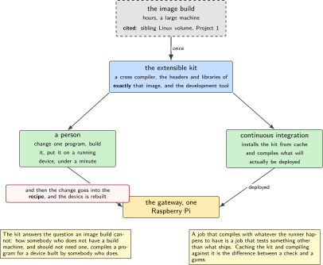
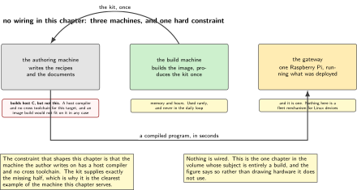
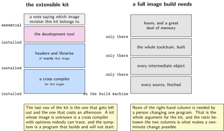
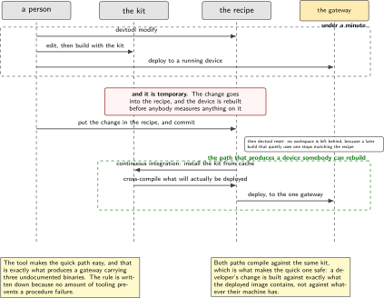
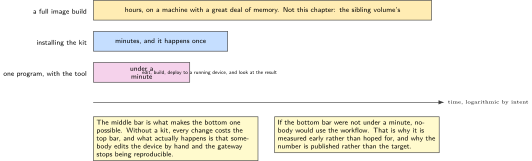

# P16. The extensible SDK, devtool, and a CI that builds with it

> **Target:** A Raspberry Pi 4 as the target, and a build host that never compiles the same thing twice  
> **Theme:** A build system's SDK, consumed outside it

> [!NOTE]
> **Where this sits in the product spine**
>
> This chapter serves no spine behaviour and belongs to the gateway rather than to the unit. The gateway of P09 runs software that somebody has to build, package and update, and this chapter is how. The image itself is a sibling volume's Project 1 and is cited rather than rebuilt.

> **Key facts**
>
> - **Board:** A Raspberry Pi 4 as the target. The build itself runs on a host with more memory and more patience
> - **Peripherals:** None. This chapter is about a build
> - **Toolchain:** The build system from the sibling Linux volume, plus its extensible software development kit and the development tool that goes with it
> - **Operating system:** Linux on both sides
> - **Difficulty:** 4 of 5
> - **Effort:** 4 evenings of about four hours
> - **Deliverable:** A recipe for the gateway software of P09, an extensible kit that a developer can use without the whole build system, and a continuous integration job that cross-compiles with a cached kit and deploys

## Why this project

The gateway in P09 is a Raspberry Pi running a broker, an image store and a host client written in C. On this bench it was installed by hand, which is fine for one gateway and impossible for twenty. This chapter is the part of the volume that treats the gateway as a product rather than as a convenience.

The specific question is narrower than it sounds. Building a whole image is slow, needs a powerful machine, and is the sibling volume's subject. What a person actually does day to day is change one program and want it on a device in a minute, and the mechanism for that is a kit extracted from the image build: a cross-compiler, the headers and libraries of exactly that image, and a tool that can put a modified program onto a running device without rebuilding anything else.

The second half is making continuous integration use the same kit. A build that compiles the gateway's C with whatever the runner happens to have is a build that does not test what will be deployed. Caching the kit and compiling against it is the difference between a check and a guess.

> [!NOTE]
> **What this chapter does not claim**
>
> The image itself is not built here. The sibling Linux volume's Project 1 builds it, including its standard kit, and this chapter cites that and extends it. The chapter's own contribution is the extensible kit, the recipe for the gateway software, and the continuous integration consumer.
>
> No image is built on the authoring laptop. It has a host compiler and builds host C perfectly well, so the gap is narrower and more specific than it sounds: it has no cross toolchain for this target, and an image build would not fit on it in any case. That is exactly the gap a kit closes, which makes the authoring laptop the clearest example of the machine this chapter is written for.
>
> The deployment at the end of this chapter is to one Raspberry Pi over the building network. Nothing here is a fleet deployment mechanism for Linux devices; P09 does that for firmware images and the Linux equivalent is deliberately out of scope.

## Prior art and what to reuse

| Source | What it gives | What it does not | Licence |
| --- | --- | --- | --- |
| The sibling Linux volume, Project 1 | **The image and the standard kit**, built in full, including the step that installs the kit and compiles against it | The extensible kit and the development tool workflow, which are this chapter | Apache-2.0 |
| The build system's manual, the kit chapters | How a kit is produced, what it contains, and the difference between the standard and the extensible one | A recipe for this volume's gateway software, and any opinion about continuous integration | CC-BY-2.0-UK |
| The development tool that accompanies the extensible kit | Modifying a recipe, building one program, and deploying it to a running target without rebuilding an image | Discipline. It is easy to use in a way that leaves a device nobody can reproduce, and the chapter says how to avoid that | MIT |
| P09, in this volume | The software the recipe packages: the broker configuration, the image store layout and the host client in C | Packaging | Apache-2.0 |
| P19, in this volume | A tunnel daemon that the same layer eventually packages, which is why the layer is built for more than one program from the start | Anything about this chapter | GPL-2.0 for the daemon |

*Table 16.1. Prior art for P16. The first row is most of the infrastructure and is cited precisely, because the boundary between an image build and a kit consumed outside it is exactly where this chapter begins.*

## Parts from the inventory

| Part | Role | Interface |
| --- | --- | --- |
| Raspberry Pi 4 | The target. The gateway of P09, which this chapter learns to rebuild rather than hand-install | The building network |
| A build machine | Produces the kit. Not the authoring laptop, which builds host C but has no cross toolchain for this target and could not fit an image build | The building network |

*Table 16.2. Inventory for P16. No board, no shield and no instrument: this is the one chapter in the volume whose subject is entirely a build, and the inventory says so rather than listing hardware it does not use.*

## System architecture



*Figure 16.1. Where the kit comes from and who consumes it. The image build is drawn as a citation rather than as a box this chapter owns. Two consumers matter: a person changing one program, and a continuous integration job that must compile what will actually be deployed.*

The structure answers one question that the image build cannot: how a person who does not have a build machine, and should not need one, compiles a program that will run on a device built by somebody who does. The kit is the answer, and the reason it is extensible rather than standard is that the development tool can then put the result on a running device in a minute.

## Configuration

```text
# meta-gateway/recipes-gateway/gateway/gateway_1.0.bb
SUMMARY = "The gateway software of this volume"
LICENSE = "MIT"
LIC_FILES_CHKSUM = "file://LICENSE;md5=..."

SRC_URI = "git://example.invalid/gateway.git;protocol=https;branch=main"
SRCREV = "<an exact commit, never a branch name>"

DEPENDS = "mosquitto openssl"
RDEPENDS:${PN} = "mosquitto"

inherit cmake systemd

SYSTEMD_SERVICE:${PN} = "gateway.service"
```

The revision is an exact commit rather than a branch, for the same reason the operating system's revision is pinned in the front matter. A recipe that follows a branch produces a different image every time it is built, and an image whose contents depend on when it was built is an image nobody can reproduce when something goes wrong.

## Wiring



*Figure 16.2. There is none. The figure records the three machines involved and what each can and cannot do, because the constraint that shapes this chapter is that the machine the author writes on has a host compiler and no cross toolchain for this target.*

## Memory and timing budget



*Figure 16.3. What the kit contains and what it costs, beside a full image build. The ratio is the chapter's argument: a kit is large and a full build is far larger, and the difference is what makes a one-minute change possible.*

| Quantity | Budget | Measured | Margin |
| --- | --- | --- | --- |
| Full image build, cold | hours | not measured | the sibling volume's |
| Extensible kit, produced once | under 2 GB installed | not measured | not measured |
| Kit installation on a developer machine | under 10 min | not measured | not measured |
| One program rebuilt with the kit | under 1 min | not measured | the chapter's point |
| Deploy to a running target | under 30 s | not measured | not measured |
| Continuous integration, kit cached | under 5 min | not measured | not measured |
| Continuous integration, kit not cached | the installation time, added | not measured | why it is cached |
| Recipes written here | two, and a layer | by construction | for more than one program |

*Table 16.3. The budget for P16. The fourth row is the whole justification: if changing one program takes as long as building an image, nobody uses the kit and everybody edits the device by hand, which is how a gateway becomes impossible to reproduce.*

## Software design (UML)



*Figure 16.4. Two paths to a changed program on a device. The upper one is the development tool, used by a person; the lower is continuous integration, used by nobody. They share the kit, which is what makes the first one safe: a developer's quick change is compiled against exactly what the deployed image contains.*

The discipline that the development tool needs is one rule, stated plainly because the tool makes it easy to break. Anything deployed with it is temporary. The change goes back into the recipe and the layer, and a device that has had a program pushed onto it is rebuilt from the image before anybody measures anything on it. A gateway carrying three undocumented binaries is a gateway whose behaviour nobody can explain, and the tool's convenience is exactly what produces that if the rule is not written down.



*Figure 16.5. Three ways to get a changed program onto the gateway, at one scale. A full image build is hours, a kit install is minutes and happens once, and a change with the development tool is under a minute. The middle bar is why the right-hand one is possible at all.*

## Data flow (ASCII)

```text
  the build machine                        CITED: the sibling Linux volume's
  +---------------------------+            Project 1 builds the image and the
  | the image build           |  <-------- standard kit. This chapter does not
  | bitbake, hours, a lot of  |            rebuild either of them.
  | memory                    |
  +---------------------------+
             |
             | populate_sdk_ext, once
             v
  +--------------------------------------------------------------------------+
  | the EXTENSIBLE kit: a cross compiler, the headers and libraries of EXACTLY |
  | that image, and the development tool                                      |
  +--------------------------------------------------------------------------+
         |                                         |
         v                                         v
  +-------------------------+        +-------------------------------------+
  | a person                |        | continuous integration              |
  |  devtool modify         |        |  install the kit from cache         |
  |  edit, build, deploy    |        |  cross-compile the gateway's C      |
  |  ONE MINUTE             |        |  run the tests that need no device  |
  |                         |        |  deploy to the one Pi               |
  |  and then: put the      |        |                                     |
  |  change in the RECIPE   |        |  compiles what will be DEPLOYED,    |
  |  and rebuild properly   |        |  not what the runner happens to have|
  +-------------------------+        +-------------------------------------+
```

## Repository layout

```text
gateway/
  meta-gateway/                   # one layer, built for more than one program
    conf/layer.conf
    recipes-gateway/gateway/gateway_1.0.bb
    recipes-gateway/gateway/files/gateway.service
    recipes-vpn/openvpn/          # P19's daemon, packaged by the same layer
  sdk/
    install-sdk.sh                # idempotent; reports if already installed
    README.md                     # which image this kit belongs to, exactly
  ci/
    build-with-sdk.sh             # the job: install from cache, compile, test
    deploy.sh                     # to one target, and only one
  docs/
    devtool_rules.md              # anything deployed this way is temporary
    reproducing.md                # how to get back to a known device
  README.md
```

## Steps

**Step 1.** **Start from the image the sibling volume builds, and say which revision.** A kit belongs to an image. A kit whose image is unknown is a cross-compiler with opinions nobody can trace.

**Step 2.** **Produce the extensible kit, not the standard one.** The standard kit is already built in the sibling volume's Project 1 and is cited; the extensible one carries the development tool, which is the reason this chapter exists.

```bash
bitbake gateway-image -c populate_sdk_ext
# the installer lands in tmp/deploy/sdk/ and is what everyone else consumes
```

**Step 3.** **Write the layer for more than one program from the start.** The gateway software now, the tunnel daemon of P19 later. A layer built for exactly one recipe is a layer that gets copied rather than extended.

**Step 4.** **Pin the source revision to a commit.** A recipe that follows a branch produces a different image every time, and reproducing a problem then becomes archaeology.

**Step 5.** **Install the kit on a machine that cannot build an image, and compile the gateway there.** This is the demonstration: the person compiling does not have, and does not need, the build machine.

```bash
./sdk/install-sdk.sh --dir ~/gateway-sdk
. ~/gateway-sdk/environment-setup-*
cmake -B build -S . && cmake --build build       # cross-compiled, in seconds
```

**Step 6.** **Use the development tool to put a change on a running device, and time it.** If it is not under a minute the workflow will not be used, and the number is what tells you early.

```bash
devtool modify gateway
# edit, then:
devtool build gateway && devtool deploy-target gateway root@gateway-01
```

**Step 7.** **Write the rule about temporary deployments, and put it where somebody will read it.** Anything deployed with the tool is temporary; the change goes into the recipe, and the device is rebuilt before anybody measures anything on it.

**Step 8.** **Make continuous integration install the kit from a cache and compile with it.** A job that compiles with whatever the runner has is a job that tests something other than what will be deployed.

```yaml
# ci/build-with-sdk.sh, as a workflow step
- name: the kit, from cache
  uses: actions/cache@v4
  with:
    path: ~/gateway-sdk
    key: sdk-${{ hashFiles('sdk/VERSION') }}   # the image revision, not a date
- name: compile what will be deployed
  run: ./ci/build-with-sdk.sh
```

**Step 9.** **Prove the cache matters by clearing it once and comparing the times.** A cache nobody has measured is a cache nobody can justify keeping.

**Step 10.** **Deploy to the one Pi, and say that it is one.** Nothing here is a fleet mechanism for Linux devices, and the chapter does not imply one by using the plural.

## Build, flash and debug

The commonest failure is a kit that does not match the image on the device, which presents as a program that builds perfectly and will not start. The kit's own notes record which image revision it belongs to, and the installation script prints it, which turns a confusing afternoon into a line of output.

The second commonest is a development tool workspace left in place. The tool takes a recipe out of the layer and into a working area, and a later build that quietly uses the working area rather than the recipe produces results nobody can reproduce. Resetting the workspace when a change is finished is part of the rule about temporary deployments and is written in the same document.

## Verification and acceptance criteria

- **A machine that cannot build an image can compile the gateway.** *Refuted if* the compilation needs anything from the build machine beyond the kit.
- **One program is rebuilt and deployed in under a minute.** *Refuted if* it takes longer, and the number is reported rather than the target, because a slow workflow is one nobody uses.
- **The kit names its image revision, and the installer prints it.** *Refuted if* a kit can be installed without knowing which image it belongs to.
- **The recipe pins a commit.** *Refuted if* it follows a branch, which would make two builds of the same recipe different.
- **Continuous integration compiles with the kit, not with the runner's own compiler.** *Refuted if* removing the kit still produces a passing build, which would mean the kit is not actually being used.
- **The cache is shown to matter.** Cleared once, the job takes measurably longer. *Refuted if* the difference is negligible, in which case the cache is complexity for nothing.
- **A device that has had a program pushed onto it is rebuilt before measurement.** Checked by procedure rather than by code, and the document says so. *Refuted if* any measurement in this volume was taken on a device in that state.
- **The layer holds more than one recipe.** *Refuted if* it holds one, which means the next program will get its own layer and a copy of this one's configuration.

## Variants

| Axis | This chapter | The alternative | Cost | Built in full |
| --- | --- | --- | --- | --- |
| The image | Cited | Built again here | Hours, and a sibling volume's subject | Sibling Linux volume, Project 1 |
| The kit | Extensible, with the tool | Standard only | No one-minute change, so hand edits instead | Here |
| Source revision | A pinned commit | A branch | Two builds of one recipe that differ | Here |
| Layer scope | More than one program | One recipe | The next program copies this layer | Here |
| Continuous integration | Compiles with the kit | With the runner's compiler | Tests something other than what ships | Here |
| Quick deployments | Temporary, by written rule | Permanent in practice | A device nobody can reproduce | Here |
| Fleet deployment for Linux | Not here | Images and a rollout | A chapter, and a different one from P09 | Named, not built |

*Table 16.4. Variants touching P16. Five rows are built. The sixth is a rule rather than code, which is unusual in this volume and is the honest form: the failure it prevents is a procedure failure and no amount of tooling prevents it.*

## Pitfalls

- **A kit that does not name its image.** The symptom is a program that builds and will not start, and the cause takes an afternoon to find.
- **A recipe that follows a branch.** Two builds of the same recipe then differ, and reproducing a problem becomes archaeology.
- **Leaving a development tool workspace in place.** Later builds silently use it, and the device stops matching the recipe.
- **Treating a quick deployment as finished work.** The change has to go back into the recipe or the device becomes unreproducible, one convenience at a time.
- **Compiling in continuous integration with the runner's own compiler.** It passes, and it tests something other than what will be deployed.
- **One recipe per layer.** The next program copies the layer, and then there are two configurations to keep in step.
- **Measuring anything on a device that has been hand-modified.** Every number taken there belongs to a system nobody can rebuild.

## Best practices applied

The image build is cited rather than repeated, and the citation names the volume and the project. The kit records which image it belongs to and the installer says so out loud. Sources are pinned to commits so that a build is reproducible rather than merely repeatable. The layer is built for the second program before the second program exists. Continuous integration compiles against what will be deployed. And the one failure that tooling cannot prevent is addressed with a written rule placed where somebody will read it.

## Stretch goals

Measure how long a full image build takes on the build machine and publish it beside the one-minute figure, which makes the argument for the kit a ratio rather than an assertion. Add the tunnel daemon of P19 to the same layer and confirm that nothing in the layer's configuration had to change. Produce a second kit from a newer image and check that a program built with the old kit is refused rather than quietly running, which is the failure mode worth catching early.

## Roadmap and next steps

P19 packages its tunnel daemon with the layer built here, which is the test of whether the layer was built for more than one program. P17 handles the first boot and the decommission of a Linux unit, which is the other half of treating a Linux device as a product. And the sibling Linux volume's Project 19 remains the place where the Linux update mechanism lives, which this volume cites rather than rebuilding.

## Portfolio evidence

The idiom this chapter proves is **maintainability**: a device's software is described by recipes in a layer rather than by what somebody installed, and a change to it is a commit rather than a session. The command that proves it is

`./sdk/install-sdk.sh --dir ~/gateway-sdk && . ~/gateway-sdk/environment-setup-* && ./ci/build-with-sdk.sh`

which installs the kit on a machine that cannot build an image, prints the image revision the kit belongs to, and cross-compiles the gateway software that will actually be deployed. Publish the layer, the pinned recipe, the measured one-minute change, and the written rule about temporary deployments.

## Sources

- The sibling Linux volume, Project 1, for the image and the standard kit, both built in full there and cited here.
- The build system's manual, the chapters on the standard and extensible kits and on the development tool workflow. Read Friday 2 October 2026.
- P09 in this volume, for the gateway software that this chapter packages.
- P19 in this volume, for the second program the layer is built to hold before that program exists.

---

[Previous](15-twister-on-hardware.md) &nbsp;&nbsp;|&nbsp;&nbsp; [Contents](../README.md) &nbsp;&nbsp;|&nbsp;&nbsp; [Next](17-first-boot.md)
