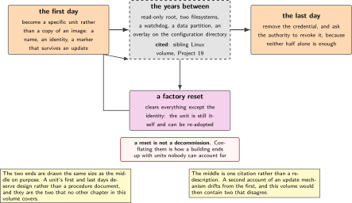
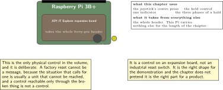
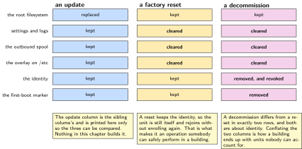
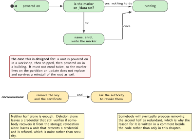
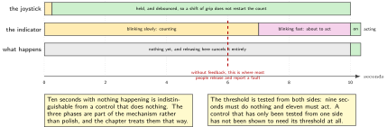

# P17. First boot, factory reset, decommission

> **Target:** A Raspberry Pi 3B+ with the Explorer expansion board, whose joystick is the held button  
> **Theme:** The first day and the last day of a unit

> [!NOTE]
> **Where this sits in the product spine**
>
> This chapter serves no spine behaviour. It covers the two days of a unit's life that no other chapter does: the day it is installed and the day it is removed. The update that fills the years in between belongs to a sibling volume and is cited, not rebuilt.

> **Key facts**
>
> - **Board:** A Raspberry Pi 3B+ with the JOY-iT Explorer expansion board, whose joystick is the only physical control in this volume
> - **Peripherals:** The joystick as the held button; one indicator for what the hold is doing; the data partition where a credential lives
> - **Toolchain:** As the front matter, plus the layer of P16 for packaging
> - **Operating system:** Linux
> - **Difficulty:** 4 of 5
> - **Effort:** 4 evenings of about four hours
> - **Deliverable:** A unit that configures itself on first boot, that can be returned to a known state by somebody holding a control for ten seconds, and that can be removed from service with its credential provably gone

## Why this project

A device has three phases and most engineering attention goes to the middle one. P08 and P09 handle the years when a unit is running and being updated, and the sibling Linux volume handles the same for a Linux unit. What neither covers is the first ten minutes, when a unit is powered on in a building for the first time and has to become a specific unit rather than a copy of an image; and the last ten minutes, when it is taken out and must not leave anything behind that would let somebody else speak as it.

Both of those are more interesting than they look. First boot has to be idempotent, because the first boot sometimes happens twice: a unit is powered on in a workshop, then shipped, then powered on again. Decommission has to be provable, because a credential that is deleted in a way nobody can verify has not been deleted as far as anybody auditing is concerned.

The chapter also contains the only physical control in this volume, and that is deliberate. Every other chapter's interface is a message, a console or a lamp. A factory reset cannot be a message, because the situation that calls for one is usually a unit that cannot be reached, and a control that can be reached only through the thing that is broken is not a control.

> [!NOTE]
> **What this chapter does not claim**
>
> The update mechanism, the read-only root filesystem, the watchdog and the overlay on the configuration directory are all built in the sibling Linux volume's Project 19. This chapter uses them and cites them, and the figure draws them as somebody else's.
>
> Wiping a credential provably is done with the tools the filesystem offers and the chapter states their limits rather than claiming the data is unrecoverable. On flash storage with wear levelling, overwriting a file does not reliably overwrite the blocks that held it, and the honest answer is that the credential is revoked at the authority as well, which is what actually makes it useless.
>
> The joystick is a control on an expansion board, not an industrial reset switch. It is the right shape for the demonstration and the chapter does not pretend it is the right part for a product.

## Prior art and what to reuse

| Source | What it gives | What it does not | Licence |
| --- | --- | --- | --- |
| The sibling Linux volume, Project 19 | **The read-only root, the two filesystems, the watchdog, the data partition and the overlay on the configuration directory.** All of it | First boot and decommission, which that chapter does not cover and this one does | Apache-2.0 |
| The system and service manager's first-boot facilities | A documented way to run something exactly once on a new instance, with the state recorded where a reinstall clears it | Idempotence under the awkward case, where the same unit boots first in a workshop and then in a building | LGPL-2.1 |
| P13, in this volume | The enrolment this chapter triggers, and the revocation that makes a decommission meaningful | Any opinion about when enrolment should happen | Apache-2.0 |
| P16, in this volume | The layer that packages the two services written here | The services | Apache-2.0 |
| The expansion board's documentation | The joystick's pins and its behaviour | A debounce, or a ten second hold, both of which are written here | Vendor |
| Published guidance on sanitising storage | The vocabulary, and the finding that overwriting a file on flash with wear levelling does not reliably overwrite the blocks | A method that works on this hardware, which is why the chapter's answer is revocation as well as deletion | Published |

*Table 17.1. Prior art for P17. The first row is the whole middle of a device's life and is cited in one line, which is the correct treatment: a chapter about the first and last days should not re-describe the years between them.*

## Parts from the inventory

| Part | Role | Interface |
| --- | --- | --- |
| Raspberry Pi 3B+ | The unit. A third Linux machine, so that the gateway and the authority can stay where they are | The building network |
| JOY-iT Explorer expansion board | Its joystick is the held control and one of its indicators shows what the hold is doing | The 40-pin header, and it takes the whole of it |

*Table 17.2. Inventory for P17. The expansion board occupies the entire header, so this Pi carries nothing else for the whole chapter, which is the one-expansion-board rule of this bench applied rather than restated.*

## System architecture



*Figure 17.1. Three phases, and who owns each. The middle one is drawn as a citation. The two at the ends are this chapter, and the figure puts them at the same size as the middle to make the point that a unit's first and last days deserve design rather than a procedure document.*

## Configuration

```text
# the two services this chapter adds, packaged by the layer of P16
first-boot.service    runs once on an instance with no identity;
                      idempotent, because a unit sometimes boots first in a
                      workshop and then again in the building
reset-hold.service    watches the joystick, and acts on a ten second hold

# and what this chapter does NOT add, because Project 19 of the sibling volume
# already has them: the read-only root, the two filesystems, the watchdog, the
# data partition, and the overlay on the configuration directory.
```

```text
# what lives where, which is the whole of the design
/           read-only, replaced wholesale by an update       (sibling volume)
/etc        an overlay on the read-only root                  (sibling volume)
/data       survives updates; holds the identity and settings (sibling volume)
/data/id/   the key and the certificate of P13                (this chapter writes)
/data/first-boot-done                                          (this chapter writes)
```

## Wiring



*Figure 17.2. The expansion board on the header, with the joystick's centre press as the held control and one indicator showing the three phases of a hold. The figure names which pins the board takes, because it takes all of them and nothing else fits on this Pi for the rest of the chapter.*

A hold needs feedback or nobody completes it. Ten seconds is a long time to hold a control with nothing happening, and the usual outcome is that somebody releases it at six and concludes the reset does not work. The indicator therefore shows three phases: counting, about to act, and acting, and the chapter treats that as part of the mechanism rather than as decoration.

## Memory and timing budget



*Figure 17.3. What survives each of the three operations. An update replaces the root and keeps the data partition; a factory reset keeps the identity and clears everything else; a decommission removes the identity too. The figure is a truth table in a picture, and the three columns differ in exactly one row each.*

| Quantity | Budget | Measured | Margin |
| --- | --- | --- | --- |
| First boot, powered on to enrolled | under 3 min | not measured | not measured |
| First boot run twice | no second enrolment | by construction | idempotence |
| Hold to trigger a reset | 10 s | by construction | a design choice |
| Feedback phases during the hold | three | by construction | or nobody completes it |
| Factory reset, start to ready | under 2 min | not measured | not measured |
| Identity after a factory reset | kept | by construction | the unit is still itself |
| Identity after a decommission | removed, and revoked | by construction | both, and the chapter says why |
| Accidental resets in normal use | zero | not measured | the reason for ten seconds |

*Table 17.3. The budget for P17. The last two rows are the pair that matter: a factory reset that keeps the identity leaves a unit that is still itself and can be re-adopted, while a decommission removes it, and conflating the two is the commonest way a building ends up with units nobody can account for.*

## Software design (UML)



*Figure 17.4. First boot, with the one case that makes it awkward. A unit powered on in a workshop and again in a building must not enrol twice, and the marker that prevents it lives on the partition an update does not replace, which is why it works across a reinstall as well.*

Decommission has two halves and only one of them is on the device. The device removes its key and certificate; the authority revokes them. Doing only the first leaves a credential that still verifies if somebody recovers it from the storage; doing only the second leaves a unit that will still present a credential and be refused, which is noise rather than security. The chapter does both and says why neither alone is enough.

```c
/* decommission: on the device, and then at the authority. Neither alone. */
int decommission(void)
{
    int rc = 0;

    rc |= cred_overwrite_and_remove("/data/id/key.pem");
    rc |= cred_overwrite_and_remove("/data/id/cert.pem");
    rc |= unlink("/data/first-boot-done");
    sync();

    /* and the half that actually makes the credential useless, because
     * overwriting a file on flash with wear levelling does not reliably
     * overwrite the blocks that held it */
    rc |= request_revocation_at_authority(unit_id());
    return rc;
}
```



*Figure 17.5. Ten seconds of holding a control, and what the indicator does. The three phases exist because ten seconds with no feedback is indistinguishable from a control that does nothing, and the usual result is somebody releasing at six and reporting a fault.*

## Data flow (ASCII)

```text
  FIRST BOOT                         the awkward case this is designed for:
  +-------------------------------+  a unit is powered on in a workshop, then
  | is /data/first-boot-done set? |  shipped, then powered on in a building.
  |   yes -> nothing to do        |  it must NOT enrol twice.
  |   no  -> set a machine name   |
  |          enrol  (P13)         |
  |          write the marker     |
  +-------------------------------+

  FACTORY RESET, held for ten seconds with feedback at three phases
  +-------------------------------------------------------------------------+
  | clear settings, logs, spools, the overlay on the configuration directory |
  | KEEP the identity: the unit is still itself and can be re-adopted        |
  +-------------------------------------------------------------------------+

  DECOMMISSION, commanded, never a hold
  +-------------------------------------------------------------------------+
  | everything a factory reset does, AND                                     |
  | remove the key and the certificate                                       |
  | AND ask the authority to revoke them, because deletion alone is not      |
  |   provable on flash with wear levelling                                  |
  +-------------------------------------------------------------------------+
```

## Repository layout

```text
projects/P17-first-and-last/
  services/
    first-boot.service
    first-boot.sh                 # idempotent, and the marker is on /data
    reset-hold.service
    reset-hold.c                  # the joystick, debounced, with feedback
  src/
    decommission.c                # both halves, and a comment saying why
  recipes/                        # packaged by the layer of P16
    first-and-last_1.0.bb
  tests/
    test_idempotent.sh            # boot twice, enrol once
    test_hold.sh                  # nine seconds does nothing, eleven acts
    test_survives.sh              # what each operation keeps, as a table
  docs/
    three_operations.md           # reset is not decommission, and why it matters
    what_project19_owns.md        # the citation, in one page
  README.md
```

## Steps

**Step 1.** **Write down the difference between a factory reset and a decommission before writing either.** One keeps the identity and one removes it. Conflating them is how a building ends up with units nobody can account for, and the distinction is a paragraph rather than a design.

**Step 2.** **Put the first-boot marker on the partition an update does not replace.** It then survives a reinstall of the root, which is the awkward case: a unit that has been updated has not become a new unit.

**Step 3.** **Make first boot idempotent and test it by running it twice.** The workshop-then-building case is not hypothetical and is the one that produces two certificates for one unit.

```bash
# tests/test_idempotent.sh
systemctl start first-boot && systemctl start first-boot
test "$(ls /data/id/*.crt | wc -l)" -eq 1 || exit 1
```

**Step 4.** **Debounce the joystick before timing anything.** A mechanical control bounces, and a ten second timer started by a bounce is a timer that restarts whenever somebody shifts their grip.

**Step 5.** **Give the hold three phases of feedback.** Counting, about to act, acting. Without it somebody releases at six seconds and reports that the reset does not work.

```c
/* reset-hold.c: the feedback is part of the mechanism, not decoration */
static void on_hold_tick(unsigned held_ms)
{
    if      (held_ms < 7000)  { led_blink_slow(); }   /* counting */
    else if (held_ms < 10000) { led_blink_fast(); }   /* about to act */
    else                      { led_on(); factory_reset(); }
}
```

**Step 6.** **Test the boundary in both directions.** Nine seconds does nothing and eleven acts. A control whose threshold has only been tested from one side has not been tested.

**Step 7.** **Make a factory reset keep the identity, and prove it.** After the reset the unit still has its key and certificate and rejoins without enrolling again.

**Step 8.** **Make a decommission do both halves.** Remove the credential and ask the authority to revoke it. Write the reason for the second half in a comment, because somebody will eventually propose removing it as redundant.

**Step 9.** **State the limit of deletion rather than overclaiming.** On flash with wear levelling, overwriting a file does not reliably overwrite the blocks. The chapter says so and points at revocation as the thing that actually makes the credential useless.

**Step 10.** **Measure how long a unit takes from powered on to enrolled, and publish it.** A commissioning engineer walking a building needs that number more than any other in this chapter.

## Build, flash and debug

The two services are packaged by the layer of P16, which is the test of whether that layer was built for more than one program. If anything in the layer's configuration had to change to accept them, P16's claim was wrong and this chapter reports it.

The commonest failure is a first boot that runs on every boot, which happens when the marker is written somewhere an update replaces. The symptom is a unit that enrols repeatedly and accumulates certificates at the authority, and it is caught by the idempotence test rather than by noticing the certificate count six months later.

## Verification and acceptance criteria

- **First boot run twice enrols once.** *Refuted if* a second certificate appears, which is the failure that fills an authority with duplicates.
- **The marker survives an update.** Install a new root and confirm first boot does not run again. *Refuted if* it does, which would mean the marker is on the wrong partition.
- **Nine seconds does nothing and eleven acts.** Both directions tested. *Refuted if* only one is.
- **The hold gives feedback at three phases.** *Refuted if* the control is silent, in which case the mechanism will be reported as broken by the first person to use it.
- **A bounce does not restart the timer.** *Refuted if* shifting a grip resets the count.
- **A factory reset keeps the identity.** The unit rejoins without enrolling. *Refuted if* it enrols again, which means the reset was a decommission.
- **A decommission removes the credential and revokes it.** Both, checked at the device and at the authority. *Refuted if* either half is missing.
- **The limit of deletion is stated.** *Refuted if* the chapter claims the credential is unrecoverable from the storage.
- **The layer of P16 accepted two more recipes unchanged.** *Refuted if* its configuration had to be edited, and then P16's claim is weakened and this chapter says so.

## Variants

| Axis | This chapter | The alternative | Cost | Built in full |
| --- | --- | --- | --- | --- |
| The years in between | Cited | Built again here | A sibling volume's subject, re-described | Sibling Linux volume, Project 19 |
| First boot marker | On the data partition | On the root | It runs again after every update | Here |
| Reset trigger | A held physical control | A message | The situation that needs it is a unit that cannot be reached | Here |
| Hold feedback | Three phases | None | Somebody releases at six seconds and reports a fault | Here |
| Reset and decommission | Two operations | One | Units nobody can account for | Here |
| Credential removal | Deletion **and** revocation | Deletion alone | A credential that still verifies if recovered | Here |
| Provable erasure | Not claimed | Asserted | An overclaim about flash with wear levelling | Here, by stating the limit |

*Table 17.4. Variants touching P17. Five rows are built, and the last is built by refusing to claim something, which in a chapter about decommissioning is the most useful row in the table.*

## Pitfalls

- **A first-boot marker on the root filesystem.** Every update makes the unit new again, and the authority slowly fills with certificates for one device.
- **A hold with no feedback.** Ten seconds is long, and the first person to try it will release early and report that it does not work.
- **An undebounced control.** The timer restarts whenever somebody shifts their grip, which looks like an intermittent fault.
- **One operation for reset and decommission.** A unit that was reset but has been accounted for as removed is the worst of both.
- **Deleting a credential and calling it gone.** On flash with wear levelling the blocks may still hold it, and revocation is what actually ends its usefulness.
- **Testing a threshold from one side.** A control that acts at eleven seconds and also at four has not been shown to need ten.
- **Re-describing the update mechanism.** It belongs to a sibling volume and a second description of it will drift from the first.

## Best practices applied

The two operations that look alike are separated and the difference is written down first. State that must survive an update is placed where an update does not reach, which is the same structural argument P07 made for the microcontroller unit. A physical control is used where a message would not reach. Feedback is treated as part of a mechanism rather than as polish. A threshold is tested from both sides. And the one claim that would be impressive and unsupportable, that deleted data is gone, is replaced by a statement of the limit plus the step that actually makes the credential useless.

## Stretch goals

Measure the enrolment time across ten units and report the distribution, which is what a commissioning engineer actually plans a day around. Add a second physical control for decommission that requires both to be held at once, which is how a real product prevents the operation that cannot be undone. Record what a decommissioned unit's storage still contains after the overwrite, using whatever the filesystem allows, and publish it as the honest measure of what deletion achieved.

## Roadmap and next steps

P13 is both the start and the end of this chapter: it supplies the enrolment first boot triggers and the revocation decommission requests. P16's layer carries the two services and is tested by doing so. And the sibling Linux volume's Project 19 remains the owner of everything between the first day and the last, which this chapter has deliberately cited in one line rather than retold.

## Portfolio evidence

The idiom this chapter proves is **reliability**, applied to the two operations nobody rehearses: first boot is idempotent under the awkward case, and the operation that cannot be undone is separated from the one that can. The command that proves it is

`sh tests/test_idempotent.sh && sh tests/test_hold.sh && sh tests/test_survives.sh`

which boots the first-boot service twice and checks that one certificate exists, tests the hold threshold from both sides, and prints the table of what each of the three operations keeps and removes. Publish that table, the hold's three feedback phases, the decommission with its comment about why deletion alone is insufficient, and the measured time from powered on to enrolled.

## Sources

- The sibling Linux volume, Project 19, for the read-only root, the two filesystems, the watchdog, the data partition and the overlay on the configuration directory, all cited and none rebuilt.
- The system and service manager's documentation on first-boot facilities, read on Friday 2 October 2026, and the awkward case it does not cover.
- P13 in this volume, for the enrolment this chapter triggers and the revocation it requests.
- P16 in this volume, for the layer that packages the two services written here.
- The expansion board's documentation, for the joystick's pins; the debounce and the hold are written in this chapter.
- Published guidance on sanitising storage, for the finding that overwriting a file on flash with wear levelling does not reliably overwrite the blocks that held it.

---

[Previous](16-the-extensible-sdk.md) &nbsp;&nbsp;|&nbsp;&nbsp; [Contents](../README.md) &nbsp;&nbsp;|&nbsp;&nbsp; [Next](18-canopen-on-a-real-wire.md)
