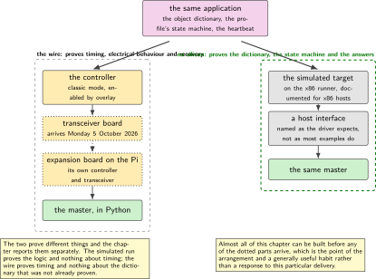
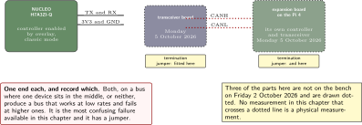
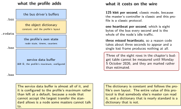
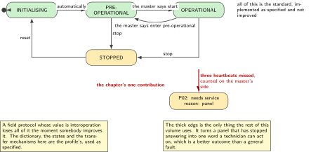
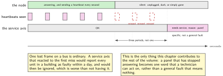

# P18. CANopen on a real wire, and on no wire at all

> **Target:** The NUCLEO-H7A3ZI-Q through a transceiver to an expansion board on a Raspberry Pi 4  
> **Theme:** A field protocol, and what a silent node means

> [!NOTE]
> **This is the plus, not the device**
>
> This chapter exists because a requirement list asked for it, not because the device in this volume needs a field bus. It earns its place in one specific way, described below: a panel that has stopped answering is a real service fault, and this is the only chapter that can produce that reason code honestly. Everything else here is a standard profile implemented carefully and nothing more.

> **Key facts**
>
> - **Boards:** NUCLEO-H7A3ZI-Q as the node, a Raspberry Pi 4 as the master. A transceiver board between the Nucleo and the wire
> - **Peripherals:** The controller on the processor, in classic mode; an expansion board on the Pi with its own controller and transceiver
> - **Toolchain:** As the front matter, plus the profile implementation as a module and a host-side stack on the Pi
> - **Operating system:** The same, on the node; the simulated target on the continuous integration runner
> - **Difficulty:** 5 of 5
> - **Effort:** 5 evenings of about four hours
> - **Deliverable:** A node with an object dictionary that a master can read, a heartbeat whose absence means something specific, and the same application running with no wire at all on the runner

## Why this project

The honest answer is that a requirement list named this protocol, and a portfolio that covers a requirement list should cover it. The chapter says so in its first box rather than inventing a product reason.

Having said that, there is one place where it genuinely belongs. A unit of the kind this volume describes may have a control panel, and a panel talks to the rest of the unit over a wire rather than over the air. When a panel stops answering, the service axis of P02 should report a specific reason rather than a general fault, and a field bus with a heartbeat is the mechanism that makes the difference between a panel that is dark and a panel that is unplugged visible to software. That is a real contribution and it is one reason code.

The second reason the chapter is worth writing is the arrangement rather than the protocol. Three of the four parts it needs arrive on Monday 5 October 2026, and the chapter is designed so that everything except the wire can be built and tested before they do. That is a general skill and the chapter is explicit about it.

> [!NOTE]
> **What this chapter does not claim**
>
> Three of the parts this chapter needs are not on the bench on Friday 2 October 2026. The transceiver board, the expansion board with its own controller, and the isolated interface board all arrive on Monday 5 October 2026. Until they do, every figure draws them dotted and every measurement reads `not measured`.
>
> The expansion board carries a classic controller rather than one supporting the flexible data rate. This protocol is a classic protocol, so nothing is lost, and the processor's own controller runs in classic mode on that wire. The chapter says so rather than letting a reader assume the faster mode is in use.
>
> Interoperation is tested against one master. That is not conformance, and the chapter does not use the word.
>
> The board's own description enables no controller at all, so an overlay adds one, and the clock selector for it is read from this part's reference manual rather than inherited from the popular sibling part.

## Prior art and what to reuse

| Source | What it gives | What it does not | Licence |
| --- | --- | --- | --- |
| The open implementation of the standard device profile, as a module | An object dictionary, network management, heartbeat, service data objects and process data mapping, with a sample that builds | A transceiver, and any opinion about what a silent node means to a product | Apache-2.0 |
| The operating system's bus interface and its driver for this processor | A standard interface to the controller, and timing calculated rather than guessed | An enabled controller on this board. The description enables none | Apache-2.0 |
| The host-side stack in Python | A master that can read a dictionary and drive a node, so the node is tested against something that is not itself | Conformance. One master is interoperation, not a certificate | MIT |
| The simulated target's host bus driver | A way to run the whole profile with no silicon, on the runner, before any part arrives | A real wire. It proves the logic and not the timing, and the chapter separates the two claims | Apache-2.0 |
| The sibling robotics volume, chapters 9 to 13 | A bus brought up in loopback, a host side, an own protocol and its network management, all on this bench | The standard profile, which is this chapter: an object dictionary rather than four message types of one's own | Apache-2.0 |
| P02, in this volume | The service axis that consumes the one reason code this chapter can produce honestly | Anything about a bus | Apache-2.0 |

*Table 18.1. Prior art for P18. The robotics volume is the closest neighbour and the boundary is sharp: that volume designed a protocol for a problem, and this one implements a standard that somebody else designed, which is a different exercise with different value.*

## Parts from the inventory

| Part | Role | Interface |
| --- | --- | --- |
| NUCLEO-H7A3ZI-Q | The node. Its controller runs in classic mode on this wire | Two pins to the transceiver |
| Transceiver board, arriving Monday 5 October 2026 | Turns the controller's two logic pins into the two wire signals | Three leads to the Nucleo, two to the wire |
| Expansion board with a controller, arriving Monday 5 October 2026 | The master's side: a controller on the Pi's four-wire bus, with its own transceiver | The Pi's forty-pin header |
| Raspberry Pi 4 | The master, running the host stack | Its header, and the building network |
| Isolated interface board, arriving Monday 5 October 2026 | A possible second node. Whether it is a header board or a device on a cable is confirmed on arrival | To be confirmed |

*Table 18.2. Inventory for P18. Three of five items are not on the bench when this chapter is written, which is why it is designed to be mostly buildable without them and why every figure marks what is absent.*

## System architecture



*Figure 18.1. Two arrangements of the same application. On the left the real wire, drawn dotted because three of its parts arrive on Monday 5 October 2026; on the right the simulated target on the runner, where the whole profile runs with no silicon at all. The two prove different things and the figure labels which is which.*

The split is the chapter's main design decision and it is worth stating plainly. The simulated arrangement proves the logic: that the dictionary is right, that the state machine follows the standard, that a master's requests are answered correctly. It proves nothing about bit timing, electrical behaviour or what happens when a wire is pulled. The wire proves those and nothing else. A chapter that ran only one of the two would be claiming half of what it appears to claim.

## Configuration

```dts
/* overlays/fdcan.overlay: the board's own description enables no controller,
 * so this is not an adjustment to a default. The clock selector is read from
 * this part's reference manual, which is RM0455, and not inherited from the
 * popular sibling part whose manual most material is written against.
 */
&fdcan1 {
    status = "okay";
    pinctrl-0 = <&fdcan1_rx_pd0 &fdcan1_tx_pd1>;
    pinctrl-names = "default";
    bus-speed = <125000>;          /* classic, and the profile's usual rate */
    sample-point = <875>;
};
```

```text
# prj.conf
CONFIG_CAN=y
CONFIG_CAN_STM32_FDCAN=y
CONFIG_CAN_FD_MODE=n              # classic. The master's controller is classic,
                                  # and this profile is a classic protocol.
CONFIG_CANOPENNODE=y
CONFIG_CANOPENNODE_SDO_BUFFER_SIZE=889
CONFIG_SETTINGS=y                 # the node identifier lives with the thresholds
```

The node identifier is a settings key rather than a build constant, which matters more here than elsewhere. Two nodes with the same identifier on one wire is a fault that presents as intermittent nonsense, and a scheme where the identifier is baked into an image guarantees that every unit built from that image has it.

## Wiring



*Figure 18.2. The wire, with everything that is not yet on the bench drawn dotted. Termination is fitted at one end only, which is the single most common mistake on a first bus and the one with the most confusing symptoms.*

Termination deserves its sentence. A bus needs it at both physical ends and nowhere else, and a two-node bench bus has both ends in sight, so the mistake here is fitting it at both devices when one of them is in the middle, or fitting it at neither and watching a bus that works at low rates and fails at higher ones. The expansion board and the transceiver board both have a jumper for it, and the chapter records which was fitted.

## Memory and timing budget



*Figure 18.3. What the profile costs, which is dominated by one buffer. The object dictionary is constant and small; the service data buffer is configured and is almost all of the memory this chapter adds.*

| Quantity | Budget | Measured | Margin |
| --- | --- | --- | --- |
| Object dictionary, in flash | under 4 kB | not measured | not measured |
| Service data buffer | 889 B, configured | by construction | the profile's maximum |
| Profile's own state | under 1 kB | not measured | not measured |
| Bus rate | 125 kbit per second | by construction | classic mode |
| Heartbeat period | 1000 ms | by construction | a settings key |
| Heartbeat miss to reason code | under 3 s | not measured | three periods |
| Dictionary read, one entry | not measured | not measured | needs the wire |
| Logic suite on the simulated target | under 30 s | not measured | no wire needed |

*Table 18.3. The budget for P18. Three of the eight rows cannot be measured at all until Monday 5 October 2026, and they are marked rather than estimated. The heartbeat row is the one that matters to the rest of the volume, because it is what turns a silent panel into a reason code.*

## Software design (UML)



*Figure 18.4. The profile's own state machine, and the one edge this volume cares about. Most of the picture is the standard; the thick edge, where three missed heartbeats become a service reason code, is this chapter's contribution to the rest of the book.*

The rest of the chapter implements a standard faithfully and that is the correct ambition. The dictionary follows the profile's own layout, the network management states are the profile's, and the service data and process data mechanisms are used as specified rather than adapted. A field protocol whose value is interoperation loses all of it the moment somebody improves it.

```c
/* the one thing this chapter adds to the standard: a missing heartbeat
 * becomes a reason code that P02's service axis already understands */
static void on_heartbeat_timeout(uint8_t node_id)
{
    counters.heartbeat_missed++;
    if (counters.heartbeat_missed >= 3) {
        service_set(SVC_NEEDS_SERVICE, REASON_PANEL);   /* P02, unchanged */
        LOG_WARN("ts=%u key=node_silent id=%u missed=%u",
                 k_uptime_get_32(), node_id, counters.heartbeat_missed);
    }
}
```



*Figure 18.5. Heartbeats, and the three that do not arrive. The reason code is raised after the third miss rather than the first, because one lost frame on a bus is ordinary and a service axis that reacts to it would report every unit as faulty within a day.*

## Data flow (ASCII)

```text
  ON THE WIRE, from Monday 5 October 2026
  +-----------------+   two pins   +--------------+   two wires   +----------+
  | the controller  | -----------> | transceiver  | ------------> | the bus  |
  | on the processor|              | board        |               |          |
  | CLASSIC mode    |              +--------------+               +----+-----+
  +-----------------+                                                  |
                                                                       v
                          +--------------------------------------------------+
                          | an expansion board on the Pi: its own controller  |
                          | and transceiver; a master in Python above it      |
                          +--------------------------------------------------+

  WITH NO WIRE AT ALL, today, on the continuous integration runner
  +--------------------------------------------------------------------------+
  | the same application, built for the simulated target, on a host interface |
  |   proves: the dictionary, the state machine, the answers to a master      |
  |   proves NOT: bit timing, electrical behaviour, a wire being pulled       |
  +--------------------------------------------------------------------------+

  and the one edge the rest of this volume uses:
     three missed heartbeats -> P02's service axis, reason code: panel
```

## Repository layout

```text
projects/P18-canopen/
  CMakeLists.txt
  prj.conf
  overlays/fdcan.overlay          # the board enables no controller; this adds one
  overlays/native.overlay         # the host interface, for the runner
  src/od.c                        # the object dictionary, following the profile
  src/od.h
  src/node.c                      # the profile, and the heartbeat timeout
  src/reason.c                    # the one bridge to P02's service axis
  host/master.py                  # reads the dictionary, drives the node
  host/pull_the_wire.py           # the test that only the real bus can run
  tests/test_logic.c              # runs on the simulated target, no wire
  docs/what_the_wire_adds.md      # the two claims, kept apart
  README.md
```

## Steps

**Step 1.** **Build the whole thing for the simulated target first, before any part arrives.** The dictionary, the state machine and the master can all be exercised on the runner, and doing that first means the wire has only one job when it appears.

```bash
# on the x86 runner: the simulated target is documented for x86 hosts,
# so this does not run on the Raspberry Pi
sudo ip link add dev zcan0 type vcan && sudo ip link set up zcan0
west build -p -b native_sim projects/P18-canopen
./build/zephyr/zephyr.exe &
python host/master.py --interface zcan0 --node 2 --read-dictionary
```

**Step 2.** **Name the host interface the way the driver expects.** The simulated target's bus driver binds to a specific interface name, and most material about virtual buses uses a different one, which produces a build that runs and a master that sees nothing.

**Step 3.** **Write the object dictionary to the profile's layout rather than to taste.** The whole value of a standard protocol is that somebody else's master can read it, and a dictionary that is nearly standard is a dictionary that is not.

**Step 4.** **Put the node identifier in settings.** Two nodes with one identifier is a fault with confusing symptoms, and an identifier baked into an image guarantees it.

**Step 5.** **Enable the controller with an overlay, and check the clock selector against this part's manual.** The board enables none, and the manual most material is written against is a different one.

**Step 6.** **When the parts arrive on Monday 5 October 2026, fit termination at one end only and record which.** Both ends, or neither, both produce buses that work at low rates and fail at higher ones, which is the most confusing failure available here.

**Step 7.** **Run the same master against the real wire and compare with the simulated run.** Identical answers at the protocol level; different and now measurable timing.

**Step 8.** **Pull the wire during a transfer.** This is the test the simulated arrangement cannot run, and it is the reason the wire exists in this chapter.

```bash
python host/pull_the_wire.py --during sdo-upload --expect bus-off-and-recovery
```

**Step 9.** **Stop the node and confirm the reason code appears.** Three missed heartbeats, and P02's service axis reports a panel that is not answering, which is the one contribution this chapter makes to the rest of the volume.

**Step 10.** **Write down what the wire added, in one page.** The logic was already proven; the wire proved timing, electrical behaviour and recovery. Keeping the two claims apart is the chapter's most transferable habit.

## Build, flash and debug

Two tools make this chapter tractable and both are on the Linux side: a traffic viewer and the host stack's own dictionary reader. A node that does not appear is almost always a bit-timing disagreement or a termination mistake, and the traffic viewer tells the two apart in seconds where reasoning about them takes an afternoon.

The one failure that is specific to this bench is the interface name. The simulated target's bus driver expects one name and most published examples use another, and the symptom is a master that sees an idle bus while the node believes it is transmitting.

## Verification and acceptance criteria

- **A master reads the whole dictionary.** Every entry the profile requires, answered correctly. *Refuted if* any required entry is missing or wrong, which would mean the node is not the thing it claims to be.
- **The same answers come back with and without a wire.** The protocol-level results of the simulated run and the real run are identical. *Refuted if* they differ, and the difference is the finding.
- **Three missed heartbeats produce the panel reason code.** *Refuted if* the code is a general fault, which would leave a technician with nothing specific to check.
- **A pulled wire causes the documented recovery.** The node goes to the error state the standard describes and returns when the wire does. *Refuted if* it stays silent, which would mean a brief fault leaves a permanently dead node.
- **The node identifier can be changed without a rebuild.** *Refuted if* it is a build constant.
- **Termination is fitted at one end and recorded.** *Refuted if* the chapter does not say which.
- **The two claims are kept apart.** The document says what the simulated run proved and what the wire proved. *Refuted if* the chapter presents one set of results.
- **Nothing claims conformance.** One master is interoperation. *Refuted if* the word appears.

## Variants

| Axis | This chapter | The alternative | Cost | Built in full |
| --- | --- | --- | --- | --- |
| The protocol | A standard profile | A protocol of one's own | Already built, for a different problem | Sibling robotics volume, chapters 11 to 13 |
| Where it runs | A wire and a simulated target | One of the two | Half the claim, presented as the whole | Here |
| Bus mode | Classic | The flexible data rate | The master's controller is classic, and the profile is a classic protocol | Here |
| Node identifier | In settings | A build constant | Every unit from one image shares it | Here |
| Termination | One end, recorded | Both, or neither | A bus that works slowly and fails faster | Here |
| What a silent node means | A specific reason code | A general fault | A technician with nothing to check | Here |
| Conformance | Not claimed | Asserted | One master is not a certificate | Here, by refusing |

*Table 18.4. Variants touching P18. Five rows are built. The first is a boundary with a sibling volume that is worth stating: designing a protocol and implementing a standard are different exercises, and a portfolio benefits from one of each rather than two of either.*

## Pitfalls

- **Termination at both ends of a two-node bench bus where one device is in the middle.** It works at low rates and fails at higher ones, which reads as an intermittent hardware fault.
- **The wrong interface name for the simulated bus driver.** The master sees an idle bus while the node believes it is transmitting.
- **Improving the dictionary.** The entire value of this protocol is that somebody else's master can read it.
- **A node identifier in the image.** Every unit built from it shares one, and two nodes with one identifier produce intermittent nonsense.
- **Assuming the faster bus mode.** The master's controller here is classic, and so is this profile.
- **Inheriting a clock selector from the popular sibling part.** The manuals differ and the symptom is a bus that never transmits.
- **Presenting the simulated results and the wire results as one set.** They prove different things, and merging them overclaims both.
- **Running this chapter before Monday 5 October 2026 and reporting timing.** Three of the parts are not here, and the figures say so.

## Best practices applied

The chapter opens by saying why it exists, which is a requirement list rather than a need, and then finds the one place it genuinely contributes. The work is arranged so that almost all of it can be done before the hardware arrives, and the two halves prove different things which are reported separately. A standard is implemented as specified rather than improved. The identifier that must differ between units lives where it can. The electrical detail that causes the most confusing failures is recorded rather than assumed. And the word that would overclaim, conformance, is named and refused.

## Stretch goals

Add the isolated interface board as a second node once its form is confirmed, which turns a two-device bus into a three-device one and makes the termination question real rather than academic. Measure the bus load at the configured rate with the traffic viewer and compare it with the arithmetic, which is a check that the timing configuration means what it says. Run the master against the node while the node is also doing the work of P06, and report whether the profile's timing holds when the processor is busy.

## Roadmap and next steps

P02's service axis gains its panel reason code from this chapter and nowhere else, which is the one dependency the rest of the volume has on it. P15's hardware map gains a fixture for the bus, so that the logic suite runs everywhere and the wire suite runs only where there is a wire. And the sibling robotics volume remains the place to read about designing a protocol rather than implementing one, which is a different and equally useful exercise.

## Portfolio evidence

The idiom this chapter proves is **validation**: two arrangements that prove different things, reported separately, with the claim each supports written down before either was run. The command that proves it is

`west build -p -b native_sim projects/P18-canopen && python host/master.py --interface zcan0 --read-dictionary`

which runs the whole profile with no silicon at all and reads every required dictionary entry, so that when the wire arrives it has one job rather than three. Publish the dictionary, the heartbeat timeout producing P02's reason code, the comparison of the simulated and real protocol results, and the one-page note on what the wire added.

## Sources

- The open implementation of the standard device profile, carried as a module, and its sample. Read Friday 2 October 2026.
- The operating system's bus interface and its driver for this processor family; the board's own description, which enables no controller; and this part's reference manual, which is RM0455, for the clock selector.
- The host-side stack in Python, used as a master that is not this node.
- The simulated target's host bus driver, including the interface name it expects, which differs from the one most published examples use.
- The sibling robotics volume, chapters 9 to 13, for the bus brought up in loopback and for a protocol designed rather than adopted, which is the boundary this chapter respects.
- P02 in this volume, for the service axis that consumes this chapter's one reason code.

---

[Previous](17-first-boot.md) &nbsp;&nbsp;|&nbsp;&nbsp; [Contents](../README.md) &nbsp;&nbsp;|&nbsp;&nbsp; [Next](19-a-tunnel-as-the-management-plane.md)
