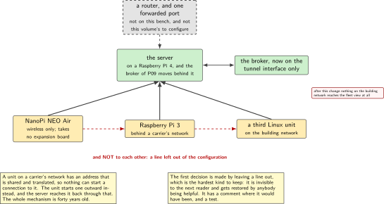
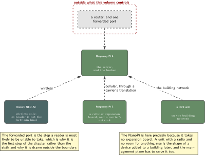
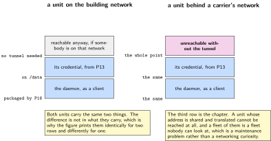
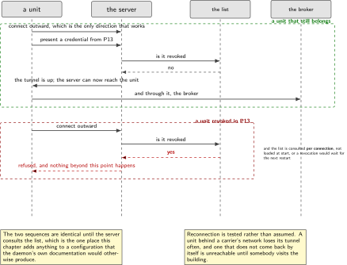
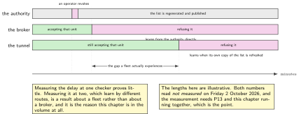

# P19. A tunnel as the management plane

> **Target:** A Raspberry Pi 4 as the server, a NanoPi NEO Air over wireless, and a Raspberry Pi 3 behind a carrier's network  
> **Theme:** Reachability, and refusing a revoked device

> [!NOTE]
> **This is the plus, not the device**
>
> This chapter exists because a requirement list named a tunnel daemon, not because the device in this volume needs one. It earns its place in one way: it is the second place a revocation has to take effect, and P13's measurement of how long that takes is only meaningful because there are two. Everything else here is a well-known daemon configured carefully.

> **Key facts**
>
> - **Boards:** A Raspberry Pi 4 as the server; a NanoPi NEO Air joining over the building's wireless network; a Raspberry Pi 3 with a cellular expansion board, behind a carrier's network
> - **Peripherals:** One cellular expansion board on the Pi 3; the NanoPi takes no expansion board, because its header is not the forty-pin kind
> - **Toolchain:** As the front matter, plus the layer of P16, which packages the daemon
> - **Operating system:** Linux throughout. No microcontroller unit is involved
> - **Difficulty:** 4 of 5
> - **Effort:** 4 evenings of about four hours
> - **Deliverable:** A management plane that a unit behind a carrier's network can reach, that nothing on the building network can, and that refuses a device revoked in P13

## Why this project

A unit on a cellular network usually cannot be reached from outside. The carrier gives it an address that is shared and translated, so the unit can start a connection outward and nothing can start one inward. That is a sensible default and it is also the reason a fleet of such units is hard to maintain: there is no way to reach one to look at it.

A tunnel inverts that. Each unit starts an outward connection to one server, and once it is established the server can reach the unit through it. That is the entire mechanism, it is forty years old, and the chapter's work is configuring it so that it is a management plane rather than a flat network where every unit can reach every other.

The part that makes this chapter worth its place in a volume about devices is the second one. P13 revokes a credential and measures how long until the device is refused. Measuring that at one checker proves little; measuring it at two, where the two learn about the revocation by different routes, is a genuine result about a fleet rather than about a broker.

> [!NOTE]
> **What this chapter does not claim**
>
> The server here is on this bench, behind a home router, and reaching it requires a port to be forwarded. That is stated in the steps rather than glossed, because a reader whose router is not theirs to configure will stop at exactly that point.
>
> No microcontroller unit uses this tunnel. The units of P11 and P12 reach the broker directly with their own credentials, and a tunnel on a part of that size is not attempted. This is a Linux chapter and says so.
>
> The daemon is used as a program and configured; nothing here is linked against it, and the chapter notes its licence for that reason rather than evaluating it.
>
> Three units is not a fleet. Everything here is written so that it would work for more, and nothing has been tried with more, which is stated rather than implied.

## Prior art and what to reuse

| Source | What it gives | What it does not | Licence |
| --- | --- | --- | --- |
| The tunnel daemon and its own certificate tooling | Everything about the tunnel: the protocol, the server, the clients and a revocation list it will honour | A management plane. A flat network where every unit reaches every other is the default and is not what this chapter builds | GPL-2.0 |
| P13, in this volume | The authority, the per-device credentials and the revocation list this tunnel checks | Anything about reachability | Apache-2.0 |
| P16, in this volume | The layer that packages the daemon and its configuration, built for more than one program before this one existed | The configuration | Apache-2.0 |
| The sibling Linux volume, Project 15 | A cellular router on this bench, with failover and position, built in full there | A tunnel, and anything about refusing a device | Apache-2.0 |
| P09, in this volume | The broker that this chapter moves behind the tunnel, and the fleet view that then becomes unreachable from the building network | Reachability | Apache-2.0 |

*Table 19.1. Prior art for P19. The daemon does all the work and the chapter's contribution is three configuration decisions and one measurement, which is an honest description of most tunnel work and is why the chapter is in the plus section.*

## Parts from the inventory

| Part | Role | Interface |
| --- | --- | --- |
| Raspberry Pi 4 | The server, and the broker of P09 which moves behind it | The building network, and one forwarded port |
| NanoPi NEO Air | A unit on the building's wireless network. It takes no expansion board: its header is not the forty-pin kind | Wireless only |
| Raspberry Pi 3 with a cellular expansion board | A unit behind a carrier's network, which is the case the tunnel exists for | The expansion board, and a subscription |

*Table 19.2. Inventory for P19. The NanoPi is in this chapter precisely because it takes no expansion board: a unit with only a wireless radio and no room for anything else is the shape of a device added to a building later, and the tunnel has to serve it too.*

## System architecture



*Figure 19.1. Three units, one server, and the two things this chapter decides. The first is that units reach the server and not each other; the second is that the broker moves behind the tunnel, so the building network can no longer reach it at all. The forwarded port is drawn because it is the step a reader is most likely to be unable to take.*

## Configuration

```text
# the three decisions, and they are the whole chapter

# 1. units reach the server, never each other. Without this line the tunnel is
#    a flat network and one compromised unit reaches every other.
#    (client-to-client is NOT enabled; its absence is the decision)

# 2. the revocation list is checked on every connection, and the daemon is
#    told where it is. A list that exists and is not consulted is decoration.
crl-verify /etc/openvpn/crl.pem

# 3. the server's own certificate is checked by the clients, with the usage
#    extension required, so that a client certificate cannot impersonate a
#    server.
remote-cert-tls server
```

```text
# and what moves: the broker of P09 stops listening on the building network
# and listens on the tunnel interface only. After this change, nothing on the
# building network can reach the fleet view at all, which is the point.
listener 8883 10.8.0.1
```

The first decision is made by leaving something out, which is the hardest kind to document. A reader comparing this configuration with a typical one will notice an absent line rather than a present one, so the absence is written as a comment in the file itself.

## Wiring



*Figure 19.2. Three units reaching one server by three different routes, and the one piece of infrastructure that is not on this bench: a router whose port forwarding somebody has to configure. The figure draws it as outside the dotted boundary of what this volume controls.*

## Memory and timing budget



*Figure 19.3. What each unit carries. The two Linux units have room for everything; the figure exists mainly to show the asymmetry between a unit on a building network and one behind a carrier's, which is the whole reason for the chapter.*

| Quantity | Budget | Measured | Margin |
| --- | --- | --- | --- |
| Tunnel established, wireless unit | under 10 s | not measured | not measured |
| Tunnel established, cellular unit | under 60 s | not measured | the attach dominates |
| Reconnection after a link drop | under 30 s | not measured | not measured |
| Overhead per message | stated once measured | not measured | not measured |
| Broker reachable from the building network | none, after the change | by construction | the point |
| Broker reachable through the tunnel | by all three units | not measured | not measured |
| Time from revoking to refusal here | measured, and compared with P13's | not measured | the chapter's result |
| Units that can reach each other | zero | by construction | by an absent line |

*Table 19.3. The budget for P19. The last two rows are the chapter. One is a measurement that is only meaningful because a second checker exists; the other is a property achieved by leaving a line out of a configuration file, which is the most easily lost decision in this chapter.*

## Software design (UML)



*Figure 19.4. A unit connecting, and a revoked unit failing to. The two sequences are identical until the server consults the list, which is the one place this chapter adds anything to a standard configuration.*

The reconnection behaviour matters more than it looks. A unit behind a carrier's network loses its tunnel whenever the carrier decides to, which is often, and a unit that does not reconnect by itself becomes unreachable until somebody visits. The daemon does this correctly by default and the chapter's contribution is to test it rather than to assume it, by taking the link away repeatedly and counting how many times the unit came back.



*Figure 19.5. Two revocations reaching two checkers by two routes. The broker learns from the authority directly; the tunnel learns when its own copy of the list is refreshed. The gap between the two is what a fleet actually experiences, and it is the number neither chapter could produce alone.*

## Data flow (ASCII)

```text
  the problem                            the mechanism
  +---------------------------+          +-----------------------------------+
  | a unit on a carrier's     |          | the unit starts a connection      |
  | network has an address    | ------>  | OUTWARD to one server; the server |
  | that is shared and        |          | can then reach it back through it |
  | translated. nothing can   |          +-----------------------------------+
  | start a connection to it  |
  +---------------------------+

  the three decisions, and they are the chapter
  +--------------------------------------------------------------------------+
  | 1. units reach the SERVER and not each other                              |
  |      achieved by LEAVING A LINE OUT, which is why it is commented         |
  | 2. the revocation list of P13 is checked on EVERY connection              |
  |      a list that exists and is not consulted is decoration                |
  | 3. the broker of P09 moves behind the tunnel                              |
  |      after which nothing on the building network can reach the fleet view |
  +--------------------------------------------------------------------------+
                                   |
                                   v
  the measurement that justifies the chapter:
     revoke in P13 -> how long until refused HERE, and how long until refused
     at the broker. two checkers, two routes, and the difference is the result.
```

## Repository layout

```text
projects/P19-tunnel/
  server/
    server.conf                   # the three decisions, with the absent one
                                  # written as a comment so it is not restored
    up.sh                         # bring the broker onto the tunnel interface
  client/
    client.conf                   # the same for all three units
    openvpn-client.service
  recipes/                        # packaged by the layer of P16
    tunnel_1.0.bb
  tools/
    drop_the_link.py              # take the link away, repeatedly, and count
    time_to_refusal_here.py       # the second checker, for P13's measurement
  tests/
    test_no_client_to_client.sh   # units cannot reach each other
    test_broker_unreachable.sh    # not from the building network
  docs/
    the_absent_line.md            # one page, because an absent line is invisible
  README.md
```

## Steps

**Step 1.** **Say first what somebody else has to do.** One port forwarded on a router this volume does not control. A reader whose router is not theirs stops here, and that is better discovered in the first step than the sixth.

**Step 2.** **Use P13's authority rather than making a second one.** The daemon's own tooling will happily create one, and a second authority means a unit has two identities and a revocation reaches one of them.

**Step 3.** **Leave the line out, and write a comment where it would have been.** Units reach the server, not each other. An absent line is invisible to the next reader and gets added back by somebody being helpful.

```text
# server.conf
#
# client-to-client is deliberately NOT enabled. Units reach the server and
# nothing else. With it, one compromised unit reaches every other unit in
# every building, which is the opposite of a management plane.
#
crl-verify /etc/openvpn/crl.pem
remote-cert-tls server
```

**Step 4.** **Point the daemon at P13's revocation list and confirm it is read on every connection, not at start.** A list loaded once at start means a revocation takes effect at the next restart of the server, which is not what anybody intends.

**Step 5.** **Bring up the wireless unit first.** It is the easy one, it needs no subscription, and it proves the server before the cellular case adds its own failure modes.

**Step 6.** **Bring up the cellular unit and time the whole thing.** Most of the time is the attach rather than the tunnel, which P11 already measured, and the chapter says so rather than attributing it here.

**Step 7.** **Move the broker behind the tunnel and prove the building network cannot reach it.** This is the moment the tunnel becomes a management plane rather than an extra route.

```bash
sh tests/test_broker_unreachable.sh      # from a machine on the building network
# expects: connection refused, not a timeout, and the test says which
```

**Step 8.** **Prove that units cannot reach each other.** From one unit, try the others. The expected result is nothing, and a test that expects nothing has to distinguish nothing from a misconfiguration, which is why it checks the server's own view as well.

**Step 9.** **Take the link away, repeatedly, and count the returns.** A unit behind a carrier's network loses its tunnel often, and one that does not come back by itself is unreachable until somebody visits.

```bash
python tools/drop_the_link.py --unit pi3-cellular --drops 50 --expect-returns 50
```

**Step 10.** **Revoke a unit in P13 and measure the time until it is refused here.** Then compare with the time until it is refused at the broker. Two checkers, two routes, and the comparison is this chapter's one real contribution.

## Build, flash and debug

The daemon's log is unusually good and reading it is almost always faster than reasoning about a failure. Three failures account for nearly everything: a certificate whose dates do not fit because a unit's clock is wrong, a revocation list the daemon cannot read, and a port that is not actually forwarded. All three present as a connection that does not establish and all three say which they are in the log's first few lines.

The one failure that does not appear in the log is the absent line being restored. A unit that can suddenly reach another unit is a configuration that somebody improved, and the test for it runs on every push for that reason rather than being checked by inspection.

## Verification and acceptance criteria

- **A unit behind a carrier's network is reachable from the server.** *Refuted if* it is not, which would mean the tunnel is not doing the one thing it exists for.
- **Units cannot reach each other.** Tried from each, and confirmed against the server's own view. *Refuted if* any unit reaches another, which would mean the absent line has been restored.
- **The broker is unreachable from the building network.** Connection refused rather than a timeout, and the test distinguishes them. *Refuted if* it is still reachable, in which case the tunnel is an extra route and not a management plane.
- **The broker is reachable through the tunnel by all three units.** *Refuted if* any unit cannot reach it, which would mean the move broke the thing it was protecting.
- **A revoked unit is refused.** The credential revoked in P13 does not establish a tunnel. *Refuted if* it does, which would mean the list is loaded and not consulted.
- **The list is consulted per connection, not at start.** Revoke while the server is running and confirm the next attempt fails without a restart. *Refuted if* a restart is needed.
- **A dropped link returns by itself, fifty times out of fifty.** *Refuted if* any drop leaves the unit unreachable, and the number is reported rather than the target.
- **The time to refusal here is measured and compared with the broker's.** *Refuted if* only one is reported, because a single checker makes P13's measurement uninteresting.

## Variants

| Axis | This chapter | The alternative | Cost | Built in full |
| --- | --- | --- | --- | --- |
| Topology | Units to the server only | A flat network | One compromised unit reaches every other | Here, by an absent line |
| Authority | P13's | A second one, from the daemon's tooling | A unit with two identities, and a revocation that reaches one | Here |
| The list | Checked per connection | Loaded at start | A revocation takes effect at the next restart | Here |
| The broker | Behind the tunnel | On the building network | The tunnel is an extra route rather than a management plane | Here |
| Reconnection | Tested by taking the link away | Assumed | A unit that is unreachable until somebody visits | Here |
| Microcontroller units | Not on the tunnel | A tunnel on a part of that size | Not attempted, and the chapter says so | Named, not built |
| The cellular link itself | Cited | Built again here | A sibling volume's subject | Sibling Linux volume, Project 15 |

*Table 19.4. Variants touching P19. Five rows are built, and the first is built by omission, which is the hardest kind of decision to keep: it is invisible to the next reader and is restored by anybody trying to be helpful, which is why it has a comment and a test.*

## Pitfalls

- **Enabling the flat-network option because a guide does.** Most guides are for a virtual private network rather than a management plane, and the two want opposite things.
- **Creating a second authority with the daemon's own tooling.** It is one command and it gives every unit two identities.
- **A revocation list loaded at start.** It takes effect at the next restart of the server, which is not what anybody means by revoking a device.
- **Leaving the broker on the building network.** The tunnel is then an extra route and protects nothing.
- **Assuming reconnection works.** It usually does, and a unit behind a carrier's network that does not come back is unreachable until somebody visits.
- **Forgetting the forwarded port.** Everything else is correct and nothing connects, and the step belongs first rather than sixth.
- **Documenting an absent line nowhere.** It is invisible, and the next person adds it back.

## Best practices applied

The dependency on somebody else's infrastructure is stated in the first step rather than discovered in the sixth. A decision made by omission is written where the omission is and tested on every push, because nothing else makes an absent line visible. One authority serves the whole volume. The thing that is supposed to be unreachable is tested from the place it should be unreachable from, and the test distinguishes refused from timed out. Reconnection is measured by taking the link away fifty times rather than assumed from a manual. And the chapter's one real contribution, a second place where a revocation has to land, is the thing it leads with.

## Stretch goals

Add the two measurements of time to refusal to a published table alongside P13's, so that the delay a fleet actually experiences is one number rather than two separate claims. Run the link-dropping test for a week rather than fifty times and report the distribution of return times, since the worst case is what decides whether a unit is reachable when somebody needs it. Add a fourth unit on a different carrier and see whether the reconnection behaviour is a property of the daemon or of one network.

## Roadmap and next steps

P13's measurement becomes meaningful here, because a revocation that is checked in two places by two routes is a revocation a fleet actually experiences. P16's layer carries this daemon, which is the second recipe it holds and the test of whether it was built for more than one. And P09's fleet view is now reachable only by somebody who belongs there, which is the quiet improvement this chapter makes to a chapter that was already finished.

## Portfolio evidence

The idiom this chapter proves is **validation**, applied to a negative: the things that should not work are tested from the places they should not work from. The command that proves it is

`sh tests/test_no_client_to_client.sh && sh tests/test_broker_unreachable.sh && python tools/drop_the_link.py --drops 50`

which tries to reach one unit from another, tries to reach the broker from the building network, and takes the cellular unit's link away fifty times to count how often it returns by itself. Publish the configuration with its commented absent line, the two negative tests, the fifty-drop result, and the time to refusal measured here beside P13's.

## Sources

- The tunnel daemon's documentation and its certificate tooling. Read Friday 2 October 2026. The daemon is used as a program and configured; nothing here is linked against it, which is why its licence is noted rather than evaluated.
- P13 in this volume, for the authority, the credentials and the revocation list this tunnel consults.
- P16 in this volume, for the layer that packages the daemon as its second recipe.
- P09 in this volume, for the broker that moves behind the tunnel and the fleet view that becomes unreachable from the building network.
- The sibling Linux volume, Project 15, for the cellular link on this bench, built in full there and cited here.

---

[Previous](18-canopen-on-a-real-wire.md) &nbsp;&nbsp;|&nbsp;&nbsp; [Contents](../README.md) &nbsp;&nbsp;|&nbsp;&nbsp; [Next](20-a-bridge-between-two-message-protocols.md)
