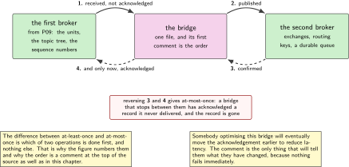
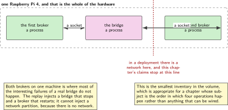
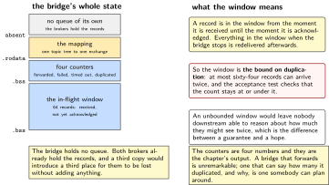
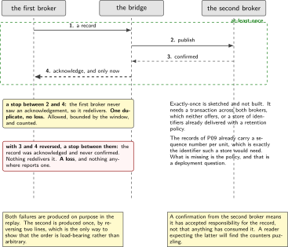
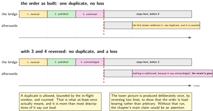

# P20. A bridge between two message protocols

> **Target:** A Raspberry Pi 4 running both brokers, with the bridge in C between them  
> **Theme:** At-least-once across a protocol boundary

> [!NOTE]
> **This is the plus, not the device**
>
> This chapter exists because a requirement list named a second message protocol, not because the device in this volume needs one. It earns its place by being the only chapter that has to say precisely what a delivery guarantee means, and by testing that claim with a replay rather than asserting it. The protocol is the pretext; the semantics are the content.

> **Key facts**
>
> - **Board:** A Raspberry Pi 4 running both brokers and the bridge. No device, no radio, no instrument
> - **Peripherals:** None
> - **Toolchain:** As the front matter, plus the second broker's C client library
> - **Operating system:** Linux
> - **Difficulty:** 4 of 5
> - **Effort:** 4 evenings of about four hours
> - **Deliverable:** A bridge that forwards every record from one broker to the other at least once, loses none across a restart on either side, and is proven by a replay that counts rather than by a claim

## Why this project

A requirement list named two message protocols. The first is used throughout this volume; the second appears here. Writing a bridge rather than a second client is the right shape, because the units should speak one protocol and the question of how a record reaches a different system is an integration question rather than a device one.

The reason the chapter is worth its place is narrower and more useful than the protocol. Every chapter in this volume so far has moved records around and none of them has had to state exactly what happens when something is delivered twice, or when a process stops halfway through forwarding. A bridge cannot avoid that question: it has an acknowledgement on each side and it has to decide the order in which it does things, and that order is the whole of the delivery guarantee.

So the chapter's content is the order of four operations and a test that proves it. The protocol is the occasion.

> [!NOTE]
> **What this chapter does not claim**
>
> Both brokers run on one machine here. In a deployment they would not, and the chapter does not model a network between them, which is where most of the interesting failures of a real bridge live.
>
> At-least-once is what is built and claimed. Exactly-once is not, and the chapter says why: it needs either a transaction across both systems or a deduplication store with a retention policy, and the second is sketched rather than built.
>
> The replay test proves the guarantee against the failures it injects, which are a bridge that stops and a broker that restarts. It does not prove it against a network partition, because there is no network here.
>
> Nothing in this chapter runs on a device. It is a gateway-side chapter, like P16 and P19, and the volume's device chapters are unaffected by it.

## Prior art and what to reuse

| Source | What it gives | What it does not | Licence |
| --- | --- | --- | --- |
| The second broker and its C client library | A different protocol with exchanges, queues and acknowledgements, and a client that links into a bridge | Any opinion about what happens when the bridge stops halfway, which is the chapter | MPL-2.0 for the broker, MIT for the client |
| The first broker, from P09 | The source side, with its own acknowledgement and its own session semantics | The boundary. Two acknowledgement models meeting is what a bridge is | EPL-2.0 |
| Published work on message delivery guarantees | The vocabulary, the three guarantees and the standard argument that the strongest is expensive | An implementation, and no opinion about this pair of brokers | Published |
| Existing bridges between these two protocols | Proof that it is a solved problem, and a reference for the mapping between the two naming schemes | A small one. The available bridges are substantial programs, and this chapter needs one file to reason about | Various |
| P09, in this volume | The records being bridged, their topic tree and their sequence numbers, which turn out to be exactly what a deduplication store needs | Anything about a second protocol | Apache-2.0 |

*Table 20.1. Prior art for P20. A bridge between these two protocols exists several times over, and the chapter says so plainly. What it offers instead is a small one whose delivery guarantee can be read in one sitting and proven in one test.*

## Parts from the inventory

| Part | Role | Interface |
| --- | --- | --- |
| Raspberry Pi 4 | Runs both brokers and the bridge. In a deployment these would be three machines and the chapter says so | The building network |

*Table 20.2. Inventory for P20. One item, and no hardware at all beyond it. This is the smallest inventory in the volume, which is appropriate for a chapter whose subject is the order in which four operations happen.*

## System architecture



*Figure 20.1. Two brokers, one bridge, and the four operations whose order is the guarantee. The figure numbers them, because the difference between at-least-once and at-most-once is which of two is done first and nothing else.*

## Configuration

```text
# the four operations, and their order IS the guarantee
# 1. receive from the first broker, do NOT acknowledge yet
# 2. publish to the second broker
# 3. wait for the second broker's confirmation
# 4. only now, acknowledge to the first broker
#
# reversing 3 and 4 gives at-most-once: a bridge that stops between them has
# acknowledged a record it never delivered, and the record is gone.
```

```text
# the mapping between two naming schemes, written down once
fleet/<unit>/state    ->  exchange "fleet", routing key "unit.<unit>.state"
fleet/<unit>/health   ->  exchange "fleet", routing key "unit.<unit>.health"
fleet/announce        ->  exchange "fleet", routing key "announce"

# and the queue on the far side is durable, because a bridge that delivers
# into a queue that vanishes on restart has not delivered anything.
```

The order of the four operations is the entire design and it is written as a comment at the top of the source as well as here, because somebody optimising the bridge will eventually move the acknowledgement earlier to reduce latency and will not realise what they have changed.

## Wiring



*Figure 20.2. There is none. The figure draws the three processes on one machine and marks, with a dotted boundary, where a network would be in a deployment, because that is where this chapter's claims stop applying.*

## Memory and timing budget



*Figure 20.3. The in-flight window, which is the only state the bridge holds. A record is in it from the moment it is received until the moment it is acknowledged, and the window's size is the bound on how much can be duplicated by a restart.*

| Quantity | Budget | Measured | Margin |
| --- | --- | --- | --- |
| In-flight window | 64 records | by construction | the duplication bound |
| Bridge's own state | under 8 kB | by construction | no queue of its own |
| Records forwarded in the replay | 10000 | by construction | the test's size |
| Records lost | zero | not measured | the claim |
| Records duplicated | bounded by the window | not measured | and counted |
| Forwarding, one record | under 5 ms | not measured | not measured |
| Recovery after a bridge restart | under 5 s | not measured | not measured |
| Recovery after a broker restart | under 30 s | not measured | not measured |

*Table 20.3. The budget for P20. The two rows that matter are losses and duplicates. Zero losses is the claim; duplicates are permitted, bounded by the in-flight window, and counted, which is what at-least-once actually means and is more than most descriptions of it say.*

## Software design (UML)



*Figure 20.4. The four operations, and the two places a failure changes the outcome. A stop between the second and the fourth produces a duplicate, which is allowed. A stop between a reordered fourth and second would produce a loss, which is not, and the figure shows both so the difference is visible rather than argued.*

Exactly-once is sketched here and not built, and the sketch is short because the reason is short. It needs either a transaction spanning both brokers, which neither offers, or a store of identifiers the bridge has already delivered, with a retention policy that decides when an identifier can be forgotten. The second is achievable and the records of P09 already carry a sequence number per unit, which is exactly the identifier such a store would need. What it costs is a store that has to survive a restart and a policy nobody can choose without knowing how long a duplicate can arrive late, which is a deployment question rather than a firmware one.

```c
/* the whole guarantee, and the order is the point */
static void on_message_from_first(const msg_t *m)
{
    inflight_add(m->id);                       /* 1. received, not acknowledged */

    if (publish_to_second(m) != 0) {           /* 2. forward */
        inflight_drop(m->id);                  /*    and let it be redelivered */
        counters.forward_failed++;
        return;
    }
    if (wait_for_confirm(m, TIMEOUT) != 0) {   /* 3. the far side's word for it */
        inflight_drop(m->id);
        counters.confirm_timeout++;
        return;                                /*    redelivered, so duplicated */
    }
    ack_to_first(m);                           /* 4. and only now */
    inflight_drop(m->id);
    counters.forwarded++;
}
```



*Figure 20.5. A bridge stopping between the publish and the acknowledgement, and what happens next. The record is redelivered because it was never acknowledged, which produces one duplicate and no loss. The same picture with two operations reversed is drawn beneath it, and there the record is simply gone.*

## Data flow (ASCII)

```text
  the first broker                 the bridge                 the second broker
  +----------------+        +-----------------------+        +----------------+
  | a record       | -(1)-> | received, NOT         |        |                |
  |                |        | acknowledged          |        |                |
  |                |        |            --(2)-->   | -----> | published      |
  |                |        |            <--(3)--   | <----- | confirmed      |
  |                | <-(4)- | acknowledged          |        |                |
  +----------------+        +-----------------------+        +----------------+

  a stop between (2) and (4):  the first broker redelivers.  A DUPLICATE.
                               allowed, bounded by the in-flight window, counted.

  the same four with (3) and (4) REVERSED:
  a stop between them:         acknowledged, never confirmed.  A LOSS.
                               not allowed, and the reason the order is a comment
                               at the top of the file as well as in this chapter.
```

## Repository layout

```text
projects/P20-bridge/
  CMakeLists.txt
  src/bridge.c                    # one file, and the order is its first comment
  src/map.c                       # one topic tree to one exchange and its keys
  src/inflight.c                  # the window, and the duplication bound
  src/counters.h                  # forwarded, failed, timed out, duplicated
  tools/replay.py                 # ten thousand records, with failures injected
  tools/compare.py                # what went in, what came out, and the deltas
  tests/test_order.c              # the four operations, in order, and reversed
  docs/exactly_once.md            # why it is sketched and not built
  docs/mapping.md                 # the two naming schemes, side by side
  README.md
```

## Steps

**Step 1.** **Write the four operations and their order before any code, as a comment.** Somebody will later move the acknowledgement earlier to reduce latency, and the comment is the only thing that will tell them what they changed.

**Step 2.** **Write the mapping between the two naming schemes down once.** A topic tree and an exchange with routing keys are different shapes, and a mapping that lives only in the code is one nobody can check against the far system's expectations.

**Step 3.** **Make the far queue durable.** A bridge that delivers into a queue which vanishes when the broker restarts has delivered nothing, and the failure is invisible until the restart.

**Step 4.** **Bound the in-flight window and say what the bound means.** It is the maximum number of records a restart can duplicate, which makes it a number somebody downstream can reason about rather than an implementation detail.

**Step 5.** **Write the replay before the bridge is finished.** Ten thousand records with a sequence number each, failures injected at chosen points, and a comparison of what went in against what came out.

```python
# tools/replay.py: the failures that matter are the two the bridge can see
FAILURES = [
    ("none",             None),
    ("bridge_stops",     lambda n: n == 3000),   # between publish and ack
    ("second_restarts",  lambda n: n == 5000),   # the far broker goes away
    ("first_restarts",   lambda n: n == 7000),   # the near one does
]
```

**Step 6.** **Run it with no failures first and require an exact match.** If the easy case is not exact there is no point injecting anything.

**Step 7.** **Inject each failure and check the two numbers.** Losses must be zero in every run. Duplicates may be non-zero and must be at or under the in-flight window, and the comparison reports both rather than a pass.

```bash
python tools/replay.py --records 10000 --failures all --out run.json
python tools/compare.py run.json
# prints, per failure: records in, records out, lost, duplicated, and the bound
```

**Step 8.** **Reverse the order deliberately and watch a loss appear.** This is the chapter's acceptance criterion and the only way to show that the order is load-bearing rather than arbitrary. Then put it back.

**Step 9.** **Write the exactly-once sketch, with its cost.** A store of identifiers, a retention policy, and the observation that P09's sequence numbers are already the identifier it would need. One page, and it stops the question being reopened every six months.

**Step 10.** **State where the claims stop.** Both brokers are on one machine here, so nothing in this chapter is a claim about a network partition, and the figure draws the boundary.

## Build, flash and debug

Both brokers log, and the bridge's counters are more useful than either. A record that has gone missing is almost always a record that was published into an exchange with no queue bound to it, which both brokers report as a successful publish because from the publisher's point of view it was one.

The second recurring confusion is the confirmation. The far broker's confirmation means it has accepted responsibility for the record, not that anything has consumed it, and a reader who expects the latter will find the counters puzzling. The chapter states it once in the source and once here.

## Verification and acceptance criteria

- **With no failures, what comes out matches what went in exactly.** *Refuted if* it does not, in which case nothing after this matters.
- **Losses are zero under every injected failure.** *Refuted if* any record that entered does not leave, which is the one thing at-least-once promises.
- **Duplicates are at or under the in-flight window.** *Refuted if* more appear, which would mean the window is not the bound it is described as.
- **Reversing the order produces a loss.** Deliberately, once. *Refuted if* it does not, which would mean the order is not load-bearing and the chapter's main claim is empty.
- **A record published into an exchange with no queue bound is detected.** *Refuted if* the bridge reports success, which it would by default and which is the most common silent failure here.
- **The far queue survives a broker restart.** *Refuted if* it does not, which would mean the delivery guarantee ends at the first restart.
- **Exactly-once is sketched, not claimed.** *Refuted if* the chapter asserts it anywhere.
- **The limits of the test are stated.** One machine, no network partition. *Refuted if* the chapter implies otherwise.

## Variants

| Axis | This chapter | The alternative | Cost | Built in full |
| --- | --- | --- | --- | --- |
| Shape | A bridge | A second client on every unit | Two protocols on a part that should speak one | Here |
| Guarantee | At-least-once, with the order as the mechanism | At-most-once | A record acknowledged and never delivered | Here |
| Exactly-once | Sketched, with its cost | Built | A store, a retention policy, and a deployment question nobody here can answer | Named, not built |
| Duplicates | Permitted, bounded, counted | Prevented | See the row above | Here |
| The far queue | Durable | Not | The guarantee ends at the first restart | Here |
| Where the brokers run | One machine, said so | Two, with a network between | Where the interesting failures are, and this chapter does not reach them | Named, not built |
| Size | One file, readable in a sitting | An existing bridge | Those are substantial programs; this one is a thing to reason about | Here |

*Table 20.4. Variants touching P20. Four rows are built and three are named rather than built, which is a high ratio and an honest one for a chapter that opens by saying the problem is already solved elsewhere.*

## Pitfalls

- **Acknowledging before the far side confirms.** It is the obvious way to reduce latency and it silently converts the guarantee into its opposite.
- **A queue that is not durable.** Everything works until the first restart, and then a day of records is gone.
- **Publishing into an exchange with nothing bound to it.** Both brokers report success, because from the publisher's view it was one.
- **Expecting a confirmation to mean consumption.** It means the far broker has accepted responsibility, which is a different and weaker thing.
- **An unbounded in-flight window.** The duplication bound then does not exist and nobody downstream can reason about what they might see twice.
- **Claiming exactly-once because duplicates are rare.** Rare is not a guarantee, and the word has a meaning.
- **Presenting a one-machine test as a distributed result.** The interesting failures of a real bridge are the ones a network introduces, and none of them is exercised here.

## Best practices applied

The design decision that is easiest to undo by accident is written as a comment where somebody would undo it. The guarantee is named precisely, including what it permits rather than only what it promises. The permitted imperfection is bounded by a number that is stated and counted. The claim is tested by injecting the failures it is supposed to survive, and then by deliberately breaking the mechanism to confirm the test can fail. What is not built is sketched with its cost so that the question does not reopen. And the boundary of the result, one machine and no network, is stated where the result is.

## Stretch goals

Move the second broker to a different machine and rerun the replay across a link that can be taken away, which is where a bridge's real failures live and which this bench could support with one more Pi. Build the deduplication store behind a setting and measure what it costs in latency and in storage, which turns the exactly-once sketch into a trade rather than an argument. Run the replay for a day rather than ten thousand records and report whether the duplication bound holds under sustained load.

## Roadmap and next steps

This chapter ends the volume, and what it leaves is one question worth carrying forward: every record in this book has a sequence number per unit because P09 needed one for staleness, and that same number turns out to be exactly what a deduplication store would need. A design decision made for one reason that happens to serve another is worth noticing, and it is the kind of thing a reader should look for in their own work rather than a conclusion this volume should draw for them.

## Portfolio evidence

The idiom this chapter proves is **validation**: the guarantee is stated precisely, tested against the failures it must survive, and then deliberately broken to show the test can fail. The command that proves it is

`python tools/replay.py --records 10000 --failures all --out run.json && python tools/compare.py run.json`

which forwards ten thousand records through four failure scenarios and prints, for each, how many were lost, how many were duplicated, and whether the duplication stayed within the in-flight window. Publish that output, the four-operation comment from the top of the source, the run with the order reversed showing a loss, and the one-page note on why exactly-once is sketched and not built.

## Sources

- The second broker and its C client library, for the exchanges, the routing keys and the publisher confirmation. Read Friday 2 October 2026.
- The first broker, from P09 in this volume, for the source side and its own acknowledgement model.
- Published work on message delivery guarantees, read for the vocabulary and for the standard argument that the strongest guarantee is expensive, and not for an implementation.
- Existing bridges between these two protocols, read for the mapping between the two naming schemes and noted as proof that this is a solved problem.
- P09 in this volume, for the sequence numbers that a deduplication store would need, which were added for an unrelated reason.

---

[Previous](19-a-tunnel-as-the-management-plane.md) &nbsp;&nbsp;|&nbsp;&nbsp; [Contents](../README.md) &nbsp;&nbsp;|&nbsp;&nbsp; [Next](21-appendix.md)
