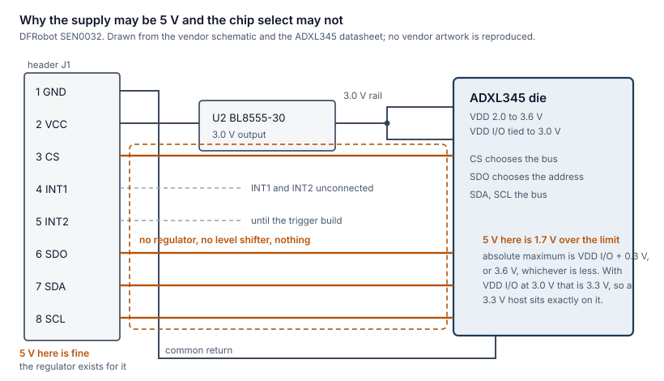
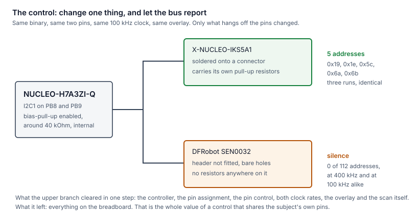
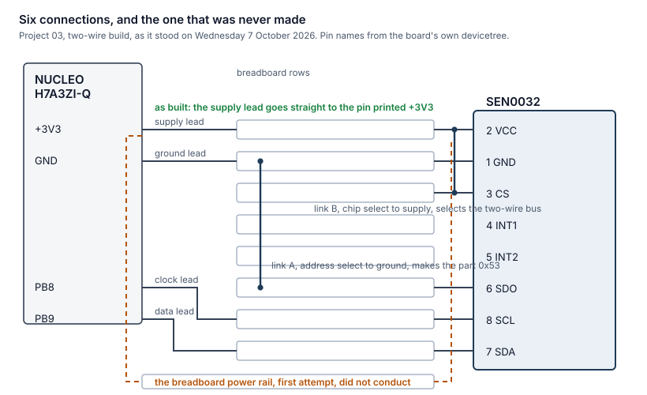

# The documents this bench is built from, and what reading them decided

Written on Wednesday 7 October 2026, after the first project in this volume met real hardware
and spent most of an evening eliminating things that turned out to be correct.

This page is a reading list with consequences attached. It names, for every piece of hardware
the volume uses, the document that is authoritative about it, and then says which specific lines
in those documents changed a decision here. A link on its own is not much use; a link beside the
sentence it settled is worth keeping.

**Nothing is vendored.** No datasheet, manual or schematic is copied into this repository. Their
licences differ from one another and from this repository's, and a reader who needs page 42
should get it from the people who maintain page 42.

### About the three pictures below

They are drawn here, from scratch, and **no artwork from any of the linked documents is
reproduced**. Two reasons, and the second one settles it without needing a judgement call.

The first is the rule above: lifting a figure out of a datasheet is vendoring, in the form that
is hardest to attribute honestly, and a cropped schematic carries no indication of which revision
it came from.

The second is that **this repository's own gate would refuse it**. The `checks` workflow allows
only the file types this volume publishes, and the list is `md`, `svg`, `py`, `yml`, `cff`, `c`,
`h`, `cpp`, `hpp`, `rs`, `toml`, `conf` and `overlay`. A screenshot is a PNG or a JPEG. The job
fails on the file type before the licence question is ever reached, which is a pleasant case of a
rule written for one reason enforcing another.

There is a third reason and it is the one that matters for reading. A vendor's schematic shows
every net on the board, correctly and at once. These three pictures each show **the two or three
nets that decided something**, with the rest left out on purpose. That is not a better drawing
than the vendor's. It is a different job.

Each figure names the document its facts come from, in its caption.

## A convention that matters more than it sounds

Every factual claim below carries a marker saying where it came from. That is not pedantry for
its own sake. On Tuesday 6 October 2026 this bench had a vendor's product page and the same
vendor's wiki disagree about a supply range, with **both of them correct**; had a pin assignment
settled from a devicetree in the operating system tree, which no document in this list contains;
and turned on a physical fact about a module that appears in no document at all.

| Marker | Means | How much it is worth |
|---|---|---|
| **[D]** | Read in a manufacturer's datasheet, reference manual or schematic | The strongest kind here. It describes the part |
| **[V]** | Read on a vendor's product page or wiki | Useful and sometimes incomplete. Two such pages contradicted each other below, and the schematic explained why both were right |
| **[S]** | Read in source code: the Zephyr tree, a board's own devicetree, a binding | Authoritative about **what the software does**, and silent about what the hardware is. A build accepting a pin says the processor can route the signal there, and says nothing about whether a jumper lead can reach it |
| **[B]** | Observed on this bench | A reading, not a specification. It describes this unit on this day |

Where a figure below is used but was **not** read from its document, that is said in the line
itself rather than left to be assumed. There are three such places and they are the honest
weak points of this page.

---

## The index

Every address is written out so that a reader can check them without trusting a shortener. An
entry marked **opened** was actually read for this volume. The rest are listed because the
hardware is on the bench and the next person should not have to find them again.

### The host board and its processor

| Document | Address | State |
|---|---|---|
| NUCLEO-H7A3ZI-Q user manual UM2408 | https://www.st.com/resource/en/user_manual/um2408-stm32h7-nucleo144-boards-mb1363-stmicroelectronics.pdf | listed. **Its connector tables are the open item at the foot of this page** |
| STM32H7A3ZIT6Q datasheet | https://www.st.com/resource/en/datasheet/stm32h7a3zi.pdf | listed |
| STM32H7A3 reference manual RM0455 | https://www.st.com/resource/en/reference_manual/rm0455-stm32h7a3b3-and-stm32h7b0-value-line-advanced-armbased-32bit-mcus-stmicroelectronics.pdf | listed, and already the subject of a standing warning in [chapter 00](../chapters/00-about-this-volume.md) |

### The part this volume has actually read

| Document | Address | State |
|---|---|---|
| ADXL345 datasheet | https://www.analog.com/media/en/technical-documentation/data-sheets/ADXL345.pdf | **opened** |
| DFRobot SEN0032 schematic | supplied by the vendor as a PDF; the product and wiki pages are the entry point | **opened**, and the most productive single document of the evening |

### Expansion boards

| Document | Address |
|---|---|
| X-NUCLEO-53L8A1 board page | https://www.st.com/en/evaluation-tools/x-nucleo-53l8a1.html |
| VL53L8CX datasheet | https://www.st.com/resource/en/datasheet/vl53l8cx.pdf |
| X-NUCLEO-IKS4A1 user manual UM3239 | https://www.st.com/resource/en/user_manual/um3239-getting-started-with-the-xnucleoiks4a1-motion-mems-and-environmental-sensor-expansion-board-for-stm32-nucleo-stmicroelectronics.pdf |
| X-NUCLEO-IKS5A1 board page | https://www.st.com/en/evaluation-tools/x-nucleo-iks5a1.html |
| STEVAL-STWINBX1 board page | https://www.st.com/en/evaluation-tools/steval-stwinbx1.html |

Note the asymmetry, because it costs something below: the IKS4A1 has a full user manual in this
list and the IKS5A1 has only a product page. The IKS5A1 is the board that was actually stacked.

### Sensors on the X-NUCLEO-IKS4A1

| Part | Address |
|---|---|
| LSM6DSO16IS | https://www.st.com/resource/en/datasheet/lsm6dso16is.pdf |
| LSM6DSV16X | https://www.st.com/resource/en/datasheet/lsm6dsv16x.pdf |
| LIS2MDL | https://www.st.com/resource/en/datasheet/lis2mdl.pdf |
| LIS2DUXS12 | https://www.st.com/resource/en/datasheet/lis2duxs12.pdf |
| LPS22DF | https://www.st.com/resource/en/datasheet/lps22df.pdf |
| STTS22H | https://www.st.com/resource/en/datasheet/stts22h.pdf |
| SHT40 | https://sensirion.com/media/documents/33FD6951/624C4357/Sensirion_Humidity_Sensors_SHT4x_Datasheet.pdf |

### Sensors on the X-NUCLEO-IKS5A1

| Part | Address |
|---|---|
| ISM6HG256X | https://www.st.com/resource/en/datasheet/ism6hg256x.pdf |
| ISM330IS | https://www.st.com/resource/en/datasheet/ism330is.pdf |
| IIS2DULPX | https://www.st.com/resource/en/datasheet/iis2dulpx.pdf |
| IIS2MDC | https://www.st.com/resource/en/datasheet/iis2mdc.pdf |
| ILPS22QS | https://www.st.com/resource/en/datasheet/ilps22qs.pdf |

### Sensors on the STEVAL-STWINBX1

| Part | Address |
|---|---|
| IIS3DWB | https://www.st.com/resource/en/datasheet/iis3dwb.pdf |
| ISM330DHCX | https://www.st.com/resource/en/datasheet/ism330dhcx.pdf |
| IMP34DT05 | https://www.st.com/resource/en/datasheet/imp34dt05.pdf |
| IMP23ABSU | https://www.st.com/resource/en/datasheet/imp23absu.pdf |

### The gateway boards

| Document | Address |
|---|---|
| Raspberry Pi 4 datasheet | https://datasheets.raspberrypi.com/rpi4/raspberry-pi-4-datasheet.pdf |
| BCM2711 peripherals | https://datasheets.raspberrypi.com/bcm2711/bcm2711-peripherals.pdf |
| Raspberry Pi 3 Model B+ datasheet | https://datasheets.raspberrypi.com/rpi3/raspberry-pi-3-b-plus-datasheet.pdf |
| BCM2835 and BCM2837 peripherals | https://datasheets.raspberrypi.com/bcm2835/bcm2835-peripherals.pdf |
| NanoPi NEO Air schematic V1.1 | https://wiki.friendlyelec.com/wiki/images/7/70/Schematic_NanoPi-NEO-Air-V1.1_1708.pdf |
| Allwinner H3 datasheet Rev 1.2 | https://archive.org/details/allwinner-h3-datasheet |

### Radios and the wireless microcontroller

| Document | Address |
|---|---|
| Waveshare SIM7070G wiki | https://www.waveshare.com/wiki/SIM7070G_Cat-M/NB-IoT/GPRS_HAT |
| SIM7000 series hardware design index | https://simcom.ee/documents?dir=SIM7000x |
| Waveshare SIM7600E-H HAT manual | https://www.waveshare.com/w/upload/6/6d/SIM7600E-H-4G-HAT-Manual-EN.pdf |
| SIM7600E-H module manual | https://fccid.io/2AJYU-8PYA009/User-Manual/User-Manual-4814639.pdf |
| ESP32 datasheet | https://www.espressif.com/sites/default/files/documentation/esp32_datasheet_en.pdf |

One entry here is deliberately **not** the fitted part. The upstream driver names the SIM7080
while the module on this bench is a SIM7070G, and that distinction is written down rather than
smoothed over: https://www.waveshare.com/wiki/SIM7080G_Cat-M/NB-IoT_HAT

### Instruments and accessories

| Document | Address |
|---|---|
| Nordic nRF Power Profiler Kit II user guide | https://docs.nordicsemi.com/bundle/ug_ppk2/page/UG/ppk/PPK_user_guide_Intro.html |
| MCC 118 electrical specification | https://mccdaq.github.io/daqhats/_static/esmcc118.pdf |
| JOY-iT Explorer 700 manual | https://www.joy-it.net/files/files/Produkte/RB-Explorer700/RB-Explorer700-Manual-16.11.2020.pdf |
| CP2102, the usual silicon in a USB to serial cable of this kind | https://www.silabs.com/documents/public/data-sheets/CP2102-9.pdf |

The last row carries a caveat worth stating: the volume does not name the silicon in that cable,
so the CP2102 is the likely part and not a confirmed one.

### Sensors on the Explorer 700

| Part | Address |
|---|---|
| DS3231 | https://www.analog.com/media/en/technical-documentation/data-sheets/DS3231.pdf |
| BMP280 | https://www.bosch-sensortec.com/media/boschsensortec/downloads/datasheets/bst-bmp280-ds001.pdf |
| PCF8591 | https://www.nxp.com/docs/en/data-sheet/PCF8591.pdf |
| PCF8574 | https://www.nxp.com/docs/en/data-sheet/PCF8574_PCF8574A.pdf |

### Named as arriving, drawn dotted until fitted

| Document | Address |
|---|---|
| Waveshare RS232 RS485 CAN Board schematic | https://files.waveshare.com/wiki/RS232-RS485-CAN-Board/RS232_RS485_CAN_Board_Sch.pdf |
| SN65HVD230 datasheet | https://www.ti.com/lit/ds/symlink/sn65hvd230.pdf |
| VL53L4CD datasheet | https://www.st.com/resource/en/datasheet/vl53l4cd.pdf |

The isolated serial and field-bus board is given no part number in this volume, so there is no
document to attach to it. That is a gap in the volume rather than a missing link.

---

## What reading them decided

Only the parts this volume has actually exercised appear here. A document that has not changed
a decision is in the index above and not in this section, because a page of facts nobody used is
a page nobody checks.

### The NUCLEO-H7A3ZI-Q and its STM32H7A3ZIT6Q

**There is one 3.3 V rail, and every pin printed `+3V3` is the same copper.** [D] Taking a
supply from a Morpho header pin is identical to taking it from the Arduino power header. When
the board is fed through its debug and console USB socket, that rail is the output of the
board's own regulator and also supplies the processor. It is a source. Nothing is driven into
it.

**The part has two-wire controllers one through four, and no fifth.** [D] This is the whole
basis of [the overlay that must be refused](../projects/03-one-sensor/overlays/impossible.overlay):
it references a controller the part does not have, and the build stops with a message naming it.
A criterion that cannot fail demonstrates nothing, so the project needed a description that was
genuinely impossible rather than merely wrong, and the peripheral list is where that came from.

**The Arduino positions map to PB8, PB9 and PD14, and that came from the devicetree.** [S] The
board's own `arduino_r3_connector.dtsi` maps the clock position to port B pin 8, the data
position to port B pin 9, and the tenth digital position to port D pin 14. This matters twice
over. It is the reason [the two-wire overlay](../projects/03-one-sensor/overlays/i2c.overlay)
names those pins; and on Tuesday 6 October 2026 it corrected a chip select that had been written
as PA4, which the build had accepted without complaint because the processor does have a PA4
and it is on no header at all.

**That is a marker worth dwelling on.** The pin assignment is an **[S]**, from source, not a
**[D]**. UM2408's connector tables are the document that would make it a [D], and they have not
been opened. The practical consequence is in the wiring page: it asks a reader to find the pin
printed `+3V3` on the silkscreen rather than naming a numbered position, because naming one from
memory is the expensive kind of mistake.

**The internal pull-ups are enabled, and their value has not been read.** [S] The compiled
devicetree shows `bias-pull-up` and `drive-open-drain` on the two-wire pin group, from the
processor's own pin control description. **The resistance is a [D] fact in the datasheet's input
and output characteristics table and was not read.** A figure of roughly 40 kOhm was used in
reasoning during the session; it is general knowledge rather than a quotation, and it should be
replaced by the datasheet's own number before it appears in any chapter. It is written here as a
gap on purpose.

**The target supply measured 3.28 V.** [B] Reported by the programmer when it connected. An
instrument reading on one evening, not a specification.

### The DFRobot SEN0032, and the ADXL345 on it

This is the document that repaid the reading, and it did so by what it does not contain.

*Figure 1. Why the supply may be 5 V and the chip select may not. Drawn from the DFRobot SEN0032
schematic and the Analog Devices ADXL345 datasheet, both linked in the index above. The header
supply passes through the regulator, which is the whole reason the module tolerates 5 V. The
four digital lines pass through nothing at all. The orange box is the part of the board where
there is no protection of any kind, and the chip select link puts whatever the header carries
into it.*

**The module carries no resistors at all.** [D] The schematic's complete component list is the
ADXL345 itself, a BL8555-30 regulator, three 104P capacitors, one 4.7 microfarad capacitor and
the eight-way header. Established by extracting the drawing's own text rather than by squinting
at the picture, which is a method worth repeating: a component list is a list, and a list can be
read exhaustively where a drawing invites a glance.

Three consequences follow immediately, and all three shaped the wiring:

1. **The chip select has to be tied by hand.** Nothing on the board holds it anywhere.
2. **The address select has to be tied by hand**, for the same reason.
3. **There are no bus pull-up resistors**, so every pull-up in the circuit is the processor's
   own, unless something else on the bus brings its own.

**The chip select chooses the bus, and that is a configuration rather than a fault.** [D] Held
high the part speaks the two-wire bus; held low or left floating it speaks the four-wire bus and
ignores the two-wire bus entirely. On the breadboard that is a short link from the chip select
row to the supply row. It looks alarming written down and it carries no current, because the pin
is an input only.

**The address select chooses between two addresses.** [D] Held low the part answers at `0x53`,
held high at `0x1d`. The project's overlay names `0x53`, so the link goes to the ground row.

**The device identification register is the right thing to ask for.** [D] Register zero reads
`0xe5` on every ADXL345 ever made. A part that answers its address but returns something else is
a different part rather than a damaged one, which is why
[the bus scan](../projects/03-one-sensor/diag/) reads it rather than stopping at an
acknowledgement.

**The two vendor pages disagree about the supply, and both are right.** [V] plus [D] The product
page says 2.0 to 3.6 V and the wiki says 3.3 to 6 V. The schematic reconciles them: the
regulator sits between the header and the die, so the first range is the die's and the second is
the module's. **This is the clearest example on the bench of why a [V] fact needs a [D] fact
behind it.** Neither page was wrong and neither page was sufficient.

**The digital pins have no margin, and that is structural.** [D] The datasheet's absolute maximum
for a digital pin is minus 0.3 V to the die's interface supply plus 0.3 V, **or 3.6 V, whichever
is less**. The schematic ties the die's interface supply to the regulator's output, and a
BL8555-**30** outputs 3.0 V, so the limit on this module is 3.3 V. A 3.3 V host sits exactly on
it. No supply arrangement improves this, because raising the header voltage does not move the
regulated rail.

**The pad order on the silkscreen is not the order in the schematic.** [D] Along the eight pads,
from the end opposite the mounting hole, the printing reads ground, supply, chip select,
interrupt one, interrupt two, address select, data, clock. The schematic's connector numbers the
same nets differently, with the supply as its first pin. Following the schematic's numbering puts
the supply one pad out, onto the ground pad. **Use the silkscreen.**

**The range ladder and what a count is worth.** [D] In ten-bit mode a count is 3.9, 7.8, 15.6 or
31.2 milli g as the range steps through plus and minus 2, 4, 8 and 16 g. In full-resolution mode
a count is always 3.9 milli g and the data widens instead. This is what let the first readings on
the board be checked: the Zephyr driver's conversion used one sixty-fourth of a g per count,
which is the 15.6 milli g entry, and the binding's default range of 2 is the plus and minus 8 g
setting, so driver and scale agreed with each other. [S]

**The header is not fitted.** [B] This appears in no document and is the single most important
fact about this unit. The module has bare plated holes. Every connection to it is a male pin
pressed against the wall of a hole, held by tilting the board. It has been read successfully
before on a Raspberry Pi 3 Model B+ in exactly that arrangement.

### The X-NUCLEO-IKS5A1, used as a control rather than as a subject

*Figure 3. The control experiment. Pin assignment from the board's own `arduino_r3_connector.dtsi`
and the compiled devicetree, not from a datasheet. Addresses observed on this bench on Tuesday 6
October 2026. The value of a control that shares the subject's own pins is that one stacking
clears six things at once and leaves exactly one place for the fault to be.*

**Five addresses answered**, `0x19`, `0x1e`, `0x5c`, `0x6a` and `0x6b`, three runs in a row. [B]
Two more that the board's sensor set suggests, `0x44` and `0x3f`, did not answer in any run. That
is a real observation with no bearing on this project and it is recorded rather than explained.

**The mapping from those addresses to parts is not established.** The five observed addresses are
*consistent with* a low-power accelerometer, a magnetometer, a pressure sensor and a pair of
six-axis parts, which is the shape of both the IKS4A1 and the IKS5A1. Confirming which part sits
at which address needs the five IKS5A1 sensor datasheets in the index above, and they have not
been opened. An earlier note in the bench log named IKS4A1 parts against these addresses; the
board that was stacked is the IKS5A1, so treat that mapping as unverified.

**Why the shield cannot stand in for the loose accelerometer.** Its sensors can speak both buses
as silicon, and on the shield they are wired to the two-wire bus by the printed circuit. Moving
one to four wires means changing solder links, and there is no soldering iron on this bench. The
chapter's claim is one part across two buses, so the part has to be one whose bus is chosen by a
jumper.

### The Raspberry Pi 3 Model B+, which is the prior working reference

**Its two-wire pins carry 1.8 kOhm pull-up resistors on the board.** Taken from the sibling
volume's chapter on writing a kernel driver for this same accelerometer, which cites the Pi
documentation. **Not re-read from the datasheet for this page.**

That single line explains a great deal. The arrangement that has produced readings from this
module had both an unmistakable 3.3 V pin and strong bus pull-ups. Moving the same module to this
board supplies neither by default, and both had to be arranged.

---

## Before wiring: the decisions the documents forced

| Decision | Which document forced it | What it would have cost to get wrong |
|---|---|---|
| The supply lead goes on `+3V3` and never on `+5V` or `VIN` | ADXL345 absolute maximum [D], plus the schematic showing the regulator output feeding the die's interface supply [D] | The chip select link puts the header voltage straight onto a pin whose limit is 3.3 V, with no level shifter in between. Five volts there is 1.7 V over the limit |
| Chip select tied high, at the module | ADXL345 bus selection [D], plus the schematic's complete component list showing nothing holds it [D] | A part in four-wire mode acknowledges nothing on a two-wire bus, so the symptom is silence at every address and every clock rate |
| Address select tied low, at the module | ADXL345 addressing [D], same absence of resistors [D] | The part answers at the other address and the overlay is wrong about it |
| The overlay names the clock on PB8 and the data on PB9 | The board's own devicetree [S] | A build that accepts a pin the headers do not expose, which is what happened to the chip select before it was checked |
| The impossible overlay names a fifth two-wire controller | The processor's peripheral list [D] | A test that cannot fail demonstrates nothing |
| No shield is fitted for this project | A design decision, recorded in [the design page](../projects/03-one-sensor/docs/DESIGN.md) before any code | A shield hides the wiring behind a connector, and the wiring is the subject of the chapter |

One divergence from this volume's own plan is worth naming rather than quietly leaving. [Chapter
00](../chapters/00-about-this-volume.md)'s wiring table says the loose accelerometer goes on the
**four-wire** bus so that the bus mode is visible rather than implied. The bench built the
**two-wire** arrangement first. In hindsight that order is defensible and the reason is worth
keeping: a two-wire bus acknowledges, so a part that is not reached produces an error, while a
four-wire bus has no acknowledgement at all and an absent part returns plausible zeroes. Bringing
up the harder-to-diagnose bus first, on contacts that are held by friction, would have been the
wrong way round.

---

## The rewirings, in order, and what each one was for

Every change below was made on Tuesday 6 October 2026 or in the small hours of Wednesday 7
October 2026. The point of the table is the last column.

*Figure 2. Six connections, and the one that was never made. Pad order from the SEN0032
silkscreen, which is not the order the vendor schematic numbers them in; pin names from the
board's own devicetree. The dashed path is the first supply route, through the breadboard's power
rail, and it is the one conductor in the picture that no bus-based continuity test can reach: a
test that ties a signal row to ground puts the signal lead and the ground lead in the path and
the supply rail in neither.*

| Change | Why it was made | What it showed | Was it a good idea |
|---|---|---|---|
| Two links at the module, chip select to supply and address select to ground | The schematic says nothing on the board holds either pin [D] | Nothing on its own; both were later proved correct by the part answering at `0x53` and staying silent at `0x1d` | Yes, and required |
| Four leads to the host: supply, ground, clock, data | The minimum a two-wire part needs | The supply lead was the one that did not exist, and that was the fault | The scheme was right; the execution was short by one lead |
| Remove the module, stack the X-NUCLEO-IKS5A1 | To separate "this bus does not work" from "this module does not answer" | Five addresses, three times. Cleared the controller, the pins, the pin control, both clock rates, the overlay and the scan software in one step | **The best single decision of the evening, and it should have come first** |
| Put the module back with the shield still stacked | To test whether the shield's pull-up resistors were what the module needed | Still five addresses. So weak pull-ups were not the cause | Yes. It also removed a hypothesis that would otherwise have been believed later |
| A spare link from the data row to the ground row | To test whether the data lead conducts, using the bus itself | Zero addresses answered, which proves the lead conducts. It also proved the ground lead, because holding data at ground only works if that row is at ground | Yes, and it is the method most worth reusing |
| The same link moved to the clock row | The same test on the other lead | The scan printed its first line and stopped. Holding the clock low stalls a transfer where holding data low fails one, so the scan never returns. **A stall is a measurement** | Yes, and the signature it taught was used again an hour later |
| Re-seat the module and every lead | The contacts are friction fits | No change | Reasonable, and it eliminated the cheapest explanation |
| Add the supply lead | The module had never had one | The bus stalled on every run | The lead was right. The run was ruined by the next row |
| Remove a spare link left over from an abandoned test | It was tying the supply row to the data row, so the new supply met the data line directly | The five shield addresses came back, which also showed nothing had been damaged | The removal was right. **Leaving it there was my mistake, not a wiring mistake**: a temporary change needs its removal written at the moment it is made, not when it is next remembered |
| Take the supply straight from the host's `+3V3` pin instead of through the breadboard's power rail | The rail was the one conductor in the circuit that no test had touched | The part answered at `0x53` with `0xe5`, intermittently | Yes, and it names a general rule: **a power rail cannot be checked by a bus-based continuity test**, because tying a signal row to ground puts the signal lead and the ground lead in the path and the supply rail in neither |
| Hold the module down by hand for the duration of a run | The contacts cannot hold themselves for the two seconds the application needs | One run in roughly fifteen produced ten readings, and three of the first four give 9.88, 9.83 and 9.97 metres per second squared against a true 9.8066 | Yes as a measurement, and it is reported with the hand included, in the same way an instrument is named |

### Rewirings that were considered and not made, and why not

| Not done | Why not |
|---|---|
| Fit an eight-way header to the module | There is no soldering iron on this bench. It remains the single change that would convert this part from intermittent to usable |
| Swap the clock and data pins in the overlay instead of on the bench | The board exposes exactly one two-wire clock pin and one data pin at those Arduino positions [S], so a physical swap has to be undone physically. The description cannot absorb it |
| Put the supply on `+5V` to give the regulator headroom | The chip select link would carry that same voltage to a pin limited to 3.3 V [D]. The regulator's headroom is not worth the die |
| Use the power meter in series with the module to measure whether it was drawing current | It would have answered the supply question with a number instead of an inference, and it was not reached for. **An honest omission rather than a reasoned decision** |
| Keep the shield stacked permanently so its pull-up resistors serve the module | It would work and it would hide the question. Whether the processor's own pull-ups suffice for this wiring is still unanswered, and stacking a shield to avoid asking is the kind of workaround this volume is written against |
| Drive the four-wire bus next, as chapter 00's table plans | Four signal connections instead of two, all of them friction contacts, on a bus with no acknowledgement. The argument for the soldering iron comes **before** that build, not after it |

---

## What these documents did not settle, and which one would

| Open question | The document that answers it |
|---|---|
| The numbered positions of `+3V3` and ground on the Morpho connectors | UM2408's connector tables. Opening them would retire the only place this volume still asks a reader to read a silkscreen |
| The resistance of the processor's internal pull-ups | The STM32H7A3ZIT6Q datasheet's input and output characteristics. The roughly 40 kOhm used in reasoning here is general knowledge and is not quoted from it |
| Which sensor sits at each of `0x19`, `0x1e`, `0x5c`, `0x6a` and `0x6b` | The five IKS5A1 sensor datasheets in the index. The IKS5A1 has no user manual in this list, only a product page, which is why this is more work than the same question on the IKS4A1 |
| Why `0x44` and `0x3f` did not answer on a shield whose other five parts did | The same five datasheets, and the IKS5A1 product page |
| Whether the processor's own pull-ups are enough for breadboard leads | No document. This is an experiment, and it has never been run, because the module was without a supply during every run where the shield's resistors were on the bus |
| Whether a finer range would be worth setting | The ADXL345 range ladder says a plus and minus 2 g setting gives four times the resolution for an application that never sees more than one g. It also changes the devicetree, so the project's object-comparison criterion would have to be run again rather than assumed |

---

## One correction this page makes to chapter 00

[Chapter 00](../chapters/00-about-this-volume.md) says that every header on this bench is female
and that every off-board connection is therefore a jumper lead. That is true of the boards and
shields. **It is not true of the DFRobot SEN0032**, whose header is not fitted at all: it has
bare plated holes, and a lead into one of them is a friction contact rather than a mated
connector. The practical difference is large enough to be worth the correction. A mated
connector either is or is not connected; a friction contact can be connected for a scan that
takes milliseconds and open for an application that takes two seconds, and it was.
