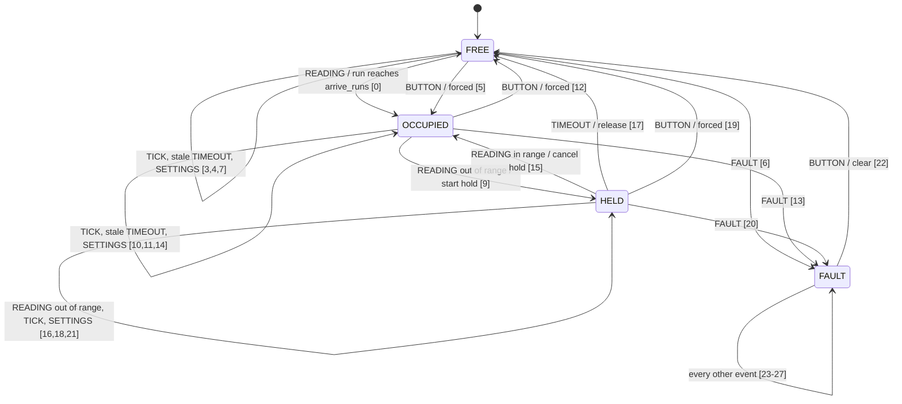
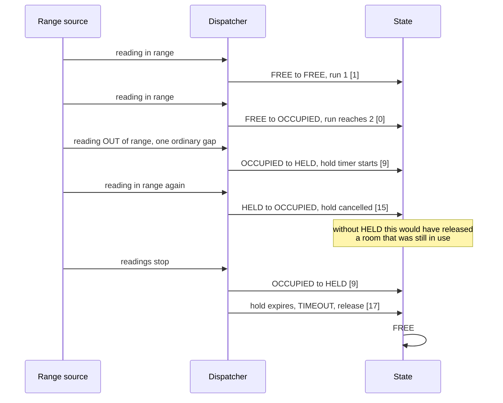

# P01 design: the table is the specification

Written Sunday 5 October 2026, before any code in this directory.

Chapter 01's deliverable is "a transition table whose every row is proven
reachable by a test that runs on the host with no board attached, and a release
that cannot be lost". This page is that table. The diagram below is generated
from the same rows, and the rule the chapter states is that **the diagram and the
table are the same object**: an edge that is not a row is a defect, not a special
case.

Nothing here is measured. The range readings come from a generated source, not a
sensor, and the hold and grace values are defaults chosen to be arguable rather
than results. Nobody on this bench has watched a real room for a week.

## The invariant the whole project exists to protect

**A release cannot be lost.** A room that forgets to release is worse than a room
with no sensor at all, because a closed door and a lit indicator look identical
whether the room is in use or whether the firmware stopped paying attention. A
missed detection is discovered within seconds by the person standing in the room;
a missed release is discovered by nobody.

That asymmetry is why `HELD` exists and why it is a state rather than a flag. A
person still in the room but out of the sensor's view for a moment must not
release it, so departure needs a timer. Arrival needs a run of readings instead,
because one sample over a threshold is somebody walking past the door.

## States and events

| State | Meaning |
|---|---|
| `FREE` | nobody detected, and no hold outstanding |
| `OCCUPIED` | a run of in-range readings has been seen |
| `HELD` | readings stopped, the hold timer is running, still reported occupied |
| `FAULT` | a read failed; the state is not trustworthy and says so |

| Event | Source |
|---|---|
| `TICK` | the kernel timer, the heartbeat |
| `READING` | the range source, generated in this chapter |
| `TIMEOUT` | the hold timer expiring |
| `BUTTON` | the user button, a forced event |
| `FAULT` | any failed read |
| `SETTINGS` | a new threshold arriving |

## The transition table

Guards are evaluated in row order, so the first matching row wins and the order
is load bearing. Two rows sharing a state and an event are told apart only by
their guard, which is why the test asserts the **row index** taken and not only
the resulting state.

| # | From | Event | Guard | Action | To |
|---|---|---|---|---|---|
| 0 | `FREE` | `READING` | in range, run + 1 reaches `arrive_runs` | `on_arrive` | `OCCUPIED` |
| 1 | `FREE` | `READING` | in range | `count_run` | `FREE` |
| 2 | `FREE` | `READING` | out of range | `reset_run` | `FREE` |
| 3 | `FREE` | `TICK` | | `none` | `FREE` |
| 4 | `FREE` | `TIMEOUT` | | `none`, a stale timer | `FREE` |
| 5 | `FREE` | `BUTTON` | | `force_occupied` | `OCCUPIED` |
| 6 | `FREE` | `FAULT` | | `latch_fault` | `FAULT` |
| 7 | `FREE` | `SETTINGS` | | `apply_settings` | `FREE` |
| 8 | `OCCUPIED` | `READING` | in range | `refresh` | `OCCUPIED` |
| 9 | `OCCUPIED` | `READING` | out of range | `start_hold` | `HELD` |
| 10 | `OCCUPIED` | `TICK` | | `none` | `OCCUPIED` |
| 11 | `OCCUPIED` | `TIMEOUT` | | `none`, a stale timer | `OCCUPIED` |
| 12 | `OCCUPIED` | `BUTTON` | | `force_free` | `FREE` |
| 13 | `OCCUPIED` | `FAULT` | | `latch_fault` | `FAULT` |
| 14 | `OCCUPIED` | `SETTINGS` | | `apply_settings` | `OCCUPIED` |
| 15 | `HELD` | `READING` | in range | `cancel_hold` | `OCCUPIED` |
| 16 | `HELD` | `READING` | out of range | `none` | `HELD` |
| 17 | `HELD` | `TIMEOUT` | | **`release`** | `FREE` |
| 18 | `HELD` | `TICK` | | `none` | `HELD` |
| 19 | `HELD` | `BUTTON` | | `force_free` | `FREE` |
| 20 | `HELD` | `FAULT` | | `latch_fault` | `FAULT` |
| 21 | `HELD` | `SETTINGS` | | `apply_settings` | `HELD` |
| 22 | `FAULT` | `BUTTON` | | `clear_fault` | `FREE` |
| 23 | `FAULT` | `TICK` | | `none` | `FAULT` |
| 24 | `FAULT` | `READING` | | `none` | `FAULT` |
| 25 | `FAULT` | `TIMEOUT` | | `none` | `FAULT` |
| 26 | `FAULT` | `FAULT` | | `none` | `FAULT` |
| 27 | `FAULT` | `SETTINGS` | | `apply_settings` | `FAULT` |

**The table is total:** all four states times all six events are covered, which
is 24 pairs, and four of those pairs carry a second guarded row, giving 28. A
dispatcher that found no row would be a defect in the table rather than an input
to tolerate, so `presence_dispatch` returns an error for it instead of dropping
the event. Dropping one is how a release goes missing.

Four of them carry the decisions worth defending:

**Row 17 is the release, and it is the only one.** Nothing else returns to `FREE`
from a hold. A second path to release would be a second thing to get wrong.

**Rows 4 and 11 exist because a timer can outlive its hold.** The kernel timer may
already be queued when row 15 cancels a hold or row 19 forces the state away, so a
`TIMEOUT` genuinely arrives in `FREE` or `OCCUPIED`. These two rows do nothing on
purpose: the hold they belonged to is already resolved. They were missing from the
first draft of this table, and their absence would have made a legitimate race
return an error.

**`FAULT` leaves only by row 22, the button.** A fault that clears itself on the
next good reading hides the fault that caused it, and the whole point of the
state is to say the reading is not trustworthy. Rows 23 to 27 exist so that every
event in `FAULT` is a row rather than a dropped event, which is what makes the
table total.

**Row 0 is before row 1 on purpose.** Arrival is checked before the run is
counted, so the run reaching its threshold transitions in the same event that
completes it rather than on the next one. Swapping them delays every arrival by
one reading, and no test of resulting state alone would notice.

## The table drawn

## One sitting, with the hold and without it

## Defaults, which are configuration and not constants

| Key | Default | Why this number is arguable |
|---|---|---|
| `arrive_runs` | 2 readings | one sample is somebody walking past; two is the smallest run that is not |
| `hold_ms` | 30000 | a guess at how long somebody may be out of view while still in the room |
| `range_mm_max` | 2500 | the far edge of a small meeting room, not a sensor limit |

The chapter's contribution is that these are settings keys rather than constants,
so changing one does not mean editing the control flow. P07 owns the versioned
schema; here they are read once at start.

## What the design costs in memory, and where chapter 01 is stale

Four figures in chapter 01's memory budget were written against a twelve-row table
with no timestamp on an event and no settings event, and the table in this
repository has twenty-eight rows, an `at_ms` on every event and six settings rows.
Three of the four describe themselves as exact. They are corrected here rather than
in the chapter, because `chapters/` is generated from the volume's LaTeX on the
authoring machine and nothing else writes it; the chapter's own source needs the
same edit and has not had it yet.

| Quantity | Chapter 01 says | What the code is |
|---|---|---|
| One event | 4 B | **20 B**: a four-byte kind, a four-byte `at_ms`, and a twelve-byte union whose larger arm is the settings |
| The event queue, 16 deep | 64 B, "by construction" | **320 B** |
| The per-row counters | 12 rows of 4 B, 48 B, "by construction" | **28 rows, 112 B** |
| The context | 64 B, "by construction" | **40 B without the counters, 152 B with them** |
| Rows covered by the test | "all twelve" | all twenty-eight |

Everything mutable this project owns is therefore 472 bytes rather than the 176 the
chapter implies. On a part with 1.4 MB of SRAM nothing is at risk, and the reason to
correct it is not the margin: three of those rows claim to be exact, and a number
that claims to be exact and is wrong by a factor of five is worse than a number
marked "not measured".

**These are facts of the build now, not arithmetic on this page.** `presence.c`
pins the settings, the event and the context with `_Static_assert`, so adding a
field to any of them fails the build and the budget gets revisited on purpose. The
host test prints all of them, derived from `PRESENCE_ROW_COUNT` and
`PRESENCE_QUEUE_DEPTH` so they cannot drift, and the C++ and Rust suites print
their own, because a checked payload is not free: `std::variant` adds a
discriminant where the C has a bare union, and so does `Option<Settings>`. What
that costs is in the CI log rather than in a sentence here.

One figure deliberately stays unmeasured. The table's size in flash cannot be had
from a host run, because a row is mostly pointers and the host's are twice the
width. The test prints the host's number labelled as the host's, and the budget's
flash row stays "not measured" until a map file from the board says otherwise.

## What this design does not decide

- **The queue depth.** Sixteen, from the chapter's data-flow figure, and whether
  that is enough is a question for a loaded run rather than for this page. It is
  `PRESENCE_QUEUE_DEPTH` in the header, so each kernel adapter sizes its queue
  from one place and the budget above is one multiplication.
- **Anything about timing.** This project's acceptance criterion is a test
  result, not a measurement, which is unusual in this volume and deliberate.
- **Which language version or kernel is better.** The variants exist to be
  compared; the comparison is in `LANGUAGE_IDIOMS.md` and `RTOS_VARIANTS.md` and
  it reports what each one costs rather than picking a winner.
