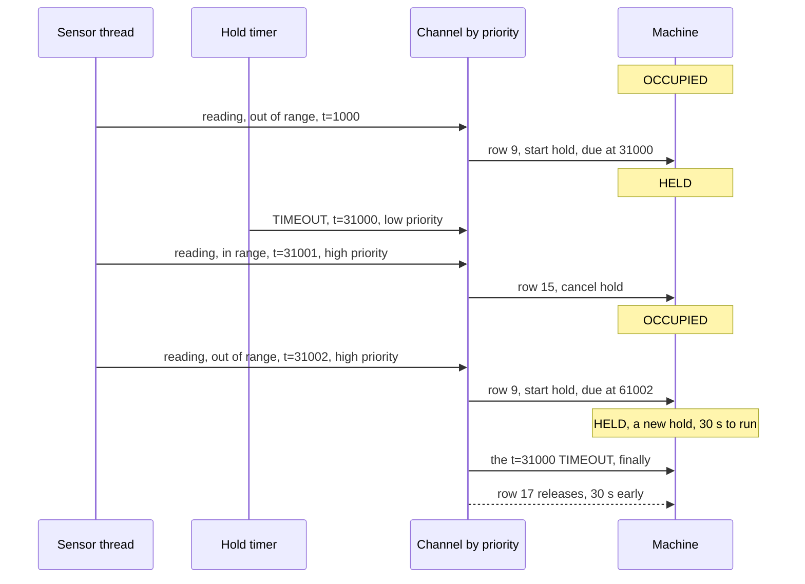

# P01 kernel variants: one table, three kernels, and the contract between them

This page is written before the adapters, which is this chapter's first rule. It
decides what an adapter is allowed to do, states the three things the table needs
from one, and records a defect that the first two kernels hide and the third
exposes.

Nothing here changes `c/presence.c`, `cpp/presence.hpp` or `rust/presence_core.rs`,
with one exception that this page argues for and that the commit after it carried
out: the twenty-ninth row, which is now in all three languages.

## What an adapter is, and what it may not do

The core decides. The adapter carries. That is the whole of it, and the useful form
of the rule is negative: **an adapter contains no comparison against a range, no
count of readings, no notion of how long a hold lasts, and no opinion about what an
event means.** If a reader finds a threshold in an adapter, the adapter is wrong,
not the table.

That is checkable rather than aspirational. Every number in this design is in
`presence_settings_t`, every decision is a row, and the adapter never includes
anything that reads a setting.

## The four things every adapter provides

| | What it is | What it must not become |
|---|---|---|
| A queue | one event queue, one consumer, `PRESENCE_QUEUE_DEPTH` deep | a queue per event class. Chapter 01's variants table already names the cost: ordering stops being a fact and becomes a question |
| A hold timer | one single-shot timer, armed and cancelled to follow `hold_running` | a timer that decides anything. It posts `PRESENCE_EV_TIMEOUT` and nothing else |
| A tick | one periodic timer posting `PRESENCE_EV_TICK` | a second dispatcher. A tick is an event like any other and takes a row |
| Three indicators | a function from state to three lamps | a place where a fourth state is invented for display |

The adapter reads exactly one field of the context, `hold_running`, and only in
order to mirror it onto the kernel timer: false to true arms, true to false
cancels. It reads it after a dispatch returns, not before, and it never writes it.

## The three things the table needs back

These are requirements on every adapter, and the table is correct only when they
hold. They were implicit until this page, which is the problem with implicit.

**1. One queue, one consumer, first in first out.** Events must be dispatched in
the order they were posted. Chapter 01 says this at line 67 as a property of the
design; here it is a requirement, because the next section shows what breaks
without it.

**2. `at_ms` is stamped when an event is posted, never when it is dispatched.** The
field is the kernel's monotonic time at the moment the thing happened. An adapter
that fills it in at the front of the dispatch loop makes every stale event look
fresh, which defeats the guard the next section adds.

**3. A cancelled hold may still deliver its expiry.** No kernel here can un-queue a
timer callback that has already fired. The table accommodates this rather than
pretending otherwise: rows 4 and 11 exist for exactly this, and they do nothing on
purpose.

## The defect requirement 1 was hiding

Row 17 is the only release in the table. It was written unguarded, so any `TIMEOUT`
arriving in `HELD` released. Under a single first-in-first-out queue that is safe, and the
argument is worth writing out because it is the whole reason the row was allowed to
stay unguarded. A stale expiry is always dequeued before anything posted after it,
so by the time it is dispatched the state has not yet moved, the hold it belongs to
is the hold that is running, and releasing is correct.

Take that ordering away and the row is wrong:

The room then reads free while somebody is in it. That is the same defect class as
the invariant this project exists to protect: a release that happens early loses a
presence just as thoroughly as a release that never happens, and it is harder to
see, because every state along the way is legal and `check_invariants` passes at
every step.

**This is reachable on QNX and not on the other two**, for a named reason rather
than a suspicion: a QNX channel delivers pulses in priority order, so a pulse from
a high-priority sensor thread can be received ahead of an older pulse from a
lower-priority timer. Zephyr's `k_msgq` and FreeRTOS's queue are both first in
first out, so under them the sequence above cannot be assembled.

### Two ways to fix it, and which one this volume takes

**Rejected: a generation counter in the adapter.** Stamp each hold with a sequence
number, have the adapter drop an expiry whose sequence is stale. This works and is
common. It is rejected because the adapter would then be deciding which events
matter, which is the one thing an adapter may not do. A reader auditing the table
would no longer be auditing the behaviour.

**Taken: a guard on the release row.** `HELD` and `TIMEOUT` became two rows, as
three other pairs already were and as `FREE` with `READING` already was with three: one guarded by the hold having
actually expired, which releases, and one unguarded below it, which does nothing.
The decision stays in the table, the fix is visible in the diagram the table
generates, and no adapter has to be trusted with it.

The guard is a wrap-safe time comparison, `(int32_t)(ev->at_ms - p->hold_due_ms) >= 0`,
and not `>=` on the raw values, because `start_hold` composes the due time with a
wrapping add and a node that has been up for 49.7 days is a node whose millisecond
counter has wrapped.

This was a change to the table, so it was a change to all three languages, to the
tests in all three, to the row count, to the memory figures in `DESIGN.md`, since a
twenty-ninth row is four more bytes of counters, and to the exhaustive-match sweep,
which grew from 96 combinations to 192 because the guard added a third payload
dimension: the hold's due time against the event's. It landed in the commit after
this page, and the history is meant to show that the argument came first.

Each of the three suites now carries the sequence drawn above as a case, which fails
against a table whose row 17 has no guard. `scripts/crosscheck_table.py` compares the
three tables row for row in CI, so a row that drifts in one language is caught
without anyone rereading three files.

## The mapping, kernel by kernel

A row that says "renamed" is a primitive that corresponds directly. A row that says
**changed** is a place where the design had to move, and those are the only
interesting rows.

| Need | Zephyr | FreeRTOS | QNX |
|---|---|---|---|
| Queue | `k_msgq`, fixed 20 byte items, renamed | `xQueueCreate` with a 20 byte item size, renamed | **changed.** A pulse carries a four byte value. A 20 byte event does not fit one |
| Post from a thread | `k_msgq_put` with `K_NO_WAIT` | `xQueueSendToBack` | `MsgSendPulse`, or a message |
| Post from an interrupt | `k_msgq_put`, same call | `xQueueSendToBackFromISR` with the yield flag | an interrupt handler returns an event, or `MsgDeliverEvent` |
| Order | first in first out | first in first out | **changed.** Priority order on the channel |
| Hold timer | `k_timer_start` with one duration and a zero period | `xTimerCreate` one-shot, `xTimerStart` | `timer_create` with `SIGEV_PULSE`, `timer_settime` |
| Cancel | `k_timer_stop` | `xTimerStop`, which posts a command to the timer service task | `timer_settime` with a zero value |
| Tick | a second `k_timer`, periodic | a periodic `xTimer` | a periodic `timer_settime` |
| Where the expiry runs | in interrupt context | in the timer service task | in whatever thread receives the pulse |
| Indicators | `gpio_pin_set_dt` over three `gpio_dt_spec` | the vendor's HAL directly | a resource manager, or `out8` on a mapped register |
| The call never to use | `k_msgq_put_front` | `xQueueSendToFront`, `xQueueOverwrite` | a second channel, or two pulse priorities |

That last row is the operative one. Each kernel offers a way to put an event at the
head of the queue, and each of those calls silently removes requirement 1. None of
the three adapters may use them, and the reason is this page rather than taste.

### Zephyr

The closest fit, which is unsurprising in a volume whose other nineteen chapters
use it. The event is a 20 byte item in a `k_msgq` whose buffer is
`PRESENCE_QUEUE_DEPTH * sizeof(presence_event_t)`, which is 320 bytes, statically
allocated, with no allocator linked.

The one thing to get right is that a `k_timer` expiry function runs in interrupt
context, so it may only call `k_msgq_put` with `K_NO_WAIT` and must treat a full
queue as an event lost rather than as something to wait for. A lost event here is a
lost release, so the adapter counts the failures and the counter is part of what the
shell reports. Dropping silently is the one failure mode this design cannot tolerate
and cannot detect after the fact.

### FreeRTOS

Also a direct fit, with one difference worth naming: a FreeRTOS software timer
callback runs in the timer service task rather than in interrupt context, and
`xTimerStop` is a command posted to that task rather than an immediate action. The
window between a cancel and the expiry is therefore wider than Zephyr's, which makes
the stale expiry of rows 4 and 11 more likely rather than less. The behaviour is the
same; the probability is not, which is a point in favour of having written those two
rows rather than having argued the race away.

Static allocation is the thing to demonstrate here, as chapter 20 of the firmware
volume does for its own task set: `configSUPPORT_STATIC_ALLOCATION` at 1,
`xQueueCreateStatic` and `xTimerCreateStatic`, and the heap implementation not
linked at all, with the map file as the evidence rather than a statement in a
README.

### QNX, and why it is here at all

**Two honest statements first.** QNX appeared in zero of the twenty three embedded
postings counted on Saturday 3 October 2026, which is why the runtime coverage note
parked it with a written revival condition. It is here because the brief for this
project is breadth across the runtimes that appear in high rate contract work, and
that is a decision about reach rather than a conclusion from those postings. And
there is no QNX licence and no QNX target on this bench, so **this adapter will be
written and will not be built.** Every statement in this section comes from the
documentation and none of it from a run, and the adapter's own header will say so in
the same words.

What makes it worth writing anyway is that it is the only one of the three that does
not fit, and the two places it does not fit are both instructive.

**A pulse is four bytes.** `MsgSendPulse` carries an `int value`, and the event is
20 bytes. So the design has to change rather than be renamed, and there are three
ways:

1. Send a message rather than a pulse. A message carries an arbitrary payload, but
   `MsgSend` blocks the sender until a server replies, which turns every sensor
   reading into a rendezvous and gives the sensor thread a way to be blocked by the
   dispatcher. The dispatcher would no longer be the only thing deciding order.
2. Keep the events in a ring the adapter owns, and send a pulse as a doorbell with
   the ring index as its value. The queue is then yours, which means requirement 1
   is yours to guarantee rather than the kernel's to provide.
3. Shrink the event to four bytes so a pulse can carry it. This is the one that
   looks cheapest and is worst: a settings event carries eight bytes of payload, so
   the six settings rows would have to become something other than events, and the
   table would stop being the whole specification.

The second is the one to write, and the page says why the other two were considered:
option 1 inverts the ownership of ordering, and option 3 would be the table
accommodating the kernel instead of the adapter doing so.

**A channel delivers by priority.** This is the one that produced the twenty ninth
row above, and it is the single most useful thing in this whole comparison: a design
that was correct under two kernels was not correct under a third, the reason was a
documented property of a primitive rather than a bug in anybody's code, and the fix
belonged in the specification rather than in an adapter.

## What can be shown, and where

Three adapters, three different levels of evidence, named rather than averaged.

| Adapter | What can be run | Where |
|---|---|---|
| FreeRTOS | **the adapter itself, on a host.** The kernel has an official POSIX port that builds with gcc, so the queue, the timer and the dispatcher run for real. **Written on Tuesday 6 October 2026** and not yet built: [`../freertos/`](../freertos/) | WSL on the demo laptop first, then GitHub Actions |
| Zephyr | **nothing yet, and the reason is checked rather than assumed.** `native_sim` would run it, and chapter 01 already uses that target, but WSL on the demo laptop has no Zephyr workspace, no `west` and no SDK: looked for on Tuesday 6 October 2026 and absent. Until one exists there, CI would be this adapter's first test, which is the opposite of how this bench works | nowhere, until a workspace exists |
| QNX | **nothing.** No licence, no target. Source and a review only | nowhere on this bench |

The firmware volume's own rule applies to the two that can run: a test that has
never been shown to fail has not been shown to work. For these adapters that means
provoking the stale expiry deliberately, by cancelling a hold and then injecting the
expiry that the cancel did not prevent, and confirming that rows 4 and 11 absorb it
and that the guarded release row does not fire. That test is the reason those rows
exist, and until it runs they are an argument rather than a result.

## What does not change

The table, the guards, the actions, the invariant and the dispatcher. Three
adapters, three queue implementations, three timer APIs, one set of rows. The claim
is checkable and is meant to be checked: `presence.c` carries no kernel header, no
conditional compilation, and no change in any adapter commit except the twenty ninth
row this page argues for, which is a change to the specification and not to any
kernel's code.
