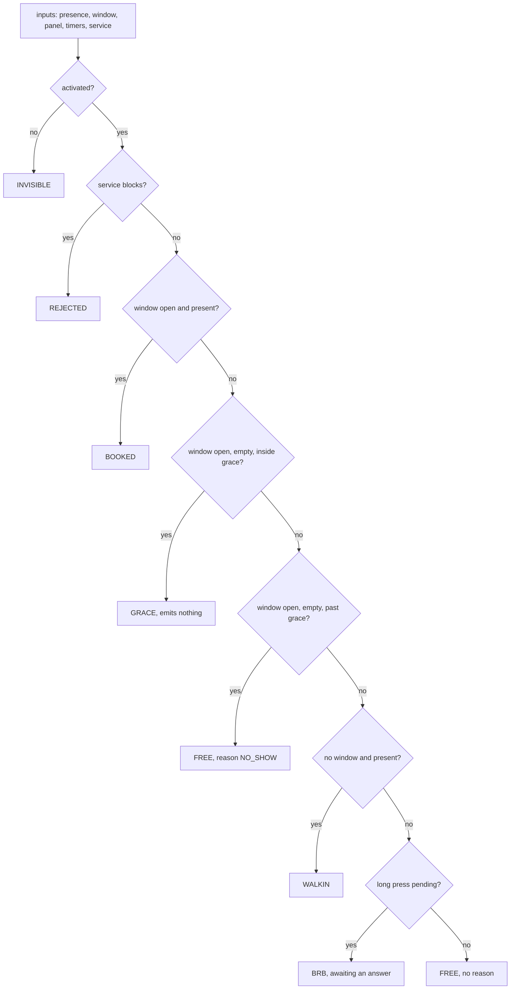

# P02 design: the cascade is the specification, and the two axes never merge

Written on Tuesday 6 October 2026, **before any code in this project exists**. That order
is chapter 02's first requirement and the git history is the evidence for it, exactly as
in [P01](../../01-presence/docs/DESIGN.md). So every statement below about a test or a
printed number is a requirement on code not yet written, not a report of a run.

This project adds **no state to the presence machine**. P01 decides whether a room is in
use; this one decides whether the room is claimed, which is a different question with
different inputs and a different owner. Presence is an observation. A claim is a
decision.

The shape is therefore different from P01 on purpose. P01's specification is a
transition table, because presence is a state machine. This one's is a **cascade**: an
ordered sequence of guarded arms, evaluated top to bottom, the first match winning. The
cascade is a pure function. It reads its inputs, returns a claim and a reason, and
touches nothing.

## The two things this design exists to protect

**A live booking beats a walk-in, and a booking nobody turned up for does not.** The
first half is easy. The second half is the whole chapter: it means the grace period is a
number somebody can change, that the release it causes is distinguishable in the record
from an ordinary departure, and that neither depends on the network.

**A room that cannot be booked must not report itself free.** The booking axis and the
service axis answer different questions and have different owners. Collapsing them into
one status produces a room that reports itself free while its sensor has been silent for
three days, and the only sign is that nobody ever books it.

Those two are written as invariants below, and the host test checks them after every
case rather than at the end.

## The claim axis, seven codes

| Code | What it means | Emitted on entry |
|---|---|---|
| `INVISIBLE` | not commissioned; the unit does not offer itself at all | yes |
| `REJECTED` | the service axis is blocking; a claim cannot be taken | yes |
| `FREE` | no booking, nobody here, and the unit is fit to be booked | yes |
| `BOOKED` | a window is open and the holder is present | yes |
| `GRACE` | a window is open and nobody is here yet, inside the grace period | **no** |
| `WALKIN` | no window, somebody is here, and they have taken the room | yes |
| `BRB` | more time has been **asked for**, and the answer has not arrived | yes |

`GRACE` is the one code that emits nothing, and that is a requirement rather than an
optimisation: grace is the common case for most of a booking, and a policy that emits
while nothing has changed turns one room into a steady message rate a gateway has to
absorb.

**`BRB` is a request, not a grant.** The unit does not own the calendar, so it cannot
extend a booking; it can only ask and then show what it was told. A panel that goes
green the instant it is pressed is asserting a decision that has not been made, and the
lie is found by the next person through the door. So `BRB` carries a timeout, and when
the timeout expires with no answer the cascade falls back to whatever the inputs then
say rather than to a success.

## The service axis, seven states and seven reasons

| State | Fit to be booked | Typical reason |
|---|---|---|
| `OK` | yes | none |
| `DEGRADED` | **yes** | `FAN`, `PANEL` |
| `NEEDS_SERVICE` | **yes** | `SENSOR`, `MODEM` |
| `OUT_OF_SERVICE` | no | `POWER`, `SENSOR` |
| `IN_MAINTENANCE` | no | `COMMANDED` |
| `NEEDS_PART` | no | `FAN`, `PANEL` |
| `REPLACED` | no | `COMMANDED` |

Reasons: `SENSOR`, `MODEM`, `PANEL`, `POWER`, `FAN`, `SETUP_INCOMPLETE`, `COMMANDED`.

**Three of the seven states do not block and four do**, and that split is a decision
worth defending rather than a detail. `DEGRADED` and `NEEDS_SERVICE` are maintenance
facts: something should be looked at, and the room still works. A room taken out of use
because a fan needs cleaning is a room lost for a week to a work order. The four that
block are the ones where the room genuinely cannot serve: no power, somebody is working
in it, a part is missing, or the unit has been superseded.

The service axis is **evaluated separately and runs at the same time**. Neither axis is
a state of the other. A blocking service state turns the claim into `REJECTED` without
changing anything about what presence reports, and that separation is the design.

## The cascade, in order, and the order is load-bearing

Eight arms, seven distinct claim codes, and `FREE` is reached by two of them. That is the
same shape as P01's rows 4 and 11, which do nothing on purpose: two different situations
legitimately produce one outcome, and the arms stay separate because the **reason**
differs even when the code does not.

**Why the order cannot be permuted.** Each of these would be a defect, and each is a
test:

| If this moved | The defect |
|---|---|
| activation below anything | an uncommissioned unit would answer, which is what the flag exists to prevent |
| the service check below the booking arms | a room with no power would report itself booked |
| walk-in above the booking arms | a passer-by would take a room somebody had booked, which is the rule this chapter is named for |
| the grace arm below the no-show arm | every booking would release immediately, because past-grace is false before grace is |
| the final arm anywhere but last | an arm with no guard shadows everything below it |

The last row is the rule P01 ended up enforcing in CI, and it holds here for the same
reason: **the only unguarded arm is the last one**. A cross-check script is **required to
compare the cascade across the three languages**, in the way
[`scripts/crosscheck_table.py`](../../../scripts/crosscheck_table.py) already does for
P01's table, so that "the same policy" is enforced rather than repeated. No such script
exists for this project yet.

## The no-show, which is the one output that must be unmistakable

Past the grace period with nobody present, the claim becomes `FREE` and **one** event
leaves the unit carrying reason `NO_SHOW`.

Two things make that exact rather than approximate.

**Emission is on change only.** The cascade is pure, so it is given the previous claim
and emits if and only if the code or the reason differs. That single rule is what makes
`GRACE` silent and what makes the no-show fire once: once the claim is `FREE` with
`NO_SHOW`, further readings of an empty booked room produce the same pair and nothing
leaves.

**The reason is carried, not inferred.** An ordinary departure also ends at `FREE`. The
two are told apart by the reason field and by nothing else, because a record that cannot
distinguish "nobody came" from "everybody left" cannot answer the only question anybody
asks of it afterwards, which is whether the grace period is set correctly.

Chapter 02 can be read as making `NO_SHOW` a claim code rather than a reason. This design
takes it as a reason, because the chapter also says the claim becomes free, and a code
cannot be both. The test enumerates whichever the code implements and prints the counts,
so the number of codes is checked rather than asserted.

## The spool, bounded in bytes and counted on discard

The outbound path is a ring with a hard bound, because the unit must keep working with
the radio down and a queue that grows without a bound is a device that stops during a
long outage in a building nobody visits.

- The bound is `claim/spool_bytes`, in **bytes**, not in events, because bytes are what
  runs out.
- Capacity is therefore `spool_bytes / sizeof(event)`, computed rather than written down,
  and **printed by the test** so a reader checks a log instead of this page. The same
  habit corrected chapter 01's memory budget, which was wrong by a factor of five while
  three rows claimed "by construction".
- When the ring is full the **oldest** is discarded, because the newest event is the one
  describing the room now.
- Every discard increments a counter. Driving a thousand events with the link down must
  leave the spool at exactly its capacity and the counter at exactly `1000 - capacity`.
  If those two disagree the spool is losing events it is not admitting to, which is the
  failure this design cannot detect any other way.

## Defaults, which are configuration and not findings

| Key | Default | Unit | Why it is a key |
|---|---|---|---|
| `claim/grace_s` | 300 | seconds | the right value depends on the building; a constant turns a conversation into a release |
| `claim/brb_hold_s` | 900 | seconds | how long a press buys, if the answer grants it |
| `claim/walkin_len_s` | 1800 | seconds | how long a walk-in claims the room |
| `claim/spool_bytes` | 4096 | bytes | the hard bound on the outbound ring |
| `claim/stale_after_s` | 600 | seconds | beyond this, published state carries the stale flag |
| `svc/activated` | 0 | flag | **defaults to off**; the room is invisible until somebody sets it |

Every default fails safe. The unit is invisible before commissioning, the spool discards
rather than grows, and a sensor that stops answering produces an outage rather than a
free room.

## The invariants, checked after every case

1. **An unactivated unit never reports `FREE`, `WALKIN`, `BOOKED` or `BRB`.** With the
   flag clear, no input sequence may produce any of them.
2. **A blocking service state always yields `REJECTED`**, whatever the booking inputs
   say, and never alters what presence reports.
3. **`GRACE` emits nothing.** The event count after a case that stays inside grace must
   equal the count before it.
4. **A no-show emits exactly one event**, and its reason is `NO_SHOW` and not the
   ordinary release.
5. **No claim transition depends on the link.** With the link down for the whole of a
   case, the claim still changes and the lamps still follow; only the record waits.
6. **The spool never exceeds its bound, and discards plus retained equals offered.**

## What this design does not decide

**There is no calendar here.** Window messages arrive as scripted input on the host and
as typed commands on the board. No chapter in this volume integrates with a calendar
service and none claims to; the architecture figure draws that source dashed.

**There is no panel.** The user button stands in for one, which exercises the two events
a panel actually produces, short press and long press.

**There is no transport.** The events are spooled and counted, not sent. P11 carries them
for real.

**Nothing here is measured on hardware.** Every acceptance criterion in chapter 02 is a
scripted case on a host, which is deliberate: for a chapter whose subject is a decision,
twenty-two cases are stronger evidence than a demonstration on a desk. Any timing figure
taken on a host is a measurement of the host.
