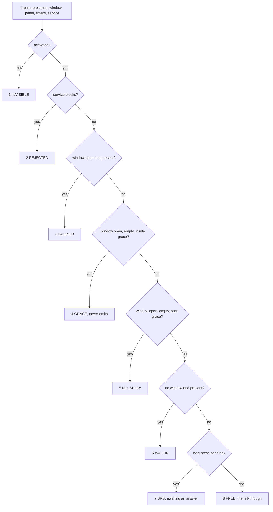

# P02 design: the cascade is the specification, and the two axes never merge

Written on Tuesday 6 October 2026, **before any code in this project exists**. That order
is chapter 02's first requirement and the git history is the evidence for it, exactly as
in [P01](../../01-presence/docs/DESIGN.md). So every statement below about a test or a
printed number is a requirement on code not yet written, not a report of a run.

This project adds **no state to the presence machine**. P01 decides whether a room is in
use; this one decides whether the room is claimed, which is a different question with
different inputs and a different owner. Presence is an observation. A claim is a
decision.

The shape is therefore different from P01 on purpose. P01's specification is a
transition table, because presence is a state machine. This one's is a **cascade**: an
ordered sequence of guarded arms, evaluated top to bottom, the first match winning. The
cascade is a pure function. It reads its inputs, returns a claim and a reason, and
touches nothing.

## The two things this design exists to protect

**A live booking beats a walk-in, and a booking nobody turned up for does not.** The
first half is easy. The second half is the whole chapter: it means the grace period is a
number somebody can change, that the release it causes is distinguishable in the record
from an ordinary departure, and that neither depends on the network.

**A room that cannot be booked must not report itself free.** The booking axis and the
service axis answer different questions and have different owners. Collapsing them into
one status produces a room that reports itself free while its sensor has been silent for
three days, and the only sign is that nobody ever books it.

Those two are written as invariants below, and the host test is required to check them
after every case rather than at the end.

## The claim axis: seven codes, and one fall-through that is not a code

| Code | What it means | Emits |
|---|---|---|
| `INVISIBLE` | not commissioned; the unit does not offer itself at all | yes |
| `REJECTED` | the service axis is blocking; a claim cannot be taken | yes |
| `BOOKED` | a window is open and the holder is present | yes |
| `GRACE` | a window is open and nobody has arrived yet, inside the grace period | **never** |
| `NO_SHOW` | the grace period ran out with nobody present; the booking is released | yes |
| `WALKIN` | no window, somebody is here, and they have taken the room | yes |
| `BRB` | more time has been **asked for**, and the answer has not arrived | yes |

Those are chapter 02's seven, and the chapter's own count is what settles two questions
that its prose leaves open. **`NO_SHOW` is a code, not a reason**, and **`FREE` is not a
code at all**: it is the fall-through, the absence of a claim, which is why the cascade's
last arm is unguarded and why an ordinary release is told from a no-show by the code
alone rather than by a reason field.

### Why `GRACE` never emits, which is not an exception made for convenience

Emission is otherwise uniform: an event leaves the unit when the code changes. `GRACE` is
excluded, and the reason is a division of labour rather than a saving.

**The calendar already knows about the booking, because it sent it.** What the unit knows
and the calendar cannot is whether anybody came. During grace the unit has observed
nothing on that question: the window is open, the room is empty, and the only thing that
has happened is that time has passed. So there is nothing to report, and the next event
is the one that answers the question, either `BOOKED` when somebody arrives or `NO_SHOW`
when the period runs out.

That is also why chapter 02 states the requirement as it does. Its refutation is "the
event count rises, which would flood a gateway with one message per reading", and grace is
the common case for most of a booking: a room booked for an hour and entered after five
minutes spends five minutes in grace being read continuously.

**`BRB` is a request, not a grant.** The unit does not own the calendar, so it cannot
extend a booking; it can only ask and then show what it was told. A panel that goes
green the instant it is pressed is asserting a decision that has not been made, and the
lie is found by the next person through the door. So `BRB` carries a timeout, and when
the timeout expires with no answer the cascade falls back to whatever the inputs then
say rather than to a success.

## The service axis, seven states and seven reasons

| State | Fit to be booked | Typical reason |
|---|---|---|
| `OK` | yes | none |
| `DEGRADED` | **yes** | `FAN`, `PANEL` |
| `NEEDS_SERVICE` | **yes** | `SENSOR`, `MODEM` |
| `OUT_OF_SERVICE` | no | `POWER`, `SENSOR` |
| `IN_MAINTENANCE` | no | `COMMANDED` |
| `NEEDS_PART` | no | `FAN`, `PANEL` |
| `REPLACED` | no | `COMMANDED` |

Reasons: `SENSOR`, `MODEM`, `PANEL`, `POWER`, `FAN`, `SETUP_INCOMPLETE`, `COMMANDED`.

**Three of the seven states do not block and four do**, and that split is a decision
worth defending rather than a detail. `DEGRADED` and `NEEDS_SERVICE` are maintenance
facts: something should be looked at, and the room still works. A room taken out of use
because a fan needs cleaning is a room lost for a week to a work order. The four that
block are the ones where the room genuinely cannot serve: no power, somebody is working
in it, a part is missing, or the unit has been superseded.

The service axis is **evaluated separately and runs at the same time**. Neither axis is
a state of the other. A blocking service state turns the claim into `REJECTED` without
changing anything about what presence reports, and that separation is the design.

## The cascade, in order, and the order is load-bearing

Eight arms, seven codes and the fall-through. **The arm number is part of the output**,
not only the code, which is P01's lesson restated: rows 0 and 1 of that table shared a
state and an event and differed only by a guard, so swapping them left every final state
identical and a test of outcomes alone would have passed. Here the test asserts which arm
fired.

**Why the order cannot be permuted.** Each of these would be a defect, and each is a
test:

| If this moved | The defect |
|---|---|
| activation below anything | an uncommissioned unit would answer, which is what the flag exists to prevent |
| the service check below the booking arms | a room with no power would report itself booked |
| walk-in above the booking arms | a passer-by would take a room somebody had booked, which is the rule this chapter is named for |
| the grace arm below the no-show arm | every booking would release immediately, because past-grace is false before grace is |
| `BRB` above walk-in | a press by somebody still in the room would hide that the room is in use |
| the final arm anywhere but last | an arm with no guard shadows everything below it |

That fifth row is the one worth pausing on, because `BRB` sitting below walk-in looks like
a mistake and is not. It is **reachable only when nobody is present**, which is exactly
what it is for: it holds the room for somebody who pressed the button on their way out.
A press while they are still in the room needs no claim of its own, because walk-in or
booked already describes the room correctly.

The last row is the rule P01 ended up enforcing in CI, and it holds here for the same
reason: **the only unguarded arm is the last one**. A cross-check script is **required to
compare the cascade across the three languages**, in the way
[`scripts/crosscheck_table.py`](../../../scripts/crosscheck_table.py) already does for
P01's table, so that "the same policy" is enforced rather than repeated. No such script
exists for this project yet.

## The no-show, which is the one output that must be unmistakable

Past the grace period with nobody present, the cascade yields `NO_SHOW`, the booking is
released, and **one** event leaves the unit.

Two things make that exact rather than approximate.

**Emission is on change of code.** The cascade is pure, so it is given the previous code
and emits if and only if the new one differs, with `GRACE` never emitted at all. That is
what makes the no-show fire once: the inputs on the next reading are unchanged, so the
code is still `NO_SHOW`, so nothing leaves.

**An ordinary release is a different code, not the same code with a different label.** A
room that empties normally falls through to `FREE`. A booking nobody attended yields
`NO_SHOW`. A record that cannot distinguish "nobody came" from "everybody left" cannot
answer the only question anybody asks of it afterwards, which is whether the grace period
is set correctly for this building.

## The spool, bounded in bytes and counted on discard

The outbound path is a ring with a hard bound, because the unit must keep working with
the radio down and a queue that grows without a bound is a device that stops during a
long outage in a building nobody visits.

- The bound is `claim/spool_bytes`, in **bytes**, not in events, because bytes are what
  runs out.
- Capacity is therefore `spool_bytes / sizeof(event)`, computed rather than written down,
  and **printed by the test** so a reader checks a log instead of this page. The same
  habit corrected chapter 01's memory budget, which was wrong by a factor of five while
  three rows claimed "by construction".
- When the ring is full the **oldest** is discarded, because the newest event is the one
  describing the room now.
- Every discard increments a counter. Driving a thousand events with the link down must
  leave the spool at exactly its capacity and the counter at exactly `1000 - capacity`.
  If those two disagree the spool is losing events it is not admitting to, which is the
  failure this design cannot detect any other way.

## Defaults, which are configuration and not findings

| Key | Default | Unit | Why it is a key |
|---|---|---|---|
| `claim/grace_s` | 300 | seconds | the right value depends on the building; a constant turns a conversation into a release |
| `claim/brb_hold_s` | 900 | seconds | how long a press buys, if the answer grants it |
| `claim/walkin_len_s` | 1800 | seconds | how long a walk-in claims the room |
| `claim/spool_bytes` | 4096 | bytes | the hard bound on the outbound ring |
| `claim/stale_after_s` | 600 | seconds | beyond this, published state carries the stale flag |
| `svc/activated` | 0 | flag | **defaults to off**; the room is invisible until somebody sets it |

Every default fails safe. The unit is invisible before commissioning, the spool discards
rather than grows, and a sensor that stops answering produces an outage rather than a
free room.

## The invariants, to be checked after every case

1. **An unactivated unit yields `INVISIBLE` and nothing else.** With the flag clear, no
   input sequence may produce any other code.
2. **A blocking service state always yields `REJECTED`**, whatever the booking inputs
   say, and never alters what presence reports.
3. **`GRACE` never appears in the event record**, however often it is the decision.
4. **A no-show emits exactly one event**, and its code is `NO_SHOW` and not the ordinary
   fall-through.
5. **No claim transition depends on the link.** With the link down for the whole of a
   case, the claim still changes and the lamps still follow; only the record waits.
6. **The spool never exceeds its bound, and discards plus retained equals offered.**

## What this design does not decide

**There is no calendar here.** Window messages arrive as scripted input on the host and
as typed commands on the board. No chapter in this volume integrates with a calendar
service and none claims to; the architecture figure draws that source dashed.

**There is no panel.** The user button stands in for one, which exercises the two events
a panel actually produces, short press and long press.

**There is no transport.** The events are spooled and counted, not sent. P11 carries them
for real.

**Nothing here is measured on hardware.** Every acceptance criterion in chapter 02 is a
scripted case on a host, which is deliberate: for a chapter whose subject is a decision,
twenty-two cases are stronger evidence than a demonstration on a desk. Any timing figure
taken on a host is a measurement of the host.
